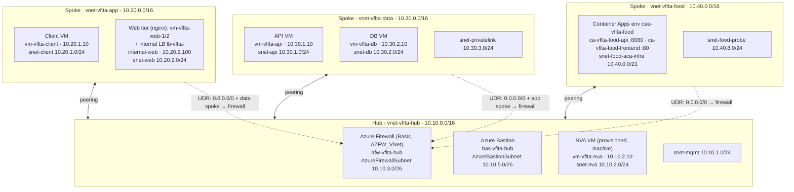
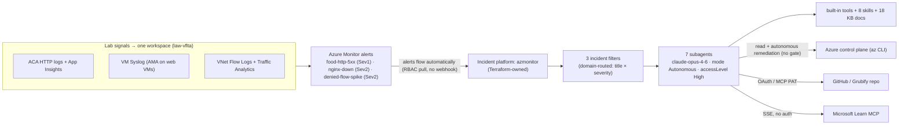
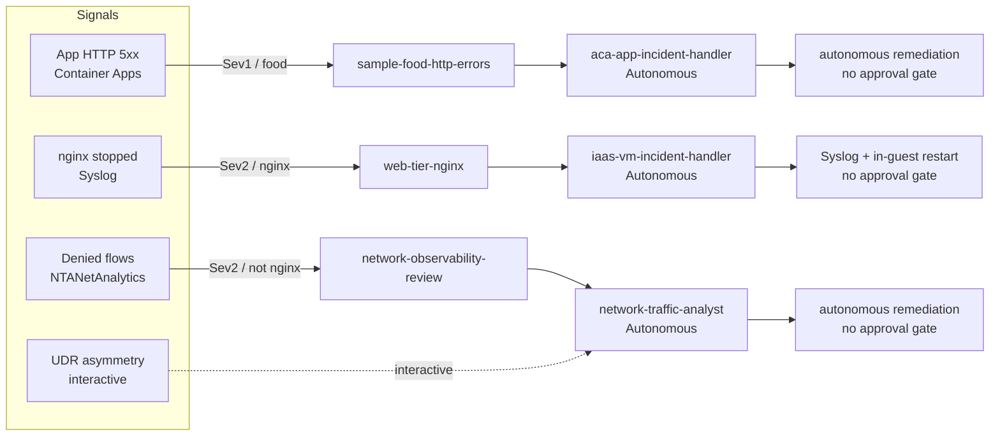

# Azure SRE Agent — Demo Runbook (6 Scenarios)

> **Part of the Coach solution** — deploy first with [Solution 00](Solution-How-To-Deploy-All-00.md), then see [Architecture (01)](Solution-Architecture-01.md) and the [Config script guide (03)](Solution-How-To-Azure-SRE-Agent-Config-03.md). All commands run from `Coach/Solutions/`.

This runbook is the single, end-to-end script for demonstrating **Azure SRE Agent**
(public preview) on the demo lab in this repository. It shows, scenario by
scenario, how a real signal becomes an incident, how Azure SRE Agent investigates
and (where authorized) remediates, and what business value each scenario proves.

It is designed to be delivered live in front of a technical or mixed audience.
Every command is real and resolves against the deployed lab; every expected agent
behavior maps to configuration that is actually applied to the live agent.

---

## 1. How to use this runbook

**Audience.** Cloud/platform engineers, SRE leads, and technical decision makers
evaluating Azure SRE Agent for production operations.

**Before the scenarios.** Sections 2–4 are the pre-demo briefing: the lab
architecture the agent operates on (§2), how Azure SRE Agent is configured and
*why* (§3), and a preview of how Azure and the agent react in each scenario and
which configuration drives that behaviour (§4). Read these first if the audience
has not seen the environment.

**Delivery model.** Each scenario is self-contained and has the same shape:

1. **Objective** — what the scenario proves.
2. **Value narrative** — the business/operational benefit (the "why").
3. **Signal path** — how the event turns into an incident the agent can act on.
4. **Preconditions** — what must be true before you start.
5. **Run it** — exact CLI commands and/or portal steps.
6. **Expected agent behavior** — what the agent does, and why.
7. **Talk track** — what to say while it runs.
8. **Restore** — how to return the lab to a clean state.
9. **Troubleshooting** — common gotchas.

**Two ways to drive a scenario:**

- **Autonomous** — an Azure Monitor alert fires, the SRE Agent picks it up through
  an incident filter, and acts without you. Used by S1, S4, S6.
- **Interactive** — you ask the agent in the portal chat to investigate a live
  condition. Used by S5 and as a fallback for any scenario.

> Run all commands from the repository root on a shell that is logged in to Azure
> (`az login`) and pointed at the demo subscription.

### Connection parameters used throughout

| Parameter | Value |
| --- | --- |
| Subscription | `<Your Subscription ID>` |
| SRE Agent | `contoso-sre-agent-dev` in `rg-sec-sreagent` (Sweden Central) |
| Hub connectivity RG | `rg-weu-hub-connectivity` (West Europe) |
| Web-API IaaS spoke RG | `rg-weu-spoke-web-api-iaas` (West Europe) |
| Data IaaS spoke RG | `rg-weu-spoke-data-iaas` (West Europe) |
| Sample Food / Grubify RG | `rg-frc-spoke-foodapp-paas` (France Central) |

Resource names that depend on the random suffix are always resolved through
Terraform outputs or the demo scripts, never hardcoded:

```bash
terraform -chdir=Infra output demo_lab_vm_names
terraform -chdir=Infra output -raw hub_resource_group_name
terraform -chdir=Infra output -raw web_api_resource_group_name
terraform -chdir=Infra output -raw data_resource_group_name
terraform -chdir=Infra output -raw sample_food_resource_group_name
```

---

## 2. Lab environment architecture

This section gives the audience the mental model of **what is deployed** before they
watch the agent operate on it. Everything the agent reacts to in this runbook is grounded
in the resources described here. The lab is two things wired together:

1. An **enterprise-style hub-and-spoke network** (the `vnet-vflta-*` VNets, West Europe)
   with central egress and security through **Azure Firewall**, VM-based workloads across an
   app spoke and a data spoke, and full **VNet Flow Logs + Traffic Analytics** observability.
   It is organized into topology-faithful resource groups: `rg-weu-hub-connectivity` (hub +
   Azure Firewall, Bastion, shared observability), `rg-weu-spoke-web-api-iaas` (client + web
   VMs, internal load balancer), and `rg-weu-spoke-data-iaas` (API + PostgreSQL VMs).
2. The **Grubify / Sample Food Ordering App** — a containerized microservice app on **Azure
   Container Apps** (`vnet-vflta-food`, France Central, `rg-frc-spoke-foodapp-paas`) — the
   application-tier workload the agent triages in S1–S3.

The **Azure SRE Agent** itself lives in a separate resource group
(`rg-sec-sreagent`, Sweden Central) and observes and acts on both layers through
Azure Monitor and the Azure control plane (Section 3).

> **Audience and prerequisites.** You do not need to read the Terraform to follow the demo,
> but three facts make every scenario legible:
>
> - The network is hub-and-spoke and **all spoke egress and cross-spoke traffic is forced
>   through the hub Azure Firewall** by user-defined routes (UDRs).
> - The only workload that serves real user traffic is **Grubify on Container Apps**; the VM
>   spokes carry synthetic/east-west traffic for the network scenarios.
> - Every signal the agent reacts to lands in **one Log Analytics workspace**
>   (`law-vflta-<suffix>`): flow logs, VM Syslog, and Container Apps logs/metrics.

### 2.1 Networking layer (VNets, subnets, peerings)



| VNet | Address space | Role | Region |
| --- | --- | --- | --- |
| `vnet-vflta-hub` | `10.10.0.0/16` | Hub: central egress, security, management | West Europe |
| `vnet-vflta-app` | `10.20.0.0/16` | App spoke: client + web tier (nginx + internal LB) | West Europe |
| `vnet-vflta-data` | `10.30.0.0/16` | Data spoke: API + DB + private-link tiers | West Europe |
| `vnet-vflta-food` | `10.40.0.0/16` | Grubify / Sample Food on Azure Container Apps | France Central |

| VNet | Subnet | CIDR | Holds |
| --- | --- | --- | --- |
| Hub | `snet-mgmt` | `10.10.1.0/24` | Management (no workload) |
| Hub | `snet-nva` | `10.10.2.0/24` | NVA VM `vm-vflta-nva` (IP-forwarding on, currently inactive) |
| Hub | `AzureFirewallSubnet` | `10.10.3.0/26` | Azure Firewall `afw-vflta-hub` |
| Hub | `AzureFirewallManagementSubnet` | `10.10.4.0/26` | Firewall management plane (required for Basic) |
| Hub | `AzureBastionSubnet` | `10.10.5.0/26` | Azure Bastion `bas-vflta-hub` |
| App | `snet-client` | `10.20.1.0/24` | `vm-vflta-client` (traffic generator) |
| App | `snet-web` | `10.20.2.0/24` | `vm-vflta-web-1/2` + internal LB `lb-vflta-internal-web` |
| Data | `snet-api` | `10.30.1.0/24` | `vm-vflta-api` |
| Data | `snet-db` | `10.30.2.0/24` | `vm-vflta-db` |
| Data | `snet-privatelink` | `10.30.3.0/24` | Private-endpoint subnet (PE network policies disabled) |
| Food | `snet-food-aca-infra` | `10.40.0.0/21` | Container Apps environment (delegated `Microsoft.App/environments`) |
| Food | `snet-food-probe` | `10.40.8.0/24` | Probe/utility subnet |

**How the network behaves — and why it matters for the demo:**

- **Hub-and-spoke, no spoke-to-spoke.** The three spokes peer **only** to the hub
  (bidirectional, forwarded traffic allowed). There is no direct spoke-to-spoke peering, so
  every cross-spoke and internet-bound packet must traverse the hub. This is the single-chokepoint
  pattern: one place to log, inspect, and control all east-west and north-south flow.
- **Forced tunnelling through Azure Firewall.** Route tables (`rt-vflta-app-to-nva`,
  `rt-vflta-data-to-nva`, `rt-vflta-food-probe-to-firewall`) send `0.0.0.0/0` and the opposite
  spoke CIDR to **next hop = the firewall's private IP**. The firewall (`afw-vflta-hub`, Basic
  SKU, `AZFW_VNet`) is therefore the **effective network virtual appliance** for the whole lab.
  This is exactly what makes S5/S6 demonstrable: a wrong route (S5) or an NSG deny (S6) becomes
  visible because all traffic is funneled and logged here.
- **The NVA VM is a deliberate red herring.** `vm-vflta-nva` exists in `snet-nva` with IP
  forwarding enabled, but **no route currently points to it** — the firewall carries all
  forwarding. S5 (UDR asymmetry) works by pointing a route at the wrong next hop, creating an
  asymmetric path the agent must detect.
- **Bastion, not public IPs.** Operators reach the VMs through `bas-vflta-hub`; the workload
  VMs have no public IPs, so the only ingress is via Bastion and the only egress is via the
  firewall.

### 2.2 Infrastructure / component layer (what sits in each subnet)

| Subnet | Component(s) | Resource name(s) | Notes |
| --- | --- | --- | --- |
| `AzureFirewallSubnet` | Azure Firewall (Basic) + policy | `afw-vflta-hub` / `afwp-vflta-hub` | Central egress + east-west control; public IPs `pip-vflta-firewall(-mgmt)` |
| `AzureBastionSubnet` | Azure Bastion (Basic) | `bas-vflta-hub` | Browser SSH to all VMs |
| `snet-nva` | NVA VM (inactive) | `vm-vflta-nva` | IP forwarding on; no UDR targets it (used by S5) |
| `snet-client` | Client VM | `vm-vflta-client` | Generates baseline/synthetic traffic |
| `snet-web` | 2× web VM (nginx) + internal LB | `vm-vflta-web-1/2`, `lb-vflta-internal-web` | LB frontend `10.20.2.100`, probe `:80 /`, rule `80→80`; web VMs carry AMA + Syslog DCR (S4) |
| `snet-api` | API VM | `vm-vflta-api` | Data-tier app host |
| `snet-db` | DB VM | `vm-vflta-db` | Data-tier database host |
| `snet-food-aca-infra` | Container Apps env + 2 apps + registry | `cae-vflta-food`, `ca-vflta-food-api` (`:8080`, 1–5 replicas), `ca-vflta-food-frontend` (`:80`, 1–3 replicas), `acrvflta<suffix>food` | Grubify; image pull via UAMI `id-vflta-food-pull` (S1–S3) |

> **Observability fabric (one workspace).** Three VNet Flow Logs (`fl-vflta-hub`,
> `fl-vflta-spoke-app`, `fl-vflta-spoke-data`) feed **Traffic Analytics** (10-minute interval)
> into `law-vflta-<suffix>` (the `NTANetAnalytics` table — S5/S6). The web VMs run the **Azure
> Monitor Agent** with a **Syslog Data Collection Rule** (`dcr-vflta-web-syslog`) that lands in
> the `Syslog` table (S4). The Container Apps environment streams `ContainerAppConsoleLogs`,
> `ContainerAppSystemLogs`, `ContainerAppHTTPLogs`, and `AllMetrics` to the same workspace via
> `diag-vflta-food-aca`, with `appi-vflta-food` (Application Insights) for app telemetry
> (S1/S2). **One workspace is the agent's single pane of glass.**

---

## 3. Azure SRE Agent architecture and configuration

Section 2 is the system the agent watches; this section is the **agent that watches it**. The
goal here is that, before the demo, the audience understands *how the agent is wired*, *why it
is configured this way*, and *which configuration produces which behaviour* in the scenarios.

This is a self-contained briefing. For the per-object deep dive (every connector, subagent,
skill, hook, and the full reactive/proactive Mermaid set) see
[Solution-Architecture-01.md](Solution-Architecture-01.md).

### 3.0 What Azure SRE Agent is

Azure SRE Agent (public preview) is an AI service that connects **observability tools**,
**incident platforms**, and **source repositories**, then automates operational work end to
end — investigating incidents and, where authorized, remediating them. It is built from three
composable blocks that this lab configures as Git-managed desired state: **built-in Azure
knowledge**, **custom subagents/skills/runbooks**, and **external integrations** (monitoring,
incident management, source control). Source:
[Overview of Azure SRE Agent](https://learn.microsoft.com/en-us/azure/sre-agent/overview).

### 3.1 Signal-to-action architecture



The flow is: **a signal lands in the workspace → Azure Monitor raises an alert → the agent
pulls the incident through its incident platform → an incident filter routes it to the right
subagent by failure domain → the subagent investigates with skills/knowledge/tools and (in
this lab) remediates autonomously**.

### 3.2 The agent resource (control plane)

Provisioned in [Infra/main.tf](Infra/main.tf) as
`Microsoft.App/agents@2026-01-01`:

| Property | Value | Why |
| --- | --- | --- |
| Name / RG / region | `contoso-sre-agent-dev` / `rg-sec-sreagent` / Sweden Central | Existing agent root; the demo lab attaches to it |
| Identity | User-assigned `uai-contoso-sre-agent-dev` | One principal for all RBAC and data access |
| Model | `claude-opus-4-6` (`Anthropic`) | Reasoning model that drives investigations |
| `actionConfiguration.mode` | `Autonomous` | Maximum autonomy: acts without a human approval gate |
| `actionConfiguration.accessLevel` | `High` | Full operational access for autonomous remediation |
| `incidentManagementConfiguration` | `AzMonitor` / `azmonitor` | Inbound incident source, **Terraform-owned** so a full-body PUT cannot wipe it |
| `monthlyAgentUnitLimit` | `500` | Cost guardrail on Agent Units (AAU) |
| `knowledgeGraphConfiguration.managedResources` | subscription + demo RG + Sample Food RG + demo LAW | The scopes the agent may observe and act on |

### 3.3 The desired-state configuration (data plane)

The agent's behaviour is Git-managed YAML+Markdown under
[AZ-SRE-Agent-Configuration/](AZ-SRE-Agent-Configuration) and applied by
[sre-agent-config.sh](Infra/scripts/sre-agent-config.sh):

| Object | Count | Role in the demo |
| --- | --- | --- |
| Connectors | 2 data-plane (`github`, `microsoft-learn-mcp`) + 2 ARM telemetry (`log-analytics`, `application-insights`) | Outbound tools/data: GitHub OAuth for S2/S3, Learn for grounded answers, telemetry for the agent's own logs |
| Subagents | 7 | Specialized responders (see table below) |
| Skills | 8 | Reusable investigation playbooks loaded by subagents (max 5 active at once) |
| Knowledge base | 18 docs (4 Sample Food + 11 VNet Flow Logs + 3 Cost) | Runbooks/context searched via `SearchMemory` |
| Incident platform | 1 (`azmonitor`) | Inbound: receives fired Azure Monitor alerts |
| Incident filters | 3 (domain-routed) | Route each incident to one specialist |
| Scheduled tasks | 5 | Proactive recurring work (e.g. Grubify triage) |
| Repos | 1 (`grubify`) | Source for code correlation/triage |
| Hooks | 0 (removed) | No `PreToolUse` gate in this lab (max autonomy) |
| Tools | built-in (0 custom) | CLI, KQL, memory, Python — invoked during a run |

The **7 subagents**, grouped by the role they play in the demo:

| Subagent | Mode | Domain it owns |
| --- | --- | --- |
| `aca-app-incident-handler` | Autonomous | Grubify/Sample Food HTTP incidents on Container Apps (S1/S2) |
| `iaas-vm-incident-handler` | Autonomous | IaaS web-tier service health — nginx/in-guest faults (S4) |
| `network-traffic-analyst` | Autonomous | NSG/UDR/flow-log networking (S5/S6) |
| `azure-resource-config-auditor` | Autonomous (read-only) | On-demand configuration/ingestion drift (post-demo task) |
| `code-analyzer` | Autonomous | Source-code correlation, GitHub issue/PR (S2) |
| `issue-triager` | Autonomous | Scheduled Grubify customer-issue triage (S3) |
| `cost-optimization-agent` | Review | Weekly subscription-wide cost optimization (FinOps) |

### 3.4 Why it is configured this way

- **Maximum autonomy by design.** Every incident-handling subagent and filter runs
  `Autonomous`; the `block-unsafe-remediation` hook is removed. The agent investigates **and**
  remediates without a human gate. The blast-radius control is therefore **least-privilege
  RBAC** (the UAMI is Contributor only over the demo scopes), not an approval step. This is a
  deliberate non-production posture justified by restore scripts; to re-harden, see §12.1 and
  [ADR 0001](docs/azure-sre-agent/adr/0001-sre-agent-iac-boundaries.md).
- **Domain routing, not severity-only.** Each of the three incident filters owns one **failure
  domain**, keyed by incident title across severities, so the right specialist (ACA app, IaaS
  web tier, hub networking) always handles the incident. This is what makes the agent's choice
  of subagent in each scenario deterministic and explainable.
- **RBAC pull, no webhook.** The Azure Monitor incident platform delivers alerts to the agent
  automatically through RBAC — there is no callback URL or shared secret to manage. Source:
  [Azure Monitor alerts](https://learn.microsoft.com/en-us/azure/sre-agent/azure-monitor-alerts).
- **Right evidence per workload.** The ACA app handler reasons over Container Apps logs and
  Application Insights — never VNet Flow Logs — matching the platform fact that **Azure
  Container Apps does not support VNet flow logs**. Source:
  [VNet flow logs — Incompatible services](https://learn.microsoft.com/en-us/azure/network-watcher/vnet-flow-logs-overview).
- **Guest-OS faults need an agent.** The web tier runs the Azure Monitor Agent + Syslog DCR so
  that an in-guest failure (nginx stopped) is detectable at all — platform metrics alone would
  miss it (S4).

### 3.5 What the configuration lets the agent actually do

| Capability shown | Enabled by | Scenario |
| --- | --- | --- |
| Autonomously triage + restart an ACA app on HTTP 5xx | `alert-vflta-food-http-5xx` → `sample-food-http-errors` → `aca-app-incident-handler` (+ ACA KQL skill) | S1 |
| Correlate an incident to source code and open a GitHub issue/PR | `github` OAuth connector + `grubify` repo | S2 |
| Continuously triage the customer backlog | scheduled task → `issue-triager` + GitHub connector | S3 |
| Detect + restart a stopped guest-OS service | AMA/Syslog → `alert-vflta-nginx-down` → `web-tier-nginx` → `iaas-vm-incident-handler` | S4 |
| Diagnose an asymmetric route interactively | flow logs + `network-traffic-analyst` (portal chat) | S5 |
| Detect + clear an NSG deny autonomously | `alert-vflta-denied-flow-spike` → `network-observability-review` → `network-traffic-analyst` | S6 |

---

## 4. Scenario map, routing, and reaction preview

Azure SRE Agent routes incoming alerts to a **handling subagent** through an
**incident filter** (response plan). This lab applies a **domain-routing rule**
(2026-06-14): each plan owns one **failure domain**, keyed by **incident title**
(`titleContains` / `titleNotContains`) on top of severity, so every alert
deterministically reaches the specialist scoped to that domain. The five plans are
disjoint by construction at every severity. Title matching is case-insensitive.

| # | Scenario | Trigger | Alert (severity) | Incident filter | Handling subagent | Mode |
| --- | --- | --- | --- | --- | --- | --- |
| S1 | Grubify IT Ops (no GitHub) | App HTTP 5xx | `alert-vflta-food-http-5xx` (Sev1) | `sample-food-http-errors` | `aca-app-incident-handler` | Autonomous |
| S2 | Grubify Developer (GitHub) | App incident + code | `alert-vflta-food-http-5xx` (Sev1) | `sample-food-http-errors` | `aca-app-incident-handler` → `code-analyzer` | Autonomous + GitHub |
| S3 | Grubify Workflow Automation (GitHub) | Scheduled triage | — (scheduled task) | `triage-grubify-issues` (every 12h) | `issue-triager` | Autonomous + GitHub |
| S4 | NGINX service down on a VM | `systemctl stop nginx` | `alert-vflta-nginx-down` (Sev2) | `web-tier-nginx` | `iaas-vm-incident-handler` | Autonomous |
| S5 | Asymmetric routing / UDR | Route to `None` | — (interactive) | — | `network-traffic-analyst` | Interactive |
| S6 | NSG rule block | Deny rule + denied flows | `alert-vflta-denied-flow-spike` (Sev2) | `network-observability-review` | `network-traffic-analyst` | Autonomous |

**Domain → routing summary** (each plan owns a failure domain, keyed by incident title):

- **Sev1 ACA app** (`titleContains food`) → `sample-food-http-errors` → `aca-app-incident-handler` (Autonomous, Azure CLI write tools).
- **Sev2 IaaS web tier** (`titleContains nginx`) → `web-tier-nginx` → `iaas-vm-incident-handler` (Autonomous; Syslog diagnosis + in-guest restart).
- **Sev2 hub networking** (`titleNotContains nginx`) → `network-observability-review` → `network-traffic-analyst` (Autonomous; investigates **and** remediates with no approval gate — see §12).

> **Pruned 2026-07-02.** Two originally-provisioned plans — `hub-firewall-network` (Sev1 `afw`)
> and `config-audit-review` (Sev3) — were removed as **dormant**: no Azure Monitor alert in this
> Terraform lab feeds them (the hub Azure Firewall `afw-vflta-hub-NetworkRuleHit` alert lives in a
> different hub resource group, and no Sev3 alert is defined here). Official guidance is to keep
> only response plans wired to real incidents; `azure-resource-config-auditor` stays reachable via
> the on-demand `post-demo-drift-check` task and `/agent`.



### 4.1 What reacts, and why (presenter view)

This is the narration spine for the live demo: for each scenario, *what breaks*, *how Azure
turns it into a signal*, *how the agent responds*, and *which configuration produces that
behaviour*. The exact subagent/skill/filter wiring is in §12.

| # | What breaks | Azure's reaction (signal → alert) | SRE Agent's reaction | Configuration that enables it |
| --- | --- | --- | --- | --- |
| S1 | Grubify API returns HTTP 5xx | Container Apps logs 5xx; metric alert `alert-vflta-food-http-5xx` (Sev1) fires in ~1 min (`PT1M`/`PT5M`, threshold > 5 on the `5xx` dimension) | `aca-app-incident-handler` pulls the Sev1 incident, loads the ACA KQL skill, correlates revisions/console logs/App Insights, then autonomously remediates (revision restart/traffic shift) and verifies | Metric alert scoped to `ca-vflta-food-api` → `sample-food-http-errors` (`titleContains food`) → `aca-app-incident-handler`; IMC `azmonitor` |
| S2 | Same Sev1 app incident, but root cause is in source code | Same alert as S1 | After the Azure triage, reads the Grubify repo over the GitHub connector, pinpoints the code, and opens an issue/PR carrying incident context | `github` OAuth connector + `grubify` repo (`authConnectorName`) |
| S3 | Customer issue sits untriaged (backlog hygiene) | None — this is the **proactive** path, no alert | Every 12h the `triage-grubify-issues` task runs `issue-triager`, which reads open issues via GitHub and classifies/labels them | Scheduled task (`0 */12 * * *`) → `issue-triager` + GitHub connector |
| S4 | `nginx` is stopped on a web VM (guest-OS fault, invisible to platform metrics) | AMA ships the `systemd` line to `law`; log-search alert `alert-vflta-nginx-down` (Sev2) fires (`PT1M`/`PT10M`, count > 0) | `iaas-vm-incident-handler` reads `Syslog`, confirms the unit is down, runs in-guest `az vm run-command` to restart `nginx`, and verifies it is active | AMA + `dcr-vflta-web-syslog` + alert scoped to `law` → `web-tier-nginx` (`titleContains nginx`) → `iaas-vm-incident-handler` |
| S5 | A route points return traffic at the wrong next hop (asymmetry) | No dedicated alert; the symptom appears as asymmetric/incomplete flows in Traffic Analytics — **interactive** scenario | In portal chat you ask `network-traffic-analyst` to investigate; it queries `NTANetAnalytics` + route tables, identifies the asymmetry, corrects the route, and verifies | VNet Flow Logs + Traffic Analytics + `network-traffic-analyst` (`RunAzCliWriteCommands`); driven interactively (no filter) |
| S6 | An NSG deny rule blocks a required flow; denied flows spike | Traffic Analytics records `FlowStatus == "Denied"` (full word, not the letter `D`); log-search alert `alert-vflta-denied-flow-spike` (Sev2) fires (`PT1M`/`PT10M`) | `network-traffic-analyst` (via the Sev2 non-nginx plan) investigates the denied flows, finds the NSG rule, autonomously removes/corrects it, and verifies recovery | VNet Flow Logs + alert scoped to `law` → `network-observability-review` (`titleNotContains nginx`) → `network-traffic-analyst` |

**Reading the table for the audience:** Azure's job is to *turn a condition into a typed,
severity-tagged signal in one workspace*; the agent's job is to *pull that signal, pick the
domain specialist, investigate with the right evidence, and act*. The only reason the agent
picks the **right** specialist every time is the domain-routing rule (title × severity); the
only reason it can **act** is the Autonomous mode + `High` access + Azure CLI write tools,
bounded by least-privilege RBAC.

---

## 5. Global preconditions

Before any scenario:

1. **Infrastructure deployed.**

   ```bash
   terraform -chdir=Infra plan
   terraform -chdir=Infra apply
   ```

2. **SRE Agent configuration applied** (subagents, incident filters, hooks,
   knowledge, connectors). Verify the desired state is live:

   ```bash
   SUB=<Your Subscription ID>
   RG=rg-sec-sreagent
   AGENT=contoso-sre-agent-dev
   ./Infra/scripts/sre-agent-config.sh verify \
     --subscription "$SUB" --resource-group "$RG" --agent "$AGENT"
   ```

3. **Baseline traffic** so Traffic Analytics and app logs have data:

   ```bash
   Student/Resources/scenarios/scripts/generate-baseline-traffic.sh
   Student/Resources/scenarios/scripts/generate-sample-food-app-traffic.sh
   ```

4. **Portal open** at the SRE Agent blade so you can show incidents live:
   `https://portal.azure.com` → `contoso-sre-agent-dev`.

---

## 6. Scenario S1 — Grubify IT Ops (no GitHub)

**Objective.** Show Azure SRE Agent autonomously triaging and remediating an
application incident on Azure Container Apps using only Azure signals — no source
code, no GitHub.

**Value narrative.** This is the classic "3 a.m. page" turned into a 30-second
autonomous response. The agent reads the HTTP logs, correlates with revisions and
platform events, forms a root-cause hypothesis, and proposes/executes a safe Azure
remediation (revision restart, traffic shift, scale). Mean time to mitigate drops
from "engineer wakes up, opens five blades" to "agent has already done the triage."

**Signal path.** Grubify API returns HTTP 5xx → Azure Monitor metric alert
`alert-vflta-food-http-5xx` (Sev1) fires → incident filter `sample-food-http-errors`
routes the incident to `aca-app-incident-handler` (Autonomous).

**Preconditions.** Grubify images deployed and serving:

```bash
Student/Resources/scenarios/scripts/deploy-sample-food-images.sh --status
Student/Resources/scenarios/scripts/validate-sample-food-app.sh
```

**Run it.** Generate controlled error/cart load to push 5xx:

```bash
Student/Resources/scenarios/scripts/break-sample-food-app.sh
```

Confirm errors in logs (same data the agent uses):

```bash
api="$(terraform -chdir=Infra output -json sample_food_resource_names | jq -r '.api_container_app')"
Student/Resources/scenarios/scripts/run-kql.sh "ContainerAppHTTPLogs
| where TimeGenerated > ago(15m)
| where ContainerAppName == '$api'
| where toint(StatusCode) >= 500
| summarize Errors=count() by Path, StatusCode
| order by Errors desc"
```

**Expected agent behavior.**

- Incident opens automatically under `contoso-sre-agent-dev`.
- `aca-app-incident-handler` queries `ContainerAppHTTPLogs` / `ContainerAppConsoleLogs_CL`,
  identifies the failing path and revision, and states a root-cause hypothesis.
- It executes an Azure remediation (e.g. restart/redeploy the revision)
  autonomously and confirms recovery — no approval gate in this lab (see §12).

**Talk track.** "No human has touched this yet. The agent already knows which
endpoint is failing, on which revision — and it is fixing it autonomously while I
watch."

**Restore.** The break script generates load only; errors subside once load stops.
Re-validate:

```bash
Student/Resources/scenarios/scripts/validate-sample-food-app.sh
```

**Troubleshooting.** If no incident appears, confirm the metric alert exists and
the incident filter is live:

```bash
./Infra/scripts/sre-agent-config.sh verify --target incident-filters \
  --name sample-food-http-errors \
  --subscription "$SUB" --resource-group "$RG" --agent "$AGENT"
```

---

## 7. Scenario S2 — Grubify Developer (GitHub)

**Objective.** Show the agent going past Azure into the **source code**: analyzing
the Grubify repository, correlating the runtime incident with a code path, and
opening a GitHub issue or pull request.

**Value narrative.** This is the "shift-left" moment. The same incident from S1 is
now connected to the line of code that caused it. The agent drafts the fix and the
issue/PR, so the on-call engineer hands off to the owning developer with full
context instead of a screenshot.

**Signal path.** Same Sev1 incident as S1 → `aca-app-incident-handler` hands off to
`code-analyzer`, which uses the GitHub connection to the Grubify repo
(`repos/grubify.yaml`).

**Preconditions — GitHub connection.** Code/issue/PR actions need a GitHub connection.
The `connectors/github.yaml` OAuth connector is applied automatically.

> **Action before demoing S2/S3:** complete the **one-time interactive OAuth authorization** in
> the SRE Agent portal (Connectors → github → Authorize). Until that is done, S2/S3 will
> investigate but cannot create issues/PRs.

> To use a PAT instead (non-interactive, scriptable), rename `connectors/example-github-mcp.yaml`
> to `connectors/github-mcp.yaml`, set `GITHUB_PAT`, and re-apply.

**Troubleshooting.** "GitHub tool not authorized" → the OAuth authorization in the portal
is not complete yet.

---

## 8. Scenario S3 — Grubify Workflow Automation (GitHub)

**Objective.** Show **proactive, scheduled** automation: the agent triages the
Grubify issue backlog on a recurring schedule, with no incident required.

**Value narrative.** Beyond reactive incident response, the agent does continuous
operational hygiene — labeling, prioritizing, and routing incoming customer issues
every 12 hours, so the backlog never rots.

**Signal path.** Scheduled task `triage-grubify-issues` runs every 12 hours →
`issue-triager` subagent processes the Grubify issue backlog.

**Preconditions.** Same GitHub connection as S2 (Option A or B).

**Run it.** Show the scheduled task and trigger it on demand for the demo:

```bash
./Infra/scripts/sre-agent-config.sh verify --target scheduled-tasks \
  --name triage-grubify-issues \
  --subscription "$SUB" --resource-group "$RG" --agent "$AGENT"
```

Then, in the portal chat:

> "Run the Grubify issue triage now and summarize what you changed."

**Expected agent behavior.** `issue-triager` reviews open issues, applies
labels/priorities, and posts a triage summary.

**Talk track.** "This runs unattended every 12 hours. Your backlog is being
groomed by an agent that understands the product."

**Restore.** Revert any demo label changes if needed.

**Troubleshooting.** Same GitHub-connection checks as S2.

---

## 9. Scenario S4 — NGINX service down on a VM

**Objective.** Show Azure SRE Agent detecting and remediating a **guest-OS service
failure** behind a load balancer, end to end, using Azure Monitor Agent telemetry.

**Topology.** The two web VMs `web_1` (`vm-vflta-web-1`) and `web_2`
(`vm-vflta-web-2`) sit behind one **internal Standard Load Balancer**
(`lb-vflta-internal-web`, frontend `10.20.2.100`, HTTP health probe on port 80,
path `/`). Stopping nginx on a single VM is **not** a real outage: the LB keeps
serving from the other healthy backend ("single instance probes down → new TCP
connections succeed to remaining healthy backend endpoint"). To create an
impactful, LB-visible outage the scenario stops nginx on **both** web VMs, so every
backend fails the HTTP probe and the LB sends **no new flows to the backend pool**
("all instances probe down → no new flows are sent to the backend pool").

**Value narrative.** This is the bridge from "VM is up" to "the service behind the
load balancer is up." A stopped web server is invisible to platform metrics but
obvious in the guest Syslog. The agent reads the Syslog events, identifies **both**
affected VMs, and restarts the service on each — autonomously, no human gate in
this lab (see §12).

**Signal path (built and validated in this repository):**

```
systemctl stop nginx on BOTH web VMs (web_1 + web_2)
  → every LB HTTP health probe fails → internal LB stops serving (10.20.2.100)
  → Azure Monitor Agent (AMA) reads the systemd events via rsyslog
  → Data Collection Rule (Syslog stream) → Log Analytics workspace (Syslog table)
  → scheduled query alert "alert-vflta-nginx-down" (Sev2) fires
  → incident filter "web-tier-nginx" (titleContains nginx, Autonomous)
  → iaas-vm-incident-handler restarts nginx on both web VMs autonomously
```

The alert query (the exact logic that fires):

```kql
Syslog
| where ProcessName == "systemd"
| where SyslogMessage has "nginx"
| where SyslogMessage has_any ("Stopped", "Deactivated", "Failed", "failed")
```

**Preconditions.**

- AMA installed on the web VMs with a Syslog DCR association (Terraform:
  `azurerm_virtual_machine_extension.web_ama`,
  `azurerm_monitor_data_collection_rule.web_syslog`,
  `azurerm_monitor_data_collection_rule_association.web_syslog`).
- `nginx` installed and running on **both** web VMs. The web cloud-init declares
  nginx; if a first boot failed to install it (transient), reconcile both VMs to
  the declared desired state:

  ```bash
  rg="$(terraform -chdir=Infra output -raw web_api_resource_group_name)"
  for key in web_1 web_2; do
    vm="$(terraform -chdir=Infra output -json demo_lab_vm_names | jq -r ".$key")"
    az vm run-command invoke -g "$rg" -n "$vm" --command-id RunShellScript \
      --scripts "which nginx || (apt-get update && DEBIAN_FRONTEND=noninteractive apt-get install -y nginx); systemctl enable --now nginx; systemctl is-active nginx"
  done
  ```

**Reaching the service from the Client VM (simple `curl -v` checks).**

Use `curl -v` from the **client VM** (`vm-vflta-client`) to see exactly what each
hop returns — the Load Balancer frontend, then each backend VM directly. `-v` prints
the status line and response headers, so you can tell a real `200 OK` from a probe
failure. Resolve the IPs from Terraform outputs and run three simple curls **on the
client** via Run Command:

```bash
LB="$(terraform -chdir=Infra output -json demo_lab_vm_private_ips | jq -r '.ilb')"
W1="$(terraform -chdir=Infra output -json demo_lab_vm_private_ips | jq -r '.web_1')"
W2="$(terraform -chdir=Infra output -json demo_lab_vm_private_ips | jq -r '.web_2')"
rg="$(terraform -chdir=Infra output -raw web_api_resource_group_name)"
client="$(terraform -chdir=Infra output -json demo_lab_vm_names | jq -r '.client')"

az vm run-command invoke -g "$rg" -n "$client" --command-id RunShellScript \
  --scripts "curl -v http://$LB/ ; curl -v http://$W1/ ; curl -v http://$W2/" \
  --query "value[0].message" -o tsv
```

If you are already on the client VM (via Bastion), the same three checks are just:

```bash
curl -v http://10.20.2.100/      # via the Load Balancer frontend
curl -v http://<web_1_ip>/       # web_1 directly
curl -v http://<web_2_ip>/       # web_2 directly
```

With nginx **up**, all three return `HTTP/1.1 200 OK`. After the trigger (nginx
down on **both** VMs), the two direct calls fail to connect (no listener on port
80) and the LB frontend stops accepting new connections, because every backend
fails the LB HTTP health probe.

**Run it.**

```bash
Student/Resources/scenarios/scripts/trigger-nginx-down.sh
```

Watch ingestion (this is the same event the alert evaluates):

```bash
Student/Resources/scenarios/scripts/run-kql.sh "Syslog
| where TimeGenerated > ago(15m)
| where SyslogMessage has 'nginx'
| project TimeGenerated, Computer, ProcessName, SyslogMessage
| order by TimeGenerated desc"
```

**Expected agent behavior.**

- Within roughly 1–2 minutes the `alert-vflta-nginx-down` (Sev2) alert fires
  (evaluation frequency is `PT1M`).
- `web-tier-nginx` routes it to `iaas-vm-incident-handler` (Autonomous).
- The agent confirms from Syslog that nginx stopped, identifies **both** affected
  web VMs (`web_1` and `web_2`), restarts the service on each autonomously, then
  verifies both are active and the LB frontend serves again — no approval gate in
  this lab (see §12).

**Talk track.** "Platform metrics said the VM was perfectly healthy. The agent
looked where a human would — the guest log — found the stopped service, and
restarted it autonomously."

**Restore.** Starts nginx on **both** web VMs and re-checks the LB frontend and each
VM with curl.

```bash
Student/Resources/scenarios/scripts/restore-nginx.sh
```

**Troubleshooting.**

- *Syslog empty:* AMA needs `rsyslog` active on the VM and a propagated DCR
  association; allow a few minutes of warm-up after first association. Verify:
  `az vm extension show -g <rg> --vm-name <web1> -n AzureMonitorLinuxAgent --query provisioningState`.
- *Alert not firing:* confirm it is enabled and Sev2:
  `az monitor scheduled-query list -g <rg> --query "[?contains(name,'nginx')].{name:name,enabled:enabled,sev:severity}" -o table`.
- *LB still serving after stopping one VM:* expected — stop nginx on **both** web
  VMs. With one backend healthy the internal LB keeps serving (single-instance
  probe-down), which is why the scenario stops both.

**References (certified).**

- Load Balancer health probes — probe-down behavior (single vs. all instances):
  <https://learn.microsoft.com/en-us/azure/load-balancer/load-balancer-custom-probe-overview#probe-down-behavior>
- Run scripts in your VM with Run Command (`az vm run-command invoke`):
  <https://learn.microsoft.com/en-us/azure/virtual-machines/run-command-overview>
- Action Run Commands for Linux (`RunShellScript`):
  <https://learn.microsoft.com/en-us/azure/virtual-machines/linux/run-command>

---

## 10. Scenario S5 — Asymmetric routing / UDR (interactive)

**Objective.** Show the agent diagnosing a **routing asymmetry** — a classic,
hard-to-spot network fault — interactively.

**Value narrative.** Routing asymmetry breaks return traffic while the forward path
looks fine, and it eats hours of human troubleshooting. The agent reasons over
effective routes, next hops, and Traffic Analytics to localize the break fast.

**Signal path.** Interactive: a user-defined route sends a return prefix to
`None`, breaking the return path. You ask the agent to investigate.

**Preconditions.** Baseline traffic generated (§5).

**Run it.**

```bash
Student/Resources/scenarios/scripts/trigger-udr-asymmetry.sh
```

This adds route `Demo-Break-Return-To-App-Client` (`10.20.1.0/24` → next hop
`None`) to the data route table. Then ask the agent in the portal:

> "Connectivity from the app tier to the database is failing intermittently on the
> return path. Investigate routing and tell me the root cause and the fix."

Supporting evidence you can show:

```bash
Student/Resources/scenarios/scripts/run-kql.sh "NTANetAnalytics
| where SubType == 'FlowLog' and TimeGenerated > ago(1h)
| summarize Flows=sum(AllowedInFlows+DeniedInFlows+AllowedOutFlows+DeniedOutFlows),
            Bytes=sum(BytesSrcToDest+BytesDestToSrc) by FlowDirection, FlowStatus
| order by Bytes desc"
```

**Expected agent behavior.** `network-traffic-analyst` localizes the more-specific
`10.20.1.0/24 → None` route, explains the asymmetry (forward path via firewall,
return path black-holed), and applies the corrective route change autonomously
(no approval gate in this lab).

**Talk track.** "The forward path is fine, which is exactly why this is so painful
to debug by hand. The agent went straight to the effective routes and found the
black hole."

**Restore.**

```bash
Student/Resources/scenarios/scripts/restore-udr-asymmetry.sh
```

**Troubleshooting.** If Traffic Analytics is sparse, regenerate baseline traffic
and allow for the Traffic Analytics processing interval.

---

## 11. Scenario S6 — NSG rule block

**Objective.** Show the agent detecting and resolving a **security-group
misconfiguration** that is silently dropping legitimate traffic.

**Value narrative.** An over-broad deny rule is one of the most common
self-inflicted outages. The agent spots the spike in denied flows, names the exact
rule and 5-tuple, and proposes removing the offending rule — with a human gate.

**Signal path.**

```
Deny rule "Demo-Deny-App-To-Db-5432" + denied traffic
  → VNet flow logs / Traffic Analytics (NTANetAnalytics, FlowStatus == "Denied")
  → scheduled query alert alert-vflta-denied-flow-spike (Sev2) fires
  → incident filter "network-observability-review" (Autonomous)
  → network-traffic-analyst investigates and removes the NSG rule autonomously
```

**Preconditions.** Baseline traffic generated (§5).

**Run it.**

```bash
Student/Resources/scenarios/scripts/trigger-nsg-block.sh
```

This creates NSG rule `Demo-Deny-App-To-Db-5432` (Deny TCP `10.20.0.0/16` →
`10.30.2.10:5432`) and generates denied traffic. Show the denied flows:

```bash
Student/Resources/scenarios/scripts/run-kql.sh "NTANetAnalytics
| where SubType == 'FlowLog' and TimeGenerated > ago(1h)
| where FlowStatus contains 'Denied' or DeniedInFlows > 0 or DeniedOutFlows > 0
| summarize DeniedFlows=sum(DeniedInFlows+DeniedOutFlows) by AclRule, SrcIp, DestIp, DestPort
| order by DeniedFlows desc"
```

**Expected agent behavior.** The `alert-vflta-denied-flow-spike` (Sev2) alert fires →
`network-traffic-analyst` identifies `Demo-Deny-App-To-Db-5432` as the blocking
rule, reports the source/destination/port, and removes the rule autonomously — no
approval gate in this lab (see §12).

**Talk track.** "Nothing crashed — a rule is quietly dropping database traffic.
The agent named the exact rule and the exact 5-tuple, and removed it
autonomously."

**Restore.**

```bash
Student/Resources/scenarios/scripts/restore-nsg-block.sh
```

**Troubleshooting.** Traffic Analytics ingestion is not instant; allow for the
processing interval before the denied-flow evidence and alert appear.

---

## 12. Cross-scenario reference

### 12.1 Run modes and the governance model (maximum autonomy)

This lab is configured for **maximum autonomy** (2026-06-14 decision): the network specialist
and the HTTP-incident handler run **Autonomous for both diagnostics and remediation**, with no
human approval gate. The `block-unsafe-remediation` hook that previously gated destructive
actions has been **removed** (deleted live; manifest renamed `example-*`). The agent restarts
services, removes NSG rules, and fixes routes on its own, then verifies the signal clears.

This is a non-production demo lab and every fault scenario has a restore script, so the speed
trade-off is acceptable. The outer boundary on blast radius is now **least-privilege RBAC**
(the user-assigned identity holds Contributor only over the demo scopes), not an approval gate.

**To re-harden** (restore the human-in-the-loop gate for a production-grade governance story):
re-create the `block-unsafe-remediation` hook manifest (recoverable from Git history) and
`sre-agent-config.sh apply --target hooks`, or add a global
[tool access policy](https://learn.microsoft.com/en-us/azure/sre-agent/tool-access-policies)
denying `RunAzCliWriteCommands(az * delete *)` and similar, or set the incident filters back to
`Review`. See [ADR 0001](docs/azure-sre-agent/adr/0001-sre-agent-iac-boundaries.md).

### 12.2 Subagents

| Subagent | Mode | Purpose |
| --- | --- | --- |
| `aca-app-incident-handler` | Autonomous | Sample Food / Grubify HTTP incidents; Azure CLI write tools. |
| `code-analyzer` | Autonomous | Source-code correlation; GitHub issue/PR. |
| `issue-triager` | Autonomous | Scheduled Grubify issue triage. |
| `network-traffic-analyst` | Autonomous | Flow logs, Traffic Analytics, NSG/UDR, hub Azure Firewall (Sev1); read tools + `RunAzCliWriteCommands`, autonomous remediation (no gate). |
| `iaas-vm-incident-handler` | Autonomous | IaaS web-tier service health (nginx down, in-guest faults); read tools + `RunAzCliWriteCommands`, autonomous in-guest restart (no gate). |
| `azure-resource-config-auditor` | Autonomous | On-demand configuration audits (read-only tools; post-demo drift task). |

### 12.3 Incident filters (domain routing)

Each plan owns a failure domain, keyed by incident title across severities; disjoint
by construction. Title matching is case-insensitive.

| Filter | Sev | Title | Domain | Agent | Mode |
| --- | --- | --- | --- | --- | --- |
| `sample-food-http-errors` | Sev1 | `food` | ACA app | `aca-app-incident-handler` | Autonomous |
| `web-tier-nginx` | Sev2 | `nginx` | IaaS web tier | `iaas-vm-incident-handler` | Autonomous |
| `network-observability-review` | Sev2 | not `nginx` | hub networking | `network-traffic-analyst` | Autonomous |

### 12.4 Knowledge base

The agent grounds its reasoning in uploaded knowledge (agent memory), including the
Sample Food architecture, HTTP 500 runbook, GitHub issue triage guidance, and the
incident report template. Show it with:

```bash
./Infra/scripts/sre-agent-config.sh verify --target knowledge-files \
  --subscription "$SUB" --resource-group "$RG" --agent "$AGENT"
```

### 12.5 KQL catalog

Reusable queries live in [kql-catalog.md](docs/demo-lab/kql-catalog.md) and are runnable via
`Student/Resources/scenarios/scripts/run-kql.sh`. The helper accepts built-in aliases such as
`sample-food-http-errors`, raw KQL strings, `--query "<KQL query>"`, or stdin
with `- < query.kql`. Key tables by scenario:

| Scenario | Table(s) |
| --- | --- |
| S1/S2 | `ContainerAppHTTPLogs`, `ContainerAppConsoleLogs_CL` |
| S4 | `Syslog` |
| S5/S6 | `NTANetAnalytics` (FlowStatus `Denied` = deny) |

### 12.6 Cost and run-mode trade-offs

- **Azure Monitor Agent** has no agent fee; you pay for ingested/retained data.
- **Log search alerts** are billed per evaluation; more frequent evaluation costs
  more. The nginx alert uses `PT1M` (fast detection); the denied-flow alert uses
  `PT5M` (its signal is floored by the 10-min Traffic Analytics interval anyway).
- **Autonomous mode** maximizes speed: the agent remediates without an approval
  gate. The blast-radius control is least-privilege RBAC, not a human gate — re-add
  the hook or a tool access policy to re-harden (§12.1).

---

## 13. Mapping: official SRE Agent lab → this lab

| Official scenario (microsoft/sre-agent starter-lab) | This lab |
| --- | --- |
| Scenario 1 — IT Ops (no GitHub) | **S1** Grubify IT Ops, `aca-app-incident-handler`, Azure-only remediation |
| Scenario 2 — Developer (GitHub) | **S2** Grubify Developer, `code-analyzer`, GitHub issue/PR |
| Scenario 3 — Workflow Automation (GitHub) | **S3** scheduled `triage-grubify-issues` → `issue-triager` |
| (Lab extension) | **S4** NGINX down via AMA/Syslog (new in this repo) |
| (Lab extension) | **S5** UDR asymmetry (network lab) |
| (Lab extension) | **S6** NSG block (network lab) |

S1–S3 are faithful to the upstream lab semantics; S4–S6 extend the demo with
infrastructure/network scenarios unique to this repository.

---

## 14. Reset / teardown

**Per-scenario restore** is documented in each scenario. To return the whole lab to
a clean baseline:

```bash
Student/Resources/scenarios/scripts/restore-nginx.sh
Student/Resources/scenarios/scripts/restore-nsg-block.sh
Student/Resources/scenarios/scripts/restore-udr-asymmetry.sh
Student/Resources/scenarios/scripts/validate.sh
```

**Full teardown** (destroys the lab infrastructure):

```bash
terraform -chdir=Infra destroy
```

SRE Agent configuration is desired-state; remove specific surfaces with
`sre-agent-config.sh delete --target <t> --name <n> ... --yes` only when you intend
to drop them from the live agent.

---

## 15. Business value / ROI summary

| Dimension | Without SRE Agent | With SRE Agent (this lab) |
| --- | --- | --- |
| Detection of guest-OS service failure (S4) | Manual, often missed by platform metrics | Automatic via AMA/Syslog alert |
| Time to root-cause (S1, S5, S6) | Minutes-to-hours of multi-blade investigation | Seconds of autonomous correlation |
| Code linkage (S2) | Separate ticket, lost context | Issue/PR with incident context |
| Backlog hygiene (S3) | Ad hoc, deferred | Scheduled, continuous |
| Change safety | Human speed, human error | Autonomous triage **and** remediation; RBAC bounds blast radius |
| Operational cost | On-call toil | Agent detects, triages, and fixes end to end |

**One-line value:** *Azure SRE Agent compresses detection, triage, and remediation to
minutes* — fully autonomous in this demo lab, with least-privilege RBAC as the boundary and a
one-step path to re-add a human approval gate for production.

---

## 16. References

Official Microsoft documentation (verified):

- Azure SRE Agent docs — https://sre.azure.com/docs
- Azure Monitor Agent overview — https://learn.microsoft.com/azure/azure-monitor/agents/azure-monitor-agent-overview
- Install/manage Azure Monitor Agent — https://learn.microsoft.com/azure/azure-monitor/agents/azure-monitor-agent-manage
- Data collection rules (DCR) — https://learn.microsoft.com/azure/azure-monitor/essentials/data-collection-rule-overview
- Create a log search alert rule — https://learn.microsoft.com/azure/azure-monitor/alerts/alerts-create-log-alert-rule
- Choose the right alert type — https://learn.microsoft.com/azure/azure-monitor/alerts/alerts-types
- Virtual network flow logs overview — https://learn.microsoft.com/azure/network-watcher/vnet-flow-logs-overview
- Traffic analytics overview — https://learn.microsoft.com/azure/network-watcher/traffic-analytics
- Monitor logs in Azure Container Apps — https://learn.microsoft.com/azure/container-apps/log-monitoring

Reference labs:

- microsoft/sre-agent starter lab — https://github.com/microsoft/sre-agent/tree/main/labs/starter-lab
- dm-chelupati/sre-agent-lab — https://github.com/dm-chelupati/sre-agent-lab

In-repository references:

- [KQL catalog](docs/demo-lab/kql-catalog.md)
- [Sample Food Ordering App lab](docs/demo-lab/sample-food-ordering-app-lab.md)
- [SRE Agent configuration](AZ-SRE-Agent-Configuration/README.md)
- [SRE Agent config script guide](Solution-How-To-Azure-SRE-Agent-Config-03.md)
- [ADR 0001 — SRE Agent IaC boundaries](docs/azure-sre-agent/adr/0001-sre-agent-iac-boundaries.md)

---

## 17. Glossary

- **Azure SRE Agent** — Microsoft's agentic site-reliability service (public
  preview) that triages and (where authorized) remediates incidents on Azure.
- **AMA (Azure Monitor Agent)** — guest agent that collects OS telemetry (Syslog,
  performance) from VMs and sends it to Azure Monitor per a DCR.
- **DCR (Data Collection Rule)** — declarative definition of what telemetry to
  collect, how to process it, and where to send it; bound to a VM by a DCR
  association.
- **Syslog** — standard Linux logging stream; the AMA Linux Syslog data source
  collects systemd/service events used by the nginx-down alert.
- **Incident filter** — SRE Agent routing rule matching alerts by severity and
  dispatching them to a handling subagent in a chosen mode.
- **Subagent** — a specialized SRE Agent persona (tools + skills + system prompt)
  for a domain (network, app incidents, code, triage).
- **Run mode (Review / Autonomous)** — whether the agent only recommends (Review)
  or also acts (Autonomous).
- **Hook (PreToolUse)** — a governance control evaluated before a tool call; the
  `block-unsafe-remediation` hook forces human approval on destructive actions.
  **Not deployed in this lab** (maximum autonomy); re-add it to restore the gate.
- **NTANetAnalytics** — the Traffic Analytics table in Log Analytics; `FlowStatus
  == "D"` denotes a denied flow.
- **UDR (User-Defined Route)** — a custom route that overrides Azure system routing;
  a route to next hop `None` black-holes matching traffic.
- **NSG (Network Security Group)** — a set of allow/deny rules controlling traffic
  to/from Azure resources.
- **Container Apps logs** — `ContainerAppHTTPLogs` (ingress HTTP),
  `ContainerAppConsoleLogs_CL` (stdout/stderr), `ContainerAppSystemLogs_CL`
  (platform events).

---

## 18. Appendix — quick command reference

```bash
# Connection
SUB=<Your Subscription ID>
RG=rg-sec-sreagent
AGENT=contoso-sre-agent-dev

# Verify live agent configuration
./Infra/scripts/sre-agent-config.sh verify --subscription "$SUB" --resource-group "$RG" --agent "$AGENT"

# Baseline data
Student/Resources/scenarios/scripts/generate-baseline-traffic.sh
Student/Resources/scenarios/scripts/generate-sample-food-app-traffic.sh

# S1/S2 — app incident
Student/Resources/scenarios/scripts/break-sample-food-app.sh
Student/Resources/scenarios/scripts/validate-sample-food-app.sh

# S4 — nginx down
Student/Resources/scenarios/scripts/trigger-nginx-down.sh
Student/Resources/scenarios/scripts/restore-nginx.sh

# S5 — UDR asymmetry
Student/Resources/scenarios/scripts/trigger-udr-asymmetry.sh
Student/Resources/scenarios/scripts/restore-udr-asymmetry.sh

# S6 — NSG block
Student/Resources/scenarios/scripts/trigger-nsg-block.sh
Student/Resources/scenarios/scripts/restore-nsg-block.sh

# Ad-hoc KQL
Student/Resources/scenarios/scripts/run-kql.sh "Syslog | where TimeGenerated > ago(15m) | take 20"
```
