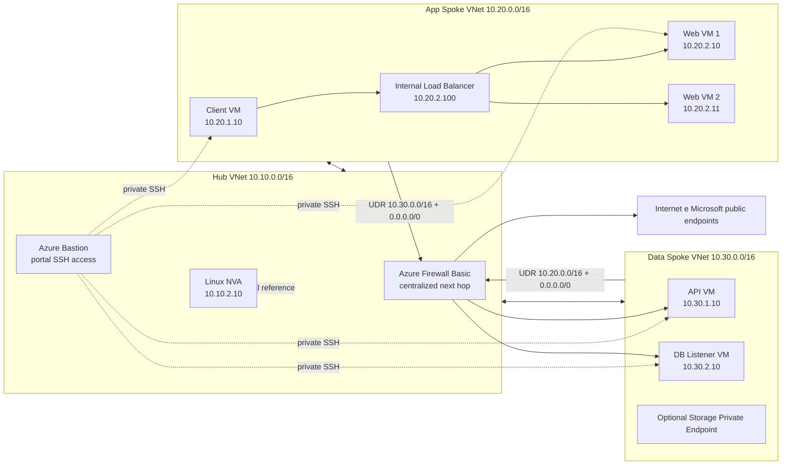
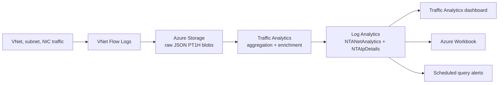
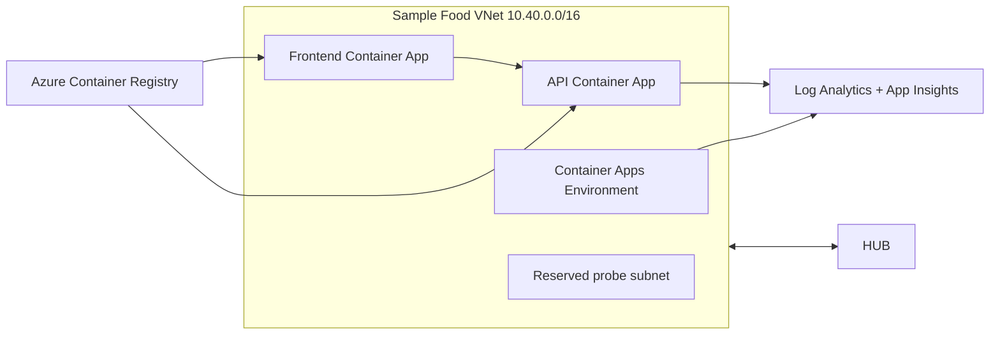

# Architecture

## Topology

## Observability Flow

## Role of Azure Firewall and Linux NVA

Azure Firewall Basic is the actual centralized next hop in the demo. The route tables on the app/data spokes point to the firewall's private IP for inter-spoke and Internet-bound traffic. The firewall policy uses a wildcard network rule `allow-all` that indiscriminately permits all flows routed through the firewall. This is intentional for the lab: the firewall demonstrates centralized transit and observability, while NSGs and UDRs remain the enforcement/fault points for the scenarios.

The Linux NVA `10.10.2.10` remains in the lab as an educational reference. It is used to compare the concept of a virtual appliance and to explain historical or alternative patterns, but it is not the default data path in the demo. Avoid presenting it as the primary inline device.

## Administrative Access to VMs

The Linux VMs have no public IPs and do not use SSH keys generated by Terraform. The lab uses a local password for the admin user and Azure Bastion in the hub as the controlled access path to the VMs' private IPs. This choice prioritizes demo simplicity and portal-based access, but should be treated as a security trade-off: Microsoft recommends SSH keys over passwords for Linux; the architectural compensation is that SSH is not exposed to the Internet and only traverses Bastion.

Azure Bastion requires a dedicated subnet named `AzureBastionSubnet`; in the lab it uses `10.10.5.0/26` in the hub VNet. Do not associate a route table/UDR with the Bastion subnet. Source: https://learn.microsoft.com/en-us/azure/bastion/configuration-settings

The default Bastion SKU is `Basic`, sufficient for browser-based portal connections with username/password over port 22. Upgrade to `Standard` only if native client, tunneling, file transfer, custom ports, or IP-based connections are required. Sources: https://learn.microsoft.com/en-us/azure/bastion/bastion-connect-vm-ssh-linux, https://learn.microsoft.com/en-us/azure/bastion/connect-vm-native-client-linux

All VMs have Boot Diagnostics enabled with managed storage for serial log and boot screenshot. Source: https://learn.microsoft.com/en-us/azure/virtual-machines/boot-diagnostics

## Private Endpoint

The data spoke includes an optional Private Link subnet. This subnet should not be treated as a regular workload subnet routed the same way as the app/API/DB subnets, because the Private Endpoint represents a private interface to a PaaS service.

Key demo points:

- Traffic to the Private Endpoint is interpreted from the source VM's perspective.
- Do not expect flow log capture on the Private Endpoint itself.
- Validation requires correlation between private DNS, the Private Endpoint's private IP, resource ID, and the observed flow.
- The Private Link subnet is not associated with the fault UDR route tables, so the demo avoids introducing side effects on private PaaS traffic.

Source: https://learn.microsoft.com/en-us/azure/network-watcher/vnet-flow-logs-overview#private-endpoint-traffic

## Why This Architecture

- VNet Flow Logs records Layer 4 IP traffic with 5-tuple, direction, flow state, encryption state, and byte/packet counters. Source: https://learn.microsoft.com/en-us/azure/network-watcher/vnet-flow-logs-overview#how-logging-works
- Traffic Analytics aggregates the raw flow logs, enriches them with topology, security, and geography data, and makes them queryable in Log Analytics. Source: https://learn.microsoft.com/en-us/azure/network-watcher/traffic-analytics#how-traffic-analytics-works
- The hub-spoke topology uses Azure Firewall in the hub as the central next hop for inter-spoke and Internet-bound traffic. Hub-spoke source: https://learn.microsoft.com/en-us/azure/architecture/networking/architecture/hub-spoke
- The UDRs on the spokes route app -> data, data -> app, and the default route through the firewall. UDRs override system routes when more specific or applicable. UDR source: https://learn.microsoft.com/en-us/azure/virtual-network/virtual-networks-udr-overview#user-defined-routes
- Azure Firewall Basic is sufficient for the demo because it includes stateful firewall, outbound SNAT, network traffic filtering, and application FQDN filtering. In the lab the network rule is intentionally permissive (`source=*`, `destination=*`, `port=*`, `protocol=Any`) and does not represent an enterprise security baseline. Source: https://learn.microsoft.com/en-us/azure/firewall/features-by-sku#azure-firewall-basic-features
- Network Watcher Next Hop validates the effective next hop before and after faults. Source: https://learn.microsoft.com/en-us/azure/network-watcher/next-hop-overview

## Deployed Resources

- Dedicated resource group.
- Three virtual networks: hub, app spoke, data spoke.
- Bidirectional hub-spoke peerings.
- NSGs on the app, data, and hub subnets.
- Azure Firewall Basic in the hub with `AzureFirewallSubnet`, `AzureFirewallManagementSubnet`, Standard public IP, firewall policy, and a wildcard network rule to allow all flows traversing the firewall.
- Azure Bastion Basic in the hub with `AzureBastionSubnet` and a static Standard public IP.
- Route tables associated with the app/data spokes for centralized routing through the firewall.
- Optional Private Link subnet not associated with the demo fault route tables.
- Private Linux VMs for client, web, API, DB listener, and the reference NVA, with local admin password and Boot Diagnostics enabled.
- Internal Standard Load Balancer.
- Dedicated Storage Account for raw flow logs.
- Log Analytics Workspace.
- Network Watcher Flow Log per VNet.
- Optional Workbook and alerts.

## Optional Extension: Sample Food Ordering App

The repository now includes an optional lab extension with the Sample Food Ordering App on Azure Container Apps, migrated from the Bicep/azd lab `dm-chelupati/sre-agent-lab` to Terraform.

Architectural notes:

- The new VNet uses `10.40.0.0/16` to avoid overlap with hub `10.10.0.0/16`, app `10.20.0.0/16`, and data `10.30.0.0/16`.
- The Container Apps Environment uses a dedicated subnet, as required by Azure Container Apps custom VNet. Source: https://learn.microsoft.com/en-us/azure/container-apps/vnet-custom
- The app uses Container Apps logs and Application Insights as its primary observability plane. Source: https://learn.microsoft.com/en-us/azure/container-apps/log-monitoring
- Azure Container Apps is not supported by VNet Flow Logs; therefore it should not be presented as a workload visible in `NTANetAnalytics`. Source: https://learn.microsoft.com/en-us/azure/network-watcher/vnet-flow-logs-overview#incompatible-services
