# Azure SRE Agent — Architectural guidelines: how many agents, how to organize them, how to specialize them (enterprise / CAF Landing Zone)

Date: 2026-07-03
Scope: **fleet architecture** for Azure SRE Agent at the enterprise tenant level — *how many*
agents to create, *how* to segment them, *how* to assign responsibility and specialize them, with
360° decision criteria (costs/FinOps, effectiveness, efficiency, operational complexity, performance,
reliability/resilience, security, governance).
Audience: Principal/Cloud Architect, Platform Engineering, SRE Lead, CCoE, technical and budget
decision-makers.
Reference context: **hub-and-spoke** topology with **Cloud Adoption Framework (CAF) Landing
Zone** (Platform LZ: Identity/Management/Connectivity — vs Application LZ with *N* applications in
*N* spokes, with *N* = 10, 30, 50, 100+).

> This document answers the **strategic-architectural** question ("how many agents and how to
> organize them"). The *how to configure each individual primitive* (skill, subagent, tool, hook,
> incident filter, scheduled task) is in the master document
> [../sre-agent-guidelines-best-practices-use-cases-how-to.md](../sre-agent-guidelines-best-practices-use-cases-how-to.md).
> The IaC boundaries (control plane vs data plane) are in
> [../adr/0001-sre-agent-iac-boundaries.md](../adr/0001-sre-agent-iac-boundaries.md).

> Source convention: every key statement is anchored to Microsoft Learn
> `learn.microsoft.com/azure/sre-agent/*`. The complete URL index is in
> [Appendix B](#appendix-b--index-of-official-sources). Azure SRE Agent is in **public
> preview**: verify the sources because limits and pricing may change.

---

## Table of contents

- [1. TL;DR — the answer in one page](#1-tldr--the-answer-in-one-page)
- [2. Your questions — direct answers](#2-your-questions--direct-answers)
- [3. Part I — The scoping model that determines everything](#3-part-i--the-scoping-model-that-determines-everything)
- [4. Part II — The guiding principle: segment by boundary, specialize by domain](#4-part-ii--the-guiding-principle-segment-by-boundary-specialize-by-domain)
  - [4.1 One agent per team: a structural anti-pattern (Conway's Law)](#41-one-agent-per-team-a-structural-anti-pattern-conways-law)
- [5. Part III — Segmentation axes: when to create a new agent](#5-part-iii--segmentation-axes-when-to-create-a-new-agent)
  - [5.1 Boundary: concrete definition](#51-boundary-concrete-definition)
  - [5.2 Agent counting method (worksheet)](#52-agent-counting-method-worksheet)
- [6. Part IV — Internal specialization: how to organize a single agent](#6-part-iv--internal-specialization-how-to-organize-a-single-agent)
  - [6.1 Complete catalog of subagents by Azure domain](#61-complete-catalog-of-subagents-by-azure-domain)
- [7. Part V — Anti-patterns to avoid](#7-part-v--anti-patterns-to-avoid)
- [8. Part VI — Mapping to CAF Landing Zone / hub-and-spoke](#8-part-vi--mapping-to-caf-landing-zone--hub-and-spoke)
- [9. Part VII — Reference topologies by scale (crawl-walk-run)](#9-part-vii--reference-topologies-by-scale-crawl-walk-run)
- [10. Part VIII — 360° analysis by dimension](#10-part-viii--360-analysis-by-dimension)
- [11. Part IX — Decision tree and checklist](#11-part-ix--decision-tree-and-checklist)
- [12. Part X — FinOps: the math of fleet costs](#12-part-x--finops-the-math-of-fleet-costs)
- [13. Part XI — Cross-scope multi-agent cooperation](#13-part-xi--cross-scope-multi-agent-cooperation)
  - [13.2 The architectural point: isolation vs cooperation](#132-the-architectural-point-isolation-vs-cooperation)
  - [13.5 Enterprise decision tree](#135-enterprise-decision-tree)
- [14. Part XII — End-to-end decision framework (playbook for the customer)](#14-part-xii--end-to-end-decision-framework-playbook-for-the-customer)
  - [14.1 The 7 guiding principles](#141-the-7-guiding-principles)
  - [14.3 Master decision tree (number and organization)](#143-master-decision-tree-number-and-organization)
- [Appendix A — Glossary](#appendix-a--glossary)
- [Appendix B — Index of official sources](#appendix-b--index-of-official-sources)

---

## 1. TL;DR — the answer in one page

**Guiding principle (one sentence): segment agents by *responsibility and risk boundary*
(ownership/approval, environment, residency/region, permission posture), and specialize
*inside* each agent by *operational domain* (subagent + incident routing + targeted
skill/knowledge). Do not segment by application, by technology layer, or by *organizational team* — by
Conway's Law, "1 agent per team" collapses into "per-layer" or "per-app" (§[4.1](#41-one-agent-per-team-a-structural-anti-pattern-conways-law)).**

> **If you are with the customer and want the ready-to-use method:** go to the
> **[End-to-end decision framework (Part XII)](#14-part-xii--end-to-end-decision-framework-playbook-for-the-customer)**
> — 7 principles, 5-step method, master decision tree (number **and** organization), mapping to the
> **8 quality needs** (effectiveness, efficiency, cost, performance, resiliency, security,
> reliability, governance) and do/don't checklist.

The three concise answers:

1. **How many?** You do not count from the apps: you **count from the boundaries**. Answer 4 concrete
   questions (residency, Prod/Non-Prod, Platform/Application, approval domains) and the number **emerges from the
   count** — see the [counting method (§5.2)](#52-agent-counting-method-worksheet).
   With 20 or 100 apps, the number of agents **does not change**: only the *internal* richness
   (subagent/skill/routing) changes. Principle of consolidation source:
   [Pricing — "consolidating workloads under one agent reduces always-on costs"](https://learn.microsoft.com/en-us/azure/sre-agent/pricing-billing#frequently-asked-questions).
2. **How do I organize them?** By **boundaries**: (a) Platform vs Application (CAF), (b) Prod vs Non-Prod,
   (c) region/residency, (d) team *ownership/approval* domain, (e) permission posture
   (Reader vs Privileged). Where boundaries coincide, they **collapse** into a single agent.
3. **How do I specialize them?** With **subagents by operational domain** (network, IaaS/VM, PaaS/container,
   data, AI, RCA/code, FinOps, security), **incident routing** (response plan by
   severity/service/keyword) to the right subagent, and **skill + knowledge** scoped per app.
   Source: [Custom agents (subagents)](https://learn.microsoft.com/en-us/azure/sre-agent/sub-agents).

Why not the extremes:

| Extreme | Verdict | Certified reason |
| --- | --- | --- |
| **1 agent for the tenant, 1 subagent for each app** | Partial/incorrect at scale | Subagents are for *operational domain*, not per app; a single agent violates hard boundaries (residency, prod/non-prod, approval). Source: [sub-agents](https://learn.microsoft.com/en-us/azure/sre-agent/sub-agents), [user-roles](https://learn.microsoft.com/en-us/azure/sre-agent/user-roles). |
| **1 agent per layer** (IaaS/PaaS/network/data) | ❌ Worst anti-pattern | It destroys **cross-layer correlation**, which is the core value (for example, App Insights memory trend + GitHub commit + pod restart in the **same thread**). Source: [Overview — SRE Agent in action](https://learn.microsoft.com/en-us/azure/sre-agent/overview). |
| **1 agent per team** (functional or "1 team = 1 workload") | ❌ Structural anti-pattern | By **Conway's Law** it collapses into the other two: functional teams (network/infra/app) ⇒ *per-layer*; stream-aligned teams ⇒ *per-app*. Team topology belongs on the **internal** axis (subagent), not the number of agents. Sources: [Conway's Law](https://martinfowler.com/bliki/ConwaysLaw.html), [sub-agents](https://learn.microsoft.com/en-us/azure/sre-agent/sub-agents), §[4.1](#41-one-agent-per-team-a-structural-anti-pattern-conways-law). |
| **Few agents segmented by boundary + subagents by domain** | ✅ Recommended | Maximizes correlation and value, minimizes always-on cost, respects least-privilege and per-agent isolation. Sources: [pricing](https://learn.microsoft.com/en-us/azure/sre-agent/pricing-billing), [security](https://learn.microsoft.com/en-us/azure/sre-agent/security-overview). |

---

## 2. Your questions — direct answers

**Q1. How many Azure SRE Agents should I deploy for my tenant?**
You do not answer with a range: you **calculate** it. An agent is a regional ARM resource
(`Microsoft.App/agents`) but its **operational scope is not an app**: it is the set of resources on which
its managed identity has RBAC, and **a single agent covers many resource groups and even multiple
subscriptions** ([permissions](https://learn.microsoft.com/en-us/azure/sre-agent/permissions),
[create-agent](https://learn.microsoft.com/en-us/azure/sre-agent/create-agent)). Therefore, the number
of apps is **not** a driver. The correct number is obtained by counting your **boundaries** with the
[counting method (§5.2)](#52-agent-counting-method-worksheet): typically **3-4
agents** for a single-residency company with a central SRE team, whether the apps are 10 or 100.

**Q2. How do I organize my agent or agents?**
By **responsibility/risk boundary** (see [Part III](#5-part-iii--segmentation-axes-when-to-create-a-new-agent)),
aligned with CAF: a **Platform agent** for the Platform LZs (Connectivity/Management/Identity) and one
or a few **Application agents** for the Application LZs, segmented first by **environment** (Prod /
Non-Prod), then by **ownership/approval domain** only if the teams require it.

**Q3. What criterion do I use to decide how many/which agents? What is each agent responsible for? How do I
split scope/responsibility/configuration?**
Criterion: **one agent = one boundary of autonomy + approval + residency + permission posture**.
An agent's responsibility is the **estate** (set of RGs/subscriptions) it manages, with its
set of **SRE Agent Administrators** (who approve actions), its **incident platform**, its
**model**, and its **posture** (`mode`/`accessLevel`). Scope is split via RBAC on the UAMI
(granularity = resource group); human responsibility via per-agent SRE Agent roles; behavioral
configuration via subagent/skill/response-plan *inside* the agent.

**Q4. Is one single agent with many per-app subagents okay, or one per layer?**
Neither. **Not 1 subagent per app** (subagents are for *operational domain*; at scale you
exhaust skill/tool budgets and lose maintainability). **Not 1 agent per layer** (you fragment the
cross-layer correlation that is why the agent delivers value). The correct shape is
**few agents by boundary, each with subagents by domain + incident routing**. A complete example
of an agent with **all subagents by Azure domain** is in the
[catalog (§6.1)](#61-complete-catalog-of-subagents-by-azure-domain).

---

## 3. Part I — The scoping model that determines everything

All fleet decisions derive from **how the agent binds to resources**. Certified facts
(with source) that overturn the assumption "1 agent = 1 app":

| # | Certified fact | Fleet implication | Source |
| --- | --- | --- | --- |
| F1 | The agent is a **regional** ARM resource (`Microsoft.App/agents`), creatable only in **Sweden Central, East US 2, Australia East**. | **Region/residency** is a *hard* boundary: if different residencies are required, different agents are required. | [create-agent](https://learn.microsoft.com/en-us/azure/sre-agent/create-agent) |
| F2 | The **operational scope = RBAC on the UAMI**; an agent sees "251 resources across 3 resource groups" and filters find groups **even cross-subscription**. | One agent covers **many apps, many RGs, multiple subscriptions**. The number of apps does **not** drive the number of agents. | [create-agent](https://learn.microsoft.com/en-us/azure/sre-agent/create-agent), [permissions](https://learn.microsoft.com/en-us/azure/sre-agent/permissions) |
| F3 | The **scope granularity is the resource group**: "you cannot remove individual permissions, only whole resource groups"; without assigned RGs the UAMI has no permissions. | Design agent boundaries **aligned with the RGs** of the Landing Zones. | [permissions](https://learn.microsoft.com/en-us/azure/sre-agent/permissions) |
| F4 | The **permission level (Reader vs Privileged)** is chosen at creation and applies to the managed RGs; Privileged adds contributor roles by resource type. | **Reader-only** vs **Privileged** estates fit best on separate agents (permission posture = boundary). | [create-agent](https://learn.microsoft.com/en-us/azure/sre-agent/create-agent), [permissions](https://learn.microsoft.com/en-us/azure/sre-agent/permissions) |
| F5 | Roles always assigned: Reader/Log Analytics Reader/Monitoring Reader **@ RG** + **Monitoring Contributor @ subscription**. | Each agent touches the **subscription** (Monitoring Contributor): watch out for overlaps between agents on the same subscription. | [permissions](https://learn.microsoft.com/en-us/azure/sre-agent/permissions) |
| F6 | **OBO (on-behalf-of)**: a Reader agent can temporarily elevate using the credentials of an **SRE Agent Administrator** (work/school account). | You can keep Reader as the default posture and allow point actions → reduces the need to create separate Privileged agents. | [permissions](https://learn.microsoft.com/en-us/azure/sre-agent/permissions), [security](https://learn.microsoft.com/en-us/azure/sre-agent/security-overview) |
| F7 | **Per-agent user roles** (Azure IAM on the agent resource): SRE Agent Reader / Standard User / Administrator; **only the Administrator approves** actions/OBO and manages connectors. | The agent is the **unit of approval authority**: if Team A must not approve Team B's actions, you need an agent boundary. | [user-roles](https://learn.microsoft.com/en-us/azure/sre-agent/user-roles) |
| F8 | **Run mode (Review/Autonomous) is per response plan and per scheduled task**, not in the subagent definition. | **Autonomy is differentiated *inside* an agent** → it is not a reason to split by layer/domain. | [user-roles](https://learn.microsoft.com/en-us/azure/sre-agent/user-roles), [sub-agents](https://learn.microsoft.com/en-us/azure/sre-agent/sub-agents) |
| F9 | **Per-agent isolation** (security): dedicated ADC sandbox, per-customer Cosmos DB, per-agent storage/proxy/UAMI; "no data/compute/credentials are shared between agents". | Each agent is a **hard isolation boundary** → useful to separate high-risk estates. | [security](https://learn.microsoft.com/en-us/azure/sre-agent/security-overview) |
| F10 | **Two-part cost**: **always-on 4 AAU/agent-hour** (fixed, from creation to *delete*) + **active flow** (variable, token-based). **No free tier.** | Each agent adds a **fixed cost** independent of work → fleet costs grow with the **number of agents**, not the apps. | [pricing](https://learn.microsoft.com/en-us/azure/sre-agent/pricing-billing) |
| F11 | Monthly **AAU allocation limit per agent** (min 500, max 1,000,000) on active flow only; always-on continues anyway. | The **budget is governed per agent** → more agents = more budgets to manage, but also spend isolation. | [pricing](https://learn.microsoft.com/en-us/azure/sre-agent/pricing-billing) |
| F12 | At creation the agent creates **App Insights + Log Analytics + Managed Identity**; **one active incident platform** per agent; the auto-created `quickstart_handler` processes all severities. | Each agent brings its own **resources and wiring** (incident platform, telemetry): duplicating them has an operational cost. | [overview](https://learn.microsoft.com/en-us/azure/sre-agent/overview), [pricing](https://learn.microsoft.com/en-us/azure/sre-agent/pricing-billing) |

**Part I summary:** the agent is **not an application unit**; it is a **regional operational-governance unit**
defined by (RBAC scope) × (permission posture) × (approval authority) ×
(residency) × (fixed cost). From this come the two axes of Part II.

---

## 4. Part II — The guiding principle: segment by boundary, specialize by domain

Two orthogonal axes govern the entire architecture:

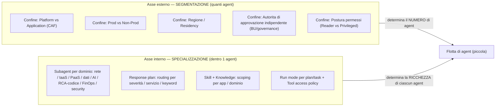

- **External axis (segmentation → *how many*):** add an agent **only** when you cross a non-collapsible
  responsibility/risk boundary. Each boundary is justified by a fact from Part I (F1, F4, F7, F9).
- **Internal axis (specialization → *how rich*):** given an agent, cover its entire scope with
  **subagents by domain** and **incident routing**, not by multiplying agents.
  Source: [sub-agents](https://learn.microsoft.com/en-us/azure/sre-agent/sub-agents).

Operational rule: **first maximize the internal axis** (a well-specialized agent covers a lot);
**then** use the external axis **only** for boundaries you cannot manage *inside* the agent.

### 4.1 One agent per team: a structural anti-pattern (Conway's Law)

**Typical customer question:** *"I have a Network team, a Cloud Infra team, an Application team… do I give each one
its own agent?"* The answer is **no**, and the reason is **structural**, not aesthetic. The reasoning,
step by step:

**Step 1 — Conway's Law** (*Conway's Law* = an organization produces systems whose structure mirrors the communication structure of the organization). If you assign **1 agent per team**, the fleet
**inherits the team topology**. Source: [Conway's Law — M. Fowler](https://martinfowler.com/bliki/ConwaysLaw.html).

**Step 2 — The two (and only two) real ways enterprise teams are organized:**

- **(a) Functional silos** (*functional silo / activity-oriented* = division by technical
  competence): Network, Cloud infra/Platform, Compute/Systems, Database, Application, Security. This is the
  dominant model in enterprises.
- **(b) Stream-aligned** (*Team Topologies* = a team aligned to an end-to-end value stream, "you
  build it, you run it"): **1 team per workload**. Source:
  [Team Topologies — Key Concepts](https://teamtopologies.com/key-concepts).

**Step 3 — Apply Conway to both: both collapse into an already documented anti-pattern
([Part V](#7-part-v--anti-patterns-to-avoid)).**

| Team model (Conway) | "1 agent per team" becomes… | Resulting anti-pattern | Certification |
| --- | --- | --- | --- |
| (a) Functional silos | **1 agent per layer** (network/infra/app) | ❌ destroys cross-layer correlation (the core value) | [overview](https://learn.microsoft.com/en-us/azure/sre-agent/overview); Fowler: *"teams organized by software layer … problematic because each feature needs close collaboration between the layers"* |
| (b) Stream-aligned | **1 agent per application** | ❌ always-on ×N; cross-workload correlation lost | [pricing — FAQ *"consolidating workloads under one agent reduces always-on costs"*](https://learn.microsoft.com/en-us/azure/sre-agent/pricing-billing#frequently-asked-questions); [permissions — one agent covers many RGs](https://learn.microsoft.com/en-us/azure/sre-agent/permissions) |

**Logical conclusion (not an opinion):** since *both* real organizational forms, mapped
1:1 to agents, produce a certified anti-pattern, **"1 agent per team" is invalid regardless of
the team model.** It is a structural truth, not an edge case.

**Step 4 — The resolution: Inverse Conway Maneuver** (*inverse Conway maneuver* = deliberately designing
mapping to achieve the desired architecture, rather than inheriting the topology
of the teams; [Fowler](https://martinfowler.com/bliki/ConwaysLaw.html)):

> **Each team's competence maps to the INTERNAL axis (subagent). The NUMBER of agents is determined
> only by *governance* boundaries (external axis). Never cross the two axes.**

The pattern is **official**: *Domain Expert → "VM Expert, AKS Expert, Network Expert"*
([sub-agents](https://learn.microsoft.com/en-us/azure/sre-agent/sub-agents)). Therefore the team topology
is transferred *inside* the agent:

| Enterprise team (silo) | Maps to (internal axis) | NOT to |
| --- | --- | --- |
| Network Engineering | subagent `network-expert` | ~~dedicated agent~~ |
| Cloud Infra / Platform | subagent `config-compliance-auditor` | ~~dedicated agent~~ |
| Compute / Systems | subagent `vm-iaas-expert`, `aks-kubernetes-expert` | ~~dedicated agent~~ |
| Database / Data | subagent `sql-database-expert`, `cosmos-nosql-expert` | ~~dedicated agent~~ |
| Application / Software | subagent `appservice-functions-expert`, `rca-source-code-expert` | ~~dedicated agent~~ |
| Security / IAM | subagent `identity-security-expert` | ~~dedicated agent~~ |

All **inside the same agent, in the same thread**, with shared-context handoff → the
cross-layer correlation (the core value) is **preserved**, not fragmented.

**Step 5 — The only case in which the organization *legitimately* affects the number of agents.** It is not
the "team"; it is the **independent approval authority** (`K` = BU/tenant that, for *Segregation of
Duties*, must not approve each other's actions). This is a **coarse governance boundary**
— typically `K=1` (central SRE) or a few (autonomous BUs) — **not** the fine-grained engineering discipline.
That is why the worksheet (§[5.2](#52-agent-counting-method-worksheet)) counts `K = approval domains`, not "number of teams".

**Decision tree — "does this team require a new agent?"**

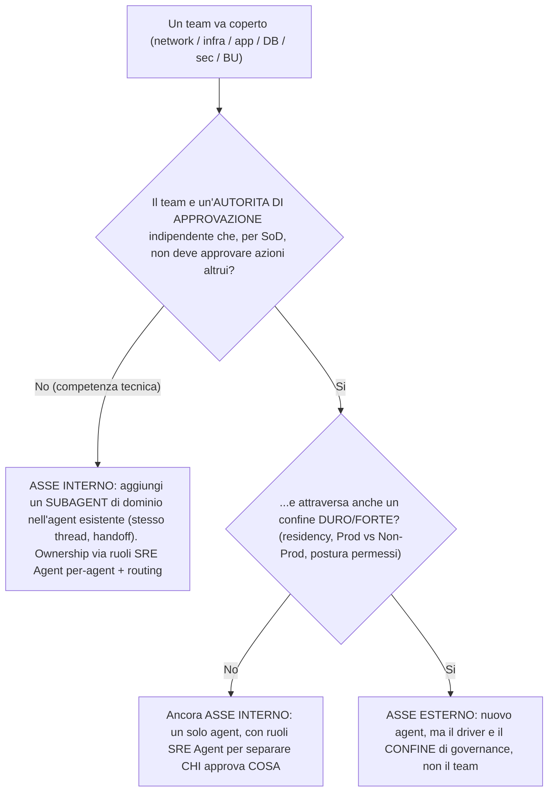

**Pros / cons and trade-offs of the resolution:**

| Option | Pros | Cons / trade-off |
| --- | --- | --- |
| ✅ **Team → subagent** (Inverse Conway) | Cross-layer correlation preserved; **1 single** always-on (4 AAU/hour); one shared knowledge base; lower MTTR; least-privilege on one UAMI; logical ownership via roles/routing | One single set of *SRE Agent Administrator* approves multiple domains → mitigated with per-agent roles and response-plan routing; requires Git-first discipline on the subagent library |
| ❌ **Team → agent** (naive Conway) | Ownership "visually" aligned to the org chart; each team "owns" its agent | Always-on ×N; cross-layer/cross-workload correlation destroyed; N incident platforms + N UAMIs + N config surfaces; fragmented knowledge; worse MTTR; FinOps sprawl |

**Operational implication (team ownership without physical sprawl):** team ownership does NOT
require a dedicated agent; it is achieved with (i) its **domain subagent**, (ii) the **per-agent SRE
Agent roles** (who requests/approves actions on its domain —
[user-roles](https://learn.microsoft.com/en-us/azure/sre-agent/user-roles)), (iii) the **response-plan
routing** to its subagent, (iv) its **knowledge base**. Logical ownership, consolidated runtime.

**Convergence with Microsoft sources:** CAF reminds us that organizational structures *"don't
necessarily have to map to an org chart … designed to capture the alignment of roles and
responsibilities"* and can be **virtual teams**
([CAF Organize](https://learn.microsoft.com/en-us/azure/cloud-adoption-framework/organize/)); WAF
recommends to *"foster a collaborative environment of shared knowledge instead of siloed learning"*
and to leverage *"centralized operations teams with specialized skills"*
([WAF Operational Excellence](https://learn.microsoft.com/en-us/azure/well-architected/operational-excellence/principles)).
Both converge on the rule: **align responsibilities, do not multiply runtime units.**

---

## 5. Part III — Segmentation axes: when to create a new agent

### 5.1 Boundary: concrete definition

A **boundary** is, simply put, **a line that a single agent cannot or should not
cross**. This is not theory: it is a **verifiable fact** about your environment, and the types are only 5 —
all **countable** (each corresponds to a question with a numeric answer). If you can answer
these 5 questions about the customer's environment, you know how many agents are needed.

| Boundary | Concrete question to ask the customer | Why a single agent cannot cross it | Type |
| --- | --- | --- | --- |
| **Residency / Region** | "Must your operational data stay within a certain jurisdiction? In how many distinct jurisdictions must you operate?" | The agent exists **only** in 3 regions (SC/EUS2/AUE) and the sandbox respects regional boundaries: it cannot exist in two jurisdictions. | **Hard** (physical/legal) |
| **Platform vs Application** | "Are hub/network/identity managed by a different team than the application teams?" (in CAF: yes) | Different owner **and** an action on the hub (firewall/route) impacts *all* spokes: different blast radius and responsibility. | **Structural** (organizational) |
| **Environment (Prod vs Non-Prod)** | "Do you want the *same* agent, with the same identity and the same autonomy, to touch production **and** dev/test?" (usually: no) | An autonomous mistake in Prod is unacceptable; Non-Prod wants more freedom. Isolating them separates risk and change management. | **Strong** (policy/risk) |
| **Independent approval authority** (BU/governance, *not* engineering team) | "In production, whoever is *SRE Agent Administrator* on an agent approves actions across **the entire** estate of that agent. Are there **independent approval authorities** (BUs/tenants that do not approve each other) that must NOT be able to approve actions on each other's resources? ⚠️ 'Engineering team' — network/infra/app — **is not** a boundary: see §[4.1](#41-one-agent-per-team-a-structural-anti-pattern-conways-law)." | The approval role is **per-agent**: one single agent = one single group of approvers across everything it touches. | **Strong** (governance) |
| **Permission posture** | "Are there estates that must remain strictly *read-only* while others may write?" | The Reader/Privileged level is an **agent-wide default**: mixing postures in the same agent is messy. | **Medium** |

Key distinction between the types:

- **HARD boundary** = **impossible** to cross with a single agent, due to a technical or
  legal limit. The only truly hard one is **residency/region** (the product cannot place an agent in two
  jurisdictions). Here **you have no choice**: different boundaries ⇒ different agents.
  Source: [create-agent — Region](https://learn.microsoft.com/en-us/azure/sre-agent/create-agent),
  [security — Private network access](https://learn.microsoft.com/en-us/azure/sre-agent/security-overview).
- **STRUCTURAL / STRONG boundary** = technically you *could* cross it with a single agent, but you
  **should not** for governance/risk reasons (Platform vs App, Prod vs Non-Prod, independent
  approval authorities). Here **you choose**, based on the risk you accept.
  Source: [permissions](https://learn.microsoft.com/en-us/azure/sre-agent/permissions),
  [user-roles](https://learn.microsoft.com/en-us/azure/sre-agent/user-roles).
- **These are NOT boundaries** (they belong *inside* an agent, not between different agents): the **number of apps**, the
  **number of subscriptions**, the **technology layers** (IaaS/PaaS/network/data), the **engineering teams**
  (network/infra/app, functional or stream-aligned — Conway's Law, §[4.1](#41-one-agent-per-team-a-structural-anti-pattern-conways-law)),
  the **difference in autonomy** between flows. Source: [permissions](https://learn.microsoft.com/en-us/azure/sre-agent/permissions),
  [user-roles — run modes per plan](https://learn.microsoft.com/en-us/azure/sre-agent/user-roles).

### 5.2 Agent counting method (worksheet)

"How many agents?" is **not** answered with "3-8 for 10-100 apps" (that would be a random number). It is
**calculated with the customer in 4 questions**; the number is the **output**, and you can defend it step by step.

**The 4 questions (worksheet):**

1. **R** = in how many distinct **residencies/jurisdictions** must you operate? (typical EU-only: `R = 1`;
   regulated global: `R = 2-3`). — *hard boundary*
2. **Do you isolate Prod from Non-Prod?** Yes (typical) ⇒ 2 environments; No ⇒ 1. — *strong boundary*
3. **Do you separate Platform from Application?** In CAF: yes ⇒ add the **Platform family** (normally 1
   agent, often only in Prod). — *structural boundary*
4. **K** = how many **independent approval domains** do you have in production? (single central SRE ⇒
   `K = 1`; K business units that do not approve each other ⇒ `K`). — *strong boundary*

**Formula (simple), for each residency R:**

```text
agent_per_residency = 1 Platform-Prod
                    + K App-Prod           (one per approval domain)
                    + 1 App-Non-Prod        (shared)
                    [ + 1 Platform-Non-Prod  only if you truly isolate it ]

N_agent ≈ R × (agent_per_residency)
```

**Concrete examples — the number *emerges* from the count, you do not just throw it out randomly:**

| Customer | R | K | Environments | Calculation | # agents |
| --- | --- | --- | --- | --- | --- |
| Mid-size, EU-only, **20 apps**, 1 central SRE team | 1 | 1 | Prod + Non-Prod | 1 Platform + 1 App-Prod + 1 App-Non-Prod | **3** |
| Mid-size, EU-only, **100 apps**, 1 central SRE team | 1 | 1 | Prod + Non-Prod | 1 Platform + 1 App-Prod + 1 App-Non-Prod | **3** |
| Enterprise, EU-only, 60 apps, **3 autonomous BUs in prod** | 1 | 3 | Prod + Non-Prod | 1 Platform + 3 App-Prod + 1 App-Non-Prod | **5** |
| Regulated global, 100 apps, **EU+US residency**, 2 BUs | 2 | 2 | Prod + Non-Prod | 2 × (1 Platform + 2 App-Prod + 1 App-Non-Prod) | **8** |

**The message to say to the customer (clear and defensible):** *"The number of agents does not depend on
how many apps you have — 20 or 100 is identical. It depends on how many **residencies**, how many **environments**, and how many
independent **approval authorities** you have. Let's count them now: the result is your number."*
Note the first two rows in the table: **same number of agents (3)** with 20 or with 100 apps; what
changes is only the **internal richness** of the Application agent (more subagents/skills/routing), not the
number of agents. Certified consolidation basis:
[Pricing — "consolidating workloads under one agent reduces always-on costs"](https://learn.microsoft.com/en-us/azure/sre-agent/pricing-billing#frequently-asked-questions).

### 5.3 Segmentation drivers (reference table)

The drivers that **justify** an additional agent, ordered by strength. "HARD" = technical boundary that cannot
be bypassed; "STRONG" = strongly recommended; "MEDIUM" = evaluate cost/benefit.

| # | Boundary (driver) | Strength | Create a separate agent when… | Why (source) |
| --- | --- | --- | --- | --- |
| S1 | **Region / Data residency** | HARD | You must respect different residencies or operate in different region sets (the agent exists only in SC / EUS2 / AUE; the sandbox respects regional boundaries). | [create-agent](https://learn.microsoft.com/en-us/azure/sre-agent/create-agent), [security — Private network access](https://learn.microsoft.com/en-us/azure/sre-agent/security-overview) |
| S2 | **Environment: Prod vs Non-Prod** | STRONG | You want to isolate blast radius, change management, and the autonomy posture of production from dev/test/staging. | Agent-wide posture and RBAC: [create-agent](https://learn.microsoft.com/en-us/azure/sre-agent/create-agent), [permissions](https://learn.microsoft.com/en-us/azure/sre-agent/permissions) |
| S3 | **Independent approval authority** (BU/governance) | STRONG | **BUs/tenants with independent approval authority** must **approve only their own** actions (the *SRE Agent Administrator* role is per-agent). ⚠️ It is not "1 agent per engineering team": see §[4.1](#41-one-agent-per-team-a-structural-anti-pattern-conways-law). | [user-roles](https://learn.microsoft.com/en-us/azure/sre-agent/user-roles) |
| S4 | **Platform vs Application (CAF)** | STRONG | You want to separate the operations of the Platform LZs (connectivity/identity/management, high cross-spoke blast radius) from application operations. | [permissions](https://learn.microsoft.com/en-us/azure/sre-agent/permissions); see [ADR 0001 — network gating](../adr/0001-sre-agent-iac-boundaries.md) |
| S5 | **Permission posture: Reader-only vs Privileged** | MEDIUM | One estate must remain strictly read-only while another operates in Privileged/Autonomous mode (the *level* is an agent-wide default). | [create-agent](https://learn.microsoft.com/en-us/azure/sre-agent/create-agent), [permissions](https://learn.microsoft.com/en-us/azure/sre-agent/permissions) |
| S6 | **Cost attribution / chargeback** | MEDIUM | You need clean per-BU showback and Cost Management tags are not enough; the agent isolates AAUs. | [pricing — Monitor your costs](https://learn.microsoft.com/en-us/azure/sre-agent/pricing-billing) |
| S7 | **Security isolation / blast radius** | MEDIUM | Mission-critical estates (Tier-0) require hard isolation from everything else (sandbox/credentials per-agent). | [security — Per-customer isolation](https://learn.microsoft.com/en-us/azure/sre-agent/security-overview) |
| S8 | **Scale / configuration limits** | MEDIUM | One agent saturates its internal budgets (max 5 active skills, ~80 tools, KB up to 1,000 files per custom agent) or the sprawl of RGs/managed resources becomes unmanageable. | [sub-agents](https://learn.microsoft.com/en-us/azure/sre-agent/sub-agents); master doc [Part III](../sre-agent-guidelines-best-practices-use-cases-how-to.md) |

**What is NOT a valid driver:**

- ❌ **Number of applications** — one agent covers many apps (F2).
- ❌ **Number of subscriptions** — one agent is cross-subscription via RBAC (F2). The subscription matters
  only if it coincides with a boundary of ownership/environment/residency.
- ❌ **Technology layer** (IaaS/PaaS/network/data) — that is an *internal* axis (subagent), not a fleet axis.
- ❌ **Engineering team** (network/infra/app, functional or stream-aligned) — by Conway's Law,
  "1 agent per team" collapses into "1 agent per layer" or "1 agent per app": both are anti-patterns. Teams
  map to **subagents**, not to the number of agents (§[4.1](#41-one-agent-per-team-a-structural-anti-pattern-conways-law)).
- ❌ **Difference in autonomy** between flows — that is managed with run mode per response plan (F8).

Collapse rule: if two estates share the **same region + same environment + same approval authority + same permission posture**, they **must sit on the same agent** (one more agent
here is only extra always-on cost and extra operational surface, with no benefit).

---

## 6. Part IV — Internal specialization: how to organize a single agent

Given an agent, richness is achieved **inside**, not by multiplying agents. Layered model:

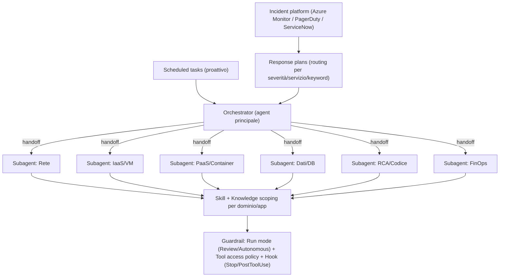

Internal specialization criteria:

| Mechanism | What it is for | WHAT/WHEN criterion | Source |
| --- | --- | --- | --- |
| **Subagent by operational domain** | Focused expertise + handoff chain in a **single thread** | Model by *domain* (network, IaaS, PaaS, data, AI, RCA/code, FinOps, security), **not by app**. Pattern: Domain Expert / Task Specialist / Workflow Executor. | [sub-agents](https://learn.microsoft.com/en-us/azure/sre-agent/sub-agents) |
| **Response plan (routing)** | Bring the incident to the right subagent and filter noise | Routing by **severity + service + keyword/title**; mutually exclusive by construction; remove `quickstart_handler` if you write your own. | [pricing — cost tips](https://learn.microsoft.com/en-us/azure/sre-agent/pricing-billing); master doc [Part IV](../sre-agent-guidelines-best-practices-use-cases-how-to.md) |
| **Skill + Knowledge** | Procedures and per-app/domain context | Add **per-app context** (architecture, runbook, KQL) as skill/knowledge instead of creating agents: "add context → fewer wasted tokens". | [pricing — cost tips](https://learn.microsoft.com/en-us/azure/sre-agent/pricing-billing), [sub-agents — KB](https://learn.microsoft.com/en-us/azure/sre-agent/sub-agents) |
| **Run mode per plan/task** | Differentiate autonomy by flow | Prod/cross-spoke network → **Review**; well-tested low-risk remediations → **Autonomous**. Set it on the plan/task, not on the subagent. | [user-roles](https://learn.microsoft.com/en-us/azure/sre-agent/user-roles), [sub-agents](https://learn.microsoft.com/en-us/azure/sre-agent/sub-agents) |
| **Tool access policy + Hook** | Guardrails and audit | Deny destructive operations; **Stop/PostToolUse** hooks for completeness/telemetry. The primary pre-execution gate is **Review mode + policy**, not hooks. | [agent-hooks](https://learn.microsoft.com/en-us/azure/sre-agent/agent-hooks); master doc [Part VI](../sre-agent-guidelines-best-practices-use-cases-how-to.md) |

**How to scale to *N* apps inside one agent:** add (i) skill+knowledge for the new app and (ii)
routing rules in the response plans to the relevant domain subagent. **Do not** add a
subagent for each app and **do not** add an agent for each app.

### 6.1 Complete catalog of subagents by Azure domain

This is the concrete example requested: **a single Application agent** with the subagents needed to
cover **all Azure domains**. The domains derive *one-to-one* from the service families that SRE
Agent officially handles ([Overview — "Azure service management capabilities"](https://learn.microsoft.com/en-us/azure/sre-agent/overview):
Compute, Storage, Networking, Databases, Monitoring/Management). The pattern is the official
**"Domain Expert"**, whose documented examples are literally *"VM Expert, AKS Expert, Network
Expert"* ([sub-agents — Custom agent patterns](https://learn.microsoft.com/en-us/azure/sre-agent/sub-agents)).

> The **5 built-in subagents** (architecture, logs & metrics, source code, root cause analysis,
> scanning) already cover the **cross-cutting** functions ([Overview](https://learn.microsoft.com/en-us/azure/sre-agent/overview)).
> The custom subagents below add **service verticality**; do not recreate the built-ins.

Catalog (Domain → subagent → Azure services → typical symptoms → typical built-in tools → handoff):

| Domain | Subagent (custom) | Azure services covered | Typical symptoms/signals | Typical built-in tools | Handoff → |
| --- | --- | --- | --- | --- | --- |
| **Compute — IaaS** | `vm-iaas-expert` | Virtual Machines, VMSS, managed disks, extensions, boot diagnostics, guest OS | CPU/memory, boot failure, full disk, missing AMA heartbeat | `RunAzCliReadCommands`, `RunAzCliWriteCommands`, `QueryLogAnalyticsByWorkspaceId`, `GetAzCliHelp` | `network-expert`, `observability-expert` |
| **Compute — Kubernetes** | `aks-kubernetes-expert` | AKS, node pool, pod, deployment, HPA, ingress, control plane | CrashLoopBackOff, pod Pending, node NotReady, image pull error | `RunAzCliReadCommands`, `RunAzCliWriteCommands`, `QueryLogAnalyticsByWorkspaceId` | `rca-source-code-expert`, `network-expert` |
| **Compute — Container** | `container-apps-expert` | Azure Container Apps (revisions, KEDA scaling, Dapr) | revision Failed, scale-to-zero cold start, 5xx | `RunAzCliReadCommands`, `RunAzCliWriteCommands`, `QueryAppInsightsByResourceId` | `rca-source-code-expert`, `observability-expert` |
| **Compute — PaaS** | `appservice-functions-expert` | App Service / Web Apps, Azure Functions (plan, slot, app settings) | cold start, 5xx, restart, slot swap, quota | `RunAzCliReadCommands`, `RunAzCliWriteCommands`, `QueryAppInsightsByResourceId` | `rca-source-code-expert`, `sql-database-expert` |
| **Storage** | `storage-expert` | Storage account, Blob/File/Queue/Table, ADLS Gen2 | throttling 503, expired SAS/key, throughput, tier | `RunAzCliReadCommands`, `QueryLogAnalyticsByWorkspaceId` | `network-expert` |
| **Networking** | `network-expert` | VNet, NSG, UDR/route table, peering, Private Endpoint/Link, private DNS, Load Balancer, App Gateway/WAF, Firewall, Bastion, VPN/ER, Front Door | lost connectivity, NSG deny, asymmetric routing, PE/DNS resolution, LB probe down, WAF block | `RunAzCliReadCommands`, `RunAzCliWriteCommands`, `QueryLogAnalyticsByWorkspaceId` | `observability-expert` |
| **Database — SQL** | `sql-database-expert` | Azure SQL Database, SQL Managed Instance | DTU/vCore saturation, deadlock, blocking, failover group | `RunAzCliReadCommands`, `QueryLogAnalyticsByWorkspaceId` | `rca-source-code-expert` |
| **Database — OSS** | `postgresql-mysql-expert` | Azure DB for PostgreSQL / MySQL (flexible server) | connection exhaustion, replication lag, IOPS, full storage | `RunAzCliReadCommands`, `QueryLogAnalyticsByWorkspaceId` | `rca-source-code-expert` |
| **Database — NoSQL** | `cosmos-nosql-expert` | Azure Cosmos DB | throttling 429 (RU/s), hot partition, consistency, multi-region | `RunAzCliReadCommands`, `QueryLogAnalyticsByWorkspaceId` | `observability-expert` |
| **Cache** | `cache-redis-expert` | Azure Cache for Redis / Azure Managed Redis | eviction, memory pressure, latency, connection spikes | `RunAzCliReadCommands`, `QueryLogAnalyticsByWorkspaceId` | `observability-expert` |
| **Messaging / Integration** | `messaging-integration-expert` | Service Bus, Event Hubs, Event Grid, API Management | DLQ growth, consumer lag, throttling, backlog, APIM 429/backend error | `RunAzCliReadCommands`, `QueryLogAnalyticsByWorkspaceId` | `rca-source-code-expert` |
| **AI (opt.)** | `ai-platform-expert` | Azure OpenAI / AI Foundry, AI Search | TPM/quota throttling 429, deployment, index latency | `RunAzCliReadCommands`, `QueryLogAnalyticsByWorkspaceId` | `observability-expert` |
| **Data platform (opt.)** | `data-platform-expert` | Synapse, Databricks, Data Factory, Fabric | pipeline failure, Spark job, trigger | `RunAzCliReadCommands`, `QueryLogAnalyticsByWorkspaceId` | `rca-source-code-expert` |
| **Observability** | `observability-expert` | Azure Monitor, Log Analytics (KQL), App Insights, workbook, alert | metric/log correlation, alert tuning | `QueryLogAnalyticsByWorkspaceId`, `QueryAppInsightsByResourceId` | (handoff target) |
| **Identity & Security** | `identity-security-expert` | Entra ID, managed identity, RBAC, Key Vault, Defender for Cloud | expiring secret/cert, RBAC drift, security finding | `RunAzCliReadCommands`, `QueryLogAnalyticsByWorkspaceId` | `config-compliance-auditor` |
| **Config / Compliance** | `config-compliance-auditor` | Azure Policy, configuration drift, tagging, guardrails | non-compliance, drift, missing tags | `RunAzCliReadCommands` (read-only) | — |
| **FinOps** | `finops-cost-expert` | Azure Advisor (Cost), Cost Management, rightsizing, orphaned resources, reservation/savings plan | savings, waste, unused resources | `RunAzCliReadCommands` | — |
| **RCA / Code** | `rca-source-code-expert` | Deploy↔incident correlation (GitHub / Azure DevOps), code-level RCA | post-deploy regression, suspicious commit | GitHub/ADO connectors (+ built-in *source code* / *RCA*) | (handoff target) |
| **Triage / Routing** | `incident-triage-router` | — (Workflow Executor) | classifies the incident and hands off to the right domain | `SearchMemory` + handoff | all domain experts |

Diagram of the single agent with the entire catalog (grouped by family):

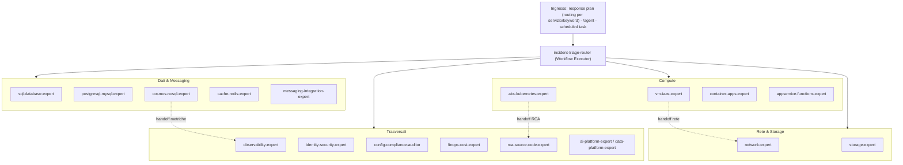

Definition examples (official YAML schema: `name`, `system_prompt`, `handoff_description`,
`tools`, `connectors`, `enable_skills` — source [sub-agents](https://learn.microsoft.com/en-us/azure/sre-agent/sub-agents);
`run mode` **does not** go here, it is set on the response plan/scheduled task):

```yaml
name: aks-kubernetes-expert
system_prompt: |
  Sei uno specialista Azure Kubernetes Service. Diagnostichi CrashLoopBackOff,
  pod Pending, nodi NotReady, errori di image pull, saturazione risorse e problemi
  di HPA/ingress; correli eventi del control plane con i workload. Proponi (e, se il
  response plan è Autonomous, applichi) remediation: restart di deployment, scale dei
  node pool, rollback di release. Non uscire dal dominio AKS: per RCA del codice fai
  handoff a rca-source-code-expert, per problemi di rete a network-expert.
handoff_description: Tutti i problemi AKS/Kubernetes (cluster, node pool, pod, ingress, HPA)
tools:
  - RunAzCliReadCommands
  - RunAzCliWriteCommands
  - QueryLogAnalyticsByWorkspaceId
  - GetAzCliHelp
enable_skills: true
handoffs:
  - rca-source-code-expert
  - network-expert
```

```yaml
name: cosmos-nosql-expert
system_prompt: |
  Sei uno specialista Azure Cosmos DB. Diagnostichi throttling 429 (RU/s), hot
  partition, latenza di lettura/scrittura, problemi di consistenza e di replica
  multi-region. Analizzi metriche di RU e chiavi di partizione. Sei read-only:
  proponi mitigazioni (aumento RU, revisione partition key) senza applicarle.
handoff_description: Tutti i problemi Cosmos DB (RU throttling, partizioni, consistenza, multi-region)
tools:
  - RunAzCliReadCommands
  - QueryLogAnalyticsByWorkspaceId
  - GetAzCliHelp
enable_skills: true
```

> `tools` must be **canonical built-in IDs** (for example `RunAzCliReadCommands`,
> `RunAzCliWriteCommands`, `GetAzCliHelp`, `QueryLogAnalyticsByWorkspaceId`,
> `QueryAppInsightsByResourceId`, `SearchMemory`, `ExecutePythonCode`), not free aliases.
> Source: [tools](https://learn.microsoft.com/en-us/azure/sre-agent/tools); details and budget in the
> master doc [Part III](../sre-agent-guidelines-best-practices-use-cases-how-to.md).

Incident routing to the subagent (response plan by `impactedService`/`titleContains`):

| Incident signal (service / keyword in title) | Destination subagent |
| --- | --- |
| `vm` · `disk` · `boot` · heartbeat | `vm-iaas-expert` |
| `aks` · `pod` · `node` · `kubelet` | `aks-kubernetes-expert` |
| `containerapp` · `revision` · `keda` | `container-apps-expert` |
| `appservice` · `functionapp` · `slot` · cold start | `appservice-functions-expert` |
| `vnet` · `nsg` · `route` · `firewall` · `privatelink` · `dns` · `loadbalancer` · `appgateway` | `network-expert` |
| `storage` · `blob` · `503` | `storage-expert` |
| `sql` · `deadlock` · `dtu` | `sql-database-expert` |
| `postgres` · `mysql` · connection | `postgresql-mysql-expert` |
| `cosmos` · `429` · `ru` | `cosmos-nosql-expert` |
| `redis` · eviction · memory | `cache-redis-expert` |
| `servicebus` · `eventhub` · `eventgrid` · `apim` · `dlq` · lag | `messaging-integration-expert` |
| `keyvault` · `rbac` · identity · defender | `identity-security-expert` |
| cost · advisor · budget (scheduled task) | `finops-cost-expert` |

Source for routing by severity/service/keyword: [Pricing — cost tips (response plans filter by
severity, service, or keyword)](https://learn.microsoft.com/en-us/azure/sre-agent/pricing-billing);
`titleContains`/`impactedService` schema in master doc
[Part IV](../sre-agent-guidelines-best-practices-use-cases-how-to.md).

**Minimum set vs full coverage (model for what you actually have):**

- **Minimum set (5-7 subagents)** to start or for lean estates: `incident-triage-router` +
  `compute-expert` (VM+PaaS combined) + `aks-kubernetes-expert` (if you use AKS) + `network-expert` +
  `database-expert` (all DBs combined) + `observability-expert` + `finops-cost-expert`.
- **Full coverage (the complete table, ~19)** for large/heterogeneous estates.
- **Granularity rule:** create a subagent **only for the domains you own**. You do not need a
  `cosmos-nosql-expert` if you do not have Cosmos; combine `sql`/`postgres`/`mysql`/`cosmos` into a single
  `database-expert` as long as there are few DBs, and split when the volume justifies it.

**Real constraints (technical honesty):** Microsoft **does not publish a cap** on the number of subagents; the
practical limits that govern granularity are (a) **max 5 active skills**, (b) **~80 tools** per
agent, (c) maintainability, plus **up to 1,000 knowledge files per custom agent**
([sub-agents — Knowledge base](https://learn.microsoft.com/en-us/azure/sre-agent/sub-agents); skill/tool
budget in the master doc [Part III](../sre-agent-guidelines-best-practices-use-cases-how-to.md)).
That is why you model by **domain** (at most a few dozen subagents) and **not by app**
(hundreds): the latter breaks the budgets and becomes unmanageable.

---

## 7. Part V — Anti-patterns to avoid

| Anti-pattern | Why it is harmful (certified) | What to do instead |
| --- | --- | --- |
| **1 agent per application** | Each agent costs a fixed **4 AAU/hour** regardless of the work (F10) → with 50-100 apps the always-on baseline explodes; it multiplies incident platform, telemetry, roles, and config surface (F12). Officially, consolidation *reduces* always-on costs. | One agent covers many apps through RBAC; scale with skill/knowledge/routing. [pricing](https://learn.microsoft.com/en-us/azure/sre-agent/pricing-billing) |
| **1 agent per layer** (IaaS/PaaS/network/data) | It fragments **cross-layer correlation**, which is the core value: the official example correlates memory trend (App Insights) + commit (GitHub) + pod restart in the **same thread**. With separate agents by layer, nobody sees the full picture. | One multi-domain agent with **subagents** by layer and handoff in the same thread. [overview](https://learn.microsoft.com/en-us/azure/sre-agent/overview), [sub-agents](https://learn.microsoft.com/en-us/azure/sre-agent/sub-agents) |
| **1 agent per team** (functional or stream-aligned) | **Structural anti-pattern (Conway's Law):** the fleet inherits the team topology. **Functional** teams (network/infra/app) ⇒ *1 agent per layer* (destroys cross-layer correlation); **stream-aligned** teams (1 team = 1 workload) ⇒ *1 agent per app* (always-on ×N, cross-workload correlation lost). Both fall into the anti-patterns above. | **Inverse Conway Maneuver:** team competence → **subagent** inside an agent (same thread); the number of agents is decided only by the *governance* boundary (approval/residency/environment). [Conway's Law](https://martinfowler.com/bliki/ConwaysLaw.html), [Team Topologies](https://teamtopologies.com/key-concepts), §[4.1](#41-one-agent-per-team-a-structural-anti-pattern-conways-law) |
| **1 subagent for every app** | Subagents are for **operational domain** (Domain/Task/Workflow), not per app; at scale you saturate budgets (5 active skills, ~80 tools) and maintenance becomes unmanageable. | Subagents by domain + routing by service/keyword to them. [sub-agents](https://learn.microsoft.com/en-us/azure/sre-agent/sub-agents) |
| **One mega-agent for the entire tenant without guardrails** | One single Privileged/Autonomous agent with Contributor at subscription scope in Prod = **huge blast radius** and one single set of Administrators approving everything. | Segment by environment/ownership/posture; Reader+OBO in Prod; Review run mode on high-risk domains. [permissions](https://learn.microsoft.com/en-us/azure/sre-agent/permissions), [user-roles](https://learn.microsoft.com/en-us/azure/sre-agent/user-roles) |
| **Two agents processing the same alert source** | Double processing (double active flow) and competing actions; the auto-created `quickstart_handler` processes *all* severities. | One incident platform per agent with deliberate routing; remove `quickstart_handler` if you use your own plans. [pricing](https://learn.microsoft.com/en-us/azure/sre-agent/pricing-billing) |

---

## 8. Part VI — Mapping to CAF Landing Zone / hub-and-spoke

Alignment with CAF archetypes: **Platform LZ** (Connectivity/Management/Identity) and **Application
LZ** (the *N* apps in the spokes).

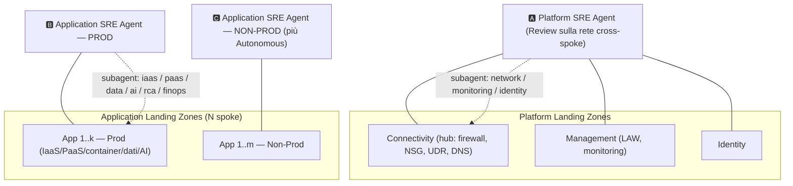

Responsibility assignment (the complete catalog of subagents by domain is in
[§6.1](#61-complete-catalog-of-subagents-by-azure-domain)):

| Agent | Estate (RBAC scope) | Typical subagents | Recommended posture | Notes |
| --- | --- | --- | --- | --- |
| **🅰 Platform** | Connectivity, Management, Identity RGs (often in a platform subscription) | network-traffic-analyst, monitoring/observability, identity/governance, config-auditor | **Reader + OBO**; **Review** run mode on cross-spoke blast-radius domains (firewall/NSG/UDR) | The hub network touches all spokes → gating mandatory in Prod (see [ADR 0001](../adr/0001-sre-agent-iac-boundaries.md)) |
| **🅱 Application — Prod** | App RGs in Prod (cross-subscription via RBAC) | iaas-vm, paas-container, data/db, ai, rca/source-code, finops, security | **Reader + OBO** or targeted Privileged; **Review** for infra actions, **Autonomous** for tested remediations | Scale to *N* apps with skill/knowledge/routing, not with new agents |
| **🅲 Application — Non-Prod** | dev/test/staging RGs | same as Prod | More permissive **Privileged/Autonomous** (low risk) | Great for "training" skill/knowledge and testing autonomy before Prod |

When to **split the Application agents further** (for large *N*, 50-100+ apps):

- By **business domain / criticality** (Tier-0 vs Tier-2/3): the Tier-0 agent with tight RBAC +
  Review; the Tier-2/3 agent more autonomous. Drivers S3/S5/S7.
- By **BU/tenant-of-tenant** when chargeback and isolated approval are needed. Drivers S3/S6.
- By **region/residency** if the apps fall under different residencies. Driver S1.

> After the split, to make the agents **cooperate** on incidents that cross multiple scopes/teams,
> see [Part XI](#13-part-xi--cross-scope-multi-agent-cooperation).

| Phase | Context | Recommended fleet | # agents | Rationale |
| --- | --- | --- | --- | --- |
| **Crawl (PoC / pilot)** | Demo, lab, first team | **1 agent** Non-Prod, Reader, scope on 1-2 RGs (or read-only subscription), few domain subagents | 1 | Official: "start with 1-2 resource groups or skip and add later". Maximum value, minimum cost/risk. [create-agent](https://learn.microsoft.com/en-us/azure/sre-agent/create-agent) |
| **Walk (team adoption)** | 1-3 teams, Prod + Non-Prod | **2-4 agents**: Platform-Prod, Application-Prod, Non-Prod (shared), (+ optional DR/region) | 2-4 | Introduces environment + platform/app + approval boundaries. |
| **Run (enterprise, N=50-100+ apps)** | Multi-BU, multi-subscription, mature hub-spoke | **Governed fleet**: Platform agent per operating region; Application agents segmented by (environment × business-domain/criticality × residency); standard library of subagent/skill/knowledge as template | 3-8 (count output) | The number grows with the **boundaries**, not with the apps. Centralized FinOps governance (per-agent AAU limits + Cost Management tags). |

> The numbers in the "# agents" column are the **output** of the [counting method (§5.2)](#52-agent-counting-method-worksheet),
> not a rule based on the number of apps. A company with 100 apps and another with 10, if they have the
> same boundaries (same residency, same Prod/Non-Prod scheme, same approval authority),
> have the **same number of agents**.

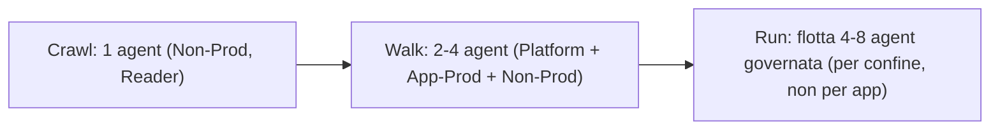

Source for the gradual path (Reader → Review actions → tested Autonomous): [permissions](https://learn.microsoft.com/en-us/azure/sre-agent/permissions),
[user-roles — how roles work together](https://learn.microsoft.com/en-us/azure/sre-agent/user-roles).

---

## 10. Part VIII — 360° analysis by dimension

For each dimension: how the **choice of how many agents** impacts it and the recommendation.

| Dimension | Effect of the number of agents | Recommendation |
| --- | --- | --- |
| **Costs / FinOps** | Each agent adds a fixed **4 AAU/hour** (always-on) regardless of the work; active flow scales with the *work*, not the number of agents. More agents = higher fixed baseline. | **Minimize the number of agents**; govern active flow with response-plan filtering, batched scheduled tasks, and per-agent AAU limits. [pricing](https://learn.microsoft.com/en-us/azure/sre-agent/pricing-billing) |
| **Effectiveness** | The value is **cross-domain correlation in a single thread**; fragmenting by layer/app destroys it. | **Few multi-domain agents** with subagents + handoff. [overview](https://learn.microsoft.com/en-us/azure/sre-agent/overview) |
| **Efficiency / operational complexity** | Each agent is a config surface (subagents, skills, connectors, incident platform, roles) to maintain Git-first. | Fewer agents = fewer surfaces; **template** the subagent/skill/knowledge library. [ADR 0001](../adr/0001-sre-agent-iac-boundaries.md) |
| **Performance / latency** | The sandbox is per-agent; more managed resources = more potential context, but the agent scopes it per incident. It is not a split driver. | Do not split for performance; keep RBAC scope clean for relevant context. [security](https://learn.microsoft.com/en-us/azure/sre-agent/security-overview) |
| **Resiliency (fault tolerance)** | The agent is **regional** and each agent is isolated (no cascade between estates). The resilience *of the agent itself* depends on the region. | For Tier-0 estates consider a **standby agent in another region**; isolate critical estates on dedicated agents. [create-agent](https://learn.microsoft.com/en-us/azure/sre-agent/create-agent), [security](https://learn.microsoft.com/en-us/azure/sre-agent/security-overview) |
| **Reliability (correctness/consistency)** | It does not depend on the *number* of agents but on the quality of context and guardrails: a context-rich agent makes fewer mistakes. | Enrich with **skill/knowledge/memory**; **Review** on risky domains; do not put everything in Autonomous. [sub-agents](https://learn.microsoft.com/en-us/azure/sre-agent/sub-agents), [user-roles](https://learn.microsoft.com/en-us/azure/sre-agent/user-roles) |
| **Security** | Blast radius = (managed RGs) × (permission level) × (autonomy). A mega Privileged/Autonomous agent on Prod is dangerous. | **Least-privilege**: Reader + OBO in Prod; isolate high-privilege estates; Review on cross-spoke domains. [permissions](https://learn.microsoft.com/en-us/azure/sre-agent/permissions) |
| **Governance** | The approval authority (SRE Agent Administrator) is **per-agent**; one incident platform per agent. | Align agent boundaries to **ownership/approval boundaries**; deliberate alert routing. [user-roles](https://learn.microsoft.com/en-us/azure/sre-agent/user-roles) |

---

## 11. Part IX — Decision tree and checklist

Decision tree: "should I create a **new** agent for this estate?":

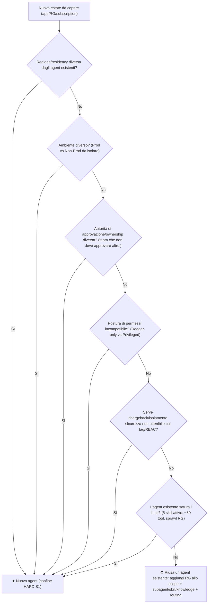

Fleet design checklist (one-page):

- [ ] I have listed the tenant's **hard boundaries**: regions/residency, environments, ownership/approval domains, permission postures.
- [ ] I have **collapsed** estates that share all boundaries into the same agent.
- [ ] I have a **Platform agent** distinct from the **Application agents** (CAF).
- [ ] Prod and Non-Prod are on **distinct agents** (or I have an explicit reason not to do so).
- [ ] Each agent has subagents **by domain** (not by app) and disjoint **response-plan** routing.
- [ ] New apps are added with **skill/knowledge/routing**, not with new agents/subagents.
- [ ] **Reader + OBO** posture is the default in Prod; **Review** on domains with cross-spoke blast radius.
- [ ] I have removed **`quickstart_handler`** where I use my own response plans; **one** incident platform per agent; no double processing of the same alert source.
- [ ] I have set **per-agent AAU limits** and **Cost Management tags** for showback.
- [ ] I have evaluated a **regional standby** for Tier-0 estates.

Concise decision matrix:

| If your primary constraint is… | Then the fleet shape is… |
| --- | --- |
| Minimum cost / pilot | **1 agent** broad-scope, Reader, many subagents |
| Prod/Non-Prod separation | **2 agents** (Prod, Non-Prod) + optional Platform |
| Team autonomy / isolated approval | **1 agent per *independent approval* domain** (BU/governance, **not** engineering team — §[4.1](#41-one-agent-per-team-a-structural-anti-pattern-conways-law)) |
| Multiple residencies | **1 agent per residency/region-set** |
| Mature enterprise hub-spoke, large N | **Fleet 4-8**: Platform + App(Prod/Non-Prod) × (business-domain/criticality/residency) |

---

## 12. Part X — FinOps: the math of fleet costs

Certified cost model ([pricing-billing](https://learn.microsoft.com/en-us/azure/sre-agent/pricing-billing)):

- **Always-on (fixed):** **4 AAU per agent-hour**, from creation until **delete**
  (*stop* stops active flow but **not** always-on). In a "full" month ≈ **4 × 730 ≈ 2,920
  AAU/agent** just for existence cost.
- **Active flow (variable):** token-based, with per-model rates (for example Claude Opus 4.6: input 100 /
  output 500 / cache-read 10 / cache-write 125 AAU per 1M tokens). It scales with the **work done**, not
  with the number of agents.
- **No free tier.** Monthly **AAU allocation limit per agent** (min 500 / max 1,000,000)
  on active flow only.

FinOps implications for the fleet:

| Lever | Effect | How |
| --- | --- | --- |
| **Consolidate agents** | Cuts the **always-on** baseline (the fixed multiplier) | Fewer agents = fewer repeated 4-AAU/hour charges. Official: "consolidating workloads under one agent reduces always-on costs". |
| **Response plan filtering** | Reduces **active flow** (fewer unnecessary investigations) | Filter by severity/service/keyword; the agent works only on relevant incidents. |
| **Batched scheduled tasks** | Reduces active flow | Daily/weekly tasks instead of continuous polling. |
| **Context (skill/knowledge/memory)** | Fewer wasted tokens per run | "Add context → fewer wasted tokens"; memory improves efficiency over time. |
| **Per-agent AAU limits** | Predictable spend cap | Set the monthly limit on each agent; beyond the limit the agent is unavailable until the next month (always-on continues). |
| **Stop/Delete unused agents** | Eliminates costs | *Stop* zeroes active flow (always-on remains); *Delete* zeroes everything. Useful for lab/PoC agents. |
| **Multi-agent showback** | Attribution by BU | Azure **Cost Management** for breakdown across multiple agents; use tag/agent-boundary as the cost dimension. |

Central trade-off of "how many agents": **more agents ⇒ more always-on baseline + more operational
surface, but better isolation (security/approval/chargeback/blast radius)**. The equilibrium point is:
**as many agents as there are hard boundaries, not one more.**

---

## 13. Part XI — Cross-scope multi-agent cooperation

Real enterprise case: you have architected **1 agent per team**, each team is responsible for specific
scopes, and you want the agents to **cooperate** on a problem that crosses multiple scopes (passing
analysis and actions to one another). This section answers with the architectural reasoning, the trade-offs, the criteria,
and the decision trees.

### 13.1 What is natively possible (and what is not)

| Capability | Native? | Certified detail | Source |
| --- | --- | --- | --- |
| Handoff between **subagents in the same agent** | ✅ Yes | They share a **single thread** with complete context (history, tool call, results); handoff chain. | [sub-agents](https://learn.microsoft.com/en-us/azure/sre-agent/sub-agents) |
| **Agent-to-agent channel between different instances** | ❌ No | Per-agent isolation: *"No data, compute, or credentials are shared between agents or customers"* (per-agent sandbox/Cosmos/blob/proxy/UAMI). Memory and knowledge do **not** propagate between agents. | [security-overview](https://learn.microsoft.com/en-us/azure/sre-agent/security-overview) |
| **Invoking** one agent from another (RPC) | ❌ Not documented | An agent's entry point is *inbound* (incident), chat, or scheduled task; there is no public endpoint for "invoke agent→agent". Therefore cross-agent triggering passes through an **incident**. | [incident-platforms](https://learn.microsoft.com/en-us/azure/sre-agent/incident-platforms), [overview](https://learn.microsoft.com/en-us/azure/sre-agent/overview) |
| Cooperation between instances via **shared systems** | ✅ Yes (integration) | Incident-platform ticket, shared MCP server, Stop hook, Slack/Teams (the 4 patterns in §13.4). | §13.4 |

Consequence: cross-scope cooperation between per-team agents is **built** with external shared systems;
it is not a native channel. This is the fact that governs all following decisions.

### 13.2 The architectural point: isolation vs cooperation

Your requirement — *automatic cooperation on a problem that touches multiple scopes* — is **exactly**
what the native model solves with **one broader agent + subagents by domain/team + handoff
in the same thread**. The "1 agent per team" architecture optimizes **approval isolation**
(the *SRE Agent Administrator* role is per-agent, [user-roles](https://learn.microsoft.com/en-us/azure/sre-agent/user-roles))
but, by isolated design, **pays for it in cross-scope cooperation**. It is a **structural trade-off**, not
a detail: the two architectures optimize opposite goals.

The two forces in tension (enterprise reasoning):

- **Force pushing to ISOLATE (agent per team):** team autonomy (Conway's law: whoever follows
  *you-build-it-you-run-it* wants their own agent), **Segregation of Duties** (in regulated sectors
  Team A must not be able to approve actions on Team B's perimeter), containment of **blast
  radius**, clean **chargeback** per BU. The agent is the unit of approval authority and of
  isolation (F7, F9).
- **Force pushing to CONSOLIDATE (few agents, subagents by team/domain):** the agent's **core value**
  is **cross-domain correlation in the same thread** (the official example: App Insights memory
  trend + GitHub commit + pod restart in a single investigation — [overview](https://learn.microsoft.com/en-us/azure/sre-agent/overview)).
  Fragmenting into per-team agents **breaks** this correlation.

Why consolidation is technically superior for cooperation (3 certified arguments):

| Dimension | Native handoff (1 agent, subagents) | Federation (agent per team + ticket) |
| --- | --- | --- |
| **Context fidelity** | **Complete**: the receiving subagent sees *all* history, tool calls, and results. | **Lossy**: Agent B sees only what Agent A wrote as notes on the ticket. [sub-agents](https://learn.microsoft.com/en-us/azure/sre-agent/sub-agents) |
| **Latency** | **Synchronous** in the same run. | **Asynchronous**: A finishes → writes ticket → routing/assignment → B starts again (minutes). |
| **Cost (active flow)** | **One** investigation = one active-flow consumption. | **N** separate investigations (one per agent) = **N× active flow** + rework due to lost context. [pricing](https://learn.microsoft.com/en-us/azure/sre-agent/pricing-billing) |

Pros/cons of the two base architectures:

| Architecture | Pros | Cons |
| --- | --- | --- |
| **Consolidated** (few agents, subagents by team/domain) | Maximum native cooperation (shared thread, full context, synchronous); minimum cost (less always-on, 1 investigation/incident); 1 config surface | One single set of *Administrators* approves across the entire estate (requires disciplined roles/routing); does not satisfy hard SoD between teams |
| **Federated** (1 agent per team) | Hard isolation of approval (SoD), blast radius, and chargeback per team; team autonomy (Conway) | Cooperation only through external systems (weaker/lossy/slower); N× always-on + N× active flow; N config surfaces to maintain |

### 13.3 Enterprise decision criteria

The real factors that move the needle between isolating and consolidating, with weight and concrete question:

| Factor | Pushes toward… | Weight | Concrete question to ask |
| --- | --- | --- | --- |
| **SoD / compliance** (banks, insurance, healthcare, defense, public sector) | Isolation | **Binding** if present | "Is there a requirement that Team A must not be able to approve actions on Team B's perimeter?" |
| **Frequency/impact of cross-scope incidents** | Consolidation | High | "What % of incidents cross multiple domains/teams? What are their MTTR and impact?" |
| **Team operating model** (Conway) | Autonomous teams → Isolation; central SRE → Consolidation | High | "Who operates: autonomous product teams *you-build-it-you-run-it* or a central SRE/Platform team?" |
| **Tolerated blast radius** | Isolation if low | Medium | "Is an incorrect autonomous cross-scope action tolerable, or must it be contained by team?" |
| **Chargeback / showback** | Isolation | Medium | "Do you need clean cost attribution (AAU) per team/BU?" |
| **Operational maturity** | Consolidation if low | Medium | "Is the customer able to manage an **agent fleet** + an integration bus?" |
| **Always-on cost** | Consolidation | Medium | "How many agents × 4 AAU/hour are you willing to pay as a fixed baseline?" |

Priority rule: **if SoD is mandatory, isolation is non-negotiable** → federated topology (§13.6 B/C). Otherwise weigh the other factors: if cross-scope incidents are
frequent/high-impact and there is no SoD → **consolidate**.

### 13.4 The four cooperation patterns

When agents remain separate, cooperation goes through one of these patterns (from most native
to most custom):

| # | Pattern | Native | Automatic | Data fidelity | Latency | Complexity | When |
| --- | --- | --- | --- | --- | --- | --- | --- |
| 1 | **Shared incident platform (blackboard)** | Yes (feature) | Semi | Medium (notes) | Medium | Low | First choice if isolation is required |
| 2 | **Shared MCP server (bus)** | No (custom) | Yes | High (structured) | Low | High | Rich/structured exchange between agents |
| 3 | **Stop hook → event** | Yes (hook) | Yes | Medium | Low | Medium | "Pass the ball" at the end of an investigation |
| 4 | **Shared Slack/Teams** | Yes | No | High | High | Low | Human-mediated handoff |

- **Pattern 1 — Shared incident platform (recommended).** All agents point to the **same**
  platform; the agent *"can read and write back to the incident"*. Agent A writes analysis+actions
  as **notes (PagerDuty) / discussion entries (ServiceNow)**; the incident is also routed to
  Team B which **reads** and continues. The ticket is the **shared state**. Constraints: **only one active incident
  platform per agent** (but it can be the same for all), remove `quickstart_handler`
  to avoid double processing. **Azure Monitor in write mode only does ack/close (no notes)** →
  for shared narrative use **ServiceNow/PagerDuty**. [incident-platforms](https://learn.microsoft.com/en-us/azure/sre-agent/incident-platforms)
- **Pattern 2 — Shared MCP server (bus).** Build an MCP server (Streamable-HTTP or stdio
  Node 20/Python 3.12/.NET 9) on an Azure store and connect it to all agents; they write/read
  `{incidentId, scope, rootCause, actions, needsHandoffTo}`. The closest thing to automated A2A, but
  **you build it**. Budget 80 tools/agent. [mcp-connectors](https://learn.microsoft.com/en-us/azure/sre-agent/mcp-connectors)
- **Pattern 3 — Stop hook → choreography.** A **Stop hook** (command/python) on Agent A, at the end of an
  investigation, emits a signal (creates/updates an incident or writes to an Azure resource via managed
  identity) that becomes an inbound incident for Agent B. Hook events: only **Stop** and
  **PostToolUse**. **Technical honesty:** the sandbox has egress proxy limited to known domains → emit
  to Azure/incident platform, not to arbitrary webhooks. [agent-hooks](https://learn.microsoft.com/en-us/azure/sre-agent/agent-hooks), [security-overview](https://learn.microsoft.com/en-us/azure/sre-agent/security-overview)
- **Pattern 4 — Slack/Teams.** Each agent posts in a shared channel; the handoff is done by a human.
  Simple, not automatic. [overview](https://learn.microsoft.com/en-us/azure/sre-agent/overview)

### 13.5 Enterprise decision tree

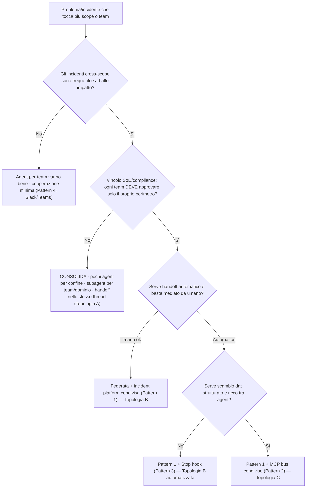

Reading: the **first** question filters out cases where cooperation is not really needed; the **second**
(SoD) is the real architectural fork (if there is none, consolidate and you are done); the following ones choose the
*cooperation mechanism* only after deciding to remain federated.

### 13.6 Reference topologies for cooperation

| Topology | How | Cooperation | Cost | Complexity | When |
| --- | --- | --- | --- | --- | --- |
| **A — Consolidated** (native handoff) | Few agents by boundary; subagents by team/domain; shared thread | **Maximum** (full context, synchronous) | **Minimum** (less always-on; 1 investigation/incident) | Low (1 surface) | SoD **not** required; cross-scope frequent |
| **B — Federated + incident platform** (blackboard) | 1 agent per team + shared ServiceNow/PagerDuty ticket (+ Stop hook for automation) | Medium (ticket notes, semi-async) | High (N× always-on + N× active flow) | Medium (cross-team routing/assignment) | SoD required; handoff can be mediated |
| **C — Federated + MCP bus** | B + shared MCP server for structured exchange | Medium-high (automatic data exchange) | High + custom bus | High (you build and operate the bus) | SoD required **and** rich automation is needed |

Hybrid blueprint (Topology B/C):

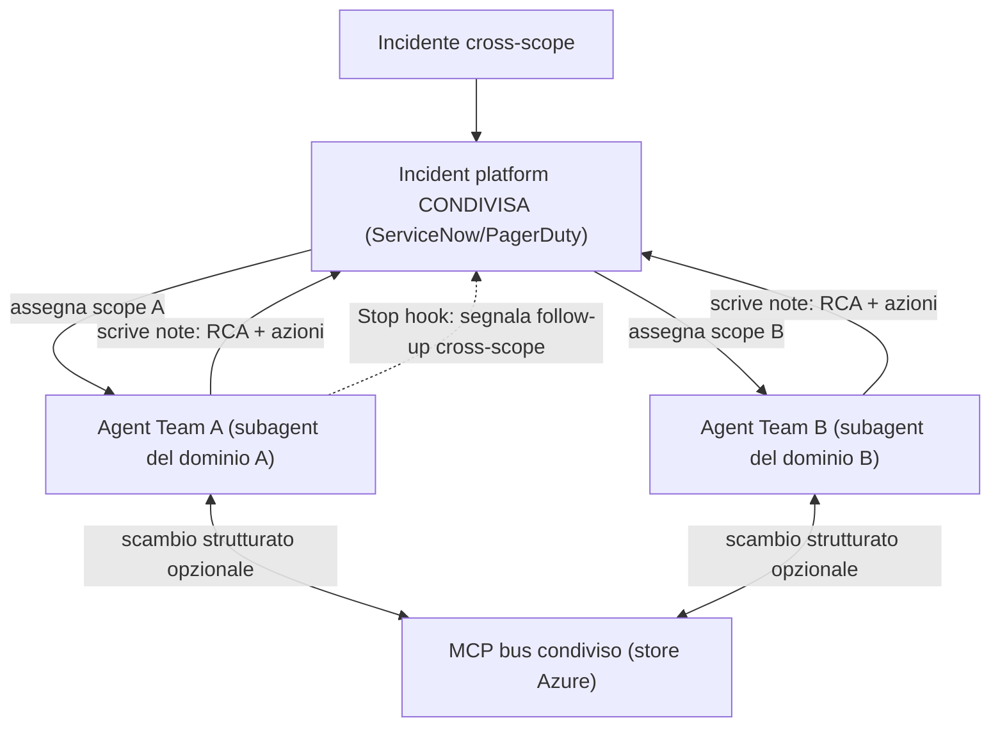

**Recommendation:** if teams truly need separate approvals (SoD),
keep per-team agents and adopt **Topology B** — Pattern 1 (shared ticket) as the primary mechanism + Pattern 3 (Stop hook) for automatic handoff; move to **Topology C** (Pattern 2)
only if you need rich and structured exchange. If separate approval is just a "nice to have",
**Topology A (consolidate)**: it is the native path, and separation between teams is achieved with
**per-agent roles + response-plan routing**, without giving up handoff in the shared thread.

### 13.7 Cooperation anti-patterns

| Anti-pattern | Why it is harmful | What to do instead |
| --- | --- | --- |
| **Two agents on the same alert source** without routing | Double processing (double active flow) + competing actions; `quickstart_handler` processes all severities | Deliberate routing/assignment in the incident platform; remove `quickstart_handler`. [incident-platforms](https://learn.microsoft.com/en-us/azure/sre-agent/incident-platforms) |
| **Relying on agent memory** to propagate cross-agent | Memory is **per-agent** (blob `memories/`): it does not propagate between instances | Externalize shared state (ticket or MCP store). [security-overview](https://learn.microsoft.com/en-us/azure/sre-agent/security-overview) |
| **Arbitrary webhook from a Stop hook** | The sandbox has egress proxy limited to known domains → the call may fail | Emit to Azure (Monitor/resources via managed identity) or the incident platform. [security-overview](https://learn.microsoft.com/en-us/azure/sre-agent/security-overview) |
| **Expecting a native "invoke agent" A2A** | It is not documented: the cross-agent trigger is **inbound** (incident) | Design the choreography around incidents/alerts, not direct agent→agent calls |
| **Blackboard ping-pong** as the primary mechanism for **high-frequency** cross-scope | N× active flow + routing latency for each incident | If cross-scope is frequent and there is no SoD, **consolidate** (Topology A) |

### 13.8 Enterprise decision checklist

- [ ] I have **classified frequency and impact** of cross-scope incidents (low → Pattern 4 is enough).
- [ ] I have verified whether there is an SoD/compliance constraint requiring separate approval per team.
- [ ] I have applied the **decision tree** (§13.5) and chosen topology **A / B / C** (§13.6).
- [ ] If **federated**: **one shared** incident platform (ServiceNow/PagerDuty for notes,
      not only Azure Monitor) + cross-team routing/assignment + `quickstart_handler` removed.
- [ ] If automation is needed: **Stop hook** emitting to Azure/incident platform (not arbitrary
      webhooks).
- [ ] I have estimated the **cost**: consolidated = 1 investigation/incident; federated = N investigations
      (**N× active flow**) + **N× always-on** (4 AAU/hour per agent).
- [ ] I have **documented the decision** and the criteria in an ADR (for audit and future review).

---

## 14. Part XII — End-to-end decision framework (playbook for the customer)

This is the **operational summary** to use directly with the customer to answer the two questions
that matter most — **how many** Azure SRE Agents to have in the tenant and **how to organize them among themselves** —
optimizing *all* needs: effectiveness, efficiency, cost, performance, resiliency, security,
reliability, governance. It is a capstone: it points back to the detailed sections without repeating them.

### 14.1 The 7 guiding principles

The non-negotiable rules (each certified and linked to the detailed section):

1. **Segment by boundary, not by app/layer/team.** The agent is a regional *operational-governance*
   unit, not an application or organizational unit; by **Conway's Law**, "1 agent per
   team" collapses into "per-layer" or "per-app" (§[4.1](#41-one-agent-per-team-a-structural-anti-pattern-conways-law),
   §[5.1](#51-boundary-concrete-definition), F2). Source:
   [permissions](https://learn.microsoft.com/en-us/azure/sre-agent/permissions),
   [Conway's Law](https://martinfowler.com/bliki/ConwaysLaw.html).
2. **Consolidate by default; split only on a real boundary.** Official: "consolidating workloads
   under one agent reduces always-on costs" (§[12](#12-part-x--finops-the-math-of-fleet-costs)).
   Source: [pricing](https://learn.microsoft.com/en-us/azure/sre-agent/pricing-billing).
3. **Specialize *inside*, not by multiplying agents.** Subagents by domain + response-plan routing +
   skill/knowledge (§[6.1](#61-complete-catalog-of-subagents-by-azure-domain)). Source:
   [sub-agents](https://learn.microsoft.com/en-us/azure/sre-agent/sub-agents).
4. **One boundary = one agent; collapse estates that share all boundaries.** The number is
   *calculated*, not guessed (§[5.2](#52-agent-counting-method-worksheet)).
5. **Least privilege by default.** Reader + OBO in Prod; **Review** on cross-spoke blast-radius
   domains (§[8](#8-part-vi--mapping-to-caf-landing-zone--hub-and-spoke)). Source:
   [permissions](https://learn.microsoft.com/en-us/azure/sre-agent/permissions).
6. **Govern the cost per agent.** Always-on is **4 AAU/hour per agent**: set per-agent AAU
   limits + Cost Management tags (§[12](#12-part-x--finops-the-math-of-fleet-costs)).
7. **Document the decision in an ADR.** Criteria + trade-offs tracked for audit and review.

### 14.2 The 5-step method

From customer input to fleet design:

1. **Count the boundaries** — residency `R`, environments (Prod/Non-Prod), Platform vs Application, approval
   domains `K`, permission posture. Details: §[5.1](#51-boundary-concrete-definition).
2. **Calculate the base number** — `N ≈ R × (1 Platform-Prod + K App-Prod + 1 App-NonProd)`.
   Details: §[5.2](#52-agent-counting-method-worksheet).
3. **Organize** — assign each resource group to its agent by (residency × Platform/App × environment
   × ownership). Details: §[8](#8-part-vi--mapping-to-caf-landing-zone--hub-and-spoke).
4. **Specialize inside** — subagents by domain + response-plan routing + skill/knowledge per app.
   Details: §[6.1](#61-complete-catalog-of-subagents-by-azure-domain).
5. **Cooperate if you remain federated** — if separate agents remain and must cooperate on
   cross-scope incidents, choose the pattern (shared incident platform + Stop hook). Details:
   §[13](#13-part-xi--cross-scope-multi-agent-cooperation).

### 14.3 Master decision tree (number and organization)

Unlike the tree in §[11](#11-part-ix--decision-tree-and-checklist) (which decides *one
single* agent yes/no), this one produces the **entire fleet** — number **and** organization:

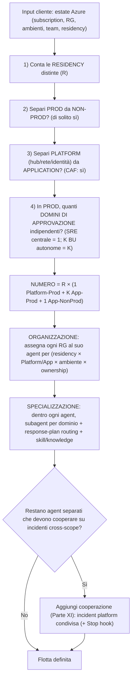

### 14.4 The 8 quality needs: decision and trade-off

For each need: how it influences **how many** agents and **how** to organize them, the recommended
decision, and the trade-off. (The descriptive detail is in
§[10](#10-part-viii--360-analysis-by-dimension).)

| Need | Effect on *how many* | Effect on *how to organize them* | Recommended decision | Trade-off |
| --- | --- | --- | --- | --- |
| **Effectiveness** | Few multi-domain agents (correlation in the same thread) | Subagents by domain + handoff | **Consolidate**; split only on a boundary | More agents = less cross-domain correlation |
| **Efficiency** | Fewer agents = fewer config surfaces | Template library of subagent/skill/knowledge | **Consolidate + templatize** | Too few = one single set of Administrators (mitigate with roles/routing) |
| **Costs / FinOps** | Fewer agents = less always-on (4 AAU/hour each) | Per-agent AAU limits + Cost Management tags | **Minimize the number**; govern active flow | Federation = N× active flow + N× always-on |
| **Performance** | Not a split driver | Clean RBAC scope = relevant context | **Do not split for performance** | Scope too broad = noisy context (mitigate with routing) |
| **Resiliency** | +1 cross-region standby agent for Tier-0 | Isolate critical estates on dedicated agents | **Regional standby** for Tier-0 | Cost of one additional agent for DR |
| **Security** | +1 agent for high-privilege estates | Reader+OBO, Review on cross-spoke, isolate Privileged/Autonomous | **Least-privilege + isolation of critical estates** | More agents = more UAMIs/surface to govern |
| **Reliability** | Not a number driver | Enrich with skill/knowledge/memory + Review gate | **Context-rich + Review** on risky domains | Autonomous everywhere = risk of incorrect actions |
| **Governance** | +1 agent per approval domain (SoD) | One incident platform per agent, deliberate routing, ADR | **Agent boundaries = approval boundaries** | More agents = more governance to maintain |

Overall reading: **6 needs out of 8 push toward consolidation** (effectiveness, efficiency, cost,
performance, reliability, and partly governance); only **security, resiliency, and governance SoD**
justify additional agents — and that is exactly why the rule is
*"consolidate by default, split only on the boundary"*.

### 14.5 Consolidated best practices (do / don't)

| ✅ Do | ❌ Don't |
| --- | --- |
| Consolidate by default; segment only by boundary | 1 agent per application |
| Specialize with subagents **by domain** + routing | 1 agent per layer (IaaS/PaaS/network/data) |
| Map team expertise to a **subagent** (Inverse Conway) | 1 agent per team (functional or stream-aligned) |
| Calculate the number with the worksheet (§5.2) | 1 subagent for every app |
| Reader + OBO in Prod; Review on cross-spoke domains | Mega Privileged/Autonomous agent without guardrails |
| One incident platform per agent + deliberate routing | Two agents on the same alert source (double processing) |
| Per-agent AAU limits + Cost Management tags | Split by number of apps/subscriptions |
| Template the subagent/skill/knowledge library | Rely on agent memory to propagate cross-agent |
| Document the decision in an ADR | Expect a native A2A channel between instances |

### 14.6 The one-pager to use with the customer

Worksheet (5 questions → fleet):

1. Distinct residencies `R` = ___
2. Do you isolate Prod from Non-Prod? (yes/no) = ___
3. Platform separate from Application? (CAF: yes) = ___
4. Independent approval domains in Prod `K` = ___
5. Is cross-scope cooperation needed between federated agents? (yes → Part XI) = ___

→ **Number** = `R × (1 Platform-Prod + K App-Prod + 1 App-NonProd)`
→ **Organization** = one agent for each combination (residency × Platform/App × environment ×
ownership), each specialized by domain.

Typical fleet (single-residency enterprise, central SRE — typical output: 3 agents):

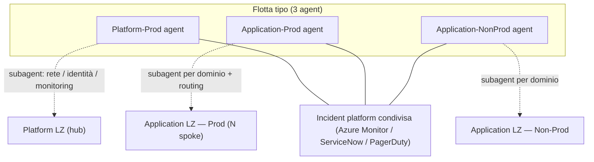

Golden rule to leave with the customer: **the number of agents follows your boundaries (residency,
environment, approval), not the number of apps; with 10 or 100 apps the fleet is the same — only
the internal richness grows (subagents, skills, routing).**

---

## Appendix A — Glossary

- **AAU (Azure Agent Unit):** standardized unit of agentic consumption used for SRE
  Agent billing; two components, always-on (fixed, 4 AAU/agent-hour) and active flow (variable, token-based).
  [pricing](https://learn.microsoft.com/en-us/azure/sre-agent/pricing-billing).
- **Always-on flow:** fixed cost of the agent's existence, independent of work, from creation
  to delete.
- **Active flow:** variable token-based cost when the agent works (chat, incident, task, async).
- **Agent (resource):** `Microsoft.App/agents`, **regional** ARM resource (SC/EUS2/AUE) with UAMI,
  model, incident platform, posture. [create-agent](https://learn.microsoft.com/en-us/azure/sre-agent/create-agent).
- **Estate:** the set of resource groups/subscriptions an agent manages (defined by the RBAC
  of its UAMI).
- **Subagent / Custom agent:** specialist for an **operational domain** invoked via `/agent` or from
  triggers (incident/scheduled task), shares the thread and supports handoff chain.
  [sub-agents](https://learn.microsoft.com/en-us/azure/sre-agent/sub-agents).
- **Response plan (incident filter):** incident routing/filtering rule toward the right subagent
  (severity/service/keyword) with run mode.
- **Run mode (Review/Autonomous):** degree of autonomy set **per response plan and per
  scheduled task** (not in the subagent). [user-roles](https://learn.microsoft.com/en-us/azure/sre-agent/user-roles).
- **Permission level (Reader/Privileged):** agent-wide default of the RBAC roles assigned to the UAMI
  on the managed RGs. [permissions](https://learn.microsoft.com/en-us/azure/sre-agent/permissions).
- **OBO (on-behalf-of):** temporary elevation with the credentials of an SRE Agent Administrator
  when the UAMI does not have the permissions.
- **SRE Agent user roles (Reader/Standard User/Administrator):** **per-agent** RBAC on the
  agent resource; only the Administrator approves actions/OBO. [user-roles](https://learn.microsoft.com/en-us/azure/sre-agent/user-roles).
- **Platform LZ / Application LZ:** CAF archetypes; the former host Connectivity/Management/
  Identity, the latter host applications in the spokes.
- **Boundary:** a line that a single agent cannot or should not cross; it is a *countable*
  fact of the environment (residency, environment, platform/app, ownership/approval, permission posture),
  not the number of apps or layers.
- **Hard boundary:** boundary technically/legally **impossible** to cross with a single
  agent (the only truly hard one is residency/region).
- **Structural / strong boundary:** boundary that you *could* cross but **should not** for
  governance/risk reasons (Platform vs Application, Prod vs Non-Prod, independent approval authorities).
- **Operational domain:** homogeneous technical area of Azure managed by a specialized subagent
  (VM/IaaS, AKS, App Service/Functions, network, SQL, PostgreSQL, Cosmos, storage, messaging, etc.).
- **Conway's Law:** an organization produces systems whose structure mirrors the
  communication structure of the organization. It implies that "1 agent per team" makes the
  fleet inherit the team topology (→ per-layer or per-app). [Fowler](https://martinfowler.com/bliki/ConwaysLaw.html).
- **Inverse Conway Maneuver:** deliberately designing the team↔system mapping to obtain the desired
  architecture. Here: team expertise → **subagent** (internal axis), not → new agent. [Fowler](https://martinfowler.com/bliki/ConwaysLaw.html).
- **Functional silos (functional silo / activity-oriented):** teams split by technical expertise
  (network, infra, compute, DB, app, security). Mapped 1:1 to agents ⇒ "per-layer" anti-pattern.
- **Stream-aligned team:** team aligned to an end-to-end value stream ("you build it, you run
  it"). Mapped 1:1 to agents ⇒ "per-app" anti-pattern. [Team Topologies](https://teamtopologies.com/key-concepts).
- **Cognitive load:** amount of complexity that a team — or an agent — can
  manage effectively; it is the real constraint that limits how many subagents/skills to put in an agent.
  [Team Topologies](https://teamtopologies.com/key-concepts).
- **A2A (agent-to-agent):** direct communication between agents. In SRE Agent it is **not native between
  different instances** (per-agent isolation); the only native in-context exchange is handoff between
  subagents **inside** one agent. [security-overview](https://learn.microsoft.com/en-us/azure/sre-agent/security-overview).
- **Handoff:** transfer of control between subagents that **share the same thread** (complete
  context). [sub-agents](https://learn.microsoft.com/en-us/azure/sre-agent/sub-agents).
- **Blackboard (shared board):** pattern in which multiple agents cooperate by reading/writing
  **external shared state** (incident-platform ticket, store via MCP), instead of talking to each other
  directly.
- **Choreography:** event-driven coordination without a central orchestrator; each
  agent reacts to events (for example, an incident created by another agent).
- **SoD (Segregation of Duties):** governance requirement whereby whoever
  approves an action on one perimeter must not be able to approve it on another; in SRE Agent it is applied
  with the *SRE Agent Administrator* role **per-agent**.
- **Federated topology:** fleet of separate agents (for example, per team) that cooperate through external shared
  systems (incident platform, MCP bus), not through a native shared thread.

---

## Appendix B — Index of official sources

Verified Microsoft Learn pages (Azure SRE Agent, public preview):

- Overview: <https://learn.microsoft.com/en-us/azure/sre-agent/overview>
- Create agent: <https://learn.microsoft.com/en-us/azure/sre-agent/create-agent>
- Permissions: <https://learn.microsoft.com/en-us/azure/sre-agent/permissions>
- User roles: <https://learn.microsoft.com/en-us/azure/sre-agent/user-roles>
- Run modes: <https://learn.microsoft.com/en-us/azure/sre-agent/run-modes>
- Pricing and billing: <https://learn.microsoft.com/en-us/azure/sre-agent/pricing-billing>
- Security overview: <https://learn.microsoft.com/en-us/azure/sre-agent/security-overview>
- Custom agents (subagents): <https://learn.microsoft.com/en-us/azure/sre-agent/sub-agents>
- Agent hooks: <https://learn.microsoft.com/en-us/azure/sre-agent/agent-hooks>
- Incident platforms: <https://learn.microsoft.com/en-us/azure/sre-agent/incident-platforms>
- Connectors: <https://learn.microsoft.com/en-us/azure/sre-agent/connectors>
- Scheduled tasks: <https://learn.microsoft.com/en-us/azure/sre-agent/scheduled-tasks>
- Network requirements: <https://learn.microsoft.com/en-us/azure/sre-agent/network-requirements>
- ARM template `Microsoft.App/agents`: <https://learn.microsoft.com/en-us/azure/templates/microsoft.app/agents?pivots=deployment-language-terraform>
- CAF — Landing Zone: <https://learn.microsoft.com/en-us/azure/cloud-adoption-framework/ready/landing-zone/>
- Azure landing zones (hub-spoke / platform vs application): <https://learn.microsoft.com/en-us/azure/cloud-adoption-framework/ready/landing-zone/design-areas>
- CAF — Manage organization alignment (virtual team; roles ≠ org chart): <https://learn.microsoft.com/en-us/azure/cloud-adoption-framework/organize/>
- WAF — Operational Excellence, principles (DevOps, workload ownership, specialized centralized teams): <https://learn.microsoft.com/en-us/azure/well-architected/operational-excellence/principles>

Organization / architecture sources (org design, non-Microsoft):

- Conway's Law (Melvin Conway, via Martin Fowler): <https://martinfowler.com/bliki/ConwaysLaw.html>
- Team Topologies — Key Concepts (stream-aligned / platform team, cognitive load): <https://teamtopologies.com/key-concepts>

Related documents in the repository:

- Master doc (configuration of each primitive): [../sre-agent-guidelines-best-practices-use-cases-how-to.md](../sre-agent-guidelines-best-practices-use-cases-how-to.md)
- IaC boundaries ADR (control plane vs data plane): [../adr/0001-sre-agent-iac-boundaries.md](../adr/0001-sre-agent-iac-boundaries.md)
- Resource support matrix: [../resource-support-matrix.md](../resource-support-matrix.md)
- Security and secrets: [../security-and-secrets.md](../security-and-secrets.md)
