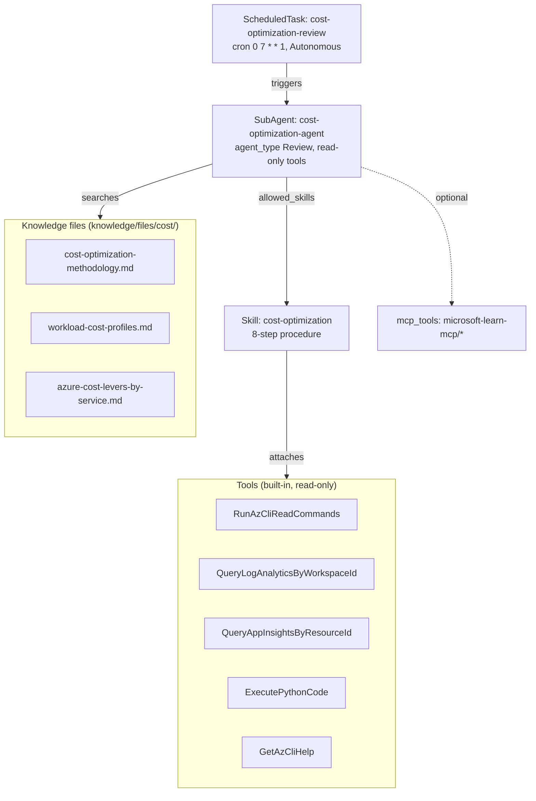

# Azure SRE Agent — Cost Optimization Agent (Architecture, Configuration, Implementation)

Date: 2026-06-30
Status: **target-state design and implementation specification.** This document defines the
evolved, subscription-wide cost-optimization specialist (`cost-optimization-agent`) that
supersedes the lab-scoped `cost-and-retention-advisor`. It is the single source of truth for
the build: the AS-IS objects still carry the old names until the migration in Section 12 is
applied.
Posture: strictly **read-only / recommendations-only**. The agent never mutates a resource; it
analyzes and proposes prioritized cost optimizations with trade-offs.
Scope: subscription `contoso-sre-agent-dev` root (`<Your Subscription ID>`), with
the same `managedResources` the agent already observes; extensible to resource-group or
management-group scope.
Audience: cloud/platform engineers, SRE leads, FinOps practitioners, technical decision makers.

This is a capability/reference document. It does not repeat the global resource inventory,
ownership matrix, or deployment command model that already exist elsewhere; it links to them:

- Whole-agent architecture: [../02-documentation-demo-lab-env/azure-sre-agent-architecture-and-configuration.md](../02-documentation-demo-lab-env/azure-sre-agent-architecture-and-configuration.md)
- Ownership (Terraform vs YAML+API): [resource-support-matrix.md](resource-support-matrix.md)
- Deployment commands: [sre-agent-config-script-guide.md](sre-agent-config-script-guide.md)
- IaC boundary decision: [adr/0001-sre-agent-iac-boundaries.md](adr/0001-sre-agent-iac-boundaries.md)
- Day-2/Day-3 operations: [day-2-day-3-operations.md](day-2-day-3-operations.md)

---

## 1. Purpose and design intent

### 1.1 Problem statement (why the AS-IS is insufficient)

The AS-IS `cost-and-retention-advisor` reviews only the **network-observability lab**: VNet Flow
Logs volume, Traffic Analytics processing, Log Analytics / Storage retention, alert noise,
scheduled-task frequency, and SRE Agent Agent-Unit (AAU) consumption. It answers *"is this lab's
telemetry configured economically?"* — not *"across this subscription, where are we wasting money
and what should we right-size, given each workload's criticality and budget?"*

### 1.2 Target capability

`cost-optimization-agent` is a **FinOps specialist** that, on demand (`/agent`) or on a schedule,
reasons over an entire scope by correlating four data planes with business context, then proposes
optimizations bounded by Well-Architected guardrails:

| Input | Question it answers | Source |
| --- | --- | --- |
| Inventory + configuration | *What exists and how is it provisioned (SKU, tier, redundancy)?* | Azure Resource Graph |
| Actual spend | *What does each resource / group / service actually cost, and is it trending up?* | Cost Management Query API |
| Utilization / consumption | *Is the resource actually used, or over-provisioned?* | Azure Monitor metrics + Log Analytics + App Insights |
| Native recommendations | *What does Azure itself flag as idle, right-sizable, or reservation-eligible?* | Azure Advisor (Cost) |
| Business context | *How critical is this workload? What are its SLA, resiliency, performance, and budget constraints?* | Knowledge files (workload profiles) |

The platform supports this pattern directly: the SRE Agent documentation lists **"Cost Optimizer"**
as a custom-agent (Task Specialist) pattern, and **"Cost anomaly detection — compares spend to
baselines, flags unexpected increases"** as a canonical scheduled-task use case, with the example
prompt *"Analyze Azure cost data for my subscription… flag any resource group where spending
increased more than 20%."* Sources:
[Custom agents](https://learn.microsoft.com/en-us/azure/sre-agent/sub-agents),
[Scheduled tasks](https://learn.microsoft.com/en-us/azure/sre-agent/scheduled-tasks).

### 1.3 Design principles

1. **Read-only by construction.** Only read tools are attached; no `RunAzCliWriteCommands`. The
   agent proposes; humans (or a separate change process) apply.
2. **Context-weighted, not bill-only.** Optimizations are ranked against each workload's
   criticality, SLA, resiliency, performance, and budget — never the Azure bill in isolation.
3. **WAF-aligned.** Recommendations follow the Well-Architected Cost Optimization pillar so they
   do not silently degrade reliability, performance, or security
   ([WAF Cost Optimization](https://learn.microsoft.com/en-us/azure/well-architected/cost-optimization/)).
4. **Evidence-first.** Every recommendation carries evidence (Advisor finding, spend figure, or
   utilization metric), an estimated saving, a risk, a rollback, and a decision criterion.
5. **De-duplicated.** Overlapping signals (for example, an Advisor "Change Pricing Tier" finding
   and a retention review of the same workspace) are merged into one recommendation.

---

## 2. Position in the two-layer model

The agent's behavior is desired state under Git, split across two layers (see
[ADR 0001](adr/0001-sre-agent-iac-boundaries.md)):

| Layer | Owns | Where | Mechanism |
| --- | --- | --- | --- |
| ARM (control plane) | Agent resource, UAMI, model, RBAC, managed scope | [../04-terraform/](../04-terraform) | Terraform (`azapi` + `azurerm`) |
| Data plane (behavior) | This sub-agent, its skill, knowledge files, scheduled task | [../06-sre-agent-configuration/](../06-sre-agent-configuration) | YAML + Markdown applied by [sre-agent-config.sh](../03-scripts/sre-agent-config.sh) |

`cost-optimization-agent` is entirely a **data-plane** capability. It attaches to the existing
agent resource provisioned in [../04-terraform/main.tf](../04-terraform/main.tf):

| Agent property | Value | Relevance to cost optimization |
| --- | --- | --- |
| Name / RG / region | `contoso-sre-agent-dev` / `rg-sec-sreagent` / Sweden Central | Host agent |
| Identity (UAMI) | `uai-contoso-sre-agent-dev` | Single principal that performs all read calls (Resource Graph, Cost Management, Advisor, Monitor) |
| Model | `claude-opus-4-6` (`Anthropic`) | Reasoning model that correlates the data planes |
| `knowledgeGraphConfiguration.managedResources` | subscription + demo RG + Sample Food RG + demo LAW | The agent already observes the subscription — the cost-optimization scope aligns natively |
| `monthlyAgentUnitLimit` | `500` | The agent's own cost guardrail (one of the levers this agent can recommend tuning) |

> The sub-agent's run **mode** (Review / Autonomous) is **not** set in the sub-agent YAML; it is
> set per response plan or scheduled task. Source:
> [Custom agent modes](https://learn.microsoft.com/en-us/azure/sre-agent/sub-agents).

---

## 3. Object model and naming

`cost-optimization-agent` is composed of one sub-agent plus the sub-resources it consumes:



### 3.1 Naming map (AS-IS → TO-BE)

| Object kind | AS-IS name | TO-BE name | Data-plane API path |
| --- | --- | --- | --- |
| SubAgent | `cost-and-retention-advisor` | `cost-optimization-agent` | `/api/v2/extendedAgent/agents/{name}` |
| Skill | `cost-retention-optimization` | `cost-optimization` | `/api/v2/extendedAgent/skills/{name}` |
| ScheduledTask | `weekly-cost-retention-review` | `cost-optimization-review` | `/api/v2/extendedAgent/scheduledtasks/{name}` |
| Knowledge | *(none)* | `cost/cost-optimization-methodology.md`, `cost/workload-cost-profiles.md`, `cost/azure-cost-levers-by-service.md` | `/api/v1/agentmemory/upload` |

The scheduled task name is intentionally **cadence-neutral** (`cost-optimization-review`, not
`weekly-…`) so that changing the cron later does not force another rename.

---

## 4. The sub-agent (`cost-optimization-agent`)

File: `../06-sre-agent-configuration/subagents/cost-optimization-agent.yaml`

```yaml
api_version: azuresre.ai/v1
kind: SubAgent
metadata:
  name: cost-optimization-agent
spec:
  description: >-
    Subscription-wide Azure cost optimization specialist. Correlates resource inventory and
    configuration (Azure Resource Graph), actual spend (Cost Management Query), utilization
    (Azure Monitor and Log Analytics), and Azure Advisor cost recommendations against each
    workload's criticality, SLA, resiliency, performance, and budget, then proposes prioritized,
    read-only optimizations with benefit, cost, risk, rollback, and decision criteria.
  agent_type: Review
  enable_skills: true
  allowed_skills:
    - cost-optimization
  handoff_description: >-
    Handles all Azure cost optimization questions across a scope: right-sizing and shutdown of
    underutilized compute, idle/orphaned resources, storage and Log Analytics tier and retention,
    reservations and savings plans, spend anomaly explanation, and budget adherence — using
    Advisor plus live inventory, spend, and utilization, weighted by workload criticality.
  system_prompt: |-
    You are the cost optimization specialist for this Azure environment. Your goal is to reduce
    spend WITHOUT degrading the reliability, performance, security, or compliance any workload
    requires. You are strictly read-only: you propose, you never apply changes.

    Method (always, in order):
    1. Establish scope and business context. Read the workload-cost-profiles knowledge to learn
       each application's criticality tier, SLA/SLO, resiliency requirements (zone/region
       redundancy), performance/scalability needs, monthly budget, environment, and owner. When a
       resource is not in the profile, infer environment from tags and treat unknown production as
       business-critical (conservative).
    2. Inventory and configuration. Use Azure Resource Graph (`az graph query`) to list every
       resource in scope with SKU, tier, redundancy, and tags.
    3. Actual spend. Call the Cost Management Query API (`az rest` POST to
       Microsoft.CostManagement/query) for cost by resource group and service, last month and
       month-to-date, and flag groups trending up versus the prior period.
    4. Utilization. For right-sizing candidates, read Azure Monitor metrics and Log Analytics to
       confirm low utilization before recommending a smaller SKU or shutdown.
    5. Azure Advisor. Run `az advisor recommendation list --category Cost` at subscription scope
       and per resource group (read-only; NEVER use --refresh). Capture impactedValue,
       shortDescription, impact, and extendedProperties savings.
    6. Correlate and de-duplicate. Merge overlapping signals into one recommendation. Never
       double-count Advisor and configuration findings for the same resource.
    7. Apply Well-Architected Cost guardrails. For each candidate, check the workload profile: do
       NOT recommend reducing redundancy, retention, or capacity below what the criticality tier
       and compliance require. Prefer eliminating waste (idle, orphaned, over-provisioned,
       duplicate) and rate optimization (reservations, savings plans, Basic logs, commitment
       tiers) before reducing necessary capability.
    8. Produce a single prioritized savings table. For each recommendation give: action, evidence,
       estimated monthly/annual saving, risk, rollback, scope, and decision criteria. Sort by
       (impact x confidence), highest first.

    Hard rules: stay read-only; cite evidence for every claim; when exact pricing is required say
    so and point to the pricing/cost-analysis workflow rather than guessing; escalate when a
    recommendation could affect a mission-critical workload, compliance retention, or DR posture.
  tools:
    - RunAzCliReadCommands
    - QueryLogAnalyticsByWorkspaceId
    - QueryAppInsightsByResourceId
    - ExecutePythonCode
    - GetAzCliHelp
  # Optional: expose Microsoft Learn MCP so the agent can look up WAF / service pricing guidance
  # at reasoning time. The connector already exists (microsoft-learn-mcp). Wildcard requires a
  # forward slash. Remove this block to keep the agent strictly offline-reasoning.
  mcp_tools:
    - microsoft-learn-mcp/*
  handoffs: []
```

### 4.1 Field-by-field rationale

| Field | Value | Why |
| --- | --- | --- |
| `agent_type` | `Review` | Interactive `/agent` invocations propose only; the agent has no write tools, so Review is the natural default for human-in-the-loop chat. |
| `enable_skills` | `true` | Required for `allowed_skills` to load the procedure. Setting `allowed_skills` auto-enables skills ([Skills](https://learn.microsoft.com/en-us/azure/sre-agent/skills)). |
| `allowed_skills` | `[cost-optimization]` | The single procedural skill (Section 5). |
| `tools` | 5 read-only built-ins | See Section 6. No write tool is present — this is the safety boundary. |
| `mcp_tools` | `microsoft-learn-mcp/*` (optional) | Custom agents receive MCP tools only via `mcp_tools`; wildcard `connection-id/*` grants all tools of that connection ([Tools — MCP](https://learn.microsoft.com/en-us/azure/sre-agent/tools)). |
| `handoffs` | `[]` | Terminal specialist; it does not hand off. |

---

## 5. The skill (`cost-optimization`)

Two files: the manifest `cost-optimization.yaml` and the procedure `cost-optimization.md`
(inlined into `spec.content` at apply time through `content_file`).

### 5.1 Manifest

File: `../06-sre-agent-configuration/skills/cost-optimization.yaml`

```yaml
api_version: azuresre.ai/v1
kind: Skill
metadata:
  name: cost-optimization
spec:
  description: >-
    Analyze and optimize Azure cost across a scope using inventory and configuration, actual
    spend, utilization, and Azure Advisor, weighted by workload criticality, SLA, resiliency,
    performance, and budget. Recommendations only.
  content_file: ./cost-optimization.md
  tools:
    - RunAzCliReadCommands
    - QueryLogAnalyticsByWorkspaceId
    - QueryAppInsightsByResourceId
    - ExecutePythonCode
    - GetAzCliHelp
  safety:
    default_mode: read_only
    requires_approval_for_actions: true
```

### 5.2 Procedure structure (`cost-optimization.md`)

The procedure is organized as the 8-step method the system prompt enforces. It folds the former
observability/retention concerns into **one** cost domain among many (so the lab telemetry levers
survive as a subset, not the whole skill).

| Step | Title | Primary tool | Output |
| --- | --- | --- | --- |
| 1 | Establish scope and business context | knowledge search | Criticality/SLA/budget per workload |
| 2 | Inventory and configuration | `RunAzCliReadCommands` (`az graph query`) | Resource table with SKU/tier/redundancy |
| 3 | Actual spend | `RunAzCliReadCommands` (`az rest` → Cost Management Query) | Cost by RG/service + trend |
| 4 | Utilization / consumption | `QueryLogAnalyticsByWorkspaceId`, `QueryAppInsightsByResourceId`, `az monitor metrics list` | Utilization evidence for right-sizing |
| 5 | Azure Advisor cost pass | `RunAzCliReadCommands` (`az advisor recommendation list --category Cost`) | Native recommendations + estimated savings |
| 6 | Correlate and de-duplicate | `ExecutePythonCode` | Single merged candidate list |
| 7 | Apply WAF Cost guardrails | knowledge (`azure-cost-levers-by-service`, `workload-cost-profiles`) | Filtered, context-safe candidates |
| 8 | Prioritized savings report | `ExecutePythonCode` (optional chart/PDF) | Final ranked table (Section 9) |

The skill documents, for each Azure service family, the canonical cost lever and the read-only
command to confirm it; it carries the same official references already present in the AS-IS skill
(VNet Flow Logs / Traffic Analytics / Log Analytics / Azure Monitor cost, plus Advisor catalog,
`az advisor recommendation`, and SRE Agent pricing/permissions) and adds the new data-source
references in Section 13.

> Skill activation limit: at most **five** skills can be active concurrently; the oldest
> auto-unloads when the limit is exceeded ([Skills — limits](https://learn.microsoft.com/en-us/azure/sre-agent/skills)).
> Keeping cost optimization in a single skill respects this budget.

---

## 6. Tools (read-only built-ins)

All tools work through the agent's managed identity with no connector setup; the agent needs
appropriate RBAC on the target scope ([Tools — built-in](https://learn.microsoft.com/en-us/azure/sre-agent/tools)).

| Tool | What the agent runs with it | Read-only? | Added vs AS-IS |
| --- | --- | --- | --- |
| `RunAzCliReadCommands` | `az graph query`, `az advisor recommendation list`, `az rest` (Cost Management Query), `az monitor metrics list`, `az consumption usage list`, `az <svc> show/list` | Yes (read verbs only) | Existing |
| `QueryLogAnalyticsByWorkspaceId` | KQL for ingestion volume (`Usage`), utilization, idle detection | Yes | Existing |
| `QueryAppInsightsByResourceId` | App-level performance/throughput to weigh right-sizing vs performance need | Yes | **Added** |
| `ExecutePythonCode` | Aggregate Cost Management JSON, compute saving %, rank, render the report/chart in a sandbox (no Azure writes) | Yes (sandboxed) | **Added** |
| `GetAzCliHelp` | Self-correct CLI syntax before running a command | Yes | Existing (skill) |

The safety boundary is explicit: **no `RunAzCliWriteCommands`**. `ExecutePythonCode` runs in an
isolated container for data processing and report generation only ([Tools — Code execution](https://learn.microsoft.com/en-us/azure/sre-agent/tools)).

---

## 7. Data sources (the four data planes)

### 7.1 Inventory and configuration — Azure Resource Graph

Returns every resource in scope plus resource-provider properties (SKU, tier, redundancy) and up
to 14 days of configuration change history, queryable at subscription/tenant scale; requires only
`read` access ([Resource Graph overview](https://learn.microsoft.com/en-us/azure/governance/resource-graph/overview)).

```bash
az graph query --first 1000 -q "
Resources
| project name, type, kind, sku=sku.name, tier=sku.tier, location, resourceGroup, tags
| order by type asc"
```

### 7.2 Actual spend — Cost Management Query API

The agent POSTs to the Cost Management Query API via `az rest`. Scope can be subscription or
resource group; `type` is `ActualCost` / `AmortizedCost` / `Usage`; `timeframe` is `MonthToDate`,
`TheLastMonth`, or `Custom`; grouping by `ResourceGroup`, `ResourceType`, or `ServiceName`
([Query - Usage REST API](https://learn.microsoft.com/en-us/rest/api/cost-management/query/usage)).

```bash
az rest --method post \
  --url "https://management.azure.com/subscriptions/$SUB/providers/Microsoft.CostManagement/query?api-version=2025-03-01" \
  --headers "Content-Type=application/json" \
  --body '{
    "type": "ActualCost",
    "timeframe": "TheLastMonth",
    "dataset": {
      "granularity": "None",
      "aggregation": { "totalCost": { "name": "PreTaxCost", "function": "Sum" } },
      "grouping": [
        { "type": "Dimension", "name": "ResourceGroup" },
        { "type": "Dimension", "name": "ServiceName" }
      ]
    }
  }'
```

The response `properties.rows` carry `PreTaxCost`, the grouped dimensions, and `Currency`. Running
the same query for `MonthToDate` versus `TheLastMonth` yields the trend the agent uses to flag
anomalies. For line-item consumption detail the agent can also use
`az consumption usage list` ([az consumption usage](https://learn.microsoft.com/en-us/cli/azure/consumption/usage)).

### 7.3 Native recommendations — Azure Advisor (Cost)

```bash
az advisor recommendation list --category Cost -o json            # subscription scope
az advisor recommendation list --category Cost -g <resource-group> -o json
```

Read-only `list` changes nothing; **never** pass `--refresh` (that triggers a recompute action,
not a read). The Cost category spans VM/VMSS right-size and shutdown, unattached disks, snapshot
storage class, App Service plan right-size/empty, AKS (VPA, Spot, autoscaler, Prometheus), Cosmos
autoscale/idle, Log Analytics (Basic logs, pricing tier, ingestion anomaly), Storage, and
subscription-scope **reservations and savings plans**
([Advisor cost recommendations](https://learn.microsoft.com/en-us/azure/advisor/advisor-reference-cost-recommendations)).

### 7.4 Utilization — Azure Monitor + Log Analytics

```bash
az monitor metrics list --resource "<resource-id>" --metric "Percentage CPU" \
  --interval PT1H --aggregation Average --start-time "<iso>" --end-time "<iso>"
```

```kql
// Log Analytics ingestion by table (cost driver), last 30 days
Usage
| where TimeGenerated > ago(30d)
| summarize IngestedGB = sum(Quantity) / 1000.0 by DataType
| order by IngestedGB desc
```

### 7.5 Advanced FinOps data planes (read-only)

| Plane | Purpose | API / command |
| --- | --- | --- |
| Forecast | Project spend 30/60/90 days; budget-breach risk | `POST .../Microsoft.CostManagement/forecast?api-version=2025-03-01` |
| Budgets | Budget variance vs actual + forecast | `az consumption budget list` / `show` |
| Reservation utilization | Commitment coverage/utilization, expiry, break-even | `GET .../Microsoft.Consumption/reservationSummaries?api-version=2024-08-01&grain=monthly` |
| Unit economics | Cost per transaction (cost-to-serve) | App Insights `requests` (`QueryAppInsightsByResourceId`) ÷ spend |
| Cost allocation | Spend by team / environment | Cost Management Query `grouping` on `TagKey` |

---

## 8. Business context model (`workload-cost-profiles.md`)

This knowledge file is the keystone that makes the agent context-aware. Without it, the agent
would optimize the bill blindly; with it, the agent weighs every recommendation against what each
workload actually requires.

File: `../06-sre-agent-configuration/knowledge/files/cost/workload-cost-profiles.md`

Per-workload schema (one row per application/project):

| Field | Example | Drives |
| --- | --- | --- |
| Workload / app | `grubify-api` | Identity |
| Resource group(s) / tag selector | `rg-frc-spoke-foodapp-paas`, `app=grubify` | Mapping resources to the profile |
| Environment | `prod` / `nonprod` / `dev-test` | Aggressiveness of right-sizing |
| Criticality tier | `mission-critical` / `business` / `dev-test` | Whether HA/redundancy may be reduced |
| SLA / SLO | `99.9%` | Floor for redundancy and instance count |
| Resiliency requirement | zone-redundant / multi-region / single-zone | Whether ZRS→LRS or zone removal is allowed |
| Performance / scalability need | autoscale 2–10; p95 < 200 ms | Whether a smaller SKU is acceptable |
| Monthly budget | `€1,500` | Budget adherence and anomaly threshold |
| Owner | `team-checkout` | Escalation routing |

Decision rule encoded in the system prompt: **dev-test** → aggressive right-sizing, shutdown
schedules, lowest redundancy; **business** → right-size on confirmed low utilization, keep
required redundancy; **mission-critical** → rate optimization only (reservations, savings plans,
commitment tiers), never reduce redundancy/retention/capacity. Unknown production defaults to
business-critical.

---

## 9. Output contract (the report)

Every run (interactive or scheduled) produces the same Markdown structure so results are
comparable over time:

```markdown
## Cost Optimization Review — <scope> — <date>

### Posture
- Total actual spend (last month / MTD): …
- Top cost services / resource groups: …
- Advisor cost recommendations (High/Medium/Low): …
- Budget adherence (per workload): …

### Findings
| Finding | Evidence (Advisor / spend / utilization) | Workload | Criticality | Confidence |

### Prioritized recommendations
| # | Recommendation | Benefit (est. €/mo) | Risk | Rollback | Scope | Decision criteria |

### Anomalies
| Resource group | Δ vs prior period | Likely cause |

### Decision
<what to do now vs later, respecting criticality and budget>

### References
<official sources + workload profile rows used>
```

---

## 10. The scheduled task (`cost-optimization-review`)

File: `../06-sre-agent-configuration/automations/scheduled-tasks/cost-optimization-review.yaml`

```yaml
api_version: azuresre.ai/v1
kind: ScheduledTask
metadata:
  name: cost-optimization-review
spec:
  description: >-
    Weekly subscription-wide cost optimization review. Correlates inventory, actual spend,
    utilization, and Azure Advisor with workload criticality and budget, and reports prioritized,
    read-only optimizations with trade-offs.
  schedule: "0 7 * * 1"
  time_zone: UTC
  enabled: true
  agent: cost-optimization-agent
  mode: Autonomous
  prompt: >-
    Perform a subscription-wide cost optimization review. (1) Read the workload cost profiles for
    business context. (2) Inventory all resources with Azure Resource Graph (SKU, tier,
    redundancy). (3) Pull actual spend from the Cost Management Query API for the last month and
    month-to-date, grouped by resource group and service, and flag any group trending up more than
    20 percent versus the prior period. (4) Confirm utilization with Azure Monitor and Log
    Analytics before any right-sizing. (5) Run Azure Advisor cost recommendations at subscription
    and resource-group scope (read-only, never --refresh). (6) Correlate and de-duplicate. (7)
    Apply Well-Architected Cost guardrails using each workload's criticality, SLA, resiliency,
    performance, and budget. (8) Output a single prioritized savings table with benefit, risk,
    rollback, scope, and decision criteria. Recommend only; do not modify any resource.
```

### 10.1 Cadence and mode rationale

| Choice | Value | Why |
| --- | --- | --- |
| Schedule | `0 7 * * 1` (Mon 07:00 UTC) | Weekly catches drift early; Advisor right-size/reservation logic uses a 7-day look-back, so weekly is the natural floor. |
| Mode | `Autonomous` | Safe **only** because the agent has read-only tools. The run reads and reports; it cannot mutate. If any write tool is ever added, switch to `Review` ([Custom agent modes](https://learn.microsoft.com/en-us/azure/sre-agent/sub-agents)). |
| Time zone | `UTC` | Deterministic, matches the other scheduled tasks. |

Optional extension: add a second **monthly** task (`0 7 1 * *`) for a billing-cycle-aligned deep
review, keeping the weekly task for anomaly detection. Not enabled by default to limit AAU.

### 10.2 Report delivery (Option C)

The deployed task (see the manifest) also performs forecast (30/60/90), budget variance, unit
economics, commitment analytics, orphaned/idle/off-hours detection, advisory action
classification, and **report delivery**: a technical report to Platform Engineering by **Outlook**
email and an executive value summary to the **FinOps Teams** channel. Both use the built-in SRE
Agent notification connectors (Office 365 Outlook, Microsoft Teams), connected once via Builder >
Connectors with OAuth; the agent sends as the authenticated user. These are outbound communication
writes only — **no Azure resource is modified** (the agent stays read-only on Azure). Azure DevOps
work-item creation and autonomous execution are intentionally **out of scope**. Source:
[Send notifications](https://learn.microsoft.com/en-us/azure/sre-agent/send-notifications).

### 10.3 Connector setup (Outlook + Teams)

These notification connectors are created through the **portal wizard** (OAuth + managed
identity), not a data-plane manifest - complete enablement runbooks live at
`../06-sre-agent-configuration/connectors/example-outlook.yaml` and `example-teams.yaml`
(excluded from deployment by necessity: they cannot be created by a data-plane apply).

Prerequisites: an SRE Agent Administrator with **Contributor** on the agent resource group
(`Microsoft.Web/connections/write` + `Microsoft.Authorization/roleAssignments/write`), a Microsoft
365 account, and a managed identity on the agent.

Steps (per connector): Builder > Connectors > **Add connector** > select **Outlook Tools (Office
365 Outlook)** or the **Microsoft Teams** connector > sign in via OAuth > select the managed
identity > **Review + add** (one Outlook and one Teams connector per agent). Then grant the
surfaced notification tools — Outlook **Send email**, Teams **Post message** — to
`cost-optimization-agent` via the Builder tool picker or its `tools:` list (read the tool IDs from
`GET /api/v2/extendedAgent/connectors/<name>`), and verify with a test ("send a test email" /
"post a test message"). Sources:
[Outlook connector](https://learn.microsoft.com/en-us/azure/sre-agent/outlook-connector),
[Teams connector](https://learn.microsoft.com/en-us/azure/sre-agent/teams-bot),
[Send notifications](https://learn.microsoft.com/en-us/azure/sre-agent/send-notifications),
[Connectors](https://learn.microsoft.com/en-us/azure/sre-agent/connectors).

---

## 11. RBAC and permissions

The agent's UAMI performs all reads. Subscription-wide cost optimization needs subscription-scope
read access; the SRE Agent default always-on roles are at **resource-group** scope, so a broader
grant is required ([SRE Agent permissions](https://learn.microsoft.com/en-us/azure/sre-agent/permissions)).

| Capability | Minimum role | Scope | Status in this environment |
| --- | --- | --- | --- |
| Resource Graph inventory + config | `Reader` | Subscription | UAMI already has `Reader` at subscription |
| Azure Advisor (Cost) read | `Reader` | Subscription | Covered by the same `Reader` |
| Azure Monitor metrics / LAW queries | `Monitoring Reader` / `Log Analytics Reader` (preconfigured at RG) | Subscription for breadth | Covered by subscription `Reader` |
| Cost Management Query (actual spend) | `Cost Management Reader` (or `Contributor`) | Subscription | UAMI already has `Contributor` at subscription → satisfied |

Net: **no new role assignment is required today** — the UAMI already holds `Reader` + `Contributor`
at subscription scope, which covers all four data planes. Least-privilege note: if `Contributor`
is ever removed, assign **`Cost Management Reader`** explicitly to preserve the spend reads. For
Enterprise Agreement / Microsoft Customer Agreement billing, also confirm the tenant **"AO/DA view
charges"** setting is enabled, otherwise Cost Management returns no data
([Assign access to Cost Management data](https://learn.microsoft.com/en-us/azure/cost-management-billing/costs/assign-access-acm-data)).

---

## 12. Migration from `cost-and-retention-advisor` (execution runbook)

The data plane has **no rename verb**; renaming is create-new + repoint + delete-old. Apply in
this order (all targeted applies; none touch `github-mcp`, so `GITHUB_PAT` is not required):

```bash
# 0) Source the layout contract
export SUB="<Your Subscription ID>"
export RG="rg-sec-sreagent"
export AGENT="contoso-sre-agent-dev"

# 1) Knowledge files (new)
./03-scripts/sre-agent-config.sh apply --target knowledge-files \
  --subscription "$SUB" --resource-group "$RG" --agent "$AGENT"

# 2) Skill (create cost-optimization)
./03-scripts/sre-agent-config.sh apply --target skills --name cost-optimization \
  --subscription "$SUB" --resource-group "$RG" --agent "$AGENT"

# 3) Sub-agent (create cost-optimization-agent)
./03-scripts/sre-agent-config.sh apply --target subagents --name cost-optimization-agent \
  --subscription "$SUB" --resource-group "$RG" --agent "$AGENT"

# 4) Scheduled task (create cost-optimization-review, points to the new agent)
./03-scripts/sre-agent-config.sh apply --target scheduled-tasks --name cost-optimization-review \
  --subscription "$SUB" --resource-group "$RG" --agent "$AGENT"

# 5) Delete the superseded objects (the script deletes by local file; old names no longer exist
#    in Git, so delete the old task via the script and the old sub-agent/skill by direct curl).
./03-scripts/sre-agent-config.sh delete --target scheduled-tasks --name weekly-cost-retention-review --yes \
  --subscription "$SUB" --resource-group "$RG" --agent "$AGENT"
# Old sub-agent and skill: DELETE ${EP}/api/v2/extendedAgent/agents/cost-and-retention-advisor
#                          DELETE ${EP}/api/v2/extendedAgent/skills/cost-retention-optimization
#   (acquire a token for resource https://azuresre.dev; EP is the agent data-plane endpoint).
```

Migration guardrails:

- Apply the **scheduled task before deleting** the old one, so there is never a window without a
  cost task.
- If a `PUT /api/v2/extendedAgent/*` returns a transient `404`, do not change paths or audience:
  `GET` the collection to confirm it is warm, then re-run the same apply.
- Gates after edits: `./03-scripts/sre-agent-config.sh validate` (with a dummy `GITHUB_PAT`),
  editor diagnostics clean, Markdown lint clean. Terraform direct-values check is not applicable
  (YAML/Markdown only).

### 12.1 Verification (data-plane GET field map)

The GET response echoes spec fields under different names than the PUT spec:

| Object | Field to check | GET JSON path |
| --- | --- | --- |
| Sub-agent | instructions | `.properties.instructions` |
| Sub-agent | tools | `.properties.tools` |
| Skill | content | `.properties.skillContent` |
| Scheduled task | prompt | `.properties.agentPrompt` |
| Scheduled task | cron | `.properties.cronExpression` |
| Scheduled task | mode | `.properties.agentMode` |
| Scheduled task | enabled | `.properties.status` (`Active`) |

---

## 13. Cost of the capability itself (AAU)

The agent's own consumption is billed in Agent Units (AAU), capped by `monthlyAgentUnitLimit = 500`
on the agent resource. A weekly subscription-wide review is a bounded, read-only workload; keep it
efficient by (a) scoping queries to the managed scope, (b) letting `ExecutePythonCode` aggregate
large Cost Management responses instead of reasoning row-by-row, and (c) keeping the prompt
specific. The scheduled-task frequency is itself one of the levers the agent can recommend tuning.
Source: [Azure SRE Agent pricing and billing](https://learn.microsoft.com/en-us/azure/sre-agent/pricing-billing).

---

## 14. Cross-references

- Whole-agent architecture and the reactive/proactive paths: [../02-documentation-demo-lab-env/azure-sre-agent-architecture-and-configuration.md](../02-documentation-demo-lab-env/azure-sre-agent-architecture-and-configuration.md)
- Configuration directory map and conventions: [../06-sre-agent-configuration/README.md](../06-sre-agent-configuration/README.md)
- Deployment script manual: [sre-agent-config-script-guide.md](sre-agent-config-script-guide.md)
- Ownership matrix: [resource-support-matrix.md](resource-support-matrix.md)
- Autonomy/governance decision: [adr/0001-sre-agent-iac-boundaries.md](adr/0001-sre-agent-iac-boundaries.md)

---

## 15. Glossary

- **Sub-agent / custom agent** — a specialist agent invoked with `/agent` or wired to a trigger,
  with its own prompt, tools, and skills.
- **Skill** — a reusable `SKILL.md` procedure the agent loads automatically when relevant; can
  attach tools (max five active concurrently).
- **Knowledge file** — a `.md`/`.txt` reference document indexed for semantic search; carries no
  tools (up to 1,000 files per agent).
- **Scheduled task** — a cron-driven automation that runs a natural-language prompt using the
  agent's tools, connectors, knowledge, and memory.
- **UAMI** — user-assigned managed identity; the agent's RBAC principal for all Azure reads.
- **Azure Resource Graph (ARG)** — KQL service for querying all resources and their configuration
  at subscription/tenant scale.
- **Cost Management Query API** — ARM API (`Microsoft.CostManagement/query`) returning actual
  spend (`ActualCost`/`AmortizedCost`) by scope and dimension.
- **Azure Advisor (Cost)** — Azure's native cost recommendation engine (idle, right-size,
  reservations, savings plans).
- **WAF Cost Optimization** — the Well-Architected pillar with principles and a checklist to
  optimize cost without harming the other pillars.
- **AAU (Agent Active Unit)** — the SRE Agent's billing/consumption unit.
- **FinOps** — the discipline that combines finance and engineering to manage and continuously
  optimize cloud cost.
- **Right-sizing** — adjusting a resource's SKU/size to match real load, eliminating
  over-provisioning.
- **Reservation / Savings plan** — 1- or 3-year spend commitments that unlock reduced rates for
  steady-state compute and services.

---

## 16. References (official, verified)

- Azure SRE Agent — Custom agents: https://learn.microsoft.com/en-us/azure/sre-agent/sub-agents
- Azure SRE Agent — Skills: https://learn.microsoft.com/en-us/azure/sre-agent/skills
- Azure SRE Agent — Tools: https://learn.microsoft.com/en-us/azure/sre-agent/tools
- Azure SRE Agent — Scheduled tasks: https://learn.microsoft.com/en-us/azure/sre-agent/scheduled-tasks
- Azure SRE Agent — Permissions: https://learn.microsoft.com/en-us/azure/sre-agent/permissions
- Azure SRE Agent — Pricing and billing: https://learn.microsoft.com/en-us/azure/sre-agent/pricing-billing
- Azure Advisor — Cost recommendations: https://learn.microsoft.com/en-us/azure/advisor/advisor-reference-cost-recommendations
- Cost Management — Query (Usage) REST API: https://learn.microsoft.com/en-us/rest/api/cost-management/query/usage
- Cost Management — Forecast (Usage) REST API: https://learn.microsoft.com/en-us/rest/api/cost-management/forecast/usage
- Consumption — Reservation Summaries (utilization): https://learn.microsoft.com/en-us/rest/api/consumption/reservations-summaries/list
- az consumption budget: https://learn.microsoft.com/en-us/cli/azure/consumption/budget
- Azure SRE Agent — Send notifications (Outlook/Teams): https://learn.microsoft.com/en-us/azure/sre-agent/send-notifications
- Cost Management — Assign access to data (RBAC): https://learn.microsoft.com/en-us/azure/cost-management-billing/costs/assign-access-acm-data
- az consumption usage: https://learn.microsoft.com/en-us/cli/azure/consumption/usage
- Azure Well-Architected — Cost Optimization: https://learn.microsoft.com/en-us/azure/well-architected/cost-optimization/
- Azure Resource Graph — Overview: https://learn.microsoft.com/en-us/azure/governance/resource-graph/overview
