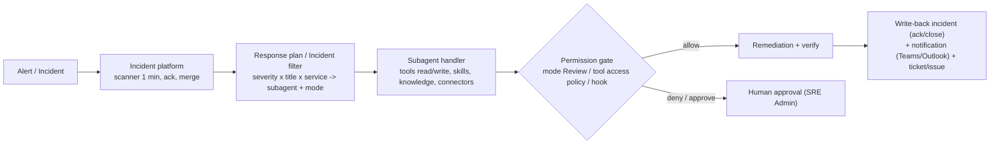
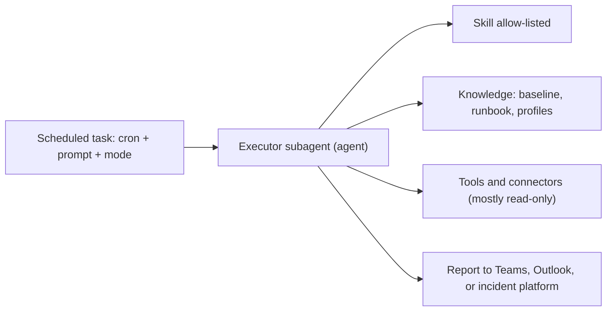
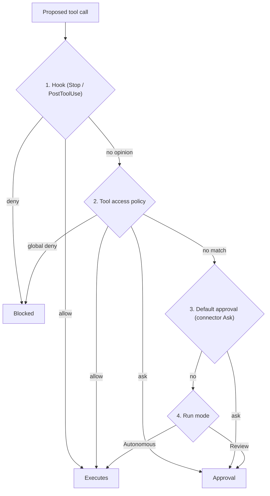
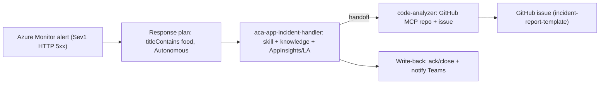
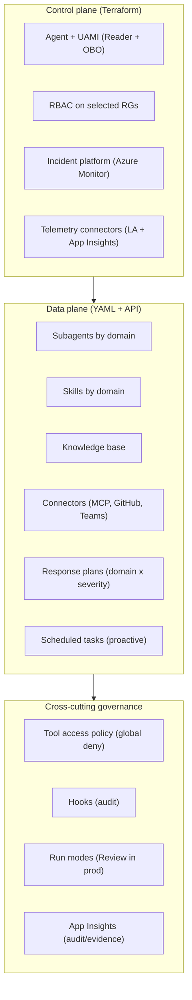

# Azure SRE Agent — Guidelines, Best Practices, Use Cases & How-To

Date: 2026-07-02
Scope: architecture, configuration, and enterprise use of **Azure SRE Agent** and all its
resource/sub-resource, with **WHAT / WHEN / HOW** criteria for each primitive and for their
**combinations**.
Audience: Cloud/Platform Architect, SRE Lead, Platform Engineering, technical decision-makers.
Objective: provide **concrete, comprehensive, and validated** guidance on how to architect,
configure, and implement SRE Agent according to best practices, to meet enterprise needs for
governance, security, resilience, cost, and business impact.

This is the **single master document** for the initiative. It does not repeat the demo walkthroughs
(those live in [../02-documentation-demo-lab-env/](../02-documentation-demo-lab-env/)) nor the raw
API inventory ([azure-sre-agent-complete-resource-reference.md](azure-sre-agent-complete-resource-reference.md)):
it integrates them into a decision-oriented operational guide.

> Source convention: every statement is anchored to Microsoft Learn `learn.microsoft.com/azure/sre-agent/*`
> or to the ARM template reference. The complete URL index is in [Appendix B](#appendix-b--index-of-official-sources).

---

## Document status

| Part | Content | Status |
| --- | --- | --- |
| I | Fundamentals (mental models, ownership) | Complete |
| II | Complete inventory of resources/sub-resources | Complete |
| III | Step 1 — Building block: Knowledge / Skill / Tool / Subagent | Complete |
| IV | Step 2 — Reactive chain (incident platform → filter → subagent → hook) | Complete |
| V | Step 3 — Proactive chain (scheduled task → subagent → skill → knowledge) | Complete |
| VI | Step 4 — Cross-cutting governance & security | Complete |
| VII | Step 5 — Combined patterns for enterprise scenarios | Complete |
| App. | Glossary, source index, project status | Complete |

---

## Table of contents

- [Part I — Fundamentals](#part-i--fundamentals)
- [Part II — Complete inventory of resources and sub-resources](#part-ii--complete-inventory-of-resources-and-sub-resources)
- [Part III — Step 1: Knowledge and action building blocks](#part-iii--step-1-knowledge-and-action-building-blocks)
- [Part IV — Step 2: Reactive chain (in preparation)](#part-iv--step-2-reactive-chain-incident--action)
- [Part V — Step 3: Proactive chain (in preparation)](#part-v--step-3-proactive-chain-scheduling--prevention)
- [Part VI — Step 4: Cross-cutting governance and security (in preparation)](#part-vi--step-4-cross-cutting-governance-and-security-agent-governance-toolkit--native-controls)
- [Part VII — Step 5: Combined enterprise patterns (in preparation)](#part-vii--step-5-combined-enterprise-patterns-end-to-end-scenarios)
- [Appendix A — Glossary](#appendix-a--glossary)
- [Appendix B — Index of official sources](#appendix-b--index-of-official-sources)
- [Appendix C — Current project status](#appendix-c--current-project-status)

---

## Part I — Fundamentals

### 1.1 Context and objective

Azure SRE Agent (public preview) is an AI service that connects observability tools, incident
management platforms, and code repositories, and automates operational work end-to-end: it
**investigates** incidents and, where authorized, **remediates** them. Source:
[Overview of Azure SRE Agent](https://learn.microsoft.com/en-us/azure/sre-agent/overview).

In this project, agent behavior is treated as **desired state under Git**, with two clear
ownership boundaries:

- **Control plane → Terraform** ([../04-terraform/](../04-terraform/)): agent resource
  `Microsoft.App/agents@2026-01-01`, identity, model, incident platform, telemetry
  connectors, RBAC.
- **Data plane (behavior) → YAML/Markdown + `sre-agent-config.sh`**
  ([../06-sre-agent-configuration/](../06-sre-agent-configuration/)): subagent, skill,
  connectors, knowledge, incident filter, scheduled task, repo, hook.

### 1.2 The two official mental models

Two **validated** lenses govern all subsequent decisions.

1. **The 5 “extension primitives” + the permission gate.** The agent “*operates through five
   extension primitives*”: **Skills, Subagents, Python tools, MCP servers, Agent hooks**, plus a
   **Permission gate** (a pre-execution security layer that evaluates every tool call). Source:
   [Overview — How does SRE Agent work?](https://learn.microsoft.com/en-us/azure/sre-agent/overview).
2. **Inbound vs outbound.** **Incident platforms** are *inbound* (incidents arrive at the
   agent); **connectors** are *outbound* (the agent reaches systems to investigate). These are
   separate concepts. Sources:
   [Connectors](https://learn.microsoft.com/en-us/azure/sre-agent/connectors),
   [Incident platforms](https://learn.microsoft.com/en-us/azure/sre-agent/incident-platforms).

### 1.3 Ownership: control plane vs data plane

| Layer | What it owns | Where | Mechanism |
| --- | --- | --- | --- |
| ARM (control plane) | Agent resource, identity, model, incident platform, telemetry connectors, RBAC | [../04-terraform/](../04-terraform/) | Terraform (`azapi` + `azurerm`) |
| Data plane (behavior) | Connectors, subagents, skills, knowledge, incident filter, scheduled task, repo, hook | [../06-sre-agent-configuration/](../06-sre-agent-configuration/) | YAML+Markdown applied by [sre-agent-config.sh](../03-scripts/sre-agent-config.sh) |

Change principle (Day-3):

- **Infrastructure change** → edit `04-terraform/`, `terraform plan`, `terraform apply`.
- **Agent behavior change** → edit `06-sre-agent-configuration/`, then
  `sre-agent-config.sh plan`/`apply`/`verify`.

### 1.4 How many agents and how to segment them (boundary ≠ team)

The **number of agents** and their organization are covered in detail in the fleet guide
[architectural-guide-lines/azure-sre-agent-fleet-architecture-guidelines.md](architectural-guide-lines/azure-sre-agent-fleet-architecture-guidelines.md)
(companion executive: [how-many-sre-agent.md](architectural-guide-lines/how-many-sre-agent.md)).
Key principle that must not be violated:

- **The number of agents follows *governance* boundaries** — residency/region, Prod/Non-Prod,
  Platform/Application (CAF), **independent approval authority** (the *SRE Agent
  Administrator* role is per-agent), permission posture — **not** the number of apps,
  subscriptions, technology layers, or teams. Sources:
  [permissions](https://learn.microsoft.com/en-us/azure/sre-agent/permissions),
  [user-roles](https://learn.microsoft.com/en-us/azure/sre-agent/user-roles),
  [pricing — consolidation](https://learn.microsoft.com/en-us/azure/sre-agent/pricing-billing#frequently-asked-questions).
- **“1 agent per team” is a structural anti-pattern (Conway’s Law):** functional teams
  (network/infra/app) ⇒ *1 agent per layer* (destroys cross-layer correlation); stream-aligned
  teams (1 team = 1 workload) ⇒ *1 agent per app* (always-on ×N). Team expertise maps to
  **subagents** (the internal axis, *Inverse Conway Maneuver*), not to the number of agents.
  Details: [fleet §4.1](architectural-guide-lines/azure-sre-agent-fleet-architecture-guidelines.md#41-one-agent-per-team-a-structural-anti-pattern-conways-law).
  Sources: [Conway's Law](https://martinfowler.com/bliki/ConwaysLaw.html),
  [sub-agents](https://learn.microsoft.com/en-us/azure/sre-agent/sub-agents),
  [Team Topologies](https://teamtopologies.com/key-concepts).

---

## Part II — Complete inventory of resources and sub-resources

Organized into 7 families. For each item: type/API, role, repo owner, official source.

### Family A — Agent resource and supporting Azure resources (control plane)

| # | Resource | Type/API | Role | Owner | Source |
| --- | --- | --- | --- | --- | --- |
| A1 | Agent | `Microsoft.App/agents@2026-01-01` | Root: model, `actionConfiguration` (mode/accessLevel), `incidentManagementConfiguration`, AAU limit, knowledge-graph scope | Terraform | [ARM agents](https://learn.microsoft.com/en-us/azure/templates/microsoft.app/agents?pivots=deployment-language-terraform) |
| A2 | Connectors ARM | `Microsoft.App/agents/connectors@2026-01-01` | The agent’s own telemetry (Log Analytics, App Insights) | Terraform | [ARM connectors](https://learn.microsoft.com/en-us/azure/templates/microsoft.app/agents/connectors?pivots=deployment-language-terraform) |
| A3 | User-Assigned Managed Identity | `azurerm_user_assigned_identity` | Single principal for RBAC and secretless data access | Terraform | [Permissions](https://learn.microsoft.com/en-us/azure/sre-agent/permissions) |
| A4 | RBAC role assignments | `azurerm_role_assignment` | Diagnostic/action rights for the UAMI + SRE Agent roles for users | Terraform | [Permissions](https://learn.microsoft.com/en-us/azure/sre-agent/permissions) |
| A5 | Log Analytics workspace | `azurerm_log_analytics_workspace` | Log store/query used in investigations | Terraform | [Create agent](https://learn.microsoft.com/en-us/azure/sre-agent/create-agent) |
| A6 | Application Insights | `azurerm_application_insights` | Application telemetry + runtime audit for the agent | Terraform | [Create agent](https://learn.microsoft.com/en-us/azure/sre-agent/create-agent) |

> When creating an agent, Azure **automatically** creates App Insights, Log Analytics, and
> Managed Identity; here they are made explicit and Terraform-owned. Source:
> [Overview — Considerations](https://learn.microsoft.com/en-us/azure/sre-agent/overview).

### Family B — The 5 extension primitives + governance

| # | Primitive | What it is | Activation | Owner/API | Source |
| --- | --- | --- | --- | --- | --- |
| B1 | Skills | Reusable procedural playbook (`SKILL.md` + tool + file) | Automatic; max 5 active | data-plane `/skills` — [../06-sre-agent-configuration/skills/](../06-sre-agent-configuration/skills/) | [Skills](https://learn.microsoft.com/en-us/azure/sre-agent/skills) |
| B2 | Subagents (custom agents) | Domain specialist | Explicit `/agent` or routed by filter/task; handoff chains | data-plane `/agents` — [../06-sre-agent-configuration/subagents/](../06-sre-agent-configuration/subagents/) | [Custom agents](https://learn.microsoft.com/en-us/azure/sre-agent/sub-agents) |
| B3 | Tools | Atomic capability (see Family C) | Invoked by the subagent during the run | built-in / MCP / custom | [Tools](https://learn.microsoft.com/en-us/azure/sre-agent/tools) |
| B4 | MCP servers (connectors) | Extension via Model Context Protocol (Streamable-HTTP or stdio) | On demand when a subagent calls the tool | data-plane connectors — [../06-sre-agent-configuration/connectors/](../06-sre-agent-configuration/connectors/) | [MCP connectors](https://learn.microsoft.com/en-us/azure/sre-agent/mcp-connectors) |
| B5 | Agent hooks | Checkpoint that intercepts behavior; executor command or prompt | On the **Stop** or **PostToolUse** event | data-plane `/hooks` — [../06-sre-agent-configuration/hooks/](../06-sre-agent-configuration/hooks/) | [Agent hooks](https://learn.microsoft.com/en-us/azure/sre-agent/agent-hooks) |
| B6 | Permission gate / Tool access policies | Pre-execution security layer: approves, applies policy, blocks | Before every tool call | control on agent + policy | [Tool access policies](https://learn.microsoft.com/en-us/azure/sre-agent/tool-access-policies), [Run modes](https://learn.microsoft.com/en-us/azure/sre-agent/run-modes) |

> **Built-in subagents (out of the box): 5** — architecture, logs and metrics, source code, root cause
> analysis, scanning — extensible with custom subagents. Source:
> [Overview](https://learn.microsoft.com/en-us/azure/sre-agent/overview).
> **Validated governance rule:** **Review/Autonomous mode is NOT set in the subagent YAML**,
> but **on the response plan or the scheduled task**. Source:
> [Custom agents — Custom agent modes](https://learn.microsoft.com/en-us/azure/sre-agent/sub-agents).

### Family C — Tools (7 categories)

| # | Category | Examples | Setup | Source |
| --- | --- | --- | --- | --- |
| C1 | Built-in | `RunAzCliReadCommands`, `RunAzCliWriteCommands`, `GetAzCliHelp`, `QueryLogAnalyticsByWorkspaceId`, `QueryAppInsightsByResourceId`, kubectl/AKS, metrics | None (managed identity + RBAC) | [Tools](https://learn.microsoft.com/en-us/azure/sre-agent/tools) |
| C2 | MCP | namespaced tools `my-server_*`, wildcard `my-server/*` | MCP connector | [MCP connectors](https://learn.microsoft.com/en-us/azure/sre-agent/mcp-connectors) |
| C3 | Code execution | `ExecutePythonCode` (Python + shell in sandbox) | None (built-in) | [Python code execution](https://learn.microsoft.com/en-us/azure/sre-agent/python-code-execution) |
| C4 | Knowledge | `SearchMemory`, document search, application topology, TSG retrieval, knowledge graph | None (some features require connectors) | [Memory](https://learn.microsoft.com/en-us/azure/sre-agent/memory) |
| C5 | Communication | email (Outlook), Teams | Outlook/Teams connector | [Connectors](https://learn.microsoft.com/en-us/azure/sre-agent/connectors) |
| C6 | Incident mgmt & DevOps | PagerDuty/ServiceNow, GitHub/Azure DevOps | Platform connector | [Tools](https://learn.microsoft.com/en-us/azure/sre-agent/tools) |
| C7 | Custom tools | 4 types: Kusto, Python, Link, HTTP client | Builder UI; attached to a skill or subagent | [Tools — Custom tools](https://learn.microsoft.com/en-us/azure/sre-agent/tools) |

> ⚠️ Preview caveat: in this tenant, creation of **custom Tool**
> (`Tool`/`KustoTool`/`PythonTool`/`HttpClientTool`/`LinkTool`) is rejected with
> `InvalidObjectType`. Today only built-in tools + MCP are used. Sources:
> [complete-resource-reference](azure-sre-agent-complete-resource-reference.md),
> [microsoft/sre-agent#199](https://github.com/microsoft/sre-agent/issues/199).

### Family D — Knowledge & Memory

| # | Source | What it contains | Management | Source |
| --- | --- | --- | --- | --- |
| D1 | Knowledge base (documents) | Runbooks, architectures, templates (MD/PDF/DOCX…, max 16 MB) | `POST /agentmemory/upload` — [../06-sre-agent-configuration/knowledge/files/](../06-sre-agent-configuration/knowledge/files/) | [Upload knowledge documents](https://learn.microsoft.com/en-us/azure/sre-agent/upload-knowledge-document) |
| D2 | Past incidents / Session insights | Symptoms, resolution steps, root cause, pitfalls extracted at thread end | Automatic (30 min) | [Memory](https://learn.microsoft.com/en-us/azure/sre-agent/memory) |
| D3 | User memories | Environment facts saved explicitly | `#remember` / `#retrieve` / `#forget` | [Memory](https://learn.microsoft.com/en-us/azure/sre-agent/memory) |
| D4 | Synthesized knowledge | `memories/synthesizedKnowledge/overview.md` (always in the system prompt) + topic file | Automatic/on demand | [Memory](https://learn.microsoft.com/en-us/azure/sre-agent/memory) |
| D5 | Connected knowledge sources | ADO wiki, GitHub repo/wiki/issue, custom MCP | Via connectors | [Memory — Connect external sources](https://learn.microsoft.com/en-us/azure/sre-agent/memory) |

### Family E — Connectors (outbound, 4 categories)

| # | Category | Connectors | Source |
| --- | --- | --- | --- |
| E1 | Data sources | Log Analytics, Application Insights, Azure Data Explorer (query + indexing) | [Connectors](https://learn.microsoft.com/en-us/azure/sre-agent/connectors) |
| E2 | Source code & knowledge | GitHub MCP, GitHub OAuth, Azure DevOps OAuth, ADO Documentation | [Connectors](https://learn.microsoft.com/en-us/azure/sre-agent/connectors) |
| E3 | Collaboration | Teams (notifications), Outlook (email) | [Connectors](https://learn.microsoft.com/en-us/azure/sre-agent/connectors) |
| E4 | Custom (MCP servers) | Any system via MCP; partners: Datadog, Splunk, New Relic, Grafana | [MCP connectors](https://learn.microsoft.com/en-us/azure/sre-agent/mcp-connectors) |

> Validated budget: **max 80 total tools** per agent across all connectors. Source:
> [MCP connector](https://learn.microsoft.com/en-us/azure/sre-agent/mcp-connector).

### Family F — Automation, incident, and I/O surfaces (desired-state)

| # | Surface | Data-plane / owner | Role | Source |
| --- | --- | --- | --- | --- |
| F1 | Incident platform | `incidentManagementConfiguration` (Terraform) — Azure Monitor / PagerDuty / ServiceNow | Inbound: where alerts come from; with Azure Monitor no webhook (pull via RBAC) | [Incident platforms](https://learn.microsoft.com/en-us/azure/sre-agent/incident-platforms), [Azure Monitor Alerts](https://learn.microsoft.com/en-us/azure/sre-agent/azure-monitor-alerts) |
| F2 | Incident filters (response plans) | `/incidentFilters` — [../06-sre-agent-configuration/automations/incident-filters/](../06-sre-agent-configuration/automations/incident-filters/) | Incident routing → subagent + mode | [Incident response](https://learn.microsoft.com/en-us/azure/sre-agent/incident-response) |
| F3 | Scheduled tasks | `/scheduledtasks` — [../06-sre-agent-configuration/automations/scheduled-tasks/](../06-sre-agent-configuration/automations/scheduled-tasks/) | Recurring proactive work on cron | [Scheduled tasks](https://learn.microsoft.com/en-us/azure/sre-agent/scheduled-tasks) |
| F4 | Repositories | `/repos` — [../06-sre-agent-configuration/repos/](../06-sre-agent-configuration/repos/) | Source code for deploy/RCA correlation and triage | [API reference](https://learn.microsoft.com/en-us/azure/sre-agent/api-reference) |
| F5 | HTTP triggers | `/httptriggers` | Custom inbound webhook | [API reference](https://learn.microsoft.com/en-us/azure/sre-agent/api-reference) |
| F6 | Common prompts | `/commonprompts` — [../06-sre-agent-configuration/common-prompts/](../06-sre-agent-configuration/common-prompts/) | Reusable shared prompts | [API reference](https://learn.microsoft.com/en-us/azure/sre-agent/api-reference) |
| F7 | Plugins (marketplaces + installations) | `/plugins/*` — [../06-sre-agent-configuration/plugins/](../06-sre-agent-configuration/plugins/) | Marketplace registration/plugin installations | [complete-resource-reference](azure-sre-agent-complete-resource-reference.md) |

### Family G — Runtime-only surfaces (not desired-state)

| # | Surface | Path | Role |
| --- | --- | --- | --- |
| G1 | Threads & chat | `/api/v1/threads/*` | Runtime conversations |
| G2 | Approvals | `/api/v1/approvals/*` | Action approval decisions (Review mode) |
| G3 | SignalR hub | `/agentHub` | Real-time chat/thread streaming |

Source G1–G3: [API reference](https://learn.microsoft.com/en-us/azure/sre-agent/api-reference).

### Summary table — the 7 families

| Family | Content | Plane | Repo owner |
| --- | --- | --- | --- |
| A — Core & support | Agent, UAMI, RBAC, LAW, App Insights, telemetry connectors | Control | Terraform |
| B — Extension primitives | Skills, Subagents, Tools, MCP, Hooks + Permission gate | Data (+control) | 06-config |
| C — Tools | Built-in, MCP, code exec, knowledge, comms, incident/DevOps, custom | Data | 06-config |
| D — Knowledge & Memory | Document KB, past incidents, user memories, synthesized, connected | Data | 06-config/knowledge |
| E — Connectors | Data sources, source code/knowledge, collaboration, custom MCP | Data (+ARM) | 06-config/connectors |
| F — Automation & I/O | Incident platform, response plan, scheduled task, repos, HTTP trigger, common prompt, plugin | Data (+control) | 06-config + Terraform |
| G — Runtime-only | Threads, approvals, SignalR | Runtime | n/a |

---

## Part III — Step 1: Knowledge and action building blocks

Foundational layer: decide **which primitive to use for which need** and **how to combine them**.
Everything else (incident filter, scheduled task, hook) only *triggers* these four
primitives.

### 3.1 The official decision principle

| Primitive | Activation | Its own tools? | Context | Ideal for |
| --- | --- | :---: | --- | --- |
| Knowledge file | Automatic (semantic search) | No | Reference only | Runbooks, architectures, templates, static procedures |
| Skill | Automatic (loads `SKILL.md`) | Yes (can attach tools) | Uses thread context | Repeatable *executable* team-wide procedure |
| Subagent | Explicit `/agent` or routed | Yes (dedicated set) | Shares the thread (handoff) | Domain specialist, multi-step workflow |
| Tool | Invoked by agent/skill/subagent | — (it is the capability) | — | Atomic action (CLI, KQL, Python, MCP) |

Sources: [Skills — Compare](https://learn.microsoft.com/en-us/azure/sre-agent/skills),
[Custom agents — Compare](https://learn.microsoft.com/en-us/azure/sre-agent/sub-agents).

**Golden rule:** Knowledge = “what to know” · Skill = “how to proceed” · Tool = “what to do” ·
Subagent = “who orchestrates”.

Decision questions in order:

1. Reference content that does not execute anything? → **Knowledge file**.
2. Repeatable procedure that must also *execute*, valid for everyone? → **Skill** (with tools).
3. Persona/specialist with a dedicated set of tools and skills? → **Subagent**.
4. Atomic capability (read logs, run a command)? → **Tool**.

Validated anti-pattern: DO NOT create a subagent for single operations or trivial read-only
queries (“*Main agent can handle without delegation*” / “*Use skills instead*”). Source:
[Custom agents — When to use](https://learn.microsoft.com/en-us/azure/sre-agent/sub-agents).

### 3.2 The four building blocks — WHAT / WHEN / HOW

#### A. Knowledge file — the grounding layer

- **WHAT**: documents (MD/PDF/DOCX…, max 16 MB) in agent memory, searchable via `SearchMemory`.
- **WHEN (use-case)**: give the agent institutional knowledge that it must not “invent”:
  reference architectures, runbooks, report templates, naming conventions, escalation paths,
  vetted KQL catalog.
- **HOW (key aspects)**:
  - Markdown files under [../06-sre-agent-configuration/knowledge/files/](../06-sre-agent-configuration/knowledge/files/),
    uploaded with `sre-agent-config.sh apply --target knowledge-files`. The server indexes by
    **basename** → unique, descriptive file name (`http-500-errors.md`, not `runbook.md`).
  - **Upload vs Connect**: static content → upload; live/changeable content (ADO wiki, code)
    → connector.
- **⚠️ Enterprise caution**: an outdated document produces wrong answers → quarterly review.

Sources: [Upload knowledge documents](https://learn.microsoft.com/en-us/azure/sre-agent/upload-knowledge-document),
[Memory — Best practices](https://learn.microsoft.com/en-us/azure/sre-agent/memory).

#### B. Skill — the executable procedure

- **WHAT**: named playbook = `SKILL.md` + attached `tools` + support files. Automatic loading,
  without a command.
- **WHEN (use-case)**: an operational procedure must be identical for everyone and must be able to
  *act* (not just describe): “how to investigate NSG denied flow”, “how to read Traffic
  Analytics”, “how to do a cost assessment”.
- **HOW (real repo config — `traffic-analytics-kql-analysis.yaml`)**:

```yaml
api_version: azuresre.ai/v1
kind: Skill
metadata:
  name: traffic-analytics-kql-analysis
spec:
  description: Query and interpret Traffic Analytics records...   # ← the description drives automatic loading
  content_file: ./traffic-analytics-kql-analysis.md              # ← the SKILL.md with the procedure
  tools:                                                          # ← least-privilege: read ONLY
    - RunAzCliReadCommands
    - QueryLogAnalyticsByWorkspaceId
    - GetAzCliHelp
  safety:
    default_mode: read_only                                      # ← skill-level guardrail
    requires_approval_for_actions: true
```

- **Key points to focus on**:
  - `description` is the *trigger*: write it as “Use when…”, otherwise the skill will not load at
    the right time.
  - The skill’s `tools` define what it can *execute*: give it the minimum.
  - The `safety` block is the first guardrail: `default_mode: read_only` keeps it safe even if an
    autonomous subagent loads it.
- **⚠️ Hard limit**: **max 5 active skills**; the oldest is unloaded; they reset at
  compaction. Implication: domain-focused allow-list, one skill = one cohesive task.

Source: [Skills](https://learn.microsoft.com/en-us/azure/sre-agent/skills).

#### C. Tool — the atomic capability

- **WHAT**: the elementary action. Built-in (via managed identity + RBAC, zero setup) and MCP.
- **WHEN (use-case)**: it is the primary security lever. The *read* vs *write* difference is the
  real risk control, more than the mode.

| Built-in tool | Risk | When to grant it |
| --- | :---: | --- |
| `RunAzCliReadCommands`, `GetAzCliHelp` | Low | Always (evidence collection) |
| `QueryLogAnalyticsByWorkspaceId`, `QueryAppInsightsByResourceId` | Low | Diagnosis on logs/telemetry |
| `SearchMemory` | Low | Load the right runbook before acting |
| `ExecutePythonCode` | Medium | Evidence charts/aggregations (sandbox) |
| `RunAzCliWriteCommands` | High | Only to remediation subagents, with guardrails |

- **HOW (key aspects)**:
  - **Least-privilege by tool**: a read-only auditor must NOT have `RunAzCliWriteCommands`
    (in the repo `azure-resource-config-auditor` is Autonomous but read-only precisely because it has only
    read tools → it cannot modify anything).
  - **MCP tools** are namespaced as `connection-id_tool`, assigned with wildcard `connection-id/*`
    (slash required).
- **⚠️ Hard limit**: budget of **80 total tools** per agent. Custom Tools are currently blocked in preview
  (see Family C).

Sources: [Tools](https://learn.microsoft.com/en-us/azure/sre-agent/tools),
[Connectors — wildcard](https://learn.microsoft.com/en-us/azure/sre-agent/connectors).

#### D. Subagent — the specialist orchestrator

- **WHAT**: domain agent with `system_prompt` (persona), `allowed_skills`, `tools`,
  `mcp_tools`, `handoffs`.
- **WHEN (use-case)**: domain with deep expertise or multi-step workflow (incident triage,
  deploy validation, network RCA). The 3 official patterns: **Domain Expert**, **Task Specialist**,
  **Workflow Executor**.
- **HOW (real repo config — `network-traffic-analyst.yaml`, abbreviated)**:

```yaml
kind: SubAgent
metadata:
  name: network-traffic-analyst
spec:
  agent_type: Autonomous            # declared capability (see governance note)
  enable_skills: true
  allowed_skills:                   # ← scoping: the 5 network-domain skills (official cap: max 5 active)
    - vnet-flow-logs-and-ingestion
    - traffic-analytics-kql-analysis
    - connectivity-diagnostics
    - nsg-deny-flow-investigation
    - udr-asymmetry-investigation
  handoff_description: Handles VNet Flow Logs, Traffic Analytics, NSG/UDR, hub firewall...
  system_prompt: |-
    You are the networking specialist... investigate first, then apply the smallest
    reversible remediation and verify... NGINX/web-tier is OUT OF SCOPE → defer to iaas-vm-incident-handler.
  tools:                            # ← here is the write: it's a remediation-capable subagent
    - RunAzCliReadCommands
    - RunAzCliWriteCommands
    - GetAzCliHelp
    - QueryLogAnalyticsByWorkspaceId
  mcp_tools:
    - microsoft-learn-mcp/*         # ← per-subagent grant (the meta-agent visibility is NOT enough)
  handoffs: []
```

- **Aspects to focus on (the 5 fields that matter)**:
  1. `system_prompt` = persona *and boundaries*: explicitly declares what is **out of scope** (here
     nginx → defers). Prevents mis-routing.
  2. `allowed_skills` = which procedures it can load (auto-enables the skills). Cohesive with the domain
     (limit 5 active).
  3. `tools` = the real risk lever (read-only vs write-capable).
  4. `mcp_tools` = **critical enterprise gotcha**: the selection visible to the *meta-agent* does NOT
     reach the subagent; every subagent needs its own `mcp_tools` or it sees zero MCP tools.
  5. `handoffs` = who it passes control to (foundation of multi-agent chains, §3.3 Pattern 4).
- **⚠️ Validated governance**: Review/Autonomous mode does NOT belong in the subagent YAML, but
  **on the response plan or the scheduled task** that triggers it. Risk is governed through two
  independent levers: (a) *capability* = the `tools` (read vs write); (b) *autonomy* = the `mode` of the
  filter/task.

Sources: [Custom agents](https://learn.microsoft.com/en-us/azure/sre-agent/sub-agents),
[Connectors — Connectors and custom agents](https://learn.microsoft.com/en-us/azure/sre-agent/connectors#connectors-and-custom-agents).

### 3.3 Enterprise combinations

| # | Pattern | Combination | Enterprise use-case | Risk |
| --- | --- | --- | --- | :---: |
| P1 | Guided read-only specialist | Subagent(read tools) + `allowed_skills` + Knowledge | Diagnosis/advisory with no risk (audit, cost) | Low |
| P2 | Team-wide executable runbook | Skill(+read tools) + Knowledge | Standard repeatable procedure for everyone | Low |
| P3 | Auto-remediation with guardrails | Subagent(write tool) + Skill(read_only) + Hook/Policy | Controlled autonomous service restoration | High |
| P4 | Cross-domain handoff chain | Subagent A → `handoffs` → Subagent B | Triage → specialist → code RCA | Medium |
| P5 | Documentary grounding via MCP | Subagent + `mcp_tools` (Learn/GitHub) + Knowledge | Recommendations anchored to sources/code | Low |

#### P1 — Guided read-only specialist

- **WHEN**: repeatable expert advice **without modification power** (config drift audit, RBAC
  review, FinOps advisory).
- **HOW**: `tools` read-only; focused `allowed_skills`; domain Knowledge (architecture,
  source-of-truth Terraform). In the repo: `azure-resource-config-auditor` + skill
  `rbac-and-resource-access-check` + KB `terraform-design.md`.
- **Focus**: security here does not depend on mode but on the **absence of write tools**. You can
  leave it Autonomous: without write it changes nothing.

#### P2 — Team-wide executable runbook

- **WHEN**: a procedure must be identical for anyone and must *execute* the queries, not just
  explain them.
- **HOW**: Skill with detailed `content_file` + read `tools` + `safety.default_mode: read_only`;
  optional Knowledge (KQL catalog). Automatic loading based on `description`.
- **Focus**: `description` as the trigger (“Use when…”); respect the 5 active skills limit.

#### P3 — Auto-remediation with guardrails (the most delicate)

- **WHEN**: the agent must **restore the service by itself** (restart ACA revision, remove a
  wrong NSG rule) but with enterprise control.
- **HOW (three combined levers)**:
  1. Subagent with `RunAzCliWriteCommands` + `system_prompt` imposing “smallest reversible
     change, then verify”.
  2. The skill stays `read_only` (the subagent performs remediation, not the skill).
  3. **Guardrail** = **Review mode** (approval for infra operations) and/or **tool access
     policy** that denies dangerous patterns (`az * delete *`); **hooks** add audit and
     validation (events **Stop**/**PostToolUse**) but are not a pre-execution gate — details
     in [Part IV](#part-iv--step-2-reactive-chain-incident--action).
- **Focus**: in **production** the best practice is **mode = Review** on the response plan (human
  approval) and/or blocking **tool access policy**; full autonomy without a gate should be
  reserved for lab/non-prod.

Sources: [Agent hooks](https://learn.microsoft.com/en-us/azure/sre-agent/agent-hooks),
[Tool access policies](https://learn.microsoft.com/en-us/azure/sre-agent/tool-access-policies),
[Run modes](https://learn.microsoft.com/en-us/azure/sre-agent/run-modes).

#### P4 — Cross-domain handoff chain

- **WHEN**: an incident crosses multiple domains: classification → specialist → root cause on
  code.
- **HOW**: on the first subagent, set `handoffs: [next-subagent]` and explain in the `system_prompt`
  *when* to pass control. The receiver **inherits the entire thread context**. In the repo:
  `aca-app-incident-handler` → `handoffs: [code-analyzer]`.
- **Focus**: take care of each `handoff_description` (it is what the orchestrator reads to choose
  the delegate).

Source: [Custom agents — Handoff](https://learn.microsoft.com/en-us/azure/sre-agent/sub-agents).

#### P5 — Documentary grounding via MCP

- **WHEN**: recommendations must be anchored to authoritative sources (Microsoft Learn) or to real
  code (GitHub).
- **HOW**: add `mcp_tools: [microsoft-learn-mcp/*]` (docs) or `[github-mcp/*]`
  (code/issues) to the subagent, in addition to the connector. Remember the gotcha: without per-subagent `mcp_tools`, the
  subagent does not see MCP tools.
- **Focus**: `github-mcp/*` also includes destructive tools (delete_file, merge_pull_request) → in
  enterprise prefer the **explicit list** of tools for least privilege.

Source: [Connectors — individual vs wildcard](https://learn.microsoft.com/en-us/azure/sre-agent/connectors).

### 3.4 Annotated real example (P1+P2+P5 in a single subagent)

`network-traffic-analyst` combines **Subagent + 7 Skills + Tool read/write + MCP + Knowledge**:

```text
Subagent (Domain Expert "network")
 ├─ system_prompt ......... persona + boundaries (nginx out of scope → defer)
 ├─ tools ................. read (evidence) + RunAzCliWriteCommands (remediation P3)
 ├─ allowed_skills (7) .... domain procedures, auto-loaded (P2) — but max 5 active!
 ├─ mcp_tools ............. microsoft-learn-mcp/* → grounding docs (P5)
 └─ (Knowledge vnet-flow-logs) .. architecture.md, kql-catalog.md via SearchMemory (P1 grounding)
```

Lesson: 7 skills are allow-listed but runtime keeps at most 5 active → deliberate design; the 7
cover the domain, runtime selection narrows them.

### 3.5 Enterprise checklist for the layer

| Aspect | Practical rule | Source |
| --- | --- | --- |
| Least-privilege (capability) | Write tool only to remediation subagents; everything else read-only | [Permissions](https://learn.microsoft.com/en-us/azure/sre-agent/permissions) |
| Least-privilege (autonomy) | `mode` on response plan/task, not on the subagent; Review in prod | [Run modes](https://learn.microsoft.com/en-us/azure/sre-agent/run-modes) |
| 5 active skills limit | Domain-cohesive allow-lists; one skill = one task | [Skills](https://learn.microsoft.com/en-us/azure/sre-agent/skills) |
| 80 tool budget | Use MCP wildcard sparingly; prefer explicit lists | [MCP connector](https://learn.microsoft.com/en-us/azure/sre-agent/mcp-connector) |
| `mcp_tools` gotcha | Every subagent has its own MCP grant | [Connectors](https://learn.microsoft.com/en-us/azure/sre-agent/connectors#connectors-and-custom-agents) |
| Knowledge freshness | Descriptive naming + quarterly review | [Memory](https://learn.microsoft.com/en-us/azure/sre-agent/memory) |
| Cost (AAU) | Every run/subagent consumes Agent Units; `monthlyAgentUnitLimit` as a guardrail | [Pricing & billing](https://learn.microsoft.com/en-us/azure/sre-agent/pricing-billing) |
| Anti-pattern | No subagent for single or trivial read-only operations → use a skill | [Custom agents](https://learn.microsoft.com/en-us/azure/sre-agent/sub-agents) |

---

## Part IV — Step 2: Reactive chain (incident → action)

The reactive chain is the operational core of SRE Agent: it turns an **alert** into a verified
**action**, with a traceable reasoning log. It is made up of five links.

### 4.0 The end-to-end flow



Validated steps: the agent (1) **acknowledges** the alert, (2) **queries** observability, (3) **correlates**
with deployment history, (4) **searches memory** for similar incidents, (5) **forms hypotheses** and
validates them, (6) **proposes or remediates** based on the run mode. Source:
[Incident response](https://learn.microsoft.com/en-us/azure/sre-agent/incident-response).

### 4.1 Link 1 — Incident platform (inbound)

- **WHAT**: the inbound source of incidents. Three platforms are supported; **only one active at a
  time** (changing it disconnects the previous one).

| Platform | When to choose it | Auth | Write-back |
| --- | --- | --- | --- |
| Azure Monitor | You already use Azure Monitor; zero credentials | Managed identity (no webhook) | Acknowledge, close |
| PagerDuty | Existing on-call management | API-based | Ack, resolve, add notes |
| ServiceNow | Enterprise ITSM | ITSM integration | Post entries, ack, resolve |

- **WHEN (use-case)**: move from an *on-demand reactive* agent to a *proactive* one (collects
  incidents at the moment they happen).
- **HOW (key aspects)**:
  - **Azure Monitor**: no webhook, no credentials. Alerts from *managed resource groups*
    flow via **RBAC pull**. Validated requirement: the **UAMI must have the
    `Monitoring Contributor` role** on the subscription. Terraform config:
    `incidentManagementConfiguration = { type = "AzMonitor", connectionName = "azmonitor" }`.
  - **Scanner (validated numbers)**: scan interval **1 minute**; 250 alerts/call; initial lookback
    1 day; max window 29 days; merge lookback 7 days; status sync 5 minutes. Repeated
    alerts from the same rule **merge into a single thread**.
  - **Severity map**: Sev0 Critical, Sev1 Error, Sev2 Warning, Sev3 Informational, Sev4 Verbose.
- **⚠️ Critical enterprise gotcha**: when connected, a response plan named
  **`quickstart_handler`** is created (severity match, all services, **fully autonomous**). If you create
  your own plans, quickstart runs **in parallel** and can route to the wrong subagent or
  process the incident twice → **delete it** (Builder > Incident response plans > Table view
  > delete).

Sources: [Incident platforms](https://learn.microsoft.com/en-us/azure/sre-agent/incident-platforms),
[Azure Monitor Alerts](https://learn.microsoft.com/en-us/azure/sre-agent/azure-monitor-alerts).

### 4.2 Link 2 — Response plan / incident filter (routing)

- **WHAT**: defines *what the agent does* when a given type of incident arrives (subagent,
  autonomy, retry). In the repo this is the `IncidentFilter` object.
- **WHEN (use-case)**: route every incident to the **right specialist** with the **right
  autonomy**.
- **HOW (real config — `web-tier-nginx.yaml`)**:

```yaml
kind: IncidentFilter
metadata:
  name: web-tier-nginx
spec:
  incidentPlatform: AzMonitor
  isEnabled: true
  priorities: [Sev2]                        # ← dimension 1: severity
  titleContains: nginx                       # ← dimension 2: title (case-insensitive, single-token)
  handlingAgent: iaas-vm-incident-handler    # ← where to route
  agentMode: Autonomous                       # ← autonomy (here, NOT in the subagent)
  maxAutomatedInvestigationAttempts: 2        # ← retry before human escalation
  customInstructions: >-
    Investigate Sev2 web-tier alerts where NGINX is down... restart autonomously and verify...
```

- **Points to focus on**:
  - **Multi-dimensional routing**: `priorities` (severity) × `titleContains`/`titleNotContains`
    (title) × impacted service. The project best practice is **domain routing**: each
    plan owns **one failure domain**, disjoint from the others.
  - **Disjointness**: overlapping plans = double processing. In the repo, the two Sev2 plans are
    disjoint by construction (`web-tier-nginx` titleContains nginx vs `network-observability-review`
    titleNotContains nginx).
  - **`agentMode`**: this is where (not in the subagent) Review/Autonomous is chosen.
  - **`maxAutomatedInvestigationAttempts`**: how many times it retries before **escalation to a human**.
- **⚠️ Attention**: title matching is **case-insensitive** and the data plane rejects
  duplicate tokens with different casing → use **single tokens** (`nginx`, `food`, `afw`).

Sources: [Incident response plans](https://learn.microsoft.com/en-us/azure/sre-agent/incident-response-plans),
[Custom agents — modes](https://learn.microsoft.com/en-us/azure/sre-agent/sub-agents).

### 4.3 Link 3 — Subagent + mode (execution)

The **two independent risk levers** (seen in Step 1, combined here):

| Lever | Where it is set | What it controls |
| --- | --- | --- |
| Capability | subagent `tools` | What it *can* do (read vs `RunAzCliWriteCommands`) |
| Autonomy | response plan `agentMode` | Whether it *asks for approval* or acts |

- Review shows **Approve/Deny only for Azure infrastructure write operations** (CLI/ARM write); the
  other actions (email, Teams, external queries) proceed according to the reasoning and the
  `customInstructions` → to govern them you need hooks/policy.
- **Only SRE Agent Administrators** can approve.
- Permissions and mode are **orthogonal**: you need **both** (mode decides whether to ask; RBAC
  decides whether it can reach the resource). Source:
  [Run modes](https://learn.microsoft.com/en-us/azure/sre-agent/run-modes).

### 4.4 Link 4 — Permission gate (guardrails)

**Validated** clarification (correction of a common misunderstanding): pre-execution blocking is NOT
implemented by a hook. The mechanisms are three and complementary (defense-in-depth):

| Mechanism | Timing | What it does | Source |
| --- | --- | --- | --- |
| Run mode Review | Pre-execution | Human Approve/Deny for infra write operations | [Run modes](https://learn.microsoft.com/en-us/azure/sre-agent/run-modes) |
| Tool access policy | Pre-execution | Denies/allows tool call patterns (e.g. `az * delete *`) | [Tool access policies](https://learn.microsoft.com/en-us/azure/sre-agent/tool-access-policies) |
| Hook | **Stop** and **PostToolUse** events | Stop: validates completeness; PostToolUse: audits, blocks the *result*, injects context | [Agent hooks](https://learn.microsoft.com/en-us/azure/sre-agent/agent-hooks) |

- **Two hook events** (official): **Stop** (before the final response) and **PostToolUse** (after
  successful execution of a tool). Two **executors**: `prompt` (LLM → JSON) or `command` (script
  bash/python in sandbox).
- **Two levels**: agent-level (Builder > Hooks, whole agent) and custom-agent-level (Agent Canvas /
  REST API v2). If both match, **both run** (agent-level first).
- **HOW (PostToolUse command hook that blocks dangerous commands)**:

```yaml
api_version: azuresre.ai/v2
kind: ExtendedAgent
metadata:
  name: my_hooked_agent
spec:
  hooks:
    PostToolUse:
      - type: command
        matcher: "Bash|ExecuteShellCommand"   # regex ancorata ^(...)$, case-sensitive
        timeout: 30
        failMode: block
        script: |
          #!/usr/bin/env python3
          import sys, json, re
          ctx = json.load(sys.stdin)
          cmd = ctx.get('tool_input', {}).get('command', '')
          for p in [r'\brm\s+-rf\b', r'\bsudo\b']:
              if re.search(p, cmd):
                  print(json.dumps({"decision": "block", "reason": f"Blocked: {p}"})); sys.exit(0)
          print(json.dumps({"decision": "allow"}))
```

- **Key points to focus on**: specific `matcher` (avoid `*` that is too broad); `failMode: block`
  for strict enforcement; JSON response `{"decision":"block","reason":...}` or exit code 2; limits
  (64 KB script, timeout 1-300 s). Hooks **complement** run modes: modes control *what* the agent can
  do, hooks control *how well* it does it and *what happens* to the results.
- **⚠️ Enterprise**: to **truly deny before** a destructive operation, use **Review mode**
  (approval) or **tool access policy**; the PostToolUse hook intervenes *after* execution (useful
  for audit and for blocking propagation of the result/context).

### 4.5 Link 5 — Write-back and notification (outbound)

- **Write-back to the incident**: the agent updates the platform (Azure Monitor: acknowledge, close;
  PagerDuty/ServiceNow: resolve, add notes). Automatic with the connected platform.
- **Notification** (Teams/Outlook): connectors created with the **portal wizard** (OAuth + managed
  identity), **not** with a data-plane PUT. After creation the agent exposes the tools (Post message,
  Reply, Get messages) → assign them to the subagent. Source:
  [Send notifications](https://learn.microsoft.com/en-us/azure/sre-agent/send-notifications).
- **Ticket/issue**: via GitHub/ADO connector or MCP (e.g. issue in `grubify` with the template
  `incident-report-template.md`).
- **⚠️ Attention**: outbound notifications do **not** go through Review’s Approve/Deny (which applies
  only to infra operations). If you also need to gate notifications, use hook/policy.

### 4.6 Reactive enterprise combinations

| # | Pattern | Composition | Use-case | Recommended autonomy |
| --- | --- | --- | --- | --- |
| R1 | Production-safe incident response | Azure Monitor + **Review** response plan + subagent(read+write) + tool access policy + notify | Critical production infrastructure | Review |
| R2 | Autonomous remediation with audit | **Autonomous** response plan + subagent(write) + PostToolUse hook (audit) + deny-destructive policy + auto-mitigation | Staging/dev, trusted automations | Autonomous |
| R3 | Domain-routed multi-team | N disjoint response plans (severity×title) → N specialist subagents + handoff | Enterprise with multiple domains/teams | Mixed by domain |
| R4 | App incident + code RCA + ticket | response plan → app-incident-handler (Autonomous) → handoff code-analyzer → GitHub MCP + template KB | PaaS app of a dev team | Autonomous (non-prod) / Review (prod) |
| R5 | Enterprise ITSM | PagerDuty/ServiceNow + response plan + subagent + write-back (resolve/notes) | Organizations with existing ITSM | Review in prod |

**R1 — Production-safe incident response**

- **WHEN**: incidents on production infrastructure where every write action must be approved.
- **HOW**: `agentMode: Review` on the response plan; subagent with write tool **but** human gate; tool
  access policy that still denies destructive patterns (defense in depth); UAMI with
  **least-privilege** on the managed scopes (`Monitoring Contributor` for alerts + the minimum roles
  for the expected remediation); **delete `quickstart_handler`**; Teams notification.
- **Attention**: approvers are only SRE Agent Administrators; keep
  `maxAutomatedInvestigationAttempts` low and use escalation.

**R2 — Autonomous remediation with audit**

- **WHEN**: non-prod environments or well-tested and reversible remedies.
- **HOW**: `agentMode: Autonomous`; subagent with `RunAzCliWriteCommands` + `system_prompt`
  “smallest reversible change, then verify”; **PostToolUse hook** `matcher: "*"` for audit of every
  tool call (log to Application Insights); **tool access policy** that denies unplanned delete/scale-down;
  enable `auto_mitigation_enabled` on alerts so the incident self-resolves when the signal stops.
- **Attention**: full autonomy is appropriate only with guardrails and a reversible environment (this is the
  posture of this repo’s lab).

**R3 — Domain-routed multi-team**

- **WHEN**: large organization with distinct domains/teams (network, IaaS, PaaS, security).
- **HOW**: one **disjoint response plan per domain** (title × severity) → one specialist subagent
  per domain, each with its own skills/tools/knowledge; use `handoffs` for cross-domain
  cases (triage → specialist → code RCA). In the repo: 5 disjoint filters → 8 subagents.
- **Attention**: disjointness is the key property (no double processing); document the
  domain → plan → subagent map.

### 4.7 Enterprise checklist for the reactive chain

| Aspect | Practical rule | Source |
| --- | --- | --- |
| Single platform | Only one active incident platform; choose the primary one | [Incident platforms](https://learn.microsoft.com/en-us/azure/sre-agent/incident-platforms) |
| Remove quickstart | Delete `quickstart_handler` if you create your own plans | [Incident platforms](https://learn.microsoft.com/en-us/azure/sre-agent/incident-platforms) |
| Scanner RBAC | UAMI = `Monitoring Contributor` on the subscription | [Azure Monitor Alerts](https://learn.microsoft.com/en-us/azure/sre-agent/azure-monitor-alerts) |
| Disjoint plans | One plan = one failure domain; no overlaps | [Incident response plans](https://learn.microsoft.com/en-us/azure/sre-agent/incident-response-plans) |
| Prod mode | `agentMode: Review` for production infrastructure | [Run modes](https://learn.microsoft.com/en-us/azure/sre-agent/run-modes) |
| Pre-execution gate | Review + tool access policy for destructive patterns | [Tool access policies](https://learn.microsoft.com/en-us/azure/sre-agent/tool-access-policies) |
| Audit | PostToolUse hook `matcher:"*"` → log to App Insights | [Agent hooks](https://learn.microsoft.com/en-us/azure/sre-agent/agent-hooks) |
| Auto-resolve | `auto_mitigation_enabled` on alerts | [Azure Monitor Alerts](https://learn.microsoft.com/en-us/azure/sre-agent/azure-monitor-alerts) |
| Escalation | Low `maxAutomatedInvestigationAttempts` + handoff | [Incident response plans](https://learn.microsoft.com/en-us/azure/sre-agent/incident-response-plans) |
| Value metrics | Monitor > Incident metrics (mitigated/assisted/pending) | [Incident platforms](https://learn.microsoft.com/en-us/azure/sre-agent/incident-platforms) |

---

## Part V — Step 3: Proactive chain (scheduling → prevention)

If the reactive chain starts from an incident (Step 2), the **proactive chain** starts from a
**time**: the agent performs recurring operational work **before** a problem becomes an
incident. Source: [Scheduled tasks](https://learn.microsoft.com/en-us/azure/sre-agent/scheduled-tasks).

### 5.0 Why it is not a cron job

A scheduled task is **not** a script on cron: on each execution the agent opens a **conversation
thread**, plans the approach, queries the sources, reasons over the data, and produces an
**actionable summary**. It uses connectors, tools, knowledge, and memory to understand the *context* (for example,
it notices that the error rate grows 15% day-over-day while staying below the alert threshold).

| | Alert rule | Dashboard | Cron job | Scheduled task |
| --- | --- | --- | --- | --- |
| When | After the threshold | When you look | On schedule | On schedule, **before** the threshold |
| What it shows | One metric | Raw data | Script output | Correlated and explained findings |
| Context | None | Whatever is configured | Whatever the script queries | Cross-source, vs baseline |
| Action | You investigate | You investigate | Whatever the script does | Summary + next step |
| Adapts | Static rules | Static views | Static script | Memory captures the patterns |

### 5.1 Anatomy of a scheduled task (WHAT/HOW)

- **WHAT**: a recurring task assigned to a subagent, described in **natural language**.
- **HOW (real config — `flow-log-ingestion-freshness.yaml`)**:

```yaml
kind: ScheduledTask
metadata:
  name: flow-log-ingestion-freshness
spec:
  description: Read-only check that VNet Flow Logs and Traffic Analytics produce recent data.
  schedule: "0 */6 * * *"         # ← 5-field cron: min hour day-of-month month day-of-week (here: every 6 hours)
  time_zone: UTC                   # ← cron time zone
  enabled: true                    # ← on/off (Off = task disabled)
  agent: network-traffic-analyst   # ← WHICH subagent runs
  mode: Autonomous                 # ← autonomy (here, as for response plans)
  prompt: >-                       # ← the "what to do" in natural language
    Check whether VNet Flow Logs are producing recent data... Do not change resources.
```

- **Key fields**: `schedule` (5-field cron — e.g. `0 7 * * 1` = Monday 07:00; `0 */12 * * *` =
  every 12 hours); `time_zone`; `enabled`; `agent` (the executing subagent); `mode`
  (Autonomous/Review, decided **here**, not in the subagent); `prompt` (instructions). Data plane:
  `/api/v2/extendedAgent/scheduledtasks/{name}`.
- **Additional parameters from the portal**: **date range** (start/end), **message grouping** (same
  thread or a new thread per run), **run limit** (maximum number of executions), **edit in-place** with
  execution history preserved. The dashboard shows Active/Total/Total runs and the
  On/Off/Ended/Failed state.

### 5.2 The core combination: task → subagent → skill → knowledge/connectors



**Proactive security principle**: **most** proactive tasks are **read-only**
(they produce recommendations). A subagent with **read-only tools only** + `mode: Autonomous` is therefore safe
(identical to pattern P1 from Step 1): it investigates and recommends without touching anything. Only tasks that
**remediate** (e.g. orphaned resource cleanup) require write tools + `mode: Review` or a guardrail
(Part IV).

### 5.3 Enterprise use cases (official + real in the repo)

Map of the five official use cases to the combinations, with the project’s real tasks:

| Official use-case | Combination | Real task in repo | Mode |
| --- | --- | --- | --- |
| Daily health check | read-only subagent + skill + baseline knowledge | (pattern) | Autonomous |
| Cost anomaly detection / FinOps | cost-optimization-agent + cost skill + cost knowledge + Cost Mgmt/Advisor | `cost-optimization-review` (Mon 07:00) | Autonomous (read-only) |
| Security posture review | read-only config auditor + rbac/config skill + knowledge | (pattern) | Autonomous/Review |
| Deployment/drift verification | config auditor + Terraform source-of-truth knowledge | `post-demo-drift-check` (on-demand) | Review |
| SLA / data-quality reporting | subagent + LA/AppInsights + Python (charts) + notify | `flow-log-ingestion-freshness` (every 6h) | Autonomous (read-only) |
| Issue triage automation | issue-triager + GitHub connector + triage runbook | `triage-grubify-issues` (every 12h) | Autonomous |

Official use-case source: [Scheduled tasks — Example use cases](https://learn.microsoft.com/en-us/azure/sre-agent/scheduled-tasks).

### 5.4 Proactive enterprise combinations

| # | Pattern | Composition | Typical cadence | Mode |
| --- | --- | --- | --- | --- |
| S1 | Proactive FinOps | task + cost-optimization-agent + cost skill + cost knowledge + Cost Mgmt/Advisor/Resource Graph + notify | Weekly | Autonomous (read-only) |
| S2 | Security/compliance sweep | task + read-only config auditor + rbac/config skill + knowledge | Daily | Autonomous (or Review if remediating) |
| S3 | Proactive health check | task + read-only subagent + baseline knowledge | Daily/hourly | Autonomous |
| S4 | Data-quality / freshness | task + read-only subagent + KQL on Log Analytics | Every 6 hours | Autonomous |
| S5 | Post-change drift check | task + config auditor + Terraform source-of-truth | On-demand / weekly | Review |
| S6 | Issue-triage automation | task + issue-triager + GitHub connector + runbook | Every 12 hours | Autonomous |

**S1 — Proactive FinOps (real example, `cost-optimization-review.yaml`)**

- **WHEN**: enterprise subscription-wide cost governance, with a weekly executive report.
- **HOW**: `schedule: "0 7 * * 1"` (Monday 07:00 UTC), `agent: cost-optimization-agent`,
  `mode: Autonomous` (read-only), **numbered and deterministic** `prompt` (Resource Graph inventory
  → Cost Management spend → forecast vs budget → App Insights unit economics → reservation coverage
  → Advisor cost → Well-Architected Cost guardrails → prioritized table + executive summary →
  send email/Teams). Recommend-only: it modifies nothing.
- **Attention**: read-only = safe in Autonomous mode; the UAMI RBAC must include **Reader** on the
  scopes being read (Advisor/Cost Management).

**S2 — Security/compliance sweep**

- **WHEN**: recurring posture review (misconfigurations, expired certificates, open ports).
- **HOW**: daily task → `azure-resource-config-auditor` (read-only) + skill
  `rbac-and-resource-access-check` + knowledge; `mode: Autonomous` if report-only, `Review` if the
  task must apply fixes.

**S5 — Post-change drift check (real example, `post-demo-drift-check.yaml`)**

- **WHEN**: verify that the environment is aligned with IaC after a change.
- **HOW**: `enabled: false` (on-demand: launch from the portal) + `mode: Review` (restore must
  be approved) + `agent: azure-resource-config-auditor` + knowledge `terraform-design.md`. Cron is
  only a placeholder until it is enabled.

**S6 — Issue-triage automation (real example, `triage-grubify-issues.yaml`)**

- **WHEN**: dev/ops backlog hygiene (automatic classification of customer issues).
- **HOW**: `schedule: "0 */12 * * *"` + `agent: issue-triager` + GitHub connector (OAuth/MCP) +
  runbook `github-issue-triage.md`; for each untriaged `[Customer Issue]`: classify,
  label, comment.

### 5.5 Points to focus on (proactive attention points)

- **Cadence vs data latency**: do not schedule faster than the data becomes available (e.g.
  Traffic Analytics writes in ~10-minute batches → a check every minute is useless and expensive).
- **Idempotence & noise**: tasks that run too frequently generate noise and consume **AAU**; choose the
  cadence based on value, not anxiety.
- **Least-privilege**: prefer **read-only** subagents for proactive tasks; write only if you are
  remediating, with `mode: Review` or guardrails.
- **Cadence-neutral naming**: name the task by *purpose* (`cost-optimization-review`) not by
  cadence (`weekly-...`), so cron can change without renaming.
- **Deterministic prompt**: structure the `prompt` in numbered steps (as in the FinOps task) for
  repeatable results.
- **Output**: route results to Teams/Outlook or the incident platform; use **message grouping**
  (same thread vs new) and **run limit / date range / enabled** to control the lifecycle.

### 5.6 Enterprise checklist for the proactive chain

| Aspect | Practical rule | Source |
| --- | --- | --- |
| Cadence | Align cron to data latency; avoid over-scheduling | [Scheduled tasks](https://learn.microsoft.com/en-us/azure/sre-agent/scheduled-tasks) |
| Least-privilege | Read-only subagent + Autonomous for analysis-only tasks | [Run modes](https://learn.microsoft.com/en-us/azure/sre-agent/run-modes) |
| Remediation | If the task changes resources → `mode: Review` or guardrails | [Run modes](https://learn.microsoft.com/en-us/azure/sre-agent/run-modes) |
| AAU cost | Fewer runs, more value; use run limit / date range / enabled | [Pricing & billing](https://learn.microsoft.com/en-us/azure/sre-agent/pricing-billing) |
| Prompt | Natural language in numbered, deterministic steps | [Scheduled tasks](https://learn.microsoft.com/en-us/azure/sre-agent/scheduled-tasks) |
| Naming | Name by purpose, not by cadence | (repo convention) |
| Output | Notify Teams/Outlook or incident platform; message grouping | [Send notifications](https://learn.microsoft.com/en-us/azure/sre-agent/send-notifications) |
| History | Edit in-place (history preserved), not delete+recreate | [Scheduled tasks](https://learn.microsoft.com/en-us/azure/sre-agent/scheduled-tasks) |

---

## Part VI — Step 4: Cross-cutting governance and security (Agent Governance Toolkit + native controls)

Governance cuts across **all** primitives: any skill, subagent, tool, task, or incident
filter operates within the same guardrails. To structure it in an enterprise way, we use the
**Agent Governance Toolkit (AGT)** from Microsoft as the **reference lens** and map it to the
**native controls** of Azure SRE Agent.

> **Architectural clarification (Principal Engineer honesty).** The AGT
> ([microsoft.github.io/agent-governance-toolkit](https://microsoft.github.io/agent-governance-toolkit/))
> is an **open-source, framework-agnostic toolkit** (`pip install agent-governance-toolkit`), **not**
> a native SRE Agent feature (which is a *managed* service). Its value relative to SRE
> Agent is twofold: (1) provide a **governance model and vocabulary** (+ mapping to OWASP/NIST/EU AI Act/SOC 2 standards)
> with which to **design and validate** SRE Agent posture; (2)
> **govern the tools/MCP and the other agents** that live *around* SRE Agent in the enterprise
> estate. It is not “injected” into the managed runtime of SRE Agent.

### 6.0 The three governance questions (AGT framework)

AGT reduces governance of autonomous agents to three questions. Source:
[Agent Governance Toolkit](https://microsoft.github.io/agent-governance-toolkit/).

| AGT question | Meaning | Native SRE Agent answer |
| --- | --- | --- |
| **Is this action allowed?** | It is not enough to know *what* it can reach (OAuth/IAM): what matters is *what it does* once connected | **Tool access policies** (allow/ask/deny) + **Hooks** + **Run modes** |
| **Which agent did this?** | Attribution: in multi-agent scenarios, “an agent did it” is not enough | **UAMI per-agent** + **identity sidecar** + **per-customer isolation** |
| **Can you prove what happened?** | Tamper-evident record: which policy, what was requested, why it was allowed/denied | **Application Insights** (trace, tool dependency, custom event: hook/incident) + **session insights** |

### 6.1 The AGT layered model mapped to native controls

AGT is modular (“each layer is optional, start from `govern()` and add layers”). Its packages
map to capabilities that SRE Agent already offers **natively**:

| AGT package/layer | What it does | Native SRE Agent equivalent |
| --- | --- | --- |
| **Agent OS** (policy engine, governance gate) | Evaluates every tool call vs policy | **Tool access policies** + **Hooks** + **Run modes** |
| **Agent Runtime** (sandbox, four privilege rings) | Isolates execution | **ADC sandbox** per-agent (separate reasoning/tool/identity/proxy) |
| **Agent Mesh** (identity, trust, routing) | Identity/trust in multi-agent environments (SPIFFE/DID/mTLS) | **UAMI** + per-customer isolation; for the estate: AGT AgentMesh |
| **Agent SRE** (kill switch, SLO, chaos) | Operability and emergency stop | AAU limit + `enabled`/disable + monitor; advanced kill-switch = AGT |
| **Agent Compliance** (OWASP, policy lint, integrity) | Standard verification | Standards mapping (§6.6) on native controls |
| **Agent Marketplace** (plugin trust scoring) | Governance of external plugins/tools | Connectors + `govern()` on custom MCP (§6.7) |
| **Audit Log** (tamper-evident) | Immutable proof | **Application Insights** + session insights |

AGT base primitive (for custom tools, §6.7): `safe_tool = govern(my_tool, policy="policy.yaml")` —
it evaluates policy on every call, logs the decision, raises `GovernanceDenied` if blocked.

### 6.2 “Is this action allowed?” — The native permission gate

SRE Agent evaluates every tool call through a **priority control chain** (validated):



- **Priority (top-down)**: Hooks → Tool access policies → Default approval (connector) → Run modes.
  A **user-defined** hook that responds *allow* **overrides even a global deny** (audit-logged;
  only Administrators create hooks).
- **Tool access policies** — the layer closest to AGT’s policy engine:

| Scope | Who sets it | Rules | Coverage |
| --- | --- | --- | --- |
| Global | Admin | allow, ask, **deny** | All custom agents and conversations |
| Custom agent | Admin/author | **allow only** | All conversations of a subagent |
| Thread | Any user | **allow only** | One conversation |

Only global can **deny**; the other scopes can only **broaden** within global boundaries.
Evaluation order: **Deny (global) → Allow (any) → Ask (global) → default**.

- **HOW (real config — global policy via API)**:

```bash
curl -X PUT "https://<agent>/api/v2/agent/settings/global" -H "Content-Type: application/json" -d '{
  "permissions": {
    "allow": ["RunAzCliReadCommands", "RunKubectlReadCommand(kubectl get *)"],
    "ask":   ["RunKubectlWriteCommand(kubectl apply *)"],
    "deny":  ["bash(az * delete *)", "RunKubectlWriteCommand(kubectl delete *)"]
  }
}'
```

- **Patterns**: glob on tool name + `toolGlob(argGlob)` for command tools (e.g. `bash(az * delete
  *)`). Limit: 1,000 patterns per scope.
- **AGT analogy**: AGT’s `policy.yaml` (`rules: condition/action deny|require_approval`) is the
  framework-agnostic equivalent of SRE Agent’s `permissions {allow/ask/deny}` block.
- **HOW enterprise (defense-in-depth)**: (1) capability least-privilege via subagent `tools`;
  (2) **global deny** of destructive patterns (`bash(az * delete *)`); (3) **allow** of read-only
  to avoid asking for them in Review; (4) **ask** for deploys; (5) **custom-agent allow** to widen for
  a specialist; (6) **thread allow** as a temporary override for the on-call engineer; (7) **run mode** as
  the broad default.

| I want to... | Use |
| --- | --- |
| Block dangerous tools everywhere | **Global deny** |
| Auto-approve safe read-only actions | **Allow** (any scope) |
| Require confirmation for certain tools | **Ask** (global) |
| Temporary override for on-call | **Thread allow** |
| Different access per subagent | **Custom-agent allow** |
| Evaluate arguments/context | **Hooks** |
| Broad approval workflow | **Run modes** |

### 6.3 “Which agent did this?” — Identity and least-privilege RBAC

- **UAMI**: every agent has a user-assigned managed identity, a single principal, with no secrets.
- **Permission level at creation**:

| Level | What it grants | For |
| --- | --- | --- |
| **Reader** | Monitoring core + reader per resource type | Read-only diagnostics; elevation via OBO to act |
| **Privileged** | Monitoring core + contributor per resource type | Direct autonomous action |

- **Roles always assigned**: Reader (RG), Log Analytics Reader (RG), Monitoring Reader (RG),
  **Monitoring Contributor (subscription)** — for the alert lifecycle (ack/close).
- **Default**: no RG assigned = **no permissions** (deny-by-default). Grant via
  `az role assignment create` (Reader at subscription level for broad read; resource-specific roles at
  RG level for write). Modified via IAM; **granularity only at RG level** (not per single
  permission).
- **OBO (on-behalf-of)**: if the UAMI does not have the permission, the agent uses **your** credentials
  temporarily (not retained); **only an SRE Agent Administrator** with a **work/school** account can
  authorize it (no personal accounts). This is the real enabler of least privilege: **run the agent as
  Reader** and **elevate per single action** via OBO.
- **SRE Agent roles**: Administrator (configures connectors/hooks, approves OBO/actions), Standard User,
  Reader.
- **Per-customer isolation**: dedicated ADC sandbox, separate Cosmos DB, per-agent storage, per-agent proxy,
  UAMI with RBAC only on the selected RGs.
- **Multi-agent (enterprise estate)**: when multiple agents/tools share credentials, attributing
  “which agent” requires strong identities → this is where **AGT AgentMesh** (SPIFFE/DID/mTLS + trust
  scoring) complements SRE Agent, which remains **one** governed principal.
- **HOW enterprise**: high-governance prod → **Reader + OBO**; **Privileged** only where autonomy is needed;
  tight RG scopes; separate approvers (Administrator only).

### 6.4 “Can you prove what happened?” — Audit, telemetry, data residency

- **Native audit → your Application Insights**: conversation traces (trace/span ID), tool-call
  dependencies (method/URL/duration/status), errors/exceptions, **custom events** (hook activations,
  incident events). Tool telemetry in sandbox also goes through the same pipeline.
- **Data residency**: raw query results stay **only in memory** and are discarded at the end of the
  conversation/compaction. Persisted: thread (per-customer Cosmos DB), session insights
  (Cosmos+blob, synthesized not raw), memory files (`memories/`), thread files (`threadfiles/`).
- **Encryption**: at rest (Cosmos/blob managed), in transit (external HTTPS, HTTP/2 in sandbox).
- **Tamper-evident (AGT)**: AGT proposes an immutable audit log; on SRE Agent the evidence is App
  Insights + session insights, and **every hook override is audit-logged**.
- **HOW enterprise**: use **your** App Insights as the **compliance evidence store**; export traces
  for SOC 2; combine with **Incident metrics** (mitigated/assisted/pending) as KPIs.

### 6.5 Native architectural security (what you do NOT need to build)

SRE Agent provides *by design* many controls that, with a generic framework, you would have to add via
AGT:

| Control | Native SRE Agent | AGT equivalent |
| --- | --- | --- |
| Execution sandboxing | ADC micro-VM per-agent; fresh process per tool call; no persistent pool | Agent Runtime (four privilege rings) |
| Secretless | Identity sidecar, per-call token, no env inheritance | Identity layer |
| Egress control | Network proxy: request validation, token injection, env scoping | Policy/network |
| Data isolation | Per-customer (dedicated Cosmos/storage/proxy) | — |
| Private network | Regional isolation, VNET-integrated execution, MSI volume mounts | — |

Message: **do not reinvent** these layers; focus on policy (§6.2), identity/RBAC (§6.3), and
audit (§6.4).

### 6.6 Standards and compliance (the enterprise value of AGT)

AGT maps controls to the main regulatory frameworks — the **evidence structure** you need
in audits. Source: [AGT — Standards Compliance](https://microsoft.github.io/agent-governance-toolkit/).

| Standard | What it requires | How you cover it with SRE Agent (+AGT as mapping) |
| --- | --- | --- |
| **OWASP Agentic AI Top 10 (ASI)** | Deterministic controls on agentic risks | Tool access policy deny + hooks + sandbox + least-privilege RBAC |
| **NIST AI RMF 1.0** | GOVERN / MAP / MEASURE / MANAGE | Run modes+policy (GOVERN), inventory (MAP), App Insights (MEASURE), incident/hook (MANAGE) |
| **EU AI Act** | Automated evidence | App Insights + session insights as audit trail |
| **SOC 2** | Control mapping + audit export | App Insights export + RBAC + encryption |

- **HOW**: use AGT (package **Agent Compliance**: OWASP verification, policy linting) as the
  **checklist and mapping** to validate SRE Agent posture; SRE Agent provides the **technical
  controls**, AGT the **compliance structure** and the evidence.

### 6.7 Using AGT TOGETHER with SRE Agent (concrete patterns)

Because SRE Agent is managed, AGT applies **at the boundaries** and **to the estate**:

| # | Pattern | WHEN | HOW |
| --- | --- | --- | --- |
| G1 | **Governance-as-lens** | Security review, audit, posture assessment | Use the 3 questions + AGT packages as a taxonomy to map/evaluate native controls (§6.0-6.6) |
| G2 | **Govern custom MCP/tool** | You expose company tools that SRE Agent calls via MCP | Wrap your MCP server tools with `govern()` + `policy.yaml`; publish a trust-verified MCP server |
| G3 | **Govern the estate** | Multi-agent architecture (MAF/LangChain/A2A) around SRE Agent | AGT AgentMesh for end-to-end identity/trust/attribution; SRE Agent = one governed principal |

- **HOW (G2 — govern a custom MCP tool consumed by SRE Agent)**:

```python
from agentmesh.governance import govern
safe_tool = govern(my_tool, policy="policy.yaml")   # deny drop/delete, require_approval per send_email
```

```yaml
# policy.yaml (AGT)
apiVersion: governance.toolkit/v1
default_action: allow
rules:
  - name: block-destructive
    condition: "action.type in ['drop','delete','truncate']"
    action: deny
  - name: require-approval-for-send
    condition: "action.type == 'send_email'"
    action: require_approval
    approvers: ["security-team"]
```

In this way, **before** the custom tool executes (even if invoked by SRE Agent via MCP), AGT policy
evaluates it, logs the decision, and blocks the dangerous action. It is the *tool-side* complement to the *agent-side* gate
of SRE Agent (§6.2).

### 6.8 Enterprise governance checklist (consolidated)

| Aspect | Practical rule | Source |
| --- | --- | --- |
| Autonomy | `mode: Review` in prod; Autonomous only in non-prod/trusted | [Run modes](https://learn.microsoft.com/en-us/azure/sre-agent/run-modes) |
| Destructive deny | Global tool access policy `deny bash(az * delete *)` | [Tool access policies](https://learn.microsoft.com/en-us/azure/sre-agent/tool-access-policies) |
| Least-privilege identity | UAMI **Reader + OBO**; Privileged only if needed | [Permissions](https://learn.microsoft.com/en-us/azure/sre-agent/permissions) |
| Tight RG scope | Assign only the necessary RGs (deny-by-default) | [Permissions](https://learn.microsoft.com/en-us/azure/sre-agent/permissions) |
| Roles | Only Administrator configures hooks/connectors/approves OBO | [Security overview](https://learn.microsoft.com/en-us/azure/sre-agent/security-overview) |
| Audit | App Insights as evidence store; export for SOC 2 | [Security overview](https://learn.microsoft.com/en-us/azure/sre-agent/security-overview) |
| Costs/AAU | `monthlyAgentUnitLimit` as a guardrail; sober proactive cadences | [Pricing & billing](https://learn.microsoft.com/en-us/azure/sre-agent/pricing-billing) |
| Standards | Map OWASP ASI/NIST/EU AI Act/SOC 2 with AGT | [AGT](https://microsoft.github.io/agent-governance-toolkit/) |
| Custom tools | `govern()` + `policy.yaml` on company MCP servers | [AGT Quickstart](https://microsoft.github.io/agent-governance-toolkit/quickstart/) |
| Multi-agent estate | AGT AgentMesh for identity/trust/attribution | [AGT Packages](https://microsoft.github.io/agent-governance-toolkit/packages/) |

---

## Part VII — Step 5: Combined enterprise patterns (end-to-end scenarios)

The previous steps built the **building blocks** (Step 1) and the three **chains** — reactive (Step 2),
proactive (Step 3), and governance (Step 4). Here we **interweave** them into complete enterprise scenarios and
into a **reference blueprint**. Each scenario calls back to already-defined patterns (P = building
block, R = reactive, S = proactive, G = governance).

### 7.0 Base-pattern legend

| Abbreviation | Where | Summary |
| --- | --- | --- |
| P1-P5 | Step 1 (§3.3) | Knowledge/Skill/Tool/Subagent combinations |
| R1-R5 | Step 2 (§4.6) | Reactive chain incident → action |
| S1-S6 | Step 3 (§5.4) | Scheduled proactive chain |
| G1-G3 | Step 4 (§6.7) | Governance with AGT |

### 7.1 E1 — Cross-domain RCA with handoff chain (reactive, PaaS app)

- **Scenario (WHEN)**: an app on Container Apps owned by a dev team hits HTTP 5xx; it requires
  runbook-driven investigation **and** correlation to source code, with a tracked issue.
- **Composition**: incident platform (Azure Monitor) + response plan `titleContains food` +
  `aca-app-incident-handler` (Autonomous) **→ handoff →** `code-analyzer` + GitHub MCP + knowledge
  (`http-500-errors.md`, `incident-report-template.md`) + notification. Combines **R4 + P4 + P5**.



- **Key config**: filter `agentMode: Autonomous`, `maxAutomatedInvestigationAttempts: 3`;
  `aca-app-incident-handler` with `handoffs: [code-analyzer]` + `mcp_tools: [github-mcp/*]`;
  `code-analyzer` with `enable_skills: false` (tools-driven).
- **Governance/attention**: in prod, `agentMode: Review` for infra writes; **tool access policy**
  denying destructive `github-mcp` actions (delete_file, merge_pull_request); explicit `mcp_tools` instead
  of wildcard for least privilege.

### 7.2 E2 — Proactive subscription-wide FinOps (proactive)

- **Scenario (WHEN)**: weekly cost governance with technical + executive report.
- **Composition**: scheduled task `cost-optimization-review` (Mon 07:00) + `cost-optimization-agent`
  + skill `cost-optimization` + cost knowledge + Cost Management/Advisor/Resource Graph + notify
  (Teams/Outlook). Combines **S1 + P1 + P2**.
- **Key config**: `mode: Autonomous` (read-only, recommend-only); `prompt` in numbered steps; UAMI
  with **Reader** on the scopes read.
- **Governance/attention**: no write → safe in Autonomous mode; weekly cadence to contain
  **AAU**; output to the FinOps channel.

### 7.3 E3 — Compliance & security sweep with evidence (proactive + governance)

- **Scenario (WHEN)**: recurring posture review with **audit evidence** (SOC 2, OWASP ASI).
- **Composition**: daily scheduled task + `azure-resource-config-auditor` (read-only) + skill
  `rbac-and-resource-access-check` + knowledge (`terraform-design.md`) + App Insights as evidence
  store + standards mapping via **AGT**. Combines **S2 + G1 + audit (§6.4/§6.6)**.
- **Key config**: `mode: Autonomous` if report-only (`Review` if remediating); results and custom events
  in App Insights.
- **Governance/attention**: use AGT as a **compliance checklist**; export traces for SOC 2.

### 7.4 E4 — Autonomous network incident with guardrails (reactive, high risk)

- **Scenario (WHEN)**: network incident (NSG/UDR/firewall) to remediate autonomously but with
  rigorous guardrails.
- **Composition**: Azure Monitor alert → domain response plan → `network-traffic-analyst`
  (write-capable) + **tool access policy deny** for destructive patterns + **PostToolUse hook** for
  audit + write-back/verify. Combines **R2 + P3 + §6.2**.
- **Key config**: subagent with `RunAzCliWriteCommands` + `system_prompt` “smallest reversible
  change, then verify”; global policy `deny bash(az * delete *)`; hook `matcher:"*"` for audit.
- **Governance/attention**: the priority chain (Hooks → Policy → Approval → Run mode) ensures that
  global deny cannot be bypassed except by an Admin hook (audit-logged); in prod evaluate
  `Review`.

### 7.5 E5 — Multi-team operations with domain routing (reactive, org-scale)

- **Scenario (WHEN)**: large organization with distinct teams/domains (network, IaaS, PaaS,
  security), each responsible for its own domain.
- **Composition**: N **disjoint response plans** (domain×severity) → N specialist subagents, each
  with domain skill/knowledge/`mcp_tools`; `handoffs` for cross-domain cases; **mixed** modes by
  domain (e.g. network Review, config Autonomous read-only). Combines **R3 + P4**.
- **Key config**: filter disjointness (`titleContains`/`titleNotContains`); one subagent = one
  domain; documented domain → plan → subagent map.
- **Governance/attention**: disjointness prevents double processing; policy and mode **per domain**.

### 7.6 Reference blueprint: enterprise SRE Agent landing zone

The target state that combines everything:



| Layer | Components | Ownership |
| --- | --- | --- |
| Control plane | Agent, UAMI (Reader+OBO), per-RG RBAC, incident platform, telemetry connectors | Terraform |
| Data plane | Per-domain subagent, skill, knowledge, connectors, response plan (domain×severity), scheduled task | YAML+API |
| Governance | Tool access policy (global deny), audit hook, Review run mode in prod, App Insights evidence, AGT mapping | Mixed |

### 7.7 Phased adoption (crawl-walk-run)

The official recommendation: **start in Review, observe for 2-4 weeks, then promote to Autonomous the
triggers you approve systematically**. Source:
[Run modes — Recommendations](https://learn.microsoft.com/en-us/azure/sre-agent/run-modes).

| Phase | Focus | Posture |
| --- | --- | --- |
| **Crawl** | Onboarding: 1 incident platform, 2-3 read-only subagents, knowledge base, App Insights | All **Review**, UAMI **Reader** |
| **Walk** | Reactive chain on 1-2 domains + 1-2 read-only proactive tasks | Autonomous only in non-prod; global destructive deny |
| **Run** | Multi-team domain routing, autonomous remediation with guardrails, proactive FinOps/compliance, standards mapping | Targeted Autonomous in prod with policy+hook+audit |

### 7.8 Final decision matrix (need → scenario → primitives)

| Enterprise need | Scenario | Key primitives |
| --- | --- | --- |
| App RCA + tracked issue | E1 | response plan + 2 subagents (handoff) + GitHub MCP + knowledge |
| Cost optimization | E2 | scheduled task + cost subagent + skill + Cost Mgmt/Advisor |
| Compliance/security | E3 | scheduled task + read-only auditor + App Insights + AGT |
| Safe network remediation | E4 | response plan + write subagent + tool access policy + hook |
| Operations at scale | E5 | N disjoint response plans + N subagents + handoff |

### 7.9 The document on one page (consolidated checklist)

- **Building blocks** (Step 1): Knowledge = knowing, Skill = proceeding, Tool = doing, Subagent = orchestrating;
  least-privilege via tool, max 5 active skills, per-subagent `mcp_tools`.
- **Reactive** (Step 2): only 1 incident platform, delete `quickstart_handler`, disjoint response plans,
  UAMI Monitoring Contributor, Review mode in prod.
- **Proactive** (Step 3): cadence vs data latency, read-only subagent + Autonomous, purpose-based naming,
  deterministic prompt.
- **Governance** (Step 4): global destructive deny, UAMI Reader+OBO, App Insights evidence, mapping
  OWASP/NIST/EU AI Act/SOC 2, `govern()` on custom MCP tools.
- **Combinations** (Step 5): E1-E5 + blueprint + crawl-walk-run adoption.

---

## Appendix A — Glossary

- **Resource / Sub-resource**: manageable entity of the agent (ARM root resource or child
  control/data-plane object).
- **Control plane**: ARM management plane (creation/configuration of the Azure resource) — here Terraform.
- **Data plane**: plane that defines agent behavior via `extendedAgent` API — here
  YAML/MD + script.
- **Extension primitive**: one of the 5 official extension building blocks (Skills, Subagents, Python
  tools, MCP servers, Agent hooks).
- **Skill**: procedural playbook (`SKILL.md`) loaded automatically when relevant.
- **Subagent / Custom agent**: specialist agent invocable with `/agent`, with dedicated tools and skills.
- **Tool**: atomic capability (built-in, MCP, code execution, custom Kusto/Python/Link/HTTP).
- **Connector**: outbound integration to external systems (data, code, collaboration, MCP).
- **MCP (Model Context Protocol)**: standard to expose external tools to the agent (transport
  Streamable-HTTP or stdio).
- **Incident platform**: inbound source of incidents (Azure Monitor, PagerDuty, ServiceNow).
- **Incident filter / Response plan**: rule that routes an incident to the right subagent and sets its
  mode.
- **Scheduled task**: recurring proactive work on cron.
- **Hook**: lifecycle interceptor (`PreToolUse`/post-resolution) with command or prompt executor.
- **Permission gate / Tool access policy**: security layer that approves/blocks tool calls.
- **Run mode**: Review (proposes, human approves) or Autonomous (acts without gate), set on
  response plan/task.
- **Memory/Knowledge**: uploaded knowledge base + past incidents + user memories + synthesized
  knowledge, searchable via `SearchMemory`.
- **Grounding**: anchoring responses to verifiable sources instead of the model’s knowledge alone.
- **`allowed_skills`**: subagent field listing loadable skills; setting it auto-enables
  the skills.
- **`mcp_tools`**: per-subagent grant of the tools of an MCP connector (`connection-id/*` = wildcard).
- **`handoffs` / `handoff_description`**: passing control between subagents while sharing the
  thread; the description guides delegate selection.
- **`safety.default_mode: read_only`**: skill-level guardrail that keeps it non-destructive.
- **Least-privilege**: grant the minimum necessary; here on two axes — capability (tool
  read/write) and autonomy (mode).
- **Compaction**: compaction of the conversational context that resets active skills.
- **Meta-agent**: the main agent (chat), distinct from subagents, with separate tool visibility.
- **AAU (Agent Units)**: agent consumption/cost units (guardrail `monthlyAgentUnitLimit`).
- **UAMI (User-Assigned Managed Identity)**: managed identity, single principal for RBAC and secretless
  data access.
- **Tool access policy**: allow/ask/deny rules on tool names, across three scopes (global/custom-agent/
  thread; only global can deny).
- **OBO (On-Behalf-Of)**: temporary elevation that makes the agent act with the user’s credentials
  when the UAMI lacks permission; only authorizable by Administrator (work/school account).
- **Permission level (Reader / Privileged)**: RBAC level assigned to the UAMI at creation
  (read-only + OBO vs direct contributor).
- **Identity sidecar**: isolated service that issues short-lived tokens per tool call; credentials never enter the reasoning context.
- **ADC sandbox**: per-agent Azure Dedicated Compute micro-VM where tools run, isolated from
  reasoning.
- **Agent Governance Toolkit (AGT)**: Microsoft open-source, framework-agnostic toolkit for
  policy/identity/sandbox/audit of agents; not native to SRE Agent, used as a lens and for custom
  tools.
- **`govern()`**: AGT wrapper that applies a `policy.yaml` to every tool call, logs the decision, and
  raises `GovernanceDenied` if blocked.
- **OWASP ASI / NIST AI RMF / EU AI Act / SOC 2**: regulatory frameworks mapped by AGT as the
  evidence structure for compliance.

---

## Appendix B — Index of official sources

Azure SRE Agent concepts (Microsoft Learn):

- Overview: <https://learn.microsoft.com/en-us/azure/sre-agent/overview>
- Custom agents (subagents): <https://learn.microsoft.com/en-us/azure/sre-agent/sub-agents>
- Skills: <https://learn.microsoft.com/en-us/azure/sre-agent/skills>
- Tools: <https://learn.microsoft.com/en-us/azure/sre-agent/tools>
- Connectors: <https://learn.microsoft.com/en-us/azure/sre-agent/connectors>
- MCP connectors and tools: <https://learn.microsoft.com/en-us/azure/sre-agent/mcp-connectors>
- Set up MCP connector: <https://learn.microsoft.com/en-us/azure/sre-agent/mcp-connector>
- Memory and knowledge: <https://learn.microsoft.com/en-us/azure/sre-agent/memory>
- Upload knowledge documents: <https://learn.microsoft.com/en-us/azure/sre-agent/upload-knowledge-document>
- Python code execution: <https://learn.microsoft.com/en-us/azure/sre-agent/python-code-execution>
- Agent hooks: <https://learn.microsoft.com/en-us/azure/sre-agent/agent-hooks>
- Run modes: <https://learn.microsoft.com/en-us/azure/sre-agent/run-modes>
- Tool access policies: <https://learn.microsoft.com/en-us/azure/sre-agent/tool-access-policies>
- Incident platforms: <https://learn.microsoft.com/en-us/azure/sre-agent/incident-platforms>
- Incident response: <https://learn.microsoft.com/en-us/azure/sre-agent/incident-response>
- Incident response plans: <https://learn.microsoft.com/en-us/azure/sre-agent/incident-response-plans>
- Azure Monitor Alerts: <https://learn.microsoft.com/en-us/azure/sre-agent/azure-monitor-alerts>
- PagerDuty incidents: <https://learn.microsoft.com/en-us/azure/sre-agent/pagerduty-incidents>
- ServiceNow incidents: <https://learn.microsoft.com/en-us/azure/sre-agent/servicenow-incidents>
- Send notifications: <https://learn.microsoft.com/en-us/azure/sre-agent/send-notifications>
- Create and manage hooks (portal): <https://learn.microsoft.com/en-us/azure/sre-agent/create-manage-hooks-ui>
- Track incident value: <https://learn.microsoft.com/en-us/azure/sre-agent/track-incident-value>
- Scheduled tasks: <https://learn.microsoft.com/en-us/azure/sre-agent/scheduled-tasks>
- Permissions: <https://learn.microsoft.com/en-us/azure/sre-agent/permissions>
- User roles and permissions: <https://learn.microsoft.com/en-us/azure/sre-agent/user-roles>
- Agent identity: <https://learn.microsoft.com/en-us/azure/sre-agent/agent-identity>
- Security overview: <https://learn.microsoft.com/en-us/azure/sre-agent/security-overview>
- Managed connectors: <https://learn.microsoft.com/en-us/azure/sre-agent/managed-connectors>
- Code interpreter: <https://learn.microsoft.com/en-us/azure/sre-agent/code-interpreter>
- Pricing & billing: <https://learn.microsoft.com/en-us/azure/sre-agent/pricing-billing>
- API reference: <https://learn.microsoft.com/en-us/azure/sre-agent/api-reference>
- Deploy with IaC: <https://learn.microsoft.com/en-us/azure/sre-agent/deploy-iac>

ARM template reference:

- `Microsoft.App/agents`: <https://learn.microsoft.com/en-us/azure/templates/microsoft.app/agents?pivots=deployment-language-terraform>
- `Microsoft.App/agents/connectors`: <https://learn.microsoft.com/en-us/azure/templates/microsoft.app/agents/connectors?pivots=deployment-language-terraform>

Agent Governance Toolkit (Microsoft open-source, framework-agnostic):

- Home: <https://microsoft.github.io/agent-governance-toolkit/>
- Repository: <https://github.com/microsoft/agent-governance-toolkit>
- Packages: <https://microsoft.github.io/agent-governance-toolkit/packages/>
- Quickstart: <https://microsoft.github.io/agent-governance-toolkit/quickstart/>
- Conformance & standards: <https://microsoft.github.io/agent-governance-toolkit/conformance/>

Internal references in the repo:

- Raw API inventory: [azure-sre-agent-complete-resource-reference.md](azure-sre-agent-complete-resource-reference.md)
- Ownership matrix: [resource-support-matrix.md](resource-support-matrix.md)
- IaC boundaries ADR: [adr/0001-sre-agent-iac-boundaries.md](adr/0001-sre-agent-iac-boundaries.md)
- Desired-state architecture: [../02-documentation-demo-lab-env/azure-sre-agent-architecture-and-configuration.md](../02-documentation-demo-lab-env/azure-sre-agent-architecture-and-configuration.md)

---

## Appendix C — Current project status

| Object | Deployed count | Where |
| --- | ---: | --- |
| Agent (mode=Autonomous, access=High, `claude-opus-4-6`, AAU 500) | 1 | Terraform |
| Data-plane connectors / ARM telemetry | 3 / 2 | Family E / A2 |
| Subagents | 8 | [../06-sre-agent-configuration/subagents/](../06-sre-agent-configuration/subagents/) |
| Skills | 10 | [../06-sre-agent-configuration/skills/](../06-sre-agent-configuration/skills/) |
| Custom tools / Hooks | 0 / 0 | built-in only; max-autonomy |
| Knowledge base (documents) | 15 | [../06-sre-agent-configuration/knowledge/files/](../06-sre-agent-configuration/knowledge/files/) |
| Incident platform | 1 (Azure Monitor) | Terraform |
| Incident filters (response plan) | 5 | [../06-sre-agent-configuration/automations/incident-filters/](../06-sre-agent-configuration/automations/incident-filters/) |
| Scheduled tasks | 5 | [../06-sre-agent-configuration/automations/scheduled-tasks/](../06-sre-agent-configuration/automations/scheduled-tasks/) |
| Repos | 1 (`grubify`) | [../06-sre-agent-configuration/repos/](../06-sre-agent-configuration/repos/) |

> Posture note: the current state is **maximum-autonomy** (non-production lab). For production,
> see Part VI (governance) and P3 patterns with Review/Hook/policy guardrails.
