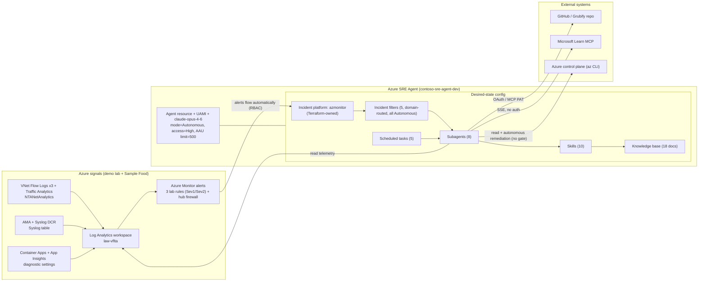
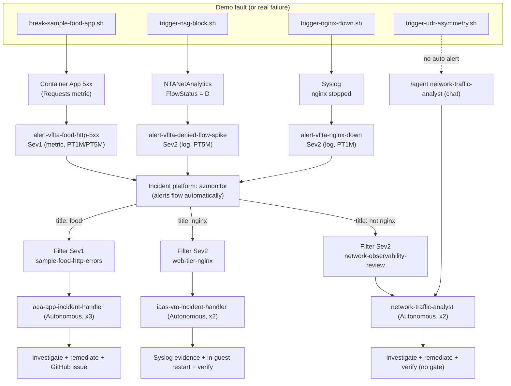
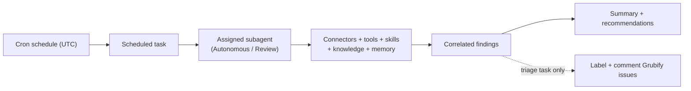

# Azure SRE Agent — Architecture and Configuration (Desired State)

Date: 2026-06-12
Last validated: 2026-06-14
Posture: this lab runs the agent in **maximum-autonomy** mode (2026-06-14 decision): global
`mode = Autonomous`, `accessLevel = High`, the `block-unsafe-remediation` governance hook
removed, and all incident-handling subagents/filters Autonomous. The agent investigates **and
remediates** without a human approval gate. See Section 12 for how to re-harden.
Routing: incidents are routed by **failure domain** (2026-06-14 architectural rule) — each
response plan owns one domain (ACA app, IaaS web tier, hub networking/firewall, configuration),
keyed by incident title across severities, so the right specialist handles each incident. See
Section 9.4.
Scope: this document describes the **desired state** of the Azure SRE Agent used by this
project — its architecture, every configuration object, the reactive path (Azure Monitor
alerts to agent actions), and the proactive path (scheduled tasks). For each configuration
object it explains **how it works**, **when it intervenes**, and **what it does and why**.
Audience: cloud/platform engineers, SRE leads, and technical decision makers.

This is a reference/architecture document. It does not repeat the resource inventory, the
ownership matrix, the deployment command model, or the scenario talk tracks that already
exist elsewhere; instead it links to them:

- Full resource inventory: [azure-sre-agent-complete-resource-reference.md](../01-documentation-azure-sre-agent/azure-sre-agent-complete-resource-reference.md)
- Ownership (Terraform vs YAML+API): [resource-support-matrix.md](../01-documentation-azure-sre-agent/resource-support-matrix.md)
- Deployment commands: [sre-agent-config-script-guide.md](../01-documentation-azure-sre-agent/sre-agent-config-script-guide.md)
- IaC boundary decision: [adr/0001-sre-agent-iac-boundaries.md](../01-documentation-azure-sre-agent/adr/0001-sre-agent-iac-boundaries.md)
- Live, scenario-by-scenario demo: [azure-sre-agent-demo-runbook.md](azure-sre-agent-demo-runbook.md)

---

## 1. Overview and the Desired-State model

Azure SRE Agent (public preview) is an AI service that connects observability tools,
incident platforms, and source repositories, then automates operational work end to end —
investigating incidents and, where authorized, remediating them. It exposes three building
blocks that this project configures: **built-in Azure knowledge**, **custom runbooks /
subagents**, and **external integrations** (monitoring, incident management, source
control). Source: [Overview of Azure SRE Agent](https://learn.microsoft.com/en-us/azure/sre-agent/overview).

In this project the agent's behavior is treated as **desired state under Git**, split across
two layers (see [ADR 0001](../01-documentation-azure-sre-agent/adr/0001-sre-agent-iac-boundaries.md)):

| Layer | What it owns | Where | Mechanism |
| --- | --- | --- | --- |
| ARM (control plane) | The agent resource, its identity, model, incident platform, telemetry connectors, RBAC | [04-terraform/](../04-terraform) | Terraform (`azapi` + `azurerm`) |
| Data plane (behavior) | Connectors, subagents, skills, knowledge, incident filters, scheduled tasks, repos | [06-sre-agent-configuration/](../06-sre-agent-configuration) | YAML+Markdown applied by [sre-agent-config.sh](Student/Resources/scenarios/scripts/sre-agent-config.sh) |

### 1.1 How this desired state was composed

The effective configuration is the integration of three sources (recorded in
[06-sre-agent-configuration/README.md](../06-sre-agent-configuration/README.md)):

1. **VNet Flow Logs + Traffic Analytics layer** (imported from the EMU project guide,
   branch `feature/app-sample-food-container-app`): the 10 networking/observability skills,
   the networking subagents, the Microsoft Learn MCP connector, the incident filters, the
   scheduled tasks, and the `vnet-flow-logs` knowledge base.
2. **Sample Food / Grubify operational layer** (imported from `dm-chelupati/sre-agent-lab`,
   retargeted to `lpassaretta_microsoft/grubify`): the `aca-app-incident-handler` (imported as
   `incident-handler`), `code-analyzer`,
   and `issue-triager` subagents; the GitHub OAuth connector; the `grubify` repo; the Azure
   Monitor incident platform; the Sample Food HTTP 5xx incident filter; the Grubify triage
   scheduled task; the `sample-food` knowledge base.
3. **Integrations added for this project**: the GitHub remote-MCP connector
   (`github-mcp.yaml`, PAT-based alternative to interactive OAuth); the migration of the Azure
   Monitor incident platform into the Terraform agent body (2026-06-14); the
   **maximum-autonomy** reconfiguration (2026-06-14): global `Autonomous` + `High` access, all
   incident-handling subagents/filters Autonomous, and the `block-unsafe-remediation`
   governance hook removed (no human approval gate); and the **domain-routing re-architecting**
   (2026-06-14): the new `iaas-vm-incident-handler` subagent for the IaaS web tier, and the
   five **domain-routed** response plans (each plan owns a failure domain keyed by incident
   title across severities — Section 9.4), replacing the earlier severity-only bands.

### 1.2 The agent resource (ARM)

The agent itself is provisioned in [04-terraform/main.tf](../04-terraform/main.tf) as
`Microsoft.App/agents@2026-01-01`:

| Property | Value | Why |
| --- | --- | --- |
| Name / RG / region | `contoso-sre-agent-dev` / `rg-sec-sreagent` / Sweden Central | Existing agent root, unchanged by the demo lab |
| Identity | User-assigned `uai-contoso-sre-agent-dev` | Single principal for all RBAC and data access |
| Model | `claude-opus-4-6` (`Anthropic`) | Reasoning model that runs investigations |
| `actionConfiguration.mode` | `Autonomous` | Maximum autonomy (2026-06-14): the agent acts without a human approval gate |
| `actionConfiguration.accessLevel` | `High` | Full operational access for autonomous remediation |
| `incidentManagementConfiguration` | `AzMonitor` / `azmonitor` | Incident platform, now in the Terraform agent body (2026-06-14) so a full-body PUT no longer wipes it |
| `monthlyAgentUnitLimit` | `500` | Cost guardrail on Agent Units (AAU) consumption |
| `knowledgeGraphConfiguration.managedResources` | subscription + hub/web-api/data RGs + Sample Food RG + demo LAW | The scopes the agent is allowed to observe/act on |

When an agent is created, Azure also provisions an Application Insights instance, a Log
Analytics workspace, and a Managed Identity; here those are made explicit and Terraform-owned
(`appi/law/uai-contoso-sre-agent-dev`). Source:
[Overview — Considerations](https://learn.microsoft.com/en-us/azure/sre-agent/overview).

### 1.3 Architecture diagram



---

## 2. Configuration object model

The desired state is composed of the object types below. The "When it intervenes" column is
the trigger that activates each type.

| Object type | Count (this project) | Role | When it intervenes | API plane |
| --- | --- | --- | --- | --- |
| Connectors | 3 data-plane (+2 ARM telemetry) | Outbound tools/data sources | On demand, when a subagent calls the tool | Data plane / ARM |
| Subagents | 7 | Specialized responders | Routed by incident filter, scheduled task, or chat | Data plane |
| Skills | 8 | Reusable investigation playbooks | Loaded by the subagents that allow them (max 5 active at once) | Data plane |
| Tools | built-in (0 custom) | Concrete capabilities (CLI, KQL, memory) | Invoked by subagents during a run | Data plane |
| Hooks | 0 (removed) | Governance gate (`PreToolUse`) | Not deployed in this lab (max autonomy); see Section 7 | Data plane |
| Knowledge base | 18 docs | Runbooks/context in agent memory | Searched via `SearchMemory` during a run | Data plane |
| Incident platform | 1 | Inbound incident source | Continuously; receives fired alerts | Terraform (azapi agent body) |
| Incident filters | 3 | Domain × severity → subagent routing | When an incident arrives | Data plane |
| Scheduled tasks | 5 | Proactive recurring work | On cron schedule | Data plane |
| Repos | 1 | Source for code correlation/triage | When a GitHub-capable subagent runs | Data plane |

Inbound vs outbound is the key mental model: the **incident platform** is inbound (incidents
flow to the agent); **connectors** are outbound (the agent reaches out to systems to
investigate). Source: [Incident platforms — Incident platforms vs. connectors](https://learn.microsoft.com/en-us/azure/sre-agent/incident-platforms).

For the authoritative per-object deployment route (PUT/PATCH/POST) see the directory map in
[06-sre-agent-configuration/README.md](../06-sre-agent-configuration/README.md) and the
[resource-support-matrix.md](../01-documentation-azure-sre-agent/resource-support-matrix.md).

---

## 3. Connectors

Connectors are **outbound**: they give subagents the tools and data to investigate. Source:
[Connectors](https://learn.microsoft.com/en-us/azure/sre-agent/connectors). This project has
two categories.

### 3.1 ARM telemetry connectors (Terraform-owned)

Defined in [04-terraform/main.tf](../04-terraform/main.tf) as
`Microsoft.App/agents/connectors@2026-01-01`. They wire the agent to its **own** telemetry and
are part of the control plane, not the data-plane desired state.

- **`log-analytics`** (`dataConnectorType: LogAnalytics`) → the agent Log Analytics
  workspace. How it works: binds the workspace via the user-assigned identity. When: whenever
  the agent queries logs. Why: gives the agent a default Log Analytics source.
- **`application-insights`** (`dataConnectorType: AppInsights`) → the agent Application
  Insights. Why: application telemetry for the agent's own runtime.

### 3.2 Data-plane investigation connectors (YAML-owned)

Defined under [06-sre-agent-configuration/connectors/](../06-sre-agent-configuration/connectors).
All three use `kind: AgentConnector` — the data-plane object `type` is derived from `kind`,
and the API rejects `type: Connector` with HTTP 400 `InvalidObjectType` (verified live).

**`github`** — GitHub OAuth connector

- How it works: `dataConnectorType: GitHubOAuth`, `dataSource: github-oauth`. Authenticated
  by an interactive OAuth session established once in the SRE Agent portal.
- When it intervenes: when a subagent (or the Grubify triage task) reads source code or
  manages issues/PRs on GitHub.
- Why: it is the connector that the `grubify` repo binds to (`authConnectorName: github`); the
  deep-clone code-correlation path uses it.
- Caveat: a one-time portal authorization is required before GitHub tools become usable.

**`github-mcp`** — GitHub remote MCP server connector

- How it works: `dataConnectorType: Mcp` over HTTP to the official GitHub remote MCP server,
  `endpoint: https://api.githubcopilot.com/mcp/`, `authType: BearerToken`, with the token
  injected at runtime from `${GITHUB_PAT}` (never committed; substituted via `envsubst`).
  `identity: system`.
- When it intervenes: same GitHub operations, but without an interactive OAuth step; surfaces
  the default GitHub MCP toolset (context, repos, issues, pull_requests, users) to the
  autonomous subagents (`code-analyzer` for S2, `issue-triager` for S3).
- Why: an automation-friendly alternative to OAuth; a fine-grained PAT gives predictable
  expiry and least privilege. Sources:
  [MCP connector tutorial](https://learn.microsoft.com/en-us/azure/sre-agent/mcp-connector),
  [github/github-mcp-server](https://github.com/github/github-mcp-server),
  [Use the GitHub MCP server](https://docs.github.com/en/copilot/how-tos/provide-context/use-mcp/use-the-github-mcp-server).

**`microsoft-learn-mcp`** — Microsoft Learn documentation MCP

- How it works: `dataConnectorType: Mcp`, transport `sse`,
  `endpoint: https://learn.microsoft.com/api/mcp`, `authType: None`, `identity: system`. The
  SSE transport and no-auth settings are the values documented in the official tutorial.
- When it intervenes: when any subagent needs authoritative Azure documentation lookups during
  an investigation (surfaced as the `microsoft-learn` skill tool).
- Why: grounds recommendations in current Microsoft Learn content. Source:
  [MCP connector — Microsoft Learn example](https://learn.microsoft.com/en-us/azure/sre-agent/mcp-connector#example-connect-to-the-microsoft-learn-mcp-server).

> Tool budget: an agent can use up to 80 tools total across all connectors. Source:
> [MCP connector](https://learn.microsoft.com/en-us/azure/sre-agent/mcp-connector).

---

## 4. Subagents

Subagents are specialized custom agents. Each declares an **autonomy mode**, an allow-list of
skills, and a concrete tool list. Source:
[Custom agents (sub-agents)](https://learn.microsoft.com/en-us/azure/sre-agent/sub-agents).
Two modes exist:

- **Review** — read-only diagnostics; the agent proposes, a human executes.
- **Autonomous** — the agent drives diagnostics **and remediation** end to end with no approval
  gate (this lab runs maximum autonomy; the `block-unsafe-remediation` hook is removed —
  Section 7).

In this lab every incident-handling subagent runs **Autonomous**. Read-only subagents (the
config auditor, the cost advisor) are also Autonomous but hold only read tools, so they
investigate and recommend without changing resources. Under the **domain-routing rule**
(Section 9.4) each incident-handling subagent owns one failure domain: `aca-app-incident-handler` (ACA
app), `iaas-vm-incident-handler` (IaaS web tier), `network-traffic-analyst` (hub
networking/firewall).

Defined under [06-sre-agent-configuration/subagents/](../06-sre-agent-configuration/subagents).

### 4.1 Networking and configuration specialists (VNet Flow Logs layer)

**`network-traffic-analyst`** (Autonomous)

- How it works: holds read tools plus `RunAzCliWriteCommands`; allow-lists the five
  networking skills (`vnet-flow-logs-and-ingestion`, `traffic-analytics-kql-analysis`,
  `connectivity-diagnostics`, `nsg-deny-flow-investigation`,
  `udr-asymmetry-investigation`) - exactly the official five-active-skills cap. Tools:
  `RunAzCliReadCommands`, `RunAzCliWriteCommands`, `GetAzCliHelp`,
  `QueryLogAnalyticsByWorkspaceId`.
- When it intervenes: the **Sev2 networking** band (NSG denied-flow spike, UDR asymmetry, top
  talkers) via `network-observability-review`, or interactive chat. NGINX / web-tier
  service-health is **out of scope** (owned by `iaas-vm-incident-handler`).
- Why: end-to-end network diagnostics **and autonomous remediation** (maximum autonomy). The
  system prompt directs it to investigate, then execute the fix itself (remove the NSG rule,
  correct the route, tighten/add a firewall rule) and verify the signal clears — no approval
  gate (the `block-unsafe-remediation` hook is removed).

**`iaas-vm-incident-handler`** (Autonomous) — new (2026-06-14, domain-routing rule)

- How it works: tools-driven (no skills); tools `RunAzCliReadCommands`, `RunAzCliWriteCommands`,
  `GetAzCliHelp`, `QueryLogAnalyticsByWorkspaceId`. Grounded in the `Syslog` table and Terraform
  outputs.
- When it intervenes: the **Sev2 web-tier service-health** band (NGINX down, in-guest faults on
  the web/api/db VMs) via the `web-tier-nginx` filter.
- Why: gives the IaaS spokes a dedicated owner so the right evidence (Syslog) and remediation
  (in-guest `az vm run-command` restart) are applied autonomously — previously this incident was
  mis-routed to the networking specialist because it shared the Sev2 band.

**`azure-resource-config-auditor`** (Autonomous)

- How it works: tools `RunAzCliReadCommands`, `GetAzCliHelp`; skills
  `rbac-and-resource-access-check`, `vnet-flow-logs-and-ingestion`, `connectivity-diagnostics`.
- When it intervenes: the on-demand `post-demo-drift-check` task and interactive `/agent`.
- Why: verify live Azure config against the Terraform source of truth and recommend the exact
  file to review. Autonomous but **read-only** (no write tools), so it never modifies resources.

**`cost-optimization-agent`** (Review)

- How it works: tools `RunAzCliReadCommands`, `QueryLogAnalyticsByWorkspaceId`,
  `QueryAppInsightsByResourceId`, `ExecutePythonCode`, `GetAzCliHelp`, plus the
  `microsoft-learn-mcp` MCP tools; skill `cost-optimization`; knowledge `cost/` (methodology,
  workload profiles, cost levers).
- When it intervenes: the weekly `cost-optimization-review` task, and on-demand via `/agent`.
- Why: subscription-wide FinOps — correlates inventory and configuration (Azure Resource Graph),
  actual spend (Cost Management Query), utilization (Monitor / Log Analytics / App Insights), and
  Azure Advisor against each workload's criticality, SLA, resiliency, performance, and budget;
  read-only recommendations with trade-offs. Supersedes the lab-scoped
  `cost-and-retention-advisor` (full spec:
  [cost-optimization-agent.md](../01-documentation-azure-sre-agent/cost-optimization-agent.md)).

### 4.2 Grubify / Sample Food operational specialists

**`aca-app-incident-handler`** (Autonomous)

*(Imported from the upstream lab as `incident-handler`; renamed 2026-06-14 to a domain-speaking name parallel to `iaas-vm-incident-handler`.)*

- How it works: `enable_skills: true` with allow-listed skill
  `sample-food-container-app-incident-analysis` (so the Sev1 path loads the exact Container
  Apps KQL); tools `SearchMemory`, `RunAzCliReadCommands`,
  `RunAzCliWriteCommands`, `GetAzCliHelp`, `QueryLogAnalyticsByWorkspaceId`,
  `QueryAppInsightsByResourceId`, `ExecutePythonCode`.
- When it intervenes: the **Sev1** band (Sample Food HTTP 5xx), via `sample-food-http-errors`,
  with up to 3 automated investigation attempts.
- Why: runbook-driven investigation. It searches memory for the relevant runbook, executes the
  diagnostic steps, plots evidence with `ExecutePythonCode`, and opens a GitHub issue in
  `grubify` following the incident-report template exactly (Summary, Impact, Timeline,
  Evidence, Root Cause, Remediation, Action Items, References).

**`code-analyzer`** (Autonomous)

- How it works: `enable_skills: false`; same tool set as `aca-app-incident-handler`.
- When it intervenes: deep root-cause work that correlates runbook diagnostics with Grubify
  source code (file:line references) and files a detailed GitHub issue.
- Why: connects symptoms to code; requires the GitHub connector (OAuth or MCP PAT).

**`issue-triager`** (Autonomous)

- How it works: tools `SearchMemory` only (GitHub actions come from the agent-wide connector,
  not a per-subagent tool).
- When it intervenes: the 12-hourly Grubify triage task.
- Why: for each untriaged `[Customer Issue]`, classify it (Bug/Performance/Feature
  Request/Question), pick a sub-category, add labels, and post a triage comment per the triage
  runbook; skips already-triaged issues.

| Subagent | Mode | Skills | Key tools | Primary trigger |
| --- | --- | --- | --- | --- |
| `network-traffic-analyst` | Autonomous | 5 networking | read + `RunAzCliWriteCommands` + LA | Sev2 networking / chat |
| `iaas-vm-incident-handler` | Autonomous | (tools-driven) | read+write CLI, LA | Sev2 web-tier (nginx) |
| `azure-resource-config-auditor` | Autonomous | 3 | read CLI | on-demand drift task / chat |
| `cost-optimization-agent` | Review | 1 (`cost-optimization`) | read CLI + LA + AppI + Python + Learn MCP | Weekly `cost-optimization-review` / chat |
| `aca-app-incident-handler` | Autonomous | 1 (Container Apps) | read+write CLI, LA, AppI, Python | Sev1 |
| `code-analyzer` | Autonomous | (memory) | read+write CLI, LA, AppI, Python | Code RCA |
| `issue-triager` | Autonomous | (memory) | `SearchMemory` (+ GitHub connector) | 12-hourly task |

---

## 5. Skills

A skill is a reusable, named investigation playbook. Each YAML carries a `description`, a
`content_file` (the Markdown instructions), a `tools` list (canonical data-plane tool IDs such
as `RunAzCliReadCommands`, `QueryLogAnalyticsByWorkspaceId`, `GetAzCliHelp`), and a
`safety` block: `default_mode: read_only` and `requires_approval_for_actions: true`. Skills are
loaded only by the subagents that allow-list them (Section 4), and at most **five** are active
at once (official cap:
[Skills - Limits and constraints](https://learn.microsoft.com/en-us/azure/sre-agent/skills)).
Defined under
[06-sre-agent-configuration/skills/](../06-sre-agent-configuration/skills).

**`vnet-flow-logs-and-ingestion`** *(2026-07-02 merge of `vnet-flow-logs-troubleshooting` + `storage-flow-log-ingestion-check`)*

- How it works: read CLI + Log Analytics.
- When it intervenes: a VNet Flow Logs enablement problem, or a raw-blob to Storage to Log
  Analytics / Traffic Analytics ingestion problem (missing, delayed, mis-scoped, or
  storage-blocked flow data).
- Why: one skill for the whole flow-log pipeline - confirms enablement, validates the Storage
  side (region/SKU/blobs), and checks Traffic Analytics freshness.

**`traffic-analytics-kql-analysis`**

- How it works: Log Analytics + Azure Monitor query + read CLI + Microsoft Learn.
- When it intervenes: any time `NTANetAnalytics` must be queried/interpreted (top talkers,
  denied flows).
- Why: turns Traffic Analytics rows into network conclusions.

**`connectivity-diagnostics`** *(2026-07-02 merge of `network-watcher-diagnostics` + `private-endpoint-traffic-analysis`)*

- How it works: read CLI + Log Analytics.
- When it intervenes: VM/VNet connectivity issues needing the right read-only Network Watcher
  diagnostic (next-hop, IP flow verify, effective rules, connection troubleshoot), including
  the Private Endpoint source-side path and private DNS resolution.
- Why: selects the correct diagnostic instead of guessing; encodes the nuance that flow logs
  capture Private Endpoint traffic at the source VM, not at the PE. Source:
  [VNet flow logs - Private endpoint traffic](https://learn.microsoft.com/en-us/azure/network-watcher/vnet-flow-logs-overview).

**`nsg-deny-flow-investigation`**

- How it works: Log Analytics + read CLI + Resource Graph + Microsoft Learn.
- When it intervenes: denied flows in Traffic Analytics (the NSG-block scenario).
- Why: correlates denied records with the offending NSG rule and subnet association.

**`udr-asymmetry-investigation`**

- How it works: Log Analytics + read CLI + Resource Graph + Microsoft Learn.
- When it intervenes: UDR-induced asymmetric routing / blackhole (the UDR scenario).
- Why: localizes the asymmetric next hop using route and next-hop checks.

**`rbac-and-resource-access-check`**

- How it works: read CLI + Resource Graph + Microsoft Learn.
- When it intervenes: suspected access/permission gaps for the agent identity or users.
- Why: diagnoses managed-identity permissions and least-privilege RBAC gaps.

**`sample-food-container-app-incident-analysis`**

- How it works: Azure Monitor + Application Insights + Log Analytics + Resource Graph queries.
- When it intervenes: Sample Food incidents on Container Apps.
- Why: the Container-Apps-native diagnostic path (logs, App Insights, Azure Monitor) for the
  HTTP 5xx scenario.

**`cost-optimization`**

- How it works: Azure Resource Graph (inventory/config) + Cost Management Query (actual spend) +
  Azure Monitor / Log Analytics / App Insights (utilization) + Azure Advisor (Cost) + read CLI;
  aggregation and reporting via `ExecutePythonCode`.
- When it intervenes: the weekly `cost-optimization-review`, and any cost question routed to
  `cost-optimization-agent`.
- Why: subscription-wide cost optimization weighted by workload criticality, SLA, resiliency,
  performance, and budget; eliminate waste and optimize rate before reducing any capability. The
  former retention / Traffic-Analytics / AAU levers survive as one cost domain among many.

---

## 6. Tools

In Azure SRE Agent, **tools** are the concrete capabilities a subagent invokes during a run.
Source: [Tools](https://learn.microsoft.com/en-us/azure/sre-agent/tools). This project does
**not** define custom `Tool` objects (the current preview API rejects the documented Tool
object type in this tenant; see
[resource-support-matrix.md](../01-documentation-azure-sre-agent/resource-support-matrix.md)).
Instead it relies on the built-in canonical tools, referenced by name in the subagent specs:

| Tool | What it does | When it intervenes |
| --- | --- | --- |
| `RunAzCliReadCommands` | Read-only Azure CLI (get/list/show) | Evidence collection on any Azure resource |
| `RunAzCliWriteCommands` | State-changing Azure CLI | Autonomous remediation by the incident subagents (no approval gate in this lab) |
| `GetAzCliHelp` | Azure CLI help/discovery | When the agent needs correct command syntax |
| `QueryLogAnalyticsByWorkspaceId` | KQL against a workspace | Reading `NTANetAnalytics`, `Syslog`, Container Apps logs |
| `QueryAppInsightsByResourceId` | App Insights queries | Requests/failures/dependencies for Sample Food |
| `ExecutePythonCode` | Run Python (e.g., chart metrics) | Building evidence visuals in incident issues |
| `SearchMemory` | Search the knowledge base / past incidents | Loading the right runbook before acting |

The skill-level logical tool names (`azure-cli-read`, `log-analytics-query`,
`azure-monitor-query`, `application-insights-query`, `azure-resource-graph-query`,
`microsoft-learn`) resolve to these built-ins and to the Microsoft Learn MCP connector.

---

## 7. Hooks

A hook is a `PreToolUse` governance interceptor that can allow or deny a tool call before it
runs. Source: [Run modes — hooks](https://learn.microsoft.com/en-us/azure/sre-agent/run-modes#review-mode).

**This lab deploys no hook (maximum-autonomy decision, 2026-06-14).** The
`block-unsafe-remediation` hook that previously gated destructive actions was **deleted from the
live agent** and its manifest removed from the repository (recoverable from Git history). With no
hook, the Autonomous subagents that hold
`RunAzCliWriteCommands` (`aca-app-incident-handler`, `code-analyzer`, `network-traffic-analyst`,
`iaas-vm-incident-handler`) execute remediation — in-guest restart, NSG rule delete, route
change, firewall rule change — **without a human approval gate**.

**How to re-harden** (restore the human-in-the-loop gate): rename the manifest back to
`block-unsafe-remediation.yaml` and run `sre-agent-config.sh apply --target hooks`. (Note: the
data-plane API ignores `spec.enabled` for hooks — it uses `activationMode`, default `always` —
so a hook is disabled by *not deploying* it, not by a flag.) A precise alternative is a global
[tool access policy](https://learn.microsoft.com/en-us/azure/sre-agent/tool-access-policies)
that denies `RunAzCliWriteCommands(az * delete *)` and similar patterns.

---

## 8. Knowledge base

Knowledge files are uploaded into agent memory and retrieved at runtime via `SearchMemory`;
this is how the agent "remembers" runbooks, templates, and architecture context across
sessions. Source: [Memory and knowledge](https://learn.microsoft.com/en-us/azure/sre-agent/memory).
Stored under [06-sre-agent-configuration/knowledge/files/](../06-sre-agent-configuration/knowledge/files)
and uploaded via `/api/v1/agentmemory/upload`. Fifteen documents in two groups.

### 8.1 Sample Food / Grubify group (4)

- **`github-issue-triage.md`** — How: classification + labeling runbook. When: the
  `issue-triager` task runs. Why: deterministic, repeatable triage of `[Customer Issue]`s.
- **`http-500-errors.md`** — How: diagnostic steps for HTTP 5xx. When: the Sev1 incident
  fires and `aca-app-incident-handler` searches memory. Why: the runbook behind the reactive 5xx path.
- **`incident-report-template.md`** — How: the exact issue structure (Summary, Impact,
  Timeline, Evidence, Root Cause, Remediation, Action Items, References). When: whenever a
  subagent files a GitHub issue. Why: consistent, complete incident records.
- **`sample-food-architecture.md`** — How: Grubify-on-Container-Apps topology. When: grounding
  any Sample Food investigation. Why: gives the agent the app's shape.

### 8.2 VNet Flow Logs group (11)

- **`architecture.md`** — How: hub/spoke + flow-logs topology and design. When: grounding
  network investigations. Why: the lab's reference architecture.
- **`demo-runbook.md`** — How: step-by-step demo execution. When: rehearsing/scripting the
  demo. Why: in-memory copy of the runbook for the agent.
- **`deployment-guide.md`** — How: infra deployment steps. When: deployment/repro questions.
  Why: deployment context.
- **`kql-catalog.md`** — How: ready KQL for Traffic Analytics. When: composing queries. Why:
  reuse vetted queries (mirrors [kql-catalog.md](kql-catalog.md)).
- **`official-sources.md`** — How: curated Microsoft Learn links. When: the agent needs an
  authoritative reference. Why: keeps recommendations grounded.
- **`operations-and-cost.md`** — How: retention/interval/cost guidance. When: the cost task
  runs. Why: backs the cost-and-retention advisor.
- **`terraform-design.md`** — How: IaC structure and resource organization. When: drift/config
  questions. Why: the source-of-truth model the auditor compares against.
- **`troubleshooting-scenarios.md`** — How: common incident scenarios and diagnostic paths.
  When: matching a symptom to a path. Why: accelerates triage.
- **`vm-application-calls-and-services.md`** — How: NGINX/application service map. When: the
  nginx-down scenario. Why: tells the agent which service/VM matters.
- **`vnet-flow-logs-traffic-analytics-terraform-guide.md`** — How: end-to-end Terraform guide.
  When: deep IaC questions. Why: full build reference.
- **`vnet-flow-logs-with-vs-without-traffic-analytics.md`** — How: comparison + decision
  criteria. When: explaining design trade-offs. Why: justifies enabling Traffic Analytics.

---

## 9. Reactive path: Azure Monitor alerts → SRE Agent actions

### 9.1 How the wiring works (no webhooks)

The agent connects to **Azure Monitor as an incident platform**. Once connected, alerts from
the agent's managed resource groups **flow to the agent automatically — no credentials and no
action-group webhook are required**; Azure Monitor even merges recurring alerts into one
thread. Source:
[Incident platforms — Supported platforms](https://learn.microsoft.com/en-us/azure/sre-agent/incident-platforms),
[Azure Monitor Alerts in SRE Agent](https://learn.microsoft.com/en-us/azure/sre-agent/azure-monitor-alerts).

This is why the Terraform alert rules need no webhook: the agent picks them up through the
`azmonitor` connection, authorized by the identity's RBAC over the managed scopes
(Section 11). The action group `ag-vflta-food` exists only because the imported Sample Food
metric alert references one; it has **no receivers**, and the other two alerts have **no action
group at all**.



### 9.2 Incident platform

**`azmonitor`** — owned by Terraform (2026-06-14) in the agent body
[04-terraform/main.tf](../04-terraform/main.tf) as
`body.properties.incidentManagementConfiguration`.

- How it works: `{ type = "AzMonitor", connectionName = "azmonitor" }` on the
  `Microsoft.App/agents` resource. Previously applied by `sre-agent-config.sh` via ARM PATCH
  from a YAML manifest; moved into Terraform so a full-body agent PUT no longer wipes it. The
  former data-plane manifest has been removed (recoverable from Git history); Terraform is the
  single owner.
- When it intervenes: continuously — it is the inbound channel that converts fired alerts into
  incidents.
- Why: only **one** incident platform can be active at a time; Azure Monitor is the right choice
  for an Azure-native lab and needs no credentials. Credential-bearing platforms
  (PagerDuty/ServiceNow, `connectionKey`) stay in the API layer to keep secrets out of
  Terraform state. Source:
  [Incident platforms](https://learn.microsoft.com/en-us/azure/sre-agent/incident-platforms).

### 9.3 Alert rules (real Azure names)

All three are defined in Terraform and are **enabled**. (Terraform addresses are given for
traceability; the **alert name** is what appears in Azure.)

**`alert-vflta-food-http-5xx`** — Sev1, metric alert
([sample-food-observability.tf](../04-terraform/sample-food-observability.tf))

- Criteria: namespace `microsoft.app/containerapps`, metric `Requests`, aggregation `Total`,
  `GreaterThan 5`, dimension `statusCodeCategory = ["5xx"]`; `frequency PT1M`,
  `window_size PT5M`.
- Scope: the Sample Food API Container App. Action group: `ag-vflta-food` (`SREFoodAG`, no
  receivers).
- Trigger: [break-sample-food-app.sh](Student/Resources/scenarios/scripts/break-sample-food-app.sh).
- Why a **metric** alert: metric data is precomputed, so PT1M/PT5M gives near-real-time
  detection — the right tool when little manipulation is needed. The severity was deliberately
  set to 1 (the upstream lab used 3) so it lands in the Sev1 band. Source:
  [Choose the right alert type](https://learn.microsoft.com/en-us/azure/azure-monitor/alerts/alerts-types).
- Routes to: `sample-food-http-errors` → `aca-app-incident-handler`.

**`alert-vflta-denied-flow-spike`** — Sev2, log search alert
([monitoring.tf](../04-terraform/monitoring.tf))

- KQL:

  ```kql
  NTANetAnalytics
  | where SubType == "FlowLog" and TimeGenerated > ago(10m)
  | where FlowStatus contains "Denied" or DeniedInFlows > 0 or DeniedOutFlows > 0
  ```

- Criteria: `time_aggregation_method Count`, `threshold 0`, `GreaterThan`; `PT5M/PT10M`;
  `skip_query_validation = true`. Scope: demo Log Analytics workspace. No action group.
- Trigger: [trigger-nsg-block.sh](Student/Resources/scenarios/scripts/trigger-nsg-block.sh).
- Why: in `NTANetAnalytics` the denied flows carry the full word `FlowStatus == "Denied"`
  (live-certified; the schema doc's `A`/`D` letters describe the raw flow-log tuple, not the
  decorated table), so the rule matches `FlowStatus contains "Denied"` OR the numeric
  `DeniedInFlows`/`DeniedOutFlows` counters; a log-search alert is used because the signal
  lives in `NTANetAnalytics` and needs KQL. The `PT1M` evaluation lowers detection latency,
  though the floor is the Traffic
  Analytics processing interval (10 min). Sources:
  [VNet flow logs — flow states](https://learn.microsoft.com/en-us/azure/network-watcher/vnet-flow-logs-overview),
  [Traffic analytics](https://learn.microsoft.com/en-us/azure/network-watcher/traffic-analytics).
- Routes to: `network-observability-review` → `network-traffic-analyst`.

**`alert-vflta-nginx-down`** — Sev2, log search alert
([nginx-observability.tf](../04-terraform/nginx-observability.tf))

- KQL:

  ```kql
  Syslog
  | where TimeGenerated > ago(10m)
  | where ProcessName == "systemd"
  | where SyslogMessage has "nginx"
  | where SyslogMessage has_any ("Stopped", "Deactivated", "Failed", "failed")
  ```

- Criteria: `Count`, `threshold 0`, `GreaterThan`; `PT1M/PT10M`. Scope: demo Log Analytics
  workspace. No action group.
- Trigger: [trigger-nginx-down.sh](Student/Resources/scenarios/scripts/trigger-nginx-down.sh).
- Why: a guest-OS service failure is observed via Syslog collected by Azure Monitor Agent; the
  `PT1M` evaluation (2026-06-14) shortens detection to ~1-2 min (Syslog has no Traffic
  Analytics floor). Source:
  [Create a log search alert rule](https://learn.microsoft.com/en-us/azure/azure-monitor/alerts/alerts-create-log-alert-rule).
- Routes to: `web-tier-nginx` → `iaas-vm-incident-handler` (autonomous in-guest restart,
  executed without an approval gate). The Sev2 networking filter excludes this via
  `titleNotContains: nginx`.

**UDR asymmetry** — no auto-firing alert; driven interactively
(`/agent network-traffic-analyst`) after
[trigger-udr-asymmetry.sh](Student/Resources/scenarios/scripts/trigger-udr-asymmetry.sh).

### 9.4 Incident filters (domain routing)

In Azure SRE Agent these are **response plans** that route incidents by severity, title
pattern, or other criteria to a custom agent at a chosen autonomy level. Source:
[Incident response plans](https://learn.microsoft.com/en-us/azure/sre-agent/incident-response-plans).
This project applies a **domain-routing rule** (2026-06-14): each response plan owns one
**failure domain**, keyed by **incident title** (`titleContains` / `titleNotContains`) on top of
severity, so the right specialist handles each incident with the right skills, tools, and blast
radius. Title matching is **case-insensitive** (the data-plane rejects case-insensitive
duplicate tokens, so single keywords are used). The three plans are **disjoint by construction**
at every severity. (Delete the portal quickstart default plan `quickstart_handler` if present —
it covers Sev0–Sev2 Autonomous and would double-route.) Defined under
[06-sre-agent-configuration/automations/incident-filters/](../06-sre-agent-configuration/automations/incident-filters).

| Filter | Sev | Title match | Domain | Handling agent | Mode | Max | Enabled |
| --- | --- | --- | --- | --- | --- | --- | --- |
| `sample-food-http-errors` | Sev1 | `contains food` | ACA app | `aca-app-incident-handler` | Autonomous | 3 | yes |
| `web-tier-nginx` | Sev2 | `contains nginx` | IaaS web tier | `iaas-vm-incident-handler` | Autonomous | 2 | yes |
| `network-observability-review` | Sev2 | `not contains nginx` | hub networking | `network-traffic-analyst` | Autonomous | 2 | yes |

- **`sample-food-http-errors`** (Sev1, `titleContains: food`) — When: a Sev1 incident whose
  title contains `food` (e.g. `alert-vflta-food-http-5xx`). Why: routes the Sample Food /
  Grubify Azure Container Apps app domain to runbook-driven autonomous investigation and
  remediation (3 attempts before escalating).
- **`web-tier-nginx`** (Sev2, `titleContains: nginx`) — When: a Sev2 web-tier service-health
  alert (`NGINX service down on web tier`). Why: routes the IaaS web tier to
  `iaas-vm-incident-handler` for Syslog-based diagnosis and autonomous in-guest restart —
  carved out of the Sev2 networking band so it reaches the right specialist.
- **`network-observability-review`** (Sev2, `titleNotContains: nginx`) — When: any other Sev2
  incident (NSG denied spike, top talkers, UDR asymmetry). Why: autonomous network diagnostics
  **and remediation** (NSG rule removal / route fix), up to 2 attempts. `titleNotContains: nginx`
  keeps it disjoint from `web-tier-nginx`.

> **Pruned 2026-07-02.** Two originally-provisioned plans were removed as **dormant** because
> this lab fires no matching alert: `hub-firewall-network` (Sev1 `afw` - the
> `afw-vflta-hub-NetworkRuleHit` alert lives in a hub RG outside this lab's Terraform) and
> `config-audit-review` (Sev3 - no Sev3 alert is wired). Official guidance is to keep only
> response plans wired to real incidents; `azure-resource-config-auditor` stays reachable via
> the on-demand `post-demo-drift-check` task and `/agent`. Source:
> [Incident response plans](https://learn.microsoft.com/en-us/azure/sre-agent/incident-response-plans).

---

## 10. Observability plumbing (signal sources)

The reactive path depends on the telemetry pipeline below (all Terraform-owned). It is
summarized here because it produces the alert data; see the `.tf` files for full detail.

| Component | Resource | Feeds | Why |
| --- | --- | --- | --- |
| Log Analytics workspace | `law-vflta-<suffix>` (PerGB2018, 30-day) | All demo signals | Central store the alerts query |
| Flow-log storage | `vflta<suffix>flow` (7-day retention) | Raw VNet flow logs | Required sink for flow logs |
| VNet flow logs x3 | hub / spoke-app / spoke-data (`version 2`) | Traffic Analytics | Layer-4 flow capture, 10-min TA interval |
| Traffic Analytics | enabled on the flow logs | `NTANetAnalytics` | Aggregated, enriched flows (denied-spike alert) |
| Syslog DCR | `dcr-vflta-web-syslog` (Syslog `*`/`*`) | `Syslog` table | Carries the nginx-down signal |
| Azure Monitor Agent | `web_ama` x2 (`AzureMonitorLinuxAgent`) | the DCR | Collects guest-OS Syslog from web VMs |
| App Insights + CAE diag | `sample_food` App Insights; ConsoleLogs/SystemLogs/HTTPLogs + AllMetrics | demo LAW | Sample Food telemetry and the 5xx metric |

Sources:
[Data collection rule overview](https://learn.microsoft.com/en-us/azure/azure-monitor/essentials/data-collection-rule-overview),
[Manage Azure Monitor Agent](https://learn.microsoft.com/en-us/azure/azure-monitor/agents/azure-monitor-agent-manage),
[Traffic analytics](https://learn.microsoft.com/en-us/azure/network-watcher/traffic-analytics).

---

## 11. Proactive path: scheduled tasks

A scheduled task is **not a cron job running a script**. On the schedule you define, the agent
plans its approach and uses its connectors, tools, knowledge, and memory to reason across
sources — catching trends before they breach a threshold — and produces an actionable summary.
Source: [Schedule tasks with Azure SRE Agent](https://learn.microsoft.com/en-us/azure/sre-agent/scheduled-tasks).
Defined under [06-sre-agent-configuration/automations/scheduled-tasks/](../06-sre-agent-configuration/automations/scheduled-tasks).



| Task | Schedule (cron) | Human-readable | Agent | Mode | Enabled |
| --- | --- | --- | --- | --- | --- |
| `daily-network-observability-health` | `0 6 * * *` | Daily 06:00 UTC | `network-traffic-analyst` | Autonomous | yes |
| `flow-log-ingestion-freshness` | `0 */6 * * *` | Every 6 hours | `network-traffic-analyst` | Autonomous | yes |
| `cost-optimization-review` | `0 7 * * 1` | Mondays 07:00 UTC | `cost-optimization-agent` | Autonomous | yes |
| `triage-grubify-issues` | `0 */12 * * *` | Every 12 hours | `issue-triager` | Autonomous | yes |
| `post-demo-drift-check` | `0 8 * * 1` | (placeholder) | `azure-resource-config-auditor` | Review | no |

- **`daily-network-observability-health`** — How: read-only review of the last 24 h of
  `NTANetAnalytics`. When: daily 06:00 UTC. Why: a proactive baseline (denied flows, top
  talkers, missing VNet coverage, unusual ports, ingestion delays); changes nothing.
- **`flow-log-ingestion-freshness`** — How: checks that flow logs and Traffic Analytics produce
  recent data, comparing expected VNets (Terraform outputs) with Log Analytics. When: every 6 h
  (useful around demo windows). Why: catches a broken pipeline before a demo.
- **`cost-optimization-review`** — How: subscription-wide cost optimization — correlates Azure
  Resource Graph inventory, Cost Management actual spend, Monitor / Log Analytics utilization, and
  Azure Advisor with each workload's criticality and budget. When: Mondays 07:00 UTC. Why:
  identifies prioritized, read-only savings that preserve reliability and performance.
- **`triage-grubify-issues`** — How: lists untriaged `[Customer Issue]`s in
  `lpassaretta_microsoft/grubify` and triages each per the runbook. When: every 12 h. Why: the
  proactive complement to the reactive incident path. Requires GitHub access — provided by the
  `github-mcp` connector (PAT); the optional `github` OAuth connector is a redundant fallback.
- **`post-demo-drift-check`** — How: compares Azure config to the Terraform source after demo
  faults and recommends restores. When: **disabled** by default (run on demand; cron is a
  schema placeholder). Why: Review mode — restores must be approved.

---

## 12. Governance and safety

This lab is configured for **maximum autonomy** (2026-06-14 decision), trading the
human-in-the-loop gate for speed. It is a non-production demo lab and every fault scenario has
a restore script. The posture and how to re-harden:

1. **Global Autonomous** — the agent's `actionConfiguration.mode` is `Autonomous` and
   `accessLevel` is `High` ([main.tf](../04-terraform/main.tf)). The agent investigates and
   acts with no approval prompt. Microsoft recommends Autonomous for non-production / trusted
   tasks ([run modes](https://learn.microsoft.com/en-us/azure/sre-agent/run-modes#recommendations)).
2. **All incident handlers Autonomous** — the five domain-routed filters and their subagents run
   Autonomous; `aca-app-incident-handler`, `iaas-vm-incident-handler`, and `network-traffic-analyst` hold
   `RunAzCliWriteCommands` and remediate end to end. Read-only subagents (auditor, cost advisor)
   are Autonomous but cannot change resources (no write tools). **Domain routing** is itself a
   safety control: it sends each incident to the specialist scoped to that failure domain,
   reducing the chance of an autonomous wrong action across domains. The maximum-blast-radius
   autonomous action in this lab is hub Azure Firewall / NSG / route change by
   `network-traffic-analyst`; in production this plan should move to `Review` or the hook should
   be re-enabled (see ADR 0001).
3. **No hook** — the `block-unsafe-remediation` gate is removed (Section 7). Nothing pauses a
   destructive tool call. **To re-harden:** redeploy the hook, or add a global
   [tool access policy](https://learn.microsoft.com/en-us/azure/sre-agent/tool-access-policies)
   denying `RunAzCliWriteCommands(az * delete *)` (and similar), or set individual filters back
   to `Review`.
4. **Least-privilege RBAC still applies** — the user-assigned identity is granted (in
   [main.tf](../04-terraform/main.tf) / [locals.tf](../04-terraform/locals.tf)) only the scopes
   below; RBAC, not an approval gate, is now the outer boundary on blast radius:

   | Role | Scope | Purpose |
   | --- | --- | --- |
   | Reader, Log Analytics Reader, Monitoring Reader | subscription + hub/web-api/data RGs + Sample Food RG + demo LAW | Read evidence and ingest alerts |
   | Monitoring Contributor | subscription | Manage alert/monitoring objects |
   | Contributor | subscription | Autonomous remediation across the demo scopes |
   | SRE Agent Administrator | the agent | Operator (current user) management |

5. **Secret hygiene** — `${GITHUB_PAT}` is never committed; it is injected at apply time via
   `envsubst` (see [06-sre-agent-configuration/README.md — Secrets](../06-sre-agent-configuration/README.md)).

---

## 13. Deploy and verify (pointers)

This document does not duplicate the command model. To apply and verify this desired state:

```bash
Student/Resources/scenarios/scripts/sre-agent-config.sh validate
Student/Resources/scenarios/scripts/sre-agent-config.sh plan   --subscription <sub> --resource-group <rg> --agent <agent>
Student/Resources/scenarios/scripts/sre-agent-config.sh apply  --subscription <sub> --resource-group <rg> --agent <agent>
Student/Resources/scenarios/scripts/sre-agent-config.sh verify --subscription <sub> --resource-group <rg> --agent <agent>
```

Full target reference and selective deployment: [sre-agent-config-script-guide.md](../01-documentation-azure-sre-agent/sre-agent-config-script-guide.md).
Live validation evidence: [validation-evidence.md](validation-evidence.md).

---

## 14. Cross-references

| Topic | Document |
| --- | --- |
| Live scenario walkthrough (6 scenarios) | [azure-sre-agent-demo-runbook.md](azure-sre-agent-demo-runbook.md) |
| What the lab deploys + commands | [README.md](README.md) |
| KQL queries | [kql-catalog.md](kql-catalog.md) |
| Resource ownership (TF vs YAML+API) | [resource-support-matrix.md](../01-documentation-azure-sre-agent/resource-support-matrix.md) |
| Full resource inventory | [azure-sre-agent-complete-resource-reference.md](../01-documentation-azure-sre-agent/azure-sre-agent-complete-resource-reference.md) |
| Deployment script guide | [sre-agent-config-script-guide.md](../01-documentation-azure-sre-agent/sre-agent-config-script-guide.md) |
| IaC boundary decision | [adr/0001-sre-agent-iac-boundaries.md](../01-documentation-azure-sre-agent/adr/0001-sre-agent-iac-boundaries.md) |

---

## 15. References (verified)

Azure SRE Agent:

- Overview: <https://learn.microsoft.com/en-us/azure/sre-agent/overview>
- Incident platforms: <https://learn.microsoft.com/en-us/azure/sre-agent/incident-platforms>
- Azure Monitor Alerts: <https://learn.microsoft.com/en-us/azure/sre-agent/azure-monitor-alerts>
- Incident response plans: <https://learn.microsoft.com/en-us/azure/sre-agent/incident-response-plans>
- Scheduled tasks: <https://learn.microsoft.com/en-us/azure/sre-agent/scheduled-tasks>
- MCP connector: <https://learn.microsoft.com/en-us/azure/sre-agent/mcp-connector>
- Connectors: <https://learn.microsoft.com/en-us/azure/sre-agent/connectors>
- Tools: <https://learn.microsoft.com/en-us/azure/sre-agent/tools>
- Custom agents (sub-agents): <https://learn.microsoft.com/en-us/azure/sre-agent/sub-agents>
- Memory and knowledge: <https://learn.microsoft.com/en-us/azure/sre-agent/memory>

Azure Monitor and Network Watcher:

- Choose the right alert type: <https://learn.microsoft.com/en-us/azure/azure-monitor/alerts/alerts-types>
- Create a log search alert rule: <https://learn.microsoft.com/en-us/azure/azure-monitor/alerts/alerts-create-log-alert-rule>
- Data collection rule overview: <https://learn.microsoft.com/en-us/azure/azure-monitor/essentials/data-collection-rule-overview>
- Manage Azure Monitor Agent: <https://learn.microsoft.com/en-us/azure/azure-monitor/agents/azure-monitor-agent-manage>
- VNet flow logs overview: <https://learn.microsoft.com/en-us/azure/network-watcher/vnet-flow-logs-overview>
- Traffic analytics overview: <https://learn.microsoft.com/en-us/azure/network-watcher/traffic-analytics>

GitHub MCP:

- GitHub remote MCP server: <https://github.com/github/github-mcp-server>
- Use the GitHub MCP server: <https://docs.github.com/en/copilot/how-tos/provide-context/use-mcp/use-the-github-mcp-server>

---

## 16. Glossary

- **Azure SRE Agent**: Microsoft's AI service that automates site-reliability operations on
  Azure by connecting observability, incident, and source-control systems.
- **Desired state**: the Git-declared target configuration applied to the agent (here, the
  YAML+Markdown under `06-sre-agent-configuration/` plus the Terraform ARM layer).
- **Data plane / control plane**: control plane = ARM resources (agent, identity, RBAC); data
  plane = the agent's behavioral config (connectors, subagents, skills, hooks, etc.).
- **Connector**: an outbound integration that gives the agent tools/data (e.g., GitHub, MCP).
- **MCP (Model Context Protocol)**: an open protocol for exposing external tools to an agent
  over transports such as HTTP or SSE.
- **SSE (Server-Sent Events)**: a one-way streaming transport used by the Microsoft Learn MCP
  connector.
- **PAT (Personal Access Token)**: a GitHub credential; here injected at runtime for the GitHub
  MCP connector.
- **Subagent (custom agent)**: a specialized agent with its own autonomy mode, skills, and
  tools.
- **Skill**: a reusable, named investigation playbook (read-only by default) loaded by
  subagents.
- **Hook**: a `PreToolUse` interceptor that allows or denies tool calls (governance gate). Not
  deployed in this lab (maximum autonomy).
- **Incident platform**: the inbound channel that turns external alerts into agent incidents
  (here Azure Monitor, owned by Terraform in the agent body).
- **Incident filter / response plan**: routes an incident to a subagent by severity (or title)
  at a chosen autonomy level.
- **Scheduled task**: agent work that runs on a cron schedule, reasoning across sources rather
  than running a fixed script.
- **Autonomous vs Review mode**: Autonomous acts end to end (in this lab, including destructive
  remediation, since the hook is removed); Review only proposes.
- **NTANetAnalytics**: the Traffic Analytics table in Log Analytics containing enriched,
  aggregated flow records; denied flows carry `FlowStatus == "Denied"` (full word, not `D`).
- **DCR (Data Collection Rule)**: defines what telemetry the Azure Monitor Agent collects and
  where it lands (here Syslog → demo Log Analytics).
- **AMA (Azure Monitor Agent)**: the agent extension on the web VMs that ships Syslog.
- **AAU (Agent Unit)**: the SRE Agent consumption/cost unit, capped by `monthlyAgentUnitLimit`.
- **AzMonitor**: the incident-platform type value for Azure Monitor.
- **UDR (User-Defined Route)**: a custom route table entry; UDR asymmetry causes
  blackhole/return-path issues.
- **NSG (Network Security Group)**: allow/deny rules; the source of the denied-flow scenario.
