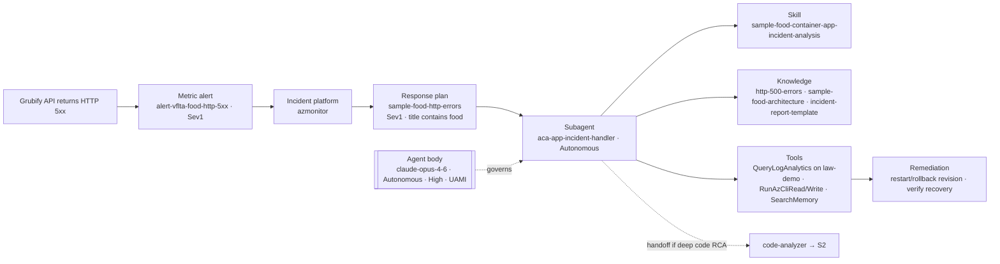
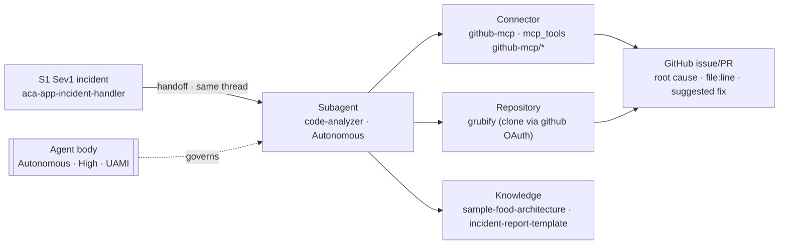
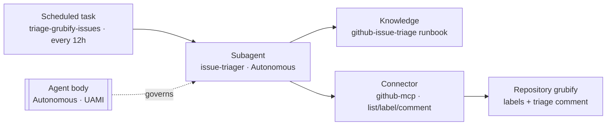
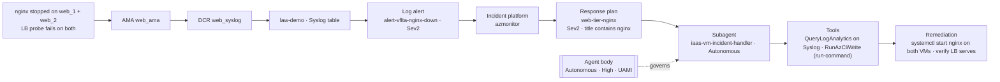
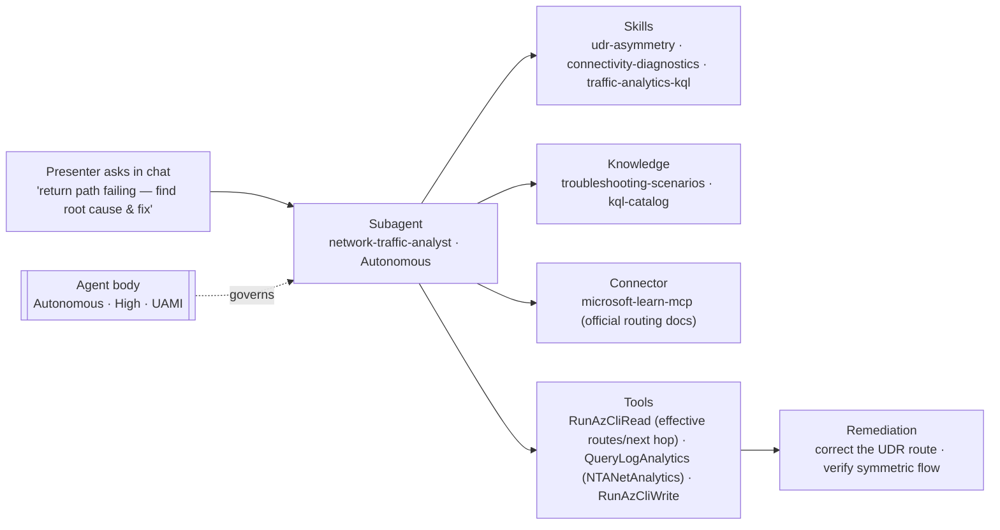
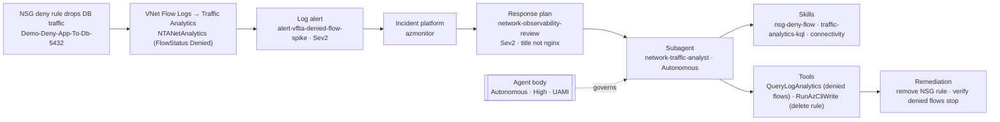
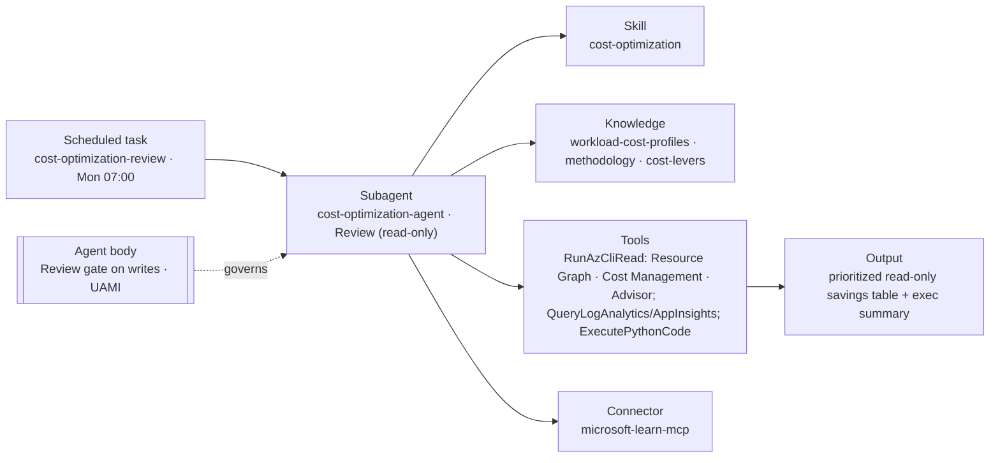
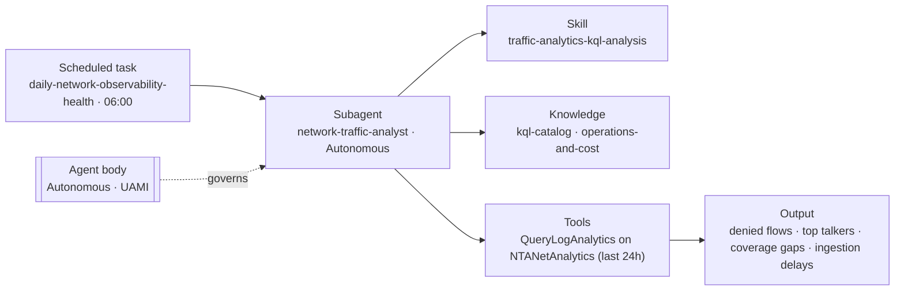
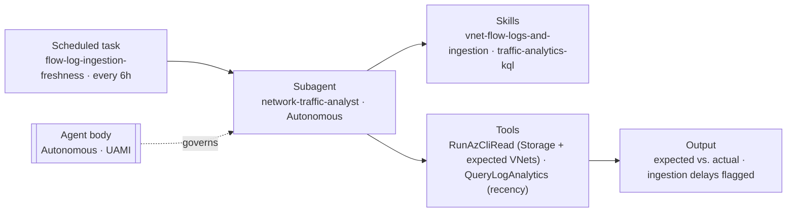

# Azure SRE Agent — Use-Case Resource & Workflow Architecture

This document explains, **one demo use case at a time**, exactly which Azure SRE
Agent resources and sub-resources take part, **why each one matters** (both as
engineering and as business value), and **how they work together** to reach the
outcome. It is written in plain, concrete language: every name is a real object in
this repository, not an abstraction.

It is a companion to — not a replacement for — the two anchor documents:

- The step-by-step demo script: [azure-sre-agent-demo-runbook.md](azure-sre-agent-demo-runbook.md)
  (scenarios in §6–§11, configuration in §3, routing in §12).
- The desired-state reference: [azure-sre-agent-architecture-and-configuration.md](azure-sre-agent-architecture-and-configuration.md).

The runbook tells you *what to click and run*. This document tells you *which parts
of the agent light up, why they exist, and how they collaborate* for each use case —
so you can explain the value to an engineer and to a business stakeholder in the same
breath.

---

## 1. How to read this document

### 1.1 The nine use cases

We cover **nine** use cases. The first six are the runbook scenarios S1–S6; the last
three (P1–P3) are the enabled proactive scheduled tasks, treated as use cases in their
own right because they exercise the agent on a recurring schedule with no incident.

| # | Use case | Kind | Trigger |
| --- | --- | --- | --- |
| S1 | Grubify IT Ops (Container Apps 5xx) | Reactive | `alert-vflta-food-http-5xx` (Sev1) |
| S2 | Grubify Developer (code + GitHub) | Reactive + handoff | Same Sev1 incident, deep-code path |
| S3 | Grubify Workflow Automation (issue triage) | Proactive (scheduled) | `triage-grubify-issues` every 12h |
| S4 | NGINX service down on a VM | Reactive | `alert-vflta-nginx-down` (Sev2) |
| S5 | Asymmetric routing / UDR | Interactive | User asks the agent in chat |
| S6 | NSG rule block | Reactive | `alert-vflta-denied-flow-spike` (Sev2) |
| P1 | Weekly cost optimization review | Proactive (scheduled) | `cost-optimization-review` Mon 07:00 |
| P2 | Daily network observability health | Proactive (scheduled) | `daily-network-observability-health` 06:00 |
| P3 | Flow-log ingestion freshness | Proactive (scheduled) | `flow-log-ingestion-freshness` every 6h |

### 1.2 Two kinds of resource (legend)

Every use case involves two clearly different families of resource. Keeping them
apart is the key to understanding the architecture.

- **SRE Agent sub-resource** — an object that *belongs to the agent* and is part of
  its Git-managed desired state: the agent body, its subagents, skills, tools,
  knowledge base, connectors, incident platform binding, response plans (incident
  filters), scheduled tasks, repositories, and memory. These are what the "left out"
  analysis in §12 is measured against.
- **Signal-chain input** — an Azure Monitor / networking resource that *feeds* the
  agent but is not part of it: the alert rules, Data Collection Rules (DCR), Azure
  Monitor Agent (AMA), the demo Log Analytics workspace, Traffic Analytics, VNet Flow
  Logs, and the Load Balancer. The agent consumes their output; it does not own them.

A subtle but important point about telemetry: the subagent reads the *workload's*
telemetry (the demo Log Analytics workspace `law-demo`, Container Apps logs, the app's
Application Insights) through its **tools** — this is the evidence. The two ARM
connectors `log-analytics` and `application-insights` are a different thing: they are
the **agent's own** telemetry sinks (its runs, its cost), used for the agent's
observability, not as the incident evidence source.

### 1.3 The template used for every use case

Each use-case section has the same four parts:

1. **What happens** — the scenario in plain words.
2. **Resources involved** — a table of every resource that participates, tagged as
   *agent sub-resource* or *signal-chain input*, with its real name and its role here.
3. **Why each resource matters here** — for every resource: its function, its
   engineering value, and its business value.
4. **How they work together** — the big picture in prose plus one Mermaid diagram
   (signal → platform → response plan → subagent → skill / knowledge / tool → fix),
   and the combined technical + business value of the whole.

---

## 2. The cast of characters (stated once)

To avoid repeating the same definition nine times, here is every SRE Agent
sub-resource used across the demo, described once in plain language with its canonical
value. Later sections reference these and add only the *contextual* value for that use
case.

### 2.1 The agent body (control plane)

| Property | Value | What it means in plain words |
| --- | --- | --- |
| Agent | `contoso-sre-agent-dev` (`Microsoft.App/agents`) | The single brain that runs every investigation. |
| Model | `claude-opus-4-6` (Anthropic) | The reasoning engine that reads evidence and decides. |
| Mode | `Autonomous` | It acts without waiting for a human to click Approve. |
| Access level | `High` | It is allowed to run write/remediation operations. |
| Incident source | `AzMonitor` (`azmonitor`) | Fired Azure Monitor alerts arrive here automatically. |
| Identity | User-assigned `uai-contoso-sre-agent-dev` | One identity for all its Azure reads and writes; the real blast-radius control is this identity's least-privilege RBAC. |
| AAU limit | `500` | A monthly cost ceiling on Agent Units. |

Canonical value: the agent body is the always-on responder. **Engineering:** one
governed identity and one reasoning loop replace a pile of point scripts. **Business:**
it turns "page a human at 3 a.m." into "the fix is already applied," compressing mean
time to mitigate (MTTM).

### 2.2 The sub-resources (data plane)

| Sub-resource | Plain-English "what it is" | Why it exists (canonical value) |
| --- | --- | --- |
| **Subagent** | A specialist responder that owns one failure domain (app, VM, network, code, cost, triage). | Focus: the right expert with the right tools handles the right problem, so answers are accurate and explainable. |
| **Skill** | A reusable investigation playbook (ordered steps + KQL) a subagent can load. | Consistency: every investigation follows the vetted method, not improvisation. Max 5 active at a time. |
| **Tool** | A concrete capability the agent can invoke: `RunAzCliReadCommands`, `RunAzCliWriteCommands`, `GetAzCliHelp`, `QueryLogAnalyticsByWorkspaceId`, `QueryAppInsightsByResourceId`, `SearchMemory`, `ExecutePythonCode`. | Hands: read gathers evidence, write remediates, query pulls telemetry, memory recalls context. |
| **Knowledge base** | Uploaded runbooks and context, searched with `SearchMemory`. | Grounding: the agent reasons from your documented reality, not generic guesses. |
| **Connector** | An outbound bridge to an external system: `github-mcp`, `github` (OAuth), `microsoft-learn-mcp`; plus ARM telemetry `log-analytics`, `application-insights`. | Reach: lets the agent act in GitHub, read official docs, and record its own telemetry. |
| **Incident platform** | The single inbound binding (`azmonitor`) that receives fired alerts. | Front door: alerts flow in automatically over RBAC — no webhook, no shared secret. |
| **Response plan** (incident filter) | A routing rule that sends an incident to one subagent by severity + title. | Determinism: the correct specialist always takes the incident, and you can explain why. |
| **Scheduled task** | A recurring prompt that runs a subagent on a cron with no incident. | Proactivity: continuous hygiene (cost, freshness, triage) instead of only reacting. |
| **Repository** | A connected source repo (`grubify`). | Shift-left: lets the agent tie a runtime symptom to the line of code. |
| **Memory** | The agent's recall of prior runs and uploaded knowledge. | Learning: each incident is handled with the context of the last one. |

The desired state also declares things it deliberately does **not** use — **0 hooks**,
**0 custom Python tools**, and empty `common-prompts` / `plugins` / `http-triggers`.
These, plus a few dormant objects, are explained in §12.

---

## 3. Use case S1 — Grubify IT Ops (Container Apps HTTP 5xx)

### 3.1 What happens

The Grubify API (an Azure Container Apps service) starts returning HTTP 5xx. A metric
alert fires at Sev1. The agent opens an incident, reads the Container Apps HTTP logs,
finds the failing path and revision, states a root cause, and restarts/rolls back the
revision **autonomously** — before any human has opened a blade. No source code, no
GitHub: Azure signals only.

**Trigger & routing:** `alert-vflta-food-http-5xx` (Sev1) → `azmonitor` →
`sample-food-http-errors` (title contains `food`) → `aca-app-incident-handler`.

### 3.2 Resources involved

| Resource | Category | Real name | Role in S1 |
| --- | --- | --- | --- |
| Metric alert | Signal-chain input | `alert-vflta-food-http-5xx` (Sev1, `microsoft.app/containerapps` Requests 5xx, GreaterThan 0, PT1M) | Detects the 5xx and raises the incident. |
| Demo workspace | Signal-chain input | `law-demo` (`ContainerAppHTTPLogs`, `ContainerAppConsoleLogs_CL`) | Holds the evidence the agent reads. |
| Incident platform | Agent sub-resource | `azmonitor` | Receives the fired alert. |
| Response plan | Agent sub-resource | `sample-food-http-errors` (Sev1, `food`, Autonomous, maxAttempts 3) | Routes the incident to the app specialist. |
| Subagent | Agent sub-resource | `aca-app-incident-handler` (Autonomous) | Investigates and remediates the app. |
| Skill | Agent sub-resource | `sample-food-container-app-incident-analysis` | The playbook of diagnostic steps + KQL. |
| Knowledge | Agent sub-resource | `http-500-errors.md`, `sample-food-architecture.md`, `incident-report-template.md` | Runbook, app surface facts, and report format. |
| Tools | Agent sub-resource | `SearchMemory`, `RunAzCliReadCommands`, `RunAzCliWriteCommands`, `QueryLogAnalyticsByWorkspaceId`, `QueryAppInsightsByResourceId`, `GetAzCliHelp`, `ExecutePythonCode` | Read evidence, restart the revision, chart metrics. |
| ARM telemetry | Agent sub-resource | `log-analytics`, `application-insights` | The agent's own run/cost telemetry. |
| Agent body | Agent sub-resource | `contoso-sre-agent-dev` + `uai-...` identity | Runs the loop under one governed identity. |

### 3.3 Why each resource matters here

| Resource | Function in S1 | Engineering value | Business value |
| --- | --- | --- | --- |
| `alert-vflta-food-http-5xx` | Fires on the first 5xx in a 1-minute window | Near-real-time detection at the platform floor (~3 min ACA metric latency) | The clock starts automatically; no one has to notice the outage |
| `law-demo` logs | Source of `ContainerAppHTTPLogs` evidence | One queryable store of the exact failing path/revision | Root cause is grounded in fact, not guesswork |
| `azmonitor` | Delivers the alert to the agent | RBAC pull — no webhook/secret to run or leak | Lower operational and security overhead |
| `sample-food-http-errors` | Sends the incident to the app expert | Deterministic, explainable routing by title `food` | Predictable response you can put in an SLA |
| `aca-app-incident-handler` | Owns the ACA app domain end to end | The right specialist with write tools and app runbooks | Faster, correct fixes; fewer escalations |
| `sample-food-container-app-incident-analysis` | Ordered diagnosis + KQL | Same vetted method every time | Consistent quality regardless of who is on call |
| Knowledge docs | Ground the run (real API surface, report format) | Prevents misdiagnosis (e.g. `/health` 404 is expected) and yields a structured issue | Trustworthy write-ups stakeholders can act on |
| Tools (read/write/query) | Gather evidence, restart the revision, plot metrics | One toolset does triage *and* remediation | MTTM drops from "wake up, open five blades" to seconds |
| ARM telemetry connectors | Record the agent's own activity | Auditable trail of what the agent did | Evidence for governance and cost control |
| Agent body + UAMI | Runs autonomously under least-privilege RBAC | Blast radius bounded by the identity's roles, not a human gate | Speed without handing over unrestricted power |

### 3.4 How they work together

The signal chain does the detecting; the agent does the thinking and the fixing. The
metric alert converts "5xx is happening" into a Sev1 incident and hands it to
`azmonitor`. The `sample-food-http-errors` response plan reads the title, sees `food`,
and gives the incident to `aca-app-incident-handler`. That subagent loads its skill,
searches the knowledge base for the HTTP-500 runbook and the app architecture, queries
`ContainerAppHTTPLogs` in `law-demo` to pinpoint the failing path and revision, and
then uses its write tool to restart/roll back the revision and confirm recovery — all
under the agent body's autonomous, high-access, least-privilege identity.

**Combined value.** *Engineering:* a full detect-diagnose-remediate loop with zero
human hops, grounded in the real app surface. *Business:* the classic 3 a.m. page
becomes a 30-second autonomous recovery, protecting revenue and customer trust while
freeing on-call engineers.

---

## 4. Use case S2 — Grubify Developer (code correlation + GitHub)

### 4.1 What happens

Same Sev1 incident as S1, but now the agent goes past Azure into the **source code**.
The app handler hands off to a code specialist, which reads the Grubify repository,
ties the runtime error to a specific file and line, and opens a GitHub issue (or PR)
with a full root-cause write-up — so the on-call engineer hands a complete package to
the owning developer instead of a screenshot.

**Trigger & routing:** same S1 incident → `aca-app-incident-handler` **handoff** →
`code-analyzer` → GitHub via `github-mcp`, source from repo `grubify`.

### 4.2 Resources involved

| Resource | Category | Real name | Role in S2 |
| --- | --- | --- | --- |
| (S1 chain) | — | S1 alert + platform + plan + app handler | Produces the incident and the handoff. |
| Handoff | Agent sub-resource | `aca-app-incident-handler.handoffs = [code-analyzer]` | Passes full context in the same thread. |
| Subagent | Agent sub-resource | `code-analyzer` (Autonomous, `enable_skills: false`) | Correlates incident to source, writes the issue. |
| Connector (MCP) | Agent sub-resource | `github-mcp` (`mcp_tools: github-mcp/*`) | Creates/updates the GitHub issue or PR. |
| Connector (OAuth) | Agent sub-resource | `github` | Optional binding for the deep repo clone. |
| Repository | Agent sub-resource | `grubify` | The source the agent reads to find file:line. |
| Knowledge | Agent sub-resource | `sample-food-architecture.md`, `incident-report-template.md`, `http-500-errors.md` | App map + issue format + runbook. |
| Tools | Agent sub-resource | `SearchMemory`, `RunAzCliReadCommands`/`Write`, `QueryLogAnalyticsByWorkspaceId`, `QueryAppInsightsByResourceId`, `ExecutePythonCode` + `github-mcp/*` MCP tools (`issue_write`, `add_issue_comment`, `search_code`, `get_file_contents`) | Combine log/metric evidence with code and file the issue. |

### 4.3 Why each resource matters here

| Resource | Function in S2 | Engineering value | Business value |
| --- | --- | --- | --- |
| Handoff to `code-analyzer` | Continues the same investigation, full context | No re-investigation, no lost detail | Faster fix; the developer gets everything at once |
| `code-analyzer` | Maps the symptom to file:line and drafts the fix | Deep RCA that a metric alone can't give | Shift-left: bugs fixed at the source, not patched at runtime |
| `github-mcp` | Creates the issue/PR through a governed connector | No `gh` CLI, no token hunting, authenticated per-call | Auditable, secretless developer workflow |
| `github` (OAuth) | Binds the repo for the deep clone | Alternative path if MCP is unavailable | Resilience / optionality (see §12 on redundancy) |
| `grubify` repo | The code the agent reads | Correlation is grounded in real source | Confidence the proposed fix is the right one |
| Knowledge (report template) | Enforces a complete, structured issue | Every issue has Summary→Root Cause→Action Items | Handoffs need no rework; teams trust the output |

### 4.4 How they work together

S2 begins where S1 ends. Instead of closing the incident at "revision restarted," the
app handler recognizes that the true cause is in code and **hands off in the same
thread** to `code-analyzer`, so all the log and metric evidence travels with it. The
code specialist reads `grubify` (locally cloned via the `github` binding, or through
`github-mcp` `get_file_contents`/`search_code`), pinpoints the offending path, and uses
the `github-mcp` `issue_write` tool to open a structured issue that follows the
`incident-report-template` from the knowledge base.

**Combined value.** *Engineering:* one continuous thread carries an incident from
"service unhealthy" to "here is the file, here is the fix, here is the issue."
*Business:* dramatically shorter developer feedback loop and a permanent fix instead of
a recurring firefight.

---

## 5. Use case S3 — Grubify Workflow Automation (scheduled issue triage)

### 5.1 What happens

With no incident at all, every 12 hours the agent grooms the Grubify customer-issue
backlog: it finds untriaged `[Customer Issue]` items, classifies each (Bug /
Performance / Feature / Question), labels them, and posts a triage comment — continuous
operational hygiene so the backlog never rots.

**Trigger & routing:** scheduled task `triage-grubify-issues` (cron `0 */12 * * *`) →
`issue-triager` → GitHub via `github-mcp`, repo `grubify`.

### 5.2 Resources involved

| Resource | Category | Real name | Role in S3 |
| --- | --- | --- | --- |
| Scheduled task | Agent sub-resource | `triage-grubify-issues` (`0 */12 * * *`, UTC, enabled, Autonomous) | Fires the recurring triage with no incident. |
| Subagent | Agent sub-resource | `issue-triager` (Autonomous, `enable_skills: false`) | Classifies, labels, comments per the runbook. |
| Connector (MCP) | Agent sub-resource | `github-mcp` (`mcp_tools: github-mcp/*`) | Reads/labels/comments on issues. |
| Repository | Agent sub-resource | `grubify` | The backlog being triaged. |
| Knowledge | Agent sub-resource | `github-issue-triage.md` | The classification/labeling runbook. |
| Tools | Agent sub-resource | `SearchMemory` + `github-mcp/*` (`list_issues`, `search_issues`, `issue_read`, `issue_write`, `add_issue_comment`, `get_label`) | Find, read, label, and comment on issues. |

### 5.3 Why each resource matters here

| Resource | Function in S3 | Engineering value | Business value |
| --- | --- | --- | --- |
| `triage-grubify-issues` | Runs the job on a schedule | Unattended, cron-driven — no human trigger | Backlog stays groomed 24/7 at near-zero effort |
| `issue-triager` | Applies the triage runbook to each issue | Consistent classification and labels | Customers get a fast, uniform first response |
| `github-mcp` | Governed read/label/comment | Secretless, auditable GitHub actions | Safe automation of a customer-facing surface |
| `grubify` repo | The issue backlog | Single source for triage | Nothing falls through the cracks |
| `github-issue-triage.md` | The rules for classifying | The agent follows *your* taxonomy | Triage matches business priorities |

### 5.4 How they work together

This is the proactive counterpart to S1/S2: the same GitHub reach, but pulled by a
clock instead of an incident. The scheduled task wakes `issue-triager`, which searches
memory for the triage runbook, uses `github-mcp` to list untriaged `[Customer Issue]`
items in `grubify`, classifies each, and posts labels and a bot comment.

**Combined value.** *Engineering:* recurring hygiene with zero human triggers.
*Business:* faster customer responsiveness and a permanently tidy backlog without
adding headcount.

---

## 6. Use case S4 — NGINX service down on a VM

### 6.1 What happens

A guest-OS web server (nginx) is stopped on **both** web VMs behind an internal Load
Balancer. Platform metrics still say the VMs are healthy, so this is invisible to
infrastructure monitoring — but obvious in the guest Syslog. The agent reads the Syslog
events, identifies both affected VMs, and restarts the service on each autonomously,
then confirms the Load Balancer serves again.

**Trigger & routing:** `systemctl stop nginx` on both web VMs → AMA → DCR → `law-demo`
Syslog → `alert-vflta-nginx-down` (Sev2) → `azmonitor` → `web-tier-nginx` (title
contains `nginx`) → `iaas-vm-incident-handler`.

### 6.2 Resources involved

| Resource | Category | Real name | Role in S4 |
| --- | --- | --- | --- |
| Load Balancer | Signal-chain input | `lb-vflta-internal-web` (HTTP probe :80) | Makes a stopped service a real outage (both backends fail the probe). |
| Azure Monitor Agent | Signal-chain input | `web_ama` VM extension | Reads the systemd events on the VMs. |
| Data Collection Rule | Signal-chain input | `web_syslog` DCR (+ association) | Ships Syslog to the workspace. |
| Demo workspace | Signal-chain input | `law-demo` (`Syslog` table) | Holds the nginx stop events. |
| Log-search alert | Signal-chain input | `alert-vflta-nginx-down` (Sev2, Syslog KQL, PT1M) | Fires when nginx stops. |
| Incident platform | Agent sub-resource | `azmonitor` | Receives the alert. |
| Response plan | Agent sub-resource | `web-tier-nginx` (Sev2, `nginx`, Autonomous, maxAttempts 2) | Routes to the VM specialist (not the network one). |
| Subagent | Agent sub-resource | `iaas-vm-incident-handler` (Autonomous, `enable_skills: false`) | Confirms from Syslog and restarts nginx. |
| Tools | Agent sub-resource | `RunAzCliReadCommands`, `RunAzCliWriteCommands`, `QueryLogAnalyticsByWorkspaceId`, `GetAzCliHelp` | Read Syslog; restart via `az vm run-command`. |
| Agent body | Agent sub-resource | `contoso-sre-agent-dev` + UAMI | Runs the autonomous restart. |

### 6.3 Why each resource matters here

| Resource | Function in S4 | Engineering value | Business value |
| --- | --- | --- | --- |
| `lb-vflta-internal-web` | Turns a stopped service into a real outage | Realistic "service down" behind an LB | The demo mirrors a genuine customer-facing failure |
| `web_ama` + `web_syslog` DCR | Get guest-OS events into Azure | Makes an in-guest fault *detectable at all* | Catches failures platform metrics miss |
| `law-demo` Syslog | Stores the nginx events | One queryable evidence store | Fast, factual root cause |
| `alert-vflta-nginx-down` | Fires on the stop event (PT1M) | Fast detection of a guest fault | Downtime measured in minutes, not hours |
| `web-tier-nginx` plan | Routes to the VM expert, excludes the network one | Correct domain separation by title | The right hands touch the box — fewer wrong turns |
| `iaas-vm-incident-handler` | Reads Syslog, restarts nginx on both VMs | Specialist with run-command write access | Service restored autonomously, no human gate |
| Write tool (`run-command`) | Executes `systemctl start nginx` in-guest | Remediation, not just detection | The outage ends on its own |
| Agent body + UAMI | Bounds the action to least-privilege roles | Safe autonomy | Speed without unrestricted power |

### 6.4 How they work together

The whole point of S4 is bridging "the VM is up" and "the service is up." The Load
Balancer's health probe makes the stopped nginx a real outage; AMA and the Syslog DCR
make the in-guest event visible in `law-demo`; the log-search alert converts that event
into a Sev2 incident. The `web-tier-nginx` plan deliberately carves nginx out of the
Sev2 network band (via `titleNotContains nginx` on its sibling) and routes it to
`iaas-vm-incident-handler`, which reads the Syslog rows, identifies both `vm-vflta-web-1`
and `vm-vflta-web-2`, and restarts nginx on each with `az vm run-command`, then verifies.

**Combined value.** *Engineering:* an end-to-end path that surfaces and fixes a
guest-OS fault the platform cannot see. *Business:* a whole class of "silent" outages
(dead service on a healthy VM) becomes self-healing.

---

## 7. Use case S5 — Asymmetric routing / UDR (interactive)

### 7.1 What happens

A user-defined route sends a return prefix to `None`, so the forward path works but the
return path is black-holed — a classic, hard-to-spot network fault. There is no alert;
the presenter asks the agent in chat to investigate. The network specialist reasons
over effective routes, next hops, and Traffic Analytics, localizes the black hole, and
corrects the route autonomously.

**Trigger & routing:** interactive chat prompt → `network-traffic-analyst` (no response
plan involved because there is no incident).

### 7.2 Resources involved

| Resource | Category | Real name | Role in S5 |
| --- | --- | --- | --- |
| VNet Flow Logs + Traffic Analytics | Signal-chain input | `NTANetAnalytics` in `law-demo` | Shows the traffic pattern / asymmetry. |
| Subagent | Agent sub-resource | `network-traffic-analyst` (Autonomous) | Diagnoses and fixes the route. |
| Skills | Agent sub-resource | `udr-asymmetry-investigation`, `connectivity-diagnostics`, `traffic-analytics-kql-analysis`, `vnet-flow-logs-and-ingestion` | Effective-route / next-hop / flow playbooks. |
| Knowledge | Agent sub-resource | `troubleshooting-scenarios.md`, `kql-catalog.md`, `vm-application-calls-and-services.md` | Routing scenarios + KQL + expected call map. |
| Connector (MCP) | Agent sub-resource | `microsoft-learn-mcp` (`mcp_tools: microsoft-learn-mcp/*`) | Grounds answers in official Azure routing docs. |
| Tools | Agent sub-resource | `RunAzCliReadCommands`, `RunAzCliWriteCommands`, `QueryLogAnalyticsByWorkspaceId`, `GetAzCliHelp` | Read effective routes/next hop; correct the route. |
| Agent body | Agent sub-resource | `contoso-sre-agent-dev` + UAMI | Runs the autonomous route fix. |

### 7.3 Why each resource matters here

| Resource | Function in S5 | Engineering value | Business value |
| --- | --- | --- | --- |
| `NTANetAnalytics` | Shows the flow asymmetry | Evidence the forward path is fine but return is not | Pinpoints an otherwise invisible fault |
| `network-traffic-analyst` | Reasons over routes and fixes them | Deep networking expertise on demand | Hours of expert troubleshooting compressed to minutes |
| UDR / connectivity / TA skills | Structured route-asymmetry method | Repeatable, correct diagnosis | Consistent outcomes regardless of who runs the demo |
| Knowledge (troubleshooting, KQL) | Grounds the reasoning | Fewer dead ends | Trustworthy answer the network team accepts |
| `microsoft-learn-mcp` | Cites official routing behavior | Answers backed by Microsoft docs | Higher credibility, fewer mistakes |
| Read + write CLI tools | Inspect effective routes, correct the route | Diagnose *and* remediate | The break is fixed, not just described |

### 7.4 How they work together

S5 shows the interactive, chat-driven face of the agent — no alert, just an expert on
call. The specialist loads its routing skills, reads effective routes and next hops with
its CLI read tool, corroborates with `NTANetAnalytics` in `law-demo`, and grounds its
reasoning with `microsoft-learn-mcp`. Once it localizes the `→ None` route, it uses its
write tool to correct the route and confirms symmetric flow.

**Combined value.** *Engineering:* a senior network diagnosis (effective routes +
flow evidence + official docs) delivered on demand. *Business:* one of the most
expensive, time-consuming fault classes becomes a minutes-long conversation.

---

## 8. Use case S6 — NSG rule block

### 8.1 What happens

An over-broad NSG deny rule silently drops legitimate database traffic. Nothing
crashes, but denied flows spike. A Sev2 alert fires; the network specialist names the
exact rule and 5-tuple and removes it autonomously.

**Trigger & routing:** deny rule + denied traffic → VNet Flow Logs / Traffic Analytics
(`FlowStatus == Denied`) → `alert-vflta-denied-flow-spike` (Sev2) → `azmonitor` →
`network-observability-review` (title **not** `nginx`) → `network-traffic-analyst`.

### 8.2 Resources involved

| Resource | Category | Real name | Role in S6 |
| --- | --- | --- | --- |
| VNet Flow Logs + Traffic Analytics | Signal-chain input | `NTANetAnalytics` in `law-demo` | Records the denied flows. |
| Log-search alert | Signal-chain input | `alert-vflta-denied-flow-spike` (Sev2, PT1M eval, PT10M window) | Fires on the denied-flow spike. |
| Incident platform | Agent sub-resource | `azmonitor` | Receives the alert. |
| Response plan | Agent sub-resource | `network-observability-review` (Sev2, not `nginx`, Autonomous, maxAttempts 2) | Routes to the network specialist. |
| Subagent | Agent sub-resource | `network-traffic-analyst` (Autonomous) | Identifies the rule and removes it. |
| Skills | Agent sub-resource | `nsg-deny-flow-investigation`, `traffic-analytics-kql-analysis`, `connectivity-diagnostics` | Denied-flow KQL + NSG correlation. |
| Knowledge | Agent sub-resource | `kql-catalog.md`, `troubleshooting-scenarios.md`, `vnet-flow-logs-and-ingestion.md` | Denied-flow queries and interpretation. |
| Connector (MCP) | Agent sub-resource | `microsoft-learn-mcp` | Official NSG/flow-log references. |
| Tools | Agent sub-resource | `RunAzCliReadCommands`, `RunAzCliWriteCommands`, `QueryLogAnalyticsByWorkspaceId`, `GetAzCliHelp` | Query denied flows; delete the NSG rule. |

### 8.3 Why each resource matters here

| Resource | Function in S6 | Engineering value | Business value |
| --- | --- | --- | --- |
| `NTANetAnalytics` denied flows | Evidence of the block (`FlowStatus Denied`) | Exact source/dest/port of the drop | The silent outage becomes visible and named |
| `alert-vflta-denied-flow-spike` | Fires on the spike | Detection floored only by the 10-min TA interval | No one has to notice the quiet failure |
| `network-observability-review` | Routes to the network expert (excludes nginx) | Clean domain split at Sev2 | Predictable, explainable handling |
| `network-traffic-analyst` | Names the rule and removes it | Specialist with write CLI | Connectivity restored autonomously |
| NSG / TA / connectivity skills | Denied-flow investigation method | Repeatable correlation to the exact rule | Consistent, defensible remediation |
| Write CLI tool | Deletes `Demo-Deny-App-To-Db-5432` | Remediation, not just a report | The block is cleared, not just flagged |

### 8.4 How they work together

S6 is the reactive twin of S5, but with a real alert. Denied flows land in
`NTANetAnalytics`; the alert converts the spike into a Sev2 incident; the
`network-observability-review` plan (which excludes `nginx`) routes it to
`network-traffic-analyst`. The specialist runs its denied-flow KQL to name the exact
rule and 5-tuple, corroborates with its skills and `microsoft-learn-mcp`, then uses its
write tool to remove the offending NSG rule and confirms denied flows stop.

**Combined value.** *Engineering:* a silent security-group misconfiguration is
detected, named to the exact 5-tuple, and cleared automatically. *Business:* a common
self-inflicted outage self-heals, protecting availability with a full audit trail.

---

## 9. Use case P1 — Weekly cost optimization review (proactive)

### 9.1 What happens

Every Monday at 07:00 UTC, with no incident, the agent runs a subscription-wide FinOps
review: it reads workload cost profiles, inventories resources, pulls actual spend and
Azure Advisor cost recommendations, and produces a single prioritized, **read-only**
savings table with trade-offs. It recommends; it never changes a resource.

**Trigger & routing:** scheduled task `cost-optimization-review` (cron `0 7 * * 1`) →
`cost-optimization-agent` (Review mode, read-only).

### 9.2 Resources involved

| Resource | Category | Real name | Role in P1 |
| --- | --- | --- | --- |
| Scheduled task | Agent sub-resource | `cost-optimization-review` (`0 7 * * 1`, UTC, enabled, Autonomous) | Fires the weekly review. |
| Subagent | Agent sub-resource | `cost-optimization-agent` (**Review**, read-only) | Correlates inventory, spend, utilization, Advisor. |
| Skill | Agent sub-resource | `cost-optimization` | The FinOps methodology playbook. |
| Knowledge | Agent sub-resource | `workload-cost-profiles.md`, `cost-optimization-methodology.md`, `azure-cost-levers-by-service.md` | Business context + method + per-service levers. |
| Connector (MCP) | Agent sub-resource | `microsoft-learn-mcp` | Official cost/Advisor references. |
| ARM telemetry | Agent sub-resource | `log-analytics`, `application-insights` | Utilization + unit-economics inputs. |
| Tools | Agent sub-resource | `RunAzCliReadCommands` (Resource Graph, Cost Management, Advisor), `QueryLogAnalyticsByWorkspaceId`, `QueryAppInsightsByResourceId`, `ExecutePythonCode`, `GetAzCliHelp` | Inventory, spend, utilization, charts. |

### 9.3 Why each resource matters here

| Resource | Function in P1 | Engineering value | Business value |
| --- | --- | --- | --- |
| `cost-optimization-review` | Runs the review weekly | Unattended cadence | Continuous cost discipline without a meeting |
| `cost-optimization-agent` (Review) | Read-only FinOps analysis | Safe: proposes, never changes | Savings ideas with zero risk to workloads |
| `cost-optimization` skill | Ordered FinOps method | Advisor + inventory + spend, de-duplicated | Credible, non-double-counted recommendations |
| Cost knowledge docs | Weight advice by criticality/SLA/budget | Won't cut redundancy a tier needs | Savings that respect reliability and compliance |
| Read tools (Graph/Cost/Advisor) | Pull inventory, spend, Advisor | One agent correlates four data sources | A single prioritized savings table, ready to act |
| `ExecutePythonCode` | Charts and unit economics | Cost-per-transaction trends | Executive-ready value story |

### 9.4 How they work together

P1 is proactive FinOps. The scheduled task wakes `cost-optimization-agent` in **Review**
mode (deliberately read-only — the one place this lab keeps a human gate), which loads
the `cost-optimization` skill and the workload profiles, then uses its read tools to
inventory resources (Resource Graph), pull spend (Cost Management), read utilization
(Log Analytics / App Insights), and fetch Advisor cost items. It correlates and
de-duplicates them into one prioritized savings table, grounded by `microsoft-learn-mcp`.

**Combined value.** *Engineering:* four cost signals correlated by one agent into a
single, WAF-aware savings table. *Business:* ongoing spend reduction with no risk to
reliability, and a ready-made executive value story.

---

## 10. Use case P2 — Daily network observability health (proactive)

### 10.1 What happens

Every day at 06:00 UTC the agent summarizes the last 24 hours of network telemetry:
denied flows, top talkers, missing VNet coverage, unusual ports, ingestion delays —
read-only, so the team starts the day with a network health digest.

**Trigger & routing:** scheduled task `daily-network-observability-health` (cron
`0 6 * * *`) → `network-traffic-analyst` (Autonomous, read-only in practice).

### 10.2 Resources involved

| Resource | Category | Real name | Role in P2 |
| --- | --- | --- | --- |
| Scheduled task | Agent sub-resource | `daily-network-observability-health` (`0 6 * * *`, UTC, enabled, Autonomous) | Fires the daily digest. |
| Subagent | Agent sub-resource | `network-traffic-analyst` | Summarizes the last 24h of flows. |
| Skill | Agent sub-resource | `traffic-analytics-kql-analysis` | The NTANetAnalytics query method. |
| Knowledge | Agent sub-resource | `kql-catalog.md`, `operations-and-cost.md` | Reusable queries + operational baselines. |
| Signal source | Signal-chain input | `NTANetAnalytics` in `law-demo` | The 24h of flow data being summarized. |
| Tools | Agent sub-resource | `QueryLogAnalyticsByWorkspaceId`, `RunAzCliReadCommands`, `GetAzCliHelp` | Query flows; read config. |

### 10.3 Why each resource matters here

| Resource | Function in P2 | Engineering value | Business value |
| --- | --- | --- | --- |
| `daily-network-observability-health` | Runs the digest daily | Unattended baseline reporting | Early warning before small issues become outages |
| `network-traffic-analyst` | Reads and summarizes flows | Expert reads the telemetry, not a raw dump | Signal, not noise, each morning |
| `traffic-analytics-kql-analysis` | Standard flow queries | Consistent daily metrics | Trends you can compare day over day |
| KQL catalog / ops knowledge | Grounds "normal" | Deviations stand out | Faster detection of drift and creep |
| `NTANetAnalytics` | The data being summarized | One source of network truth | Confidence in the health picture |

### 10.4 How they work together

P2 keeps a finger on the network's pulse. The scheduled task wakes
`network-traffic-analyst`, which loads its Traffic Analytics skill and the KQL catalog,
queries the last 24 hours of `NTANetAnalytics` in `law-demo`, and produces a read-only
summary of denied flows, top talkers, coverage gaps, and ingestion delays.

**Combined value.** *Engineering:* a daily, expert-curated network baseline instead of
raw dashboards. *Business:* problems are caught while they are still cheap to fix.

---

## 11. Use case P3 — Flow-log ingestion freshness (proactive)

### 11.1 What happens

Every 6 hours the agent checks that VNet Flow Logs and Traffic Analytics are actually
producing fresh data in Storage and Log Analytics — comparing the VNets Terraform
expects against what is really landing — so the observability that S5/S6 depend on is
never silently broken.

**Trigger & routing:** scheduled task `flow-log-ingestion-freshness` (cron `0 */6 * * *`)
→ `network-traffic-analyst` (Autonomous, read-only).

### 11.2 Resources involved

| Resource | Category | Real name | Role in P3 |
| --- | --- | --- | --- |
| Scheduled task | Agent sub-resource | `flow-log-ingestion-freshness` (`0 */6 * * *`, UTC, enabled, Autonomous) | Fires the freshness check. |
| Subagent | Agent sub-resource | `network-traffic-analyst` | Compares expected vs. actual data. |
| Skills | Agent sub-resource | `vnet-flow-logs-and-ingestion`, `traffic-analytics-kql-analysis` | Ingestion-freshness + query method. |
| Knowledge | Agent sub-resource | `vnet-flow-logs-and-ingestion.md`, `operations-and-cost.md` | Ingestion pipeline + operational facts. |
| Signal source | Signal-chain input | VNet Flow Logs in Storage + `NTANetAnalytics` in `law-demo` | The data whose freshness is checked. |
| Tools | Agent sub-resource | `RunAzCliReadCommands`, `QueryLogAnalyticsByWorkspaceId`, `GetAzCliHelp` | Read Storage/expected VNets; query recency. |

### 11.3 Why each resource matters here

| Resource | Function in P3 | Engineering value | Business value |
| --- | --- | --- | --- |
| `flow-log-ingestion-freshness` | Runs the check every 6h | Guards the pipeline that other scenarios rely on | Prevents "blind" monitoring going unnoticed |
| `network-traffic-analyst` | Compares expected vs. actual | Expert reads the pipeline health | Trustworthy assurance the data is flowing |
| Ingestion + TA skills | Freshness method | Repeatable data-recency check | Consistent detection of ingestion gaps |
| Flow-log / TA data | The freshness subject | Ground truth on landing data | Confidence S5/S6 evidence is real |
| Read tools | Inspect Storage + query recency | Diagnose gaps without changing anything | Safe, low-cost assurance |

### 11.4 How they work together

P3 protects the evidence base itself. The scheduled task wakes
`network-traffic-analyst`, which loads its ingestion and Traffic Analytics skills, reads
the VNets Terraform expects, checks the flow-log Storage and the recency of
`NTANetAnalytics` in `law-demo`, and reports any gap — read-only.

**Combined value.** *Engineering:* the monitoring pipeline is itself monitored, so the
agent never reasons on stale or missing data. *Business:* the reliability of every
network scenario is underwritten, avoiding the worst failure — not knowing you are blind.

---

## 12. Desired-state sub-resources not covered by any use case (and why)

This section answers the completeness question: which SRE Agent **own** sub-resources
(the desired state — not the Azure Monitor signal chain) are *not* exercised by any of
the nine use cases, and why. Each item is deliberate, not an oversight.

| Sub-resource | Category | Why it is not in any use case |
| --- | --- | --- |
| `azure-resource-config-auditor` | Subagent | Owns the **config-drift / Sev3** domain, which has **no wired alert** in this lab. Its Sev3 response plan was removed on 2026-07-02 as dormant; it is reachable only on demand via the `/agent` command and the disabled `post-demo-drift-check` task. Pre-provisioned for enterprise completeness, not for the demo flow. |
| `post-demo-drift-check` | Scheduled task | Shipped **disabled** (`enabled: false`, Review mode). It is meant to be run *by hand* after a demo to check for leftover NSG/UDR changes; the cron is only a schema placeholder. Not a demo scenario. |
| `rbac-and-resource-access-check` | Skill | Granted **only** to `azure-resource-config-auditor`, which is itself uncovered. It supports the config-audit domain, not any of the nine flows. |
| `github` (OAuth connector) | Connector | A **redundant Option A** for GitHub. S2/S3 use `github-mcp` (Option B, PAT). The OAuth connector exists as a fallback and to bind the repo deep-clone, but its identity is unauthorized in this lab (a manual portal step), so it is not on any active path. |
| Hooks | Extension primitive | **0 deployed.** The `block-unsafe-remediation` hook was removed to run maximum-autonomy; only an `example-*` reference remains. Re-adding it is the documented way to re-introduce a human gate (runbook §12.1). |
| Custom Python tools | Extension primitive | **0 deployed.** The built-in tools (CLI read/write, KQL, App Insights, memory, Python execution) cover every use case; no bespoke tool was needed. |
| `common-prompts`, `plugins`, `plugin-configs`, `http-triggers` | Config folders | **Empty.** No shared prompt templates, marketplace plugins, or inbound webhooks are used; incidents arrive via the RBAC-pull Azure Monitor platform instead. |
| A few VNet-flow-logs KB docs (`deployment-guide.md`, `terraform-design.md`, `official-sources.md`, `vnet-flow-logs-traffic-analytics-terraform-guide.md`, `vnet-flow-logs-with-vs-without-traffic-analytics.md`) | Knowledge | These are **design/reference** background. They stay in the searchable knowledge base (any relevant subagent can pull them via `SearchMemory`), but no single use case actively investigates *through* them the way S5/S6 use the troubleshooting and KQL docs. Available, not use-case-active. |

Two clarifications so "not covered" is not misread:

- **The signal-chain inputs are intentionally excluded from this table.** Alerts, DCR,
  AMA, the demo workspace, Traffic Analytics, VNet Flow Logs and the Load Balancer are
  *not* agent sub-resources; they feed the agent and are covered inside each use case
  as the input layer.
- **Every other desired-state sub-resource is covered.** All 3 connectors that carry an
  active path (`github-mcp`, `microsoft-learn-mcp`, plus the ARM telemetry pair), the 1
  incident platform, all 3 response plans, 6 of 7 subagents, 7 of 8 skills, 4 of 5
  scheduled tasks, and the 1 repository each appear in at least one use case above — see
  the matrix in §13.

---

## 13. Coverage matrix (proof of completeness)

`✓` = actively involved · `—` = not involved · `dormant` = deployed but wired to no
active trigger (explained in §12). Signal-chain inputs are marked `(input)`.

| Sub-resource | S1 | S2 | S3 | S4 | S5 | S6 | P1 | P2 | P3 |
| --- | :-: | :-: | :-: | :-: | :-: | :-: | :-: | :-: | :-: |
| Agent body `contoso-sre-agent-dev` | ✓ | ✓ | ✓ | ✓ | ✓ | ✓ | ✓ | ✓ | ✓ |
| Incident platform `azmonitor` | ✓ | ✓ | — | ✓ | — | ✓ | — | — | — |
| Plan `sample-food-http-errors` | ✓ | ✓ | — | — | — | — | — | — | — |
| Plan `web-tier-nginx` | — | — | — | ✓ | — | — | — | — | — |
| Plan `network-observability-review` | — | — | — | — | — | ✓ | — | — | — |
| Subagent `aca-app-incident-handler` | ✓ | ✓ | — | — | — | — | — | — | — |
| Subagent `code-analyzer` | — | ✓ | — | — | — | — | — | — | — |
| Subagent `iaas-vm-incident-handler` | — | — | — | ✓ | — | — | — | — | — |
| Subagent `network-traffic-analyst` | — | — | — | — | ✓ | ✓ | — | ✓ | ✓ |
| Subagent `issue-triager` | — | — | ✓ | — | — | — | — | — | — |
| Subagent `cost-optimization-agent` | — | — | — | — | — | — | ✓ | — | — |
| Subagent `azure-resource-config-auditor` | dormant | | | | | | | | |
| Skill `sample-food-container-app-incident-analysis` | ✓ | ✓ | — | — | — | — | — | — | — |
| Skill `nsg-deny-flow-investigation` | — | — | — | — | — | ✓ | — | — | — |
| Skill `udr-asymmetry-investigation` | — | — | — | — | ✓ | — | — | — | — |
| Skill `traffic-analytics-kql-analysis` | — | — | — | — | ✓ | ✓ | — | ✓ | ✓ |
| Skill `connectivity-diagnostics` | — | — | — | — | ✓ | ✓ | — | — | — |
| Skill `vnet-flow-logs-and-ingestion` | — | — | — | — | ✓ | — | — | — | ✓ |
| Skill `cost-optimization` | — | — | — | — | — | — | ✓ | — | — |
| Skill `rbac-and-resource-access-check` | dormant | | | | | | | | |
| Connector `github-mcp` | — | ✓ | ✓ | — | — | — | — | — | — |
| Connector `microsoft-learn-mcp` | — | — | — | — | ✓ | ✓ | ✓ | — | — |
| Connector `github` (OAuth) | dormant / redundant | | | | | | | | |
| ARM telemetry `log-analytics` / `application-insights` | ✓ | ✓ | ✓ | ✓ | ✓ | ✓ | ✓ | ✓ | ✓ |
| Scheduled task `triage-grubify-issues` | — | — | ✓ | — | — | — | — | — | — |
| Scheduled task `cost-optimization-review` | — | — | — | — | — | — | ✓ | — | — |
| Scheduled task `daily-network-observability-health` | — | — | — | — | — | — | — | ✓ | — |
| Scheduled task `flow-log-ingestion-freshness` | — | — | — | — | — | — | — | — | ✓ |
| Scheduled task `post-demo-drift-check` | dormant (disabled) | | | | | | | | |
| Repository `grubify` | — | ✓ | ✓ | — | — | — | — | — | — |
| Hooks (0) / Custom tools (0) / common-prompts / plugins / http-triggers | not deployed | | | | | | | | |

Two notes on how to read the matrix precisely:

- **Always-on resources.** The agent body and the two ARM telemetry connectors
  (`log-analytics`, `application-insights`) are active in **every** run — they are the
  agent's own reasoning process and its own observability, present regardless of the
  use case.
- **MCP grants follow the subagent.** `microsoft-learn-mcp` is granted to
  `network-traffic-analyst` and `cost-optimization-agent` (via `mcp_tools`), so it is
  *available* in every run of those subagents (S5, S6, P1, P2, P3). It is marked ✓ only
  where a use case **materially** consults official docs (S5, S6, P1); in the pure
  telemetry summaries P2/P3 it is available but not exercised.

---

## 14. References (official, certified)

Azure SRE Agent:

- Overview — <https://learn.microsoft.com/en-us/azure/sre-agent/overview>
- Sub-agents — <https://learn.microsoft.com/en-us/azure/sre-agent/sub-agents>
- Tools — <https://learn.microsoft.com/en-us/azure/sre-agent/tools>
- Connectors (and custom agents) — <https://learn.microsoft.com/en-us/azure/sre-agent/connectors>
- MCP connector — <https://learn.microsoft.com/en-us/azure/sre-agent/mcp-connector>
- Incident platforms — <https://learn.microsoft.com/en-us/azure/sre-agent/incident-platforms>
- Azure Monitor alerts (RBAC pull, no webhook) — <https://learn.microsoft.com/en-us/azure/sre-agent/azure-monitor-alerts>
- Incident response plans — <https://learn.microsoft.com/en-us/azure/sre-agent/incident-response-plans>
- Scheduled tasks — <https://learn.microsoft.com/en-us/azure/sre-agent/scheduled-tasks>
- Memory — <https://learn.microsoft.com/en-us/azure/sre-agent/memory>
- Agent hooks — <https://learn.microsoft.com/en-us/azure/sre-agent/agent-hooks>
- Tool access policies — <https://learn.microsoft.com/en-us/azure/sre-agent/tool-access-policies>
- Permissions — <https://learn.microsoft.com/en-us/azure/sre-agent/permissions>
- Pricing / billing — <https://learn.microsoft.com/en-us/azure/sre-agent/pricing-billing>

Signal-chain (Azure Monitor / networking):

- Alert types — <https://learn.microsoft.com/en-us/azure/azure-monitor/alerts/alerts-types>
- VNet flow logs (incompatible services incl. Container Apps) — <https://learn.microsoft.com/en-us/azure/network-watcher/vnet-flow-logs-overview>
- Traffic Analytics — <https://learn.microsoft.com/en-us/azure/network-watcher/traffic-analytics>
- Load Balancer probe-down behavior — <https://learn.microsoft.com/en-us/azure/load-balancer/load-balancer-custom-probe-overview#probe-down-behavior>
- Azure Monitor Agent — <https://learn.microsoft.com/en-us/azure/azure-monitor/agents/azure-monitor-agent-overview>
- Data Collection Rules — <https://learn.microsoft.com/en-us/azure/azure-monitor/essentials/data-collection-rule-overview>
- Run Command (`az vm run-command`) — <https://learn.microsoft.com/en-us/azure/virtual-machines/run-command-overview>

Repository sources of truth:

- Agent body — [infra/main.tf](../../infra/main.tf)
- Alerts / DCR / AMA — `infra/*.tf`
- Data-plane desired state — [azure-sre-agent-config/](../../azure-sre-agent-config)
- Alert → plan → subagent mapping — [mapping-alerts-incidentrespplan-subagent.md](mapping-alerts-incidentrespplan-subagent.md)
- Enterprise how/when/why for every sub-resource — [sre-agent-guidelines-best-practices-use-cases-how-to.md](../azure-sre-agent/sre-agent-guidelines-best-practices-use-cases-how-to.md)

---

## 15. Glossary

- **Agent body** — the root `Microsoft.App/agents` resource (`contoso-sre-agent-dev`);
  the always-on reasoning process and its identity.
- **Subagent** — a specialist responder that owns one failure domain (app, VM, network,
  code, cost, triage).
- **Skill** — a reusable, ordered investigation playbook (steps + KQL) a subagent loads.
- **Tool** — a concrete capability the agent invokes (CLI read/write, KQL query, App
  Insights query, memory search, Python execution).
- **Knowledge base / memory** — uploaded runbooks and context searched with
  `SearchMemory`; grounds the agent in your documented reality.
- **Connector** — an outbound bridge to an external system (GitHub via MCP or OAuth,
  Microsoft Learn via MCP) plus the ARM telemetry sinks for the agent's own logs.
- **Incident platform** — the single inbound binding (`azmonitor`) that receives fired
  alerts over RBAC, with no webhook or shared secret.
- **Response plan / incident filter** — a routing rule that assigns an incident to one
  subagent by severity and title (`titleContains` / `titleNotContains`).
- **Scheduled task** — a recurring prompt that runs a subagent on a cron with no
  incident (proactive work).
- **Handoff** — passing an investigation from one subagent to another **in the same
  thread**, carrying full context.
- **Signal chain** — the Azure Monitor / networking resources (alert, DCR, AMA, demo
  workspace, Traffic Analytics, VNet Flow Logs, Load Balancer) that feed the agent;
  inputs, not agent sub-resources.
- **AMA** — Azure Monitor Agent, the in-guest agent that ships VM Syslog to the
  workspace.
- **DCR** — Data Collection Rule, which defines what telemetry AMA collects and where it
  goes.
- **`law-demo`** — the demo Log Analytics workspace holding the lab's evidence (`Syslog`,
  `NTANetAnalytics`, Container Apps logs); distinct from the agent's own telemetry
  workspace.
- **Autonomous / Review** — run modes: Autonomous acts without a human gate; Review pauses
  for approval on write operations (used only by the cost agent here).
- **Dormant / pre-provisioned** — a sub-resource that is deployed but wired to no active
  trigger, kept for enterprise completeness or on-demand use.
- **UAMI** — user-assigned managed identity (`uai-contoso-sre-agent-dev`); the agent's one
  identity, whose least-privilege RBAC is the real blast-radius control.
