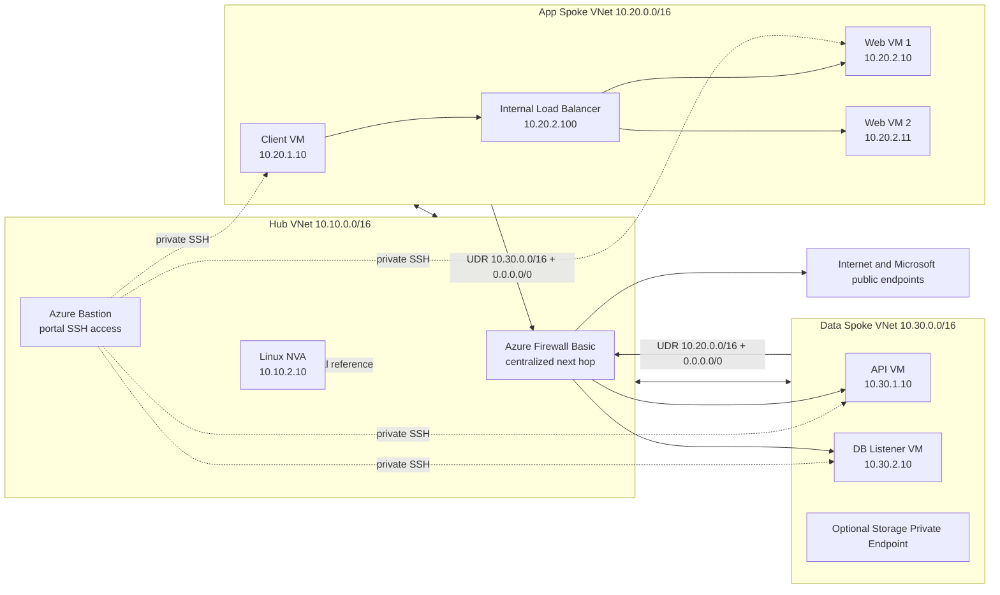
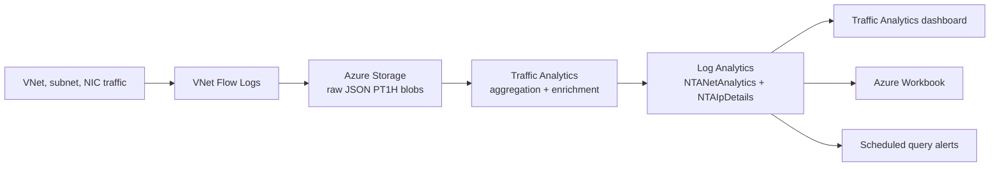
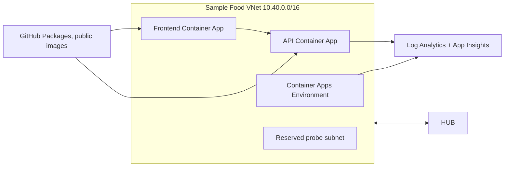

# Architecture

## Topology

## Observability flow

## Role of Azure Firewall and of the Linux network virtual appliance

Azure Firewall Basic is the real centralised next hop of this demonstration. The route tables of the application and data spokes point to the private IP address of the firewall for traffic between spokes and for traffic bound to the internet. The firewall policy uses a wildcard network rule that allows every flow routed to the firewall. That choice is deliberate for a laboratory: the firewall demonstrates centralised transit and observability, while Network Security Groups and user-defined routes remain the enforcement and fault-injection points of the scenarios.

The Linux network virtual appliance at `10.10.2.10` stays in the laboratory as an educational reference. It exists to contrast the virtual appliance concept and to explain historical or alternative patterns, but it is not the default path of the demonstration. Do not present it as the primary inline device.

## Administrative access to the virtual machines

The Linux virtual machines have no public IP address and do not use Secure Shell keys generated by Terraform. The laboratory uses a local password for the administrative user and Azure Bastion in the hub as the controlled access path to the private addresses of the virtual machines. This favours demonstration simplicity and portal access, but it must be presented as a security trade-off: Microsoft recommends Secure Shell keys over passwords for Linux. The architectural compensation is that Secure Shell is never exposed to the internet and is reachable only through Bastion.

Azure Bastion requires a dedicated subnet named `AzureBastionSubnet`; in this laboratory it uses `10.10.5.0/26` in the hub virtual network. Never associate a route table with the Bastion subnet. Source: https://learn.microsoft.com/en-us/azure/bastion/configuration-settings

The default Bastion tier is Basic, which is sufficient for a browser connection from the portal using a username and password on port 22. Move to Standard only when the native client, tunnelling, file transfer, custom ports or IP-based connection are required. Sources: https://learn.microsoft.com/en-us/azure/bastion/bastion-connect-vm-ssh-linux, https://learn.microsoft.com/en-us/azure/bastion/connect-vm-native-client-linux

Every virtual machine has boot diagnostics enabled with managed storage, which provides the serial log and a start-up screenshot. Source: https://learn.microsoft.com/en-us/azure/virtual-machines/boot-diagnostics

## Private endpoint

The data spoke includes an optional Private Link subnet. Do not treat that subnet as an ordinary routed workload subnet like the application, application programming interface or database subnets, because a private endpoint is a private network interface towards a platform service.

Points that matter during the demonstration:

- Traffic towards a private endpoint is interpreted from the source virtual machine side.
- Do not expect the flow log to be captured at the private endpoint itself.
- Validation requires correlating the private domain name resolution, the private IP address of the private endpoint, the resource identifier and the observed flow.
- The Private Link subnet is not associated with the fault-injection route tables, so the demonstration avoids side effects on private platform traffic.

Source: https://learn.microsoft.com/en-us/azure/network-watcher/vnet-flow-logs-overview#private-endpoint-traffic

## Why this architecture

- Virtual network flow logs record IP traffic at layer 4 with the five-tuple, the direction, the flow state, the encryption state and byte and packet counters. Source: https://learn.microsoft.com/en-us/azure/network-watcher/vnet-flow-logs-overview#how-logging-works
- Traffic Analytics aggregates the raw flow logs, enriches them with topology, security and geography, and makes them queryable in Log Analytics. Source: https://learn.microsoft.com/en-us/azure/network-watcher/traffic-analytics#how-traffic-analytics-works
- The hub and spoke topology uses Azure Firewall in the hub as the central next hop for traffic between spokes and for traffic bound to the internet. Source: https://learn.microsoft.com/en-us/azure/architecture/networking/architecture/hub-spoke
- The user-defined routes on the spokes direct application to data, data to application, and the default route towards the firewall. A user-defined route overrides a system route when it is more specific or otherwise applicable. Source: https://learn.microsoft.com/en-us/azure/virtual-network/virtual-networks-udr-overview#user-defined-routes
- Azure Firewall Basic is sufficient for this demonstration because it includes a stateful firewall, outbound source network address translation, network traffic filtering and application fully qualified domain name filtering. In this laboratory the network rule is deliberately permissive (`source=*`, `destination=*`, `port=*`, `protocol=Any`) and does not represent an enterprise security baseline. Source: https://learn.microsoft.com/en-us/azure/firewall/features-by-sku#azure-firewall-basic-features
- Network Watcher next hop validates the effective next hop before and after each injected fault. Source: https://learn.microsoft.com/en-us/azure/network-watcher/next-hop-overview

## Deployed resources

- A dedicated resource group.
- Three virtual networks: hub, application spoke and data spoke.
- Bidirectional hub-to-spoke peerings.
- Network Security Groups on the application, data and hub subnets.
- Azure Firewall Basic in the hub with `AzureFirewallSubnet`, `AzureFirewallManagementSubnet`, a Standard public IP address, a firewall policy and a wildcard network rule that allows every flow crossing the firewall.
- Azure Bastion Basic in the hub with `AzureBastionSubnet` and a static Standard public IP address.
- Route tables associated with the application and data spokes for centralised routing through the firewall.
- An optional Private Link subnet, not associated with the fault-injection route tables.
- Private Linux virtual machines for the client, web, application programming interface, database listener and the reference network virtual appliance, each with a local administrative password and boot diagnostics enabled.
- An internal Standard load balancer.
- A dedicated storage account for the raw flow logs.
- A Log Analytics workspace.
- A Network Watcher flow log for each virtual network.
- Optional workbook and alerts.

## Optional extension: the sample food ordering application

The repository includes an optional extension of the laboratory: the Grubify sample food ordering application on Azure Container Apps, migrated to Terraform from the Bicep and Azure Developer CLI laboratory `dm-chelupati/sre-agent-lab`.

Architectural points:

- The new virtual network uses `10.40.0.0/16` to avoid overlapping with the hub at `10.10.0.0/16`, the application spoke at `10.20.0.0/16` and the data spoke at `10.30.0.0/16`.
- The Container Apps environment uses a dedicated subnet, as required when Azure Container Apps runs inside a custom virtual network. Source: https://learn.microsoft.com/en-us/azure/container-apps/vnet-custom
- The application uses Container Apps logs and Application Insights as its primary observability plane. Source: https://learn.microsoft.com/en-us/azure/container-apps/log-monitoring
- Azure Container Apps is not supported by virtual network flow logs, so it must not be presented as a workload visible in `NTANetAnalytics`. Source: https://learn.microsoft.com/en-us/azure/network-watcher/vnet-flow-logs-overview#incompatible-services
