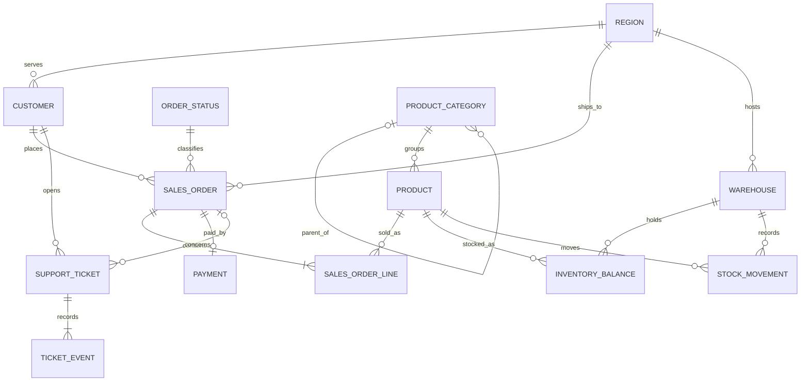

## Schema map

| Schema      | Responsibility                                                         |
|-------------|------------------------------------------------------------------------|
| `ref`       | Stable region and order-status reference values                        |
| `catalog`   | Product hierarchy and product attributes                               |
| `sales`     | Customers, orders, order lines, and payments                            |
| `inventory` | Warehouses, current balances, and stock-movement history                |
| `support`   | Customer-support tickets and ticket-event history                       |
| `lab`       | Installation metadata, scenario catalog, generator, and size reporting |

The business schemas represent separate application domains while remaining in
one database. This creates useful cross-schema joins without introducing
cross-database dependencies that would reduce Azure SQL Database portability.

## Entity relationship diagram

## Table catalog

### Reference domain

| Table             | Primary key       | Purpose                                             |
|-------------------|-------------------|-----------------------------------------------------|
| `ref.Region`      | `RegionCode`      | Region, currency, customer, shipping, and warehouse |
| `ref.OrderStatus` | `OrderStatusCode` | Order lifecycle and terminal-state classification   |

### Catalog domain

| Table                     | Primary key         | Main relationships                                      |
|---------------------------|---------------------|---------------------------------------------------------|
| `catalog.ProductCategory` | `ProductCategoryId` | Optional self-reference to parent category              |
| `catalog.Product`         | `ProductId`         | Required category; referenced by lines and stock tables |

`catalog.Product.AttributesJson` provides semi-structured sample data while an
`ISJSON` constraint keeps the values valid. `Sku` has a unique constraint.

### Sales domain

| Table                  | Primary key        | Main relationships                                                    |
|------------------------|--------------------|-----------------------------------------------------------------------|
| `sales.Customer`       | `CustomerId`       | Required region; parent of orders and tickets                         |
| `sales.SalesOrder`     | `SalesOrderId`     | Required customer, order status, and shipping region                  |
| `sales.SalesOrderLine` | `SalesOrderLineId` | Required order and product; unique line number within each order      |
| `sales.Payment`        | `PaymentId`        | Required order; zero or one generated payment for each non-new order |

`sales.SalesOrderLine.LineTotal` is a persisted computed column. Order-level
amount constraints require `TotalAmount` to equal subtotal, tax, and shipping.

### Inventory domain

| Table                        | Primary key                    | Main relationships                   |
|------------------------------|--------------------------------|--------------------------------------|
| `inventory.Warehouse`        | `WarehouseId`                  | Required region                      |
| `inventory.InventoryBalance` | `WarehouseId`, `ProductId`     | Required warehouse and product       |
| `inventory.StockMovement`    | `StockMovementId`              | Required warehouse and product       |

The composite inventory-balance key allows the blocking scenario to target one
predictable row. Quantity checks prevent negative stock and reservations above
on-hand quantity.

### Support domain

| Table                   | Primary key       | Main relationships                              |
|-------------------------|-------------------|-------------------------------------------------|
| `support.SupportTicket` | `SupportTicketId` | Required customer and optional related order    |
| `support.TicketEvent`   | `TicketEventId`   | Required ticket                                 |

Ticket descriptions and event details use `nvarchar(max)` to provide a
large-value workload surface. Every generated ticket has three chronological
events.

### Lab domain

| Table          | Primary key    | Purpose                                                       |
|----------------|----------------|---------------------------------------------------------------|
| `lab.BuildInfo` | `BuildInfoId` | Schema version, install time, seed date, and scale factor      |
| `lab.Scenario` | `ScenarioCode` | Machine-readable scenario objective, script, and expected signal |

`lab.BuildInfo` is constrained to one row. Validation derives expected table
cardinality from its stored scale factor.

## Relationship reference

| Child column                                      | Parent column                                          | Cardinality |
|---------------------------------------------------|--------------------------------------------------------|-------------|
| `catalog.ProductCategory.ParentProductCategoryId` | `catalog.ProductCategory.ProductCategoryId`            | Optional N:1 |
| `catalog.Product.ProductCategoryId`               | `catalog.ProductCategory.ProductCategoryId`            | N:1         |
| `sales.Customer.RegionCode`                       | `ref.Region.RegionCode`                                | N:1         |
| `sales.SalesOrder.CustomerId`                     | `sales.Customer.CustomerId`                            | N:1         |
| `sales.SalesOrder.OrderStatusCode`                | `ref.OrderStatus.OrderStatusCode`                      | N:1         |
| `sales.SalesOrder.ShipToRegionCode`               | `ref.Region.RegionCode`                                | N:1         |
| `sales.SalesOrderLine.SalesOrderId`               | `sales.SalesOrder.SalesOrderId`                        | N:1         |
| `sales.SalesOrderLine.ProductId`                  | `catalog.Product.ProductId`                            | N:1         |
| `sales.Payment.SalesOrderId`                      | `sales.SalesOrder.SalesOrderId`                        | N:1         |
| `inventory.Warehouse.RegionCode`                  | `ref.Region.RegionCode`                                | N:1         |
| `inventory.InventoryBalance.WarehouseId`          | `inventory.Warehouse.WarehouseId`                      | N:1         |
| `inventory.InventoryBalance.ProductId`            | `catalog.Product.ProductId`                            | N:1         |
| `inventory.StockMovement.WarehouseId`             | `inventory.Warehouse.WarehouseId`                      | N:1         |
| `inventory.StockMovement.ProductId`               | `catalog.Product.ProductId`                            | N:1         |
| `support.SupportTicket.CustomerId`                | `sales.Customer.CustomerId`                            | N:1         |
| `support.SupportTicket.SalesOrderId`              | `sales.SalesOrder.SalesOrderId`                        | Optional N:1 |
| `support.TicketEvent.SupportTicketId`             | `support.SupportTicket.SupportTicketId`                | N:1         |

All foreign keys are enabled and trusted after generation. The validation
script fails if any relationship becomes disabled or untrusted.

## Baseline indexes

The schema includes indexes needed for normal application paths:

* Unique product SKU, customer reference, customer email, and order number
* Customer orders by customer and descending order date
* Orders by order date
* Order lines by order
* Payments by order
* Stock movements by product and descending event time
* Ticket events by ticket and event time

The following indexes are intentionally absent:

* Order lines by product
* Stock movements by warehouse and event time
* Support tickets by customer
* Support tickets by status, team, priority, or creation time

These omissions allow the DBA agent to distinguish evidence-based index
recommendations from blanket foreign-key indexing.

## Data distributions

The generator uses a fixed seed date and formulas rather than random values.
Reinstalling with the same scale factor and seed date produces the same
cardinality and value distribution.

### Skew

* Customer 1 receives every fifth order, creating a high-volume tenant
* Product 1 receives about 30 percent of order lines
* Product 1 receives every eighth stock movement
* Customer 1 receives every tenth support ticket

### Time

* Orders span two years
* One quarter of orders concentrate in the most recent 30 days
* Stock movements span two years
* Support tickets span two years

### Lifecycle

* Most orders are completed
* Five percent of orders remain new and have no payment
* Cancelled and returned orders have refunded payments
* Thirty-five percent of tickets remain open or pending

These distributions support selectivity analysis, cardinality-estimation
analysis, growth assessment, and workload comparison.

## Query surfaces

| Object                                        | Intended use                                      |
|-----------------------------------------------|---------------------------------------------------|
| `sales.vw_OrderSummary`                       | Cross-domain order reporting                      |
| `inventory.vw_InventoryRisk`                  | Current stock and reorder assessment              |
| `support.vw_OpenTicketBacklog`                | Support backlog and age analysis                  |
| `sales.usp_GetCustomerOrderHistory`           | Customer-skew and cached-plan analysis             |
| `sales.usp_SearchOrdersByCalendarDate`        | Non-SARGable date analysis                        |
| `sales.usp_FindCustomerByExternalReference`   | Implicit-conversion analysis                      |
| `sales.usp_GetProductSalesSummary`            | Missing-index and join-cost analysis              |
| `support.usp_SearchTicketText`                 | Leading-wildcard and large-value scan analysis    |

The stored procedures that contain tuning defects include comments identifying
the deliberate behavior. Remediation scripts can be added later without
changing the base dataset.
