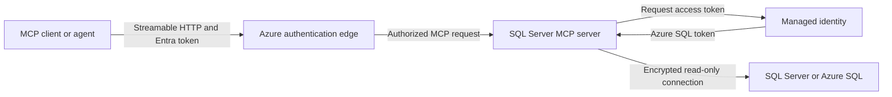

## Overview

The SQL Server MCP server provides a controlled Model Context Protocol (MCP)
interface for SQL Server and Azure SQL. It allows MCP clients and AI agents to
discover database metadata, execute bounded read-only queries, and analyze
estimated execution plans without exposing database credentials to the
client.

The implementation in
[the SQL Server MCP resource folder](../README.md) is a hardened fork of the
MIT-licensed [alyiox/mcp-mssql](https://github.com/alyiox/mcp-mssql) project.
The fork retains the upstream profile model, schema discovery, parameter
binding, read-only query validation, and execution-plan parsing while reducing
the exposed surface to read-only operations.

## Technical implementation

The server uses:

* The .NET MCP SDK for protocol handling and tool registration
* ASP.NET Core for Streamable HTTP hosting
* `Microsoft.Data.SqlClient` for SQL Server and Azure SQL connectivity
* Microsoft ScriptDom for T-SQL parsing and read-only validation
* .NET configuration providers for connection profiles and execution limits

Requests follow this path:

1. An MCP client connects through Streamable HTTP or stdio.
2. The server resolves a named, operator-configured connection profile.
3. ScriptDom parses and validates submitted query text.
4. SqlClient opens an encrypted connection using the profile identity.
5. The server applies execution time, row count, and response-size limits.
6. Results are returned as structured MCP content.



The authentication edge is required for remotely hosted HTTP deployments. It
is not part of the MCP server application itself.

## Transports and endpoints

The server supports the standard MCP transports:

| Transport       | Configuration               | Behavior                                     |
|-----------------|-----------------------------|----------------------------------------------|
| Streamable HTTP | `MCPMSSQL_TRANSPORT=http`   | Independent HTTP service for remote clients  |
| Stdio           | `MCPMSSQL_TRANSPORT=stdio`  | MCP subprocess for local clients             |

The HTTP transport exposes:

| Path       | Purpose                                              |
|------------|------------------------------------------------------|
| `/mcp`     | Streamable HTTP MCP endpoint                         |
| `/healthz` | Liveness endpoint for the hosting platform           |

The container listens on port `8080` by default. Streamable HTTP follows the
[MCP transport specification](https://modelcontextprotocol.io/specification/2025-06-18/basic/transports).

## Capabilities

The hardened MCP surface provides four read-only tools:

| Tool            | Capability                                                                  |
|-----------------|-----------------------------------------------------------------------------|
| `list_profiles` | List configured targets without returning connection strings               |
| `get_object`    | Return columns, indexes, constraints, relationships, or routine metadata    |
| `run_query`     | Execute one bounded, parameterized, parser-validated `SELECT`                |
| `analyze_query` | Compile and summarize an estimated execution plan without running the query |

Named profiles allow one server deployment to expose multiple approved
databases. Each tool accepts an optional profile name. The default profile is
used when the client does not specify one.

The server does not expose:

* DDL or DML execution
* Stored-procedure execution
* Actual execution-plan collection
* Query-result snapshots
* Permission or configuration changes
* Backup, restore, or maintenance operations

The upstream write tool is permanently removed from registration. Startup
also fails if a profile attempts to enable writes.

### Read-only query validation

`run_query` and `analyze_query` require one `SELECT` statement in one batch.
ScriptDom parsing rejects DDL, DML, `EXEC`, multiple statements, and the
following state-changing or high-risk constructs:

* `SELECT INTO`
* Variable assignment
* `NEXT VALUE FOR`
* `OPENQUERY`, `OPENDATASOURCE`, and `OPENROWSET`
* Write-oriented or blocking lock hints
* Input longer than 64 KiB
* Excessive parser nesting

Application validation limits what the server sends to the database. The
database identity and its SQL permissions remain the authoritative security
boundary.

### Execution limits

| Setting                    | Environment variable                             | Default | Maximum   |
|----------------------------|--------------------------------------------------|--------:|----------:|
| Maximum rows               | `MCPMSSQL_QUERY_MAX_ROWS`                        |     250 |     1,000 |
| Query timeout in seconds   | `MCPMSSQL_QUERY_COMMAND_TIMEOUT_SECONDS`         |      30 |       120 |
| Maximum UTF-8 output bytes | `MCPMSSQL_QUERY_MAX_OUTPUT_BYTES`                | 262,144 | 1,048,576 |
| Plan timeout in seconds    | `MCPMSSQL_ANALYZE_COMMAND_TIMEOUT_SECONDS`       |      30 |       120 |

Values outside the supported range are clamped at startup and logged. Full
plan resources use instance-local storage. Multi-replica hosting must account
for MCP session routing and ephemeral local data.

## Configuration profiles

The default profile uses flat environment variables:

```text
MCPMSSQL_CONNECTION_STRING=Server=tcp:<sql-endpoint>,1433;Database=<database>;Authentication=Active Directory Managed Identity;User Id=<managed-identity-client-id>;Encrypt=True;TrustServerCertificate=False;
MCPMSSQL_DESCRIPTION=<approved-target-description>
```

Additional profiles use standard .NET hierarchical configuration:

```text
McpMssql__Profiles__<profile>__ConnectionString=<connection-string>
McpMssql__Profiles__<profile>__Description=<approved-target-description>
```

Profiles are allowlisted by the server operator. MCP clients select a profile
by name and cannot supply or replace its connection string.

## Deployment and hosting in Azure

The included [Dockerfile](../Dockerfile) builds a non-root
.NET 10 Linux container. The build restores dependencies, runs unit tests, and
publishes the application into the final runtime image.

The image can run on any Azure hosting service that provides:

* OCI container execution
* HTTPS ingress or an HTTPS-capable gateway
* User-assigned managed identity
* Environment-based or mounted-file configuration
* DNS and network access to the target SQL endpoints
* Liveness probes and application logging

Use immutable image digests for controlled deployments. The registry,
resource names, DNS names, and Azure compute service are deployment choices
and are not embedded in the MCP server.

### Deployment sequence

1. Build the image from the repository Dockerfile.
2. Publish the image to an approved private OCI-compatible registry.
3. Deploy the image digest to the selected Azure compute service.
4. Assign the approved user-assigned managed identity to the compute
   resource.
5. Configure the container environment and one or more database profiles.
6. Expose port `8080` through HTTPS and route MCP traffic to `/mcp`.
7. Configure `/healthz` as the liveness probe.
8. Configure DNS, routing, firewall rules, private connectivity, and
   certificate trust for each SQL target.
9. Protect `/mcp` with Microsoft Entra authentication at the hosting edge or
   an approved gateway.
10. Validate health, authenticated MCP initialization, profile discovery, and
    a bounded read-only query.

Set these baseline container variables:

```text
MCPMSSQL_TRANSPORT=http
MCPMSSQL_REQUIRE_AZURE_MANAGED_IDENTITY=true
ASPNETCORE_URLS=http://+:8080
```

`/healthz` confirms process liveness. It does not validate client
authorization, managed identity token acquisition, SQL connectivity, or
database permissions.

## Authentication and authorization

The deployment has two independent authentication hops:

1. MCP client to MCP service
2. MCP service to SQL database

### MCP client to MCP service

The server contains no static HTTP credential and does not register
application-level HTTP authentication middleware. A remote deployment must
use the Azure hosting edge, an API gateway, or another approved reverse proxy
to:

* Terminate HTTPS
* Validate Microsoft Entra access tokens
* Restrict the accepted token issuer and audience
* Restrict callers through application assignments or equivalent policy
* Forward only authorized requests to `/mcp`

The MCP client acquires a token for the audience configured by the
authentication edge. This audience identifies the MCP API. It is separate
from the managed identity used to connect to the database.

### MCP service to SQL database

The Azure host uses its user-assigned managed identity to obtain an Azure SQL
token through SqlClient. No SQL password or access token is stored in the
profile.

When `MCPMSSQL_REQUIRE_AZURE_MANAGED_IDENTITY=true`, startup requires every
profile to:

* Use `Active Directory Managed Identity`
* Set `User Id` to a valid user-assigned managed identity client ID
* Specify an explicit database and SQL endpoint
* Omit passwords and integrated authentication

The server normalizes accepted profiles to use encryption, certificate
validation, `ApplicationIntent=ReadOnly`, `PersistSecurityInfo=False`, and a
connection timeout no longer than 30 seconds.

### Database authorization

Create a contained Microsoft Entra user for the workload identity in every
target database and add it to an approved least-privilege diagnostic role:

```sql
CREATE USER [<managed-identity-name>] FROM EXTERNAL PROVIDER;
ALTER ROLE [<approved-read-only-role>]
    ADD MEMBER [<managed-identity-name>];
```

The role should grant only the capabilities required for approved diagnostics,
such as `CONNECT`, selected data access, metadata visibility, `SHOWPLAN`, and
the appropriate database performance-state permission.

Azure role-based access control on the SQL resource does not grant SQL
data-plane access. The contained database user and SQL permissions are
required independently.

## Connect an MCP client

### Remote Streamable HTTP

1. Confirm that `https://<mcp-host>/healthz` is reachable through the intended
   network path.
2. Add a Streamable HTTP server to the MCP client with
   `https://<mcp-host>/mcp` as the endpoint.
3. Configure the client to acquire a Microsoft Entra bearer token for the MCP
   API audience accepted by the hosting edge.
4. Initialize the MCP session.
5. Call `list_profiles` and confirm that only approved targets are advertised.
6. Run a bounded read-only query to validate the complete database path.

MCP client configuration schemas differ. The logical configuration is:

```json
{
  "name": "sqlserver-mcp",
  "transport": "streamable-http",
  "url": "https://<mcp-host>/mcp",
  "authentication": {
    "type": "microsoft-entra",
    "audience": "<configured-api-audience>"
  }
}
```

Map these values to the fields supported by the selected MCP client. Do not
copy access tokens or database connection strings into prompts or agent
instructions.

### Local stdio

For local development, an MCP client can launch the server as a subprocess
with `MCPMSSQL_TRANSPORT=stdio`. In this mode, the server reads MCP messages
from standard input, writes MCP messages to standard output, and sends logs to
standard error.

Supply an approved database profile through the user configuration file or
the process environment. Stdio is a local process transport and does not use
the remote HTTP authentication layer.

## Operational validation

Validate each release and deployment at four levels:

1. Confirm `/healthz` reports a healthy process.
2. Confirm anonymous or unauthorized `/mcp` requests are rejected by the
   hosting edge.
3. Confirm an authorized MCP client can initialize and call `list_profiles`.
4. Confirm each profile can connect with managed identity and execute a
   bounded read-only query.

Monitor application startup failures, identity token acquisition,
authentication failures, SQL connection failures, query timeouts, limit
clamping warnings, and health probe status. Do not log connection strings,
access tokens, query parameters containing sensitive values, or returned
business data.

## References

* [Hardened server implementation and deployment](../README.md)
* [Original alyiox/mcp-mssql repository](https://github.com/alyiox/mcp-mssql)
* [MCP Streamable HTTP transport](https://modelcontextprotocol.io/specification/2025-06-18/basic/transports)
* [Managed identities for Azure resources](https://learn.microsoft.com/entra/identity/managed-identities-azure-resources/overview)
* [Microsoft Entra service principals with Azure SQL](https://learn.microsoft.com/azure/azure-sql/database/authentication-aad-service-principal-tutorial)
